<!--
1. Convert doc to MD
1. Export images
1. Checkout branch, add pages, misc stuff to get ready
1. Paste MD contents and images into folder
1. Add metadata fields
1. Rename images to match "Save Doc as HTML filenames and locations"
1. Remove alert messages from converter
1. Indent images properly into lists
1. Renumber ordered lists to "1. "
1. Fix spaces around bold items
1. Update bold items to UICONTROL and Backtick 
1. Fixing the inline object code blocks, which forced renumbering the images as they were out of sync
1. Fix any spelling errors
1. Fix any misc markdown errors
1. Upload to stage and verify publish to stage
   Total time, 7hrs
-->

# Adobe Experience Platform: Hands-On Technical Exercise: Adobe Experience Platform Web SDK

## Overview

In this exercise you're going to get hands-on experience creating, publishing and deploying a Launch property that uses the Adobe Experience Platform Web SDK extension. You'll also learn how to set up an Experience Edge configuration that allows you to both stream data to Adobe Experience Platform and bring XDM schemas into Launch. While the Web SDK can be used to send data to the Experience Cloud SaaS solutions (Analytics, AAM, and Target), we will not be covering those scenarios in this document. This is purely Platform data collection from a website. 


## AEP Web SDK Use Cases

Before beginning this exercise it's important to call out that the Web SDK (also known as alloy.js) was released in early May 2020. Please think of this version of the alloy as a minimally viable product (MVP) rather than a fully-fledged and mature JavaScript library. While the foundations are in place and features and functionality will be added rapidly over the coming months, you will see small workarounds in this document that account for some of the newness. Fortunately, this SDK was designed with Platform in mind first, so we will be using it for its core purpose. Using it to replace current Analytics AppMeasurement.js, Target at.js, AAM DIL, and ECID Service is also one of its main purposes, but the supporting systems around alloy, and alloy itself, will need a little more development before customers should start migrating off of their current libraries.

Lastly, if you have worked with Platform before, you may recall a Launch extension with the title Adobe Experience Platform. This is not the AEP Web SDK. It is the forerunner and you may have heard it referred to as "ricochet". This extension is now deprecated and should not be used (you'll also see a "- DEMO ONLY" text appended to the end). Please use the AEP Web SDK for customers moving forward.


## Create a Streaming Inlet

Whether it be an API call from a third-party point-of-sale system or our own JavaScript library, streaming data is still just streaming data. As such, you need to create a streaming inlet for the AEP Web SDK similar to how you did for the Offline Purchase calls from the previous exercise.


1. Log into [Adobe Experience Platform](https://experience.adobe.com/platform) with your adobe ID and ensure that you are in your assigned Experience Cloud org and in the sandbox you've created. 
1. Click on **[!UICONTROL Sources]** in the left rail, select **[!UICONTROL Streaming]** as the category and you should see that the **[!UICONTROL HTTP API]** tile shows that you already have an active account. 
1. Mouse over the top right corner of the tile and click on the **[!UICONTROL Plus]** icon to add a new streaming inlet:


    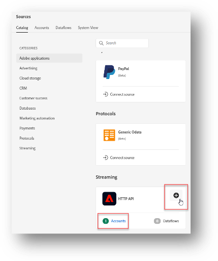


1. Select the **[!UICONTROL New Account]** radio button then proceed through the wizard and do the following for each step of the wizard:
    1. **[!UICONTROL Authentication]**
        1. Name: `Luma Website Web SDK`
        1. Description: `Site data from Luma Website`
        1. No Authentication required
        1. Click **[!UICONTROL Connect to Source]** and wait for successful connection
        1. Once connect, click **[!UICONTROL Next]**
    1. **[!UICONTROL Select Data]**
        1. Select: **[!UICONTROL Existing Dataset]**
        1. Select: `Luma Website Data`
        1. Click: **[!UICONTROL Next]**
    1. **[!UICONTROL Dataflow Detail]**
        1. Dataflow Name: `Luma Website Web SDK`
        1. Description: `Site data from Luma Website`
        1. Click: **[!UICONTROL Next]**
    1. **[!UICONTROL Review]**
        1. Ensure the settings are correct then click **[!UICONTROL Finish:]**

            
        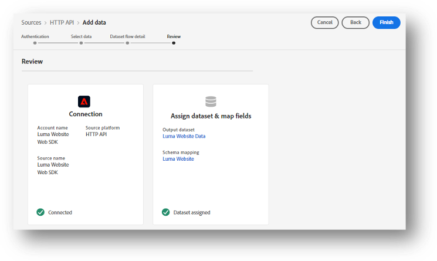

1. Once completed, click **[!UICONTROL Sources]** followed by the **[!UICONTROL Accounts]** tab and you should now have two streaming inlet accounts:

    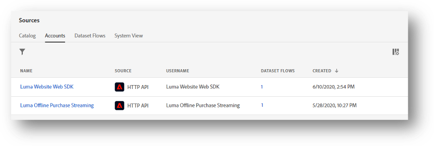


## Build Edge Configuration

A new feature recently added to Launch is called Edge Configuration. When network calls are sent in from the Web SDK, the "Edge" determines what happens to the data in those network calls. That data can be sent to Platform (what we're going to do), and/or be sent to Analytics, Target, and so forth. Edge Configuration is the tool that tells "the Edge" where to send the data. In this section, you'll create an Edge Configuration that will point the data to your streaming inlet and dataset. 

1. Log into launch.adobe.com for the wwfovlab you were assigned. 
1. In left rail, click the **[!UICONTROL Edge Configuration]** icon.

    
    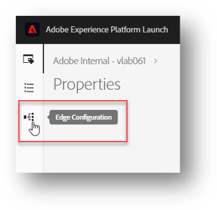

1. On the resulting page, you'll see the edge configurations for those that you are sharing this organization with (if you are the very first one, you won't see any configurations). Click the **[!UICONTROL New Edge Configuration]** button.
1. In the **[!UICONTROL Friendly Name]** field, give your Edge Configuration a name that includes your `ldap`. The example used in this document will be Luma Development (&lt;ldap>):

    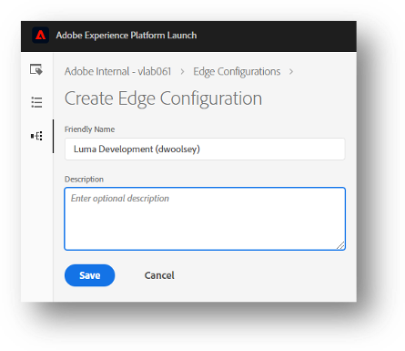


1. Click **[!UICONTROL Save]** and you'll be taken to a screen where you can tell the edge configurator where to send the data. 
1. Enable the **[!UICONTROL Adobe Experience Platform]** slider and you'll see the 4 fields become editable
1. In the **[!UICONTROL Sandbox]** dropdown, select the Platform sandbox that you've been using thus far. It will contain your ldap.
1. In the **[!UICONTROL Streaming Inlet dropdown]**, select the streaming inlet you created earlier (`Luma Website Web SDK`)
1. In the **[!UICONTROL Event Dataset]** field, select the `Luma Website Data` dataset (recall that you created that dataset and corresponding schema in earlier exercises). 
1. Leave the Profile Dataset dropdown as you don't need to set that. When finished, your settings should look like this:


    


    >[!NOTE] Scroll down and notice the additional settings for Target, Audience Manager, and Analytics. Alloy is also capable of sending data to those solutions; however, there are additional things about how those solutions consume alloy-generated data that aren't quite ready for customer adoption. That's why we won't be doing any of that work in this exercise.

1. If necessary, scroll down to the bottom until you can see and click on the **[!UICONTROL Save]** button.
1. Once your configuration saves, you'll see that you have 3 environments that correspond to the same 3 Launch environments (Development, Production, and Staging): 


    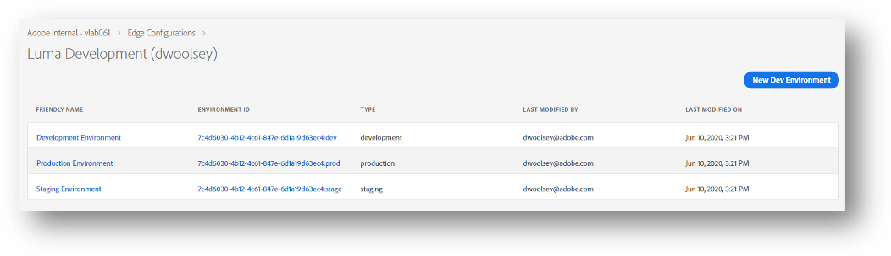


1. Click into the **[!UICONTROL Development]** environment and notice how it has all the settings that you just set.
1. Scroll down, click **[!UICONTROL Cancel]**, then click into either the **[!UICONTROL Production]** or **[!UICONTROL Staging]** environment. Notice how these environments have the same settings? In a customer instance, you'd create the development environment like you just did then adjust the staging and production environments as needed to match the corollary Platform environments. Since we are limited to just a single sandbox per user, go ahead and leave the staging and production environments as they currently are. 
1. Cancel/leave any edge configuration environments you may still be in to return to your Edge configuration overview page. Notice in the top right corner the **[!UICONTROL New Dev Environment]** button. Just like Launch, you can have multiple dev environments, but only one staging and production environment. You'll also get more detail on how these environments correspond to Launch environments later in this exercise.

    >[!NOTE] The Environment ID column will show that the environment ID is exactly the same for all three environments with the exception of the :dev, :stage, and :prod endings.

1. At this point, you've successfully configured your Edge Configuration. Click the **Properties** button in the upper left corner and you'll be taken back to the **[!UICONTROL Properties]** overview page:

    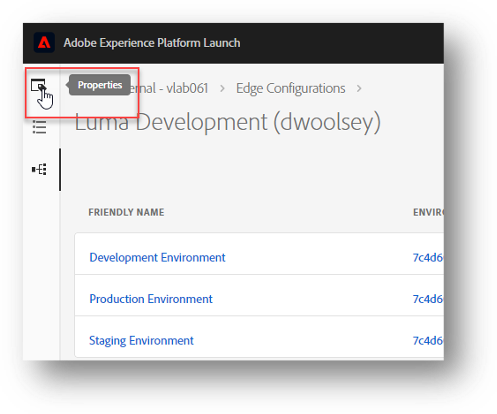
 


## Create a Launch Property and Create a Library

In this section, you're going to create a Desktop Launch property with the default configurations for the adobevlab.com domain. You will be putting this property on your Luma website, replacing the Luma property you created in your individual AGS### org.


1. If necessary, log into launch.adobe.com and click the blue **[!UICONTROL New Property]** button.
1. Name your org `Luma AGS###-<current AEM URL instance number>`. For example, if your AEM publish URL was aempublish**007-01**.msa.adobevlab.com, then your property name would be Luma AGS007-01.
1. Enter `adobevlab.com` as the domain (since it is the domain of your AEM) and click **[!UICONTROL Save]**.


    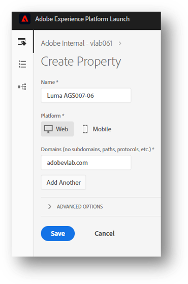


    Your new property should appear on the list of properties. 

1. Click into your newly created property then click on **[!UICONTROL Publishing]** in the main nav.
1. Click the **[!UICONTROL Add New Library]** button in the Development section.
1. On the resulting page, give the new library a name (something like `AEP Web SDK Deployment`), select your development environment from the **[!UICONTROL Environment]** dropdown, and then click the **[!UICONTROL + Add All Changed Resources]** link at the bottom.


    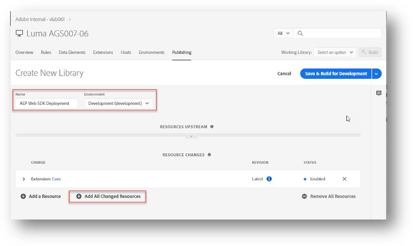


1. Click the blue **[!UICONTROL Save & Build for Development]** button and give it a moment to process. You'll know the environment is ready when you see your library in the **[!UICONTROL Development]** area with a green dot next to it.
1. In the upper right corner, set the **[!UICONTROL Working Library]** dropdown to the library you just created. 

    >[!NOTE] Because this exercise document is mainly concerned about teaching the principles of AEP Web SDK and not the basics of Launch, we will be using the same library for all changes, working only in the development environment, and deploying the Launch Development Environment tags to the site later on. This will allow for faster validation because you'll see your changes on the site as soon as the library finishes building. 


## Re-create Existing Data Elements and Rules

Because you'll be using the same website to deploy this new Launch property, we can reuse a lot of the same data elements and rules that you created when you deployed the other Adobe solutions in your original Launch property. Unfortunately, since we had to change Experience Cloud Orgs in order to do the Platform exercises, you'll need to re-create the data elements and rules you created earlier instead of just using what's already there. For convenience, all of the necessary steps for creation have been added below, with some slight modifications:


### Data Elements

1. If necessary, log into [https://experience.adobe.com/launch](https://experience.adobe.com/launch) for your assigned wwfovlab###, click into your Launch property, and set the working library to the `AEP Web SDK Deployment` library.
1. Click on the **[!UICONTROL Data Elements]** tab followed by the **[!UICONTROL Create New Data Element]** button.
1. Name the data element `hashed_email`
1. Leave the Extension dropdown set to **[!UICONTROL Core]** and change the **[!UICONTROL Data Element Type]** dropdown to **[!UICONTROL Custom Code]**.
1. Click the newly visible **[!UICONTROL &lt;/> Open Editor]** button and paste in the following code:
    
    ```javascript
    return digitalData.user[0].profile[0].attributes.username`
    ```

1. Click the **[!UICONTROL Save]** button to close the editor.
1. Click **[!UICONTROL Save to Library]** and after a moment, you'll be returned to the Date Elements tab. You'll see your newly created data element, but the working library in the upper right corner now has an orange circle next to it instead of green one. This is because the change has been added to the library, but the library has not been built yet:


    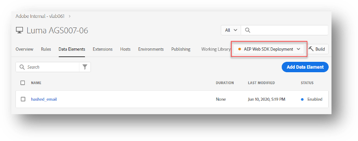


1. Click **[!UICONTROL Add Data Element]** and name the new element `page_name`.
1. Set the **[!UICONTROL Data Element Type]** as **[!UICONTROL JavaScript Variable.]**
1. Set the **[!UICONTROL JavaScript variable name]** field to `digitalData.page.pageInfo.pageName`. This will retrieve the object in the data layer that contains the page name.
1. Click **[!UICONTROL Save to Library]** to save the data element and return to the **[!UICONTROL Data Elements]** tab. Note the newly created data element.
1. Repeat steps 8-11 to create another data element named `order_id` with a **[!UICONTROL JavaScript variable]** type pointing to the `digitalData.cart.orderId` JavaScript object in the data layer. This will get the object in the data layer that contains the order ID.
1. Create another data element named `cart_revenue`. (This will get the shopping cart total from the data layer.)
1. Leave the Extension dropdown set to **[!UICONTROL Core]** and change the **[!UICONTROL Data Element Type]** dropdown to **[!UICONTROL Custom Code]**.
1. Click the newly visible **[!UICONTROL &lt;/> Open Editor]** button and paste in the following code: 
    
    ```javascript
    return parseFloat(digitalData.cart.cartAmount);`
    ```

    >[!NOTE] The original way this data element was created in your Launch property was just by referencing the JavaScript object right from the data layer. However, since XDM has strict object type requirements, this needs to be a number, not a string. More details around how XDM works later in this exercise, but this is an example of something to account for when deploying the Web SDK for Platform ingestion.

1. Click the **[!UICONTROL Save]** button to close the editor then click **[!UICONTROL Save to Library]**.
1. Finally, begin creating another data element named `authentication_state`.
1. Change the **[!UICONTROL Data Element Type]** to **[!UICONTROL Custom code]** and click **[!UICONTROL &lt;/> Open Editor.]**
1. Paste the following code into the code editor:

    ```javascript
    /****Return Authentication State*****/
    if (digitalData.user[0].profile[0].attributes.loggedIn)
        return "logged in"
    else 
        return "logged out"
    ```

1. Click **[!UICONTROL Save]** to close the editor followed by **[!UICONTROL Save to Library]** to save the data element and return to the **[!UICONTROL Data Elements]** tab. Note the newly created data element. At this point, you should have five data elements: hashed_email, page_name, order_id, cart_revenue, and authentication_state.


    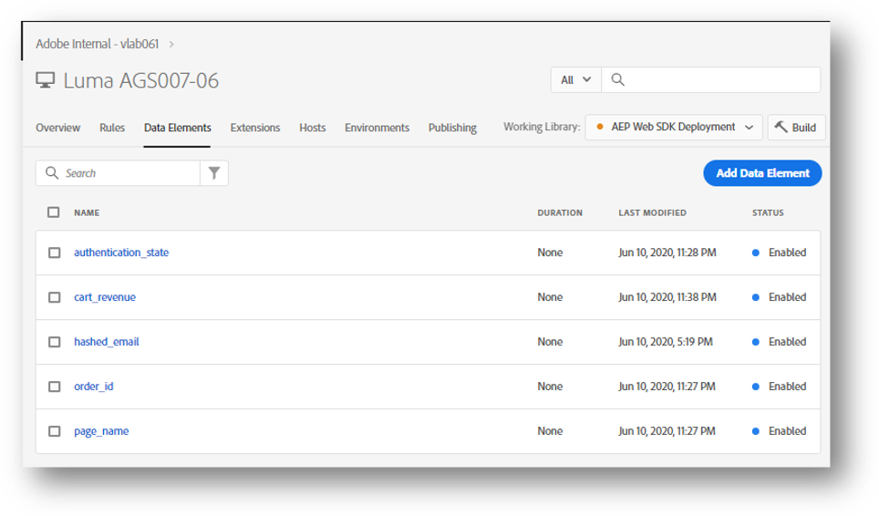


### Rules

When you created your original Launch property, you created rules that fired at different times in the page load process and then had different actions firing for the solutions. For example, the General Page Load rule fired an Analytics data collection call and the All Pages – Top rule fired the Target network call. For AEP Web SDK, you'll still need data collection code fired at those same points, but you'll be firing Web SDK data collection calls instead. As such, in this section, you're just going to set up all of the rules and the events that trigger them, but you'll be updating them later to fire AEP Web SDK calls.


1. Click the **[!UICONTROL Rules]** tab, add a new rule, and name it `General Page Load`.
1. Click **[!UICONTROL +Add]** in the **[!UICONTROL EVENTS]** section to add an **[!UICONTROL Event]**
1. Select **[!UICONTROL Core]** as the **[!UICONTROL Extension]** (should be selected by default) and **[!UICONTROL Window Loaded]** as the **[!UICONTROL Event Type]**.
1. Click **[!UICONTROL Keep Changes]** when done and then **[!UICONTROL Save to Library]** on the resulting page to save your newly created rule.
1. Add a new rule named `Cart Add` and click **[!UICONTROL +Add]** in the **[!UICONTROL EVENTS]** section to add a new event.
1. Set the **[!UICONTROL Event Type]** to **[!UICONTROL Custom Event]** and in the new **[!UICONTROL Custom Event Type]** field, place the text `cart-add`.
1. In the **[!UICONTROL Elements matching the CSS selector]** field, enter the text `body`. A fully configured event for this rule will look like this:

    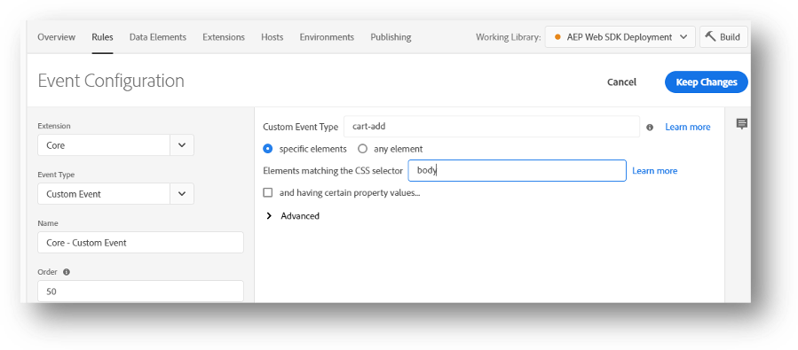

1. Click **[!UICONTROL Keep Changes]** when done and then **[!UICONTROL Save to Library]** on the resulting page to save your newly created rule.
1. Create a new rule named `Checkout Page`.
1. Add an event, set the **[!UICONTROL Event Type]** to **[!UICONTROL Library Loaded (Page Top),]** and set the order to `5`.
1. Click **[!UICONTROL Keep Changes]** and then add a new condition.
1. Set the **[!UICONTROL Condition Type]** to **[!UICONTROL Path Without Query String]** and set the **[!UICONTROL Path equals]** field to `/user/checkout.html`.
1. Enable the **[!UICONTROL Regex]** slider and your condition should look like this:

    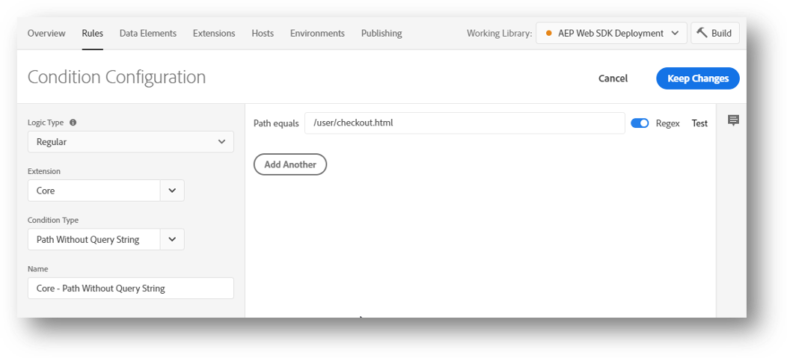


1. Click **[!UICONTROL Keep Changes]** when done and then **[!UICONTROL Save to Library]** on the resulting page to save your newly created rule.
1. Add a new rule and name it `Order Confirmation Page`.
1. Click the +**[!UICONTROL Add]** button in the **[!UICONTROL EVENTS]** section.
1. Set the **[!UICONTROL Event Type]** to **[!UICONTROL Library Loaded (Page Top),]** set the order to `5,` and click **[!UICONTROL Keep Changes.]**
1. Click the +**[!UICONTROL Add]** button in the **[!UICONTROL CONDITIONS]** section to add a condition for this rule.
1. Set the **[!UICONTROL Condition Type]** dropdown to **[!UICONTROL Path Without Query String]** and in the newly visible **[!UICONTROL Path Equals]** field, enter `thank-you.html` followed by enabling the **[!UICONTROL Regex]** slider. 
1. Click **[!UICONTROL Keep Changes]** when done and then **[!UICONTROL Save to Library]** on the resulting page to save your newly created rule. At this point, you should have these four rules: 


    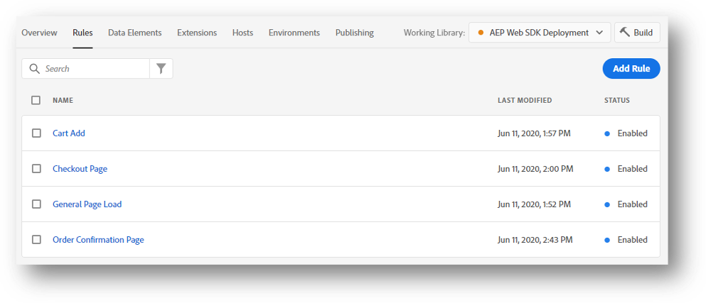


    >[!NOTE] If you were to look at your original Launch property, you would notice that the checkout and order confirmation page rules were fired on window loaded instead of library loaded. They were changed in this scenario to account for missing data layer elements that you'll learn about later.

1. You'll now create two more rules that'll handle authentication and personalization scenarios. To start, click the **Add Rule** button.
1. Name the rule: `All Pages - Top – Authenticated`
1. Click the **[!UICONTROL +Add]** under the EVENTS section to add a new event. 
1. Leave the Extension dropdown set to **[!UICONTROL Core]** and set the **[!UICONTROL Event Type]** drop down to **[!UICONTROL Library Loaded (Page Top)]**.
1. Change the **[!UICONTROL Order]** field from `50` to `10` then click **[!UICONTROL Keep Changes]**
1. Add a condition to the rule so that it only executes when the visitor is Authenticated. To do that, under CONDITIONS, click +**[!UICONTROL Add]**.
1. Leave **[!UICONTROL Core]** as the Extension selection and select **[!UICONTROL Value Comparison]** as the **[!UICONTROL Condition Type]**.
1. In the newly visible **[!UICONTROL Return true if]** form, click the **[!UICONTROL Database]** icon, click the `hashed_email` data element, and click the **[!UICONTROL Select]** button.
1. Change the evaluator to **[!UICONTROL Matches Regex]** and enter the value of `.+`. This will condition the rule fire when the `hashed_email` data element has any value/is set. This is also an alternate way of saying someone logged in:


    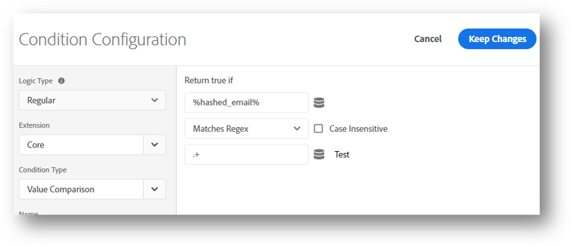


1. Click the **[!UICONTROL Keep Changes]** button and then **[!UICONTROL Save to Library]** on the resulting page to save your newly created rule.
1. Add a new rule and name it `All Pages – Top`.
1. Under the **[!UICONTROL Events]** area, click **[!UICONTROL +Add]**.
1. Leave **[!UICONTROL Core]** as the Extension to use and select **[!UICONTROL Library Loaded (Page Top)]** as the **[!UICONTROL Event Type]**. Leave the default order assignment of `50`. 
1. Click the **[!UICONTROL Keep Changes]** button and then **[!UICONTROL Save to Library]** on the resulting page to save your newly created rule. At this point, you should have six rules:


    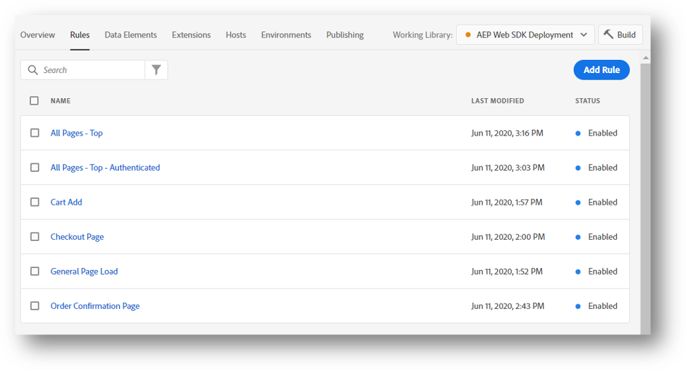


Now that you have all the data elements and rule triggers set up from your original property, you can move to the next section and start making AEP Web SDK-related changes to this property.


## Add and Configure AEP Web SDK Extension

The first step in deploying the AEP Web SDK is to find and install the extension. As you use it throughout the rest of the exercise, keep in mind that this JavaScript library is primarily designed to do two things. First, it will collect and send data to Platform. Second, it will replace existing JavaScript libraries for Analytics, Target, ID service, and Audience Manager. As mentioned earlier, the use of the SDK with non-Platform solutions isn't quite ready for widespread adoption so none of those use cases will be deployed in this exercise.

1. If necessary, log into launch.adobe.com for your assigned wwfovlab###, click into your Launch property, and set the working library to the `AEP Web SDK Deployment` library.
1. Click on the **[!UICONTROL Extensions]** tab followed by the **[!UICONTROL Catalog]** subtab.
1. Search for `AEP` and click **[!UICONTROL Install]** on the `AEP Web SDK` extension:


    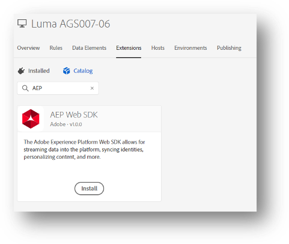


1. On the resulting **[!UICONTROL Install Extension]** screen, change the **[!UICONTROL Edge Domain]** configuration field to `data.adobevlab.com`. 

    >[!NOTE] The `data.adobevlab.com` domain will act as a first party domain for your mPaaS AEM instances. For a variety of reasons, your data collection domain should be a first party CNAME to the site being tagged. ClientCare has a free program that will allow customers to set up a CNAME for secure domains as well. It was this process that was followed to obtain this domain for you ahead of time. 

1. In the **[!UICONTROL Edge Configurations]** section, change the **[!UICONTROL Edge Configuration]** dropdown to the configuration you set up earlier in this document (it should have your ldap in it). A properly configured extension will look like this:

    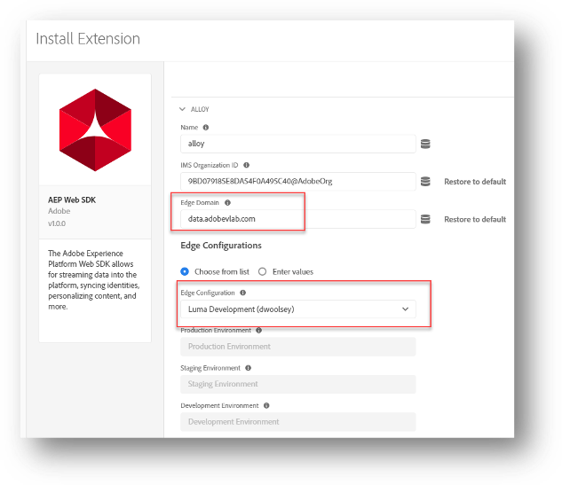


    >[!NOTE] Notice the three environments listed. This extension is "aware" of what Launch publishing environment it is in. When the extension is in a development library, the SDK will send data to the development configuration, staging to the staging configuration, and so forth. Because you only have one sandbox, we left all three environments pointing to your development sandbox. In a real customer scenario, you'd want to ensure that each environment was correctly configured by the Edge Configuration tool.

1. Scroll through the rest of the configuration options and notice the following things:
    1. There are options to have the library wait for consent.
    1. The Personalization section is where you would get the Web SDK equivalent of the pre-hiding snippet you used when you deployed Target. While we won't be using Target, we'll be using this snippet later on just to demonstrate how it would work going forward.
    1. In the Data Collection section, you'll see the ability to enable or disable click tracking. This is a similar setting to what you would find in the Analytics AppMeasurement library. You'll also see a code editor button that will be used and explained later on.
    1. Near the bottom you'll see the **When sending event data, automatically include:** text. If you change that to **specific context information**, you'll see that you can choose to exclude certain elements that the SDK collects automatically that a client's privacy policy may forbid from being captured. If you were to look at your schema for the Luma Web Data that you created in an earlier exercise, you'll see that the AEP Web SDK mixin has those four corresponding parent nodes:


        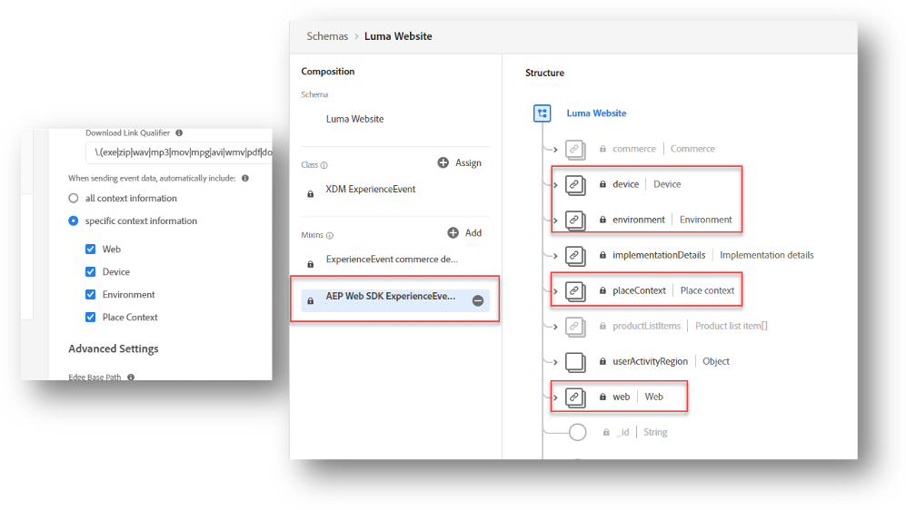

    1. Scroll back up to the top and notice in the upper right corner an Add Instance button. The Web SDK is designed so that multiple instances of the SDK can exist in the same Launch property at the same time. This is for use cases where two Adobe clients may need to have their own code bases on the same web page at the same time, such as partner/affiliate pages on a client's site. If you've ever had to manage multiple instances of Target, ECID, Analytics, and AAM on the same page at the same time, you'll appreciate why the SDK was designed to handle multiple instances. Again, we won't need it here, but it's being highlighted so you know it's an option.
1. With your brief tour of the extension complete, click the **[!UICONTROL Save to Library]** button and you will have successfully installed the AEP Web SDK extension.


## Create a Basic AEP Web SDK Deployment

When streaming data into Platform, one must have the exact JSON format of the XDM schema with the correct capitalization. That holds true for the direct API calls in a Server-to-server scenario or with data collection from the Web SDK. However, getting that notation exactly right in JavaScript is error prone. To aid with that, the product teams have created a client-side XDM mapping tool. It's that tool that you'll use in this section to get the right XDM calls and then use in conjunction with Launch rules to deploy a basic Web SDK implementation. 


### Create XDM-based Data Elements

Before going into the exact steps of how to use the XDM mapper, a small explanation is in order so that the steps make sense. If DMA Academy was your first exposure to Launch, then you may not know that data elements can reference other data elements. When you have a data element that uses just custom code, then all you really have is a place to execute JavaScript. It's this functionality that's used in the XDM mapper tool. With this tool, you're essentially going to create a kind of "parent" data element that will reference other data elements to populate an XDM object model. To see this in action, perform the following steps:

1. If necessary, log into launch.adobe.com for your assigned wwfovlab###, click into your Launch property, and set the working library to the `AEP Web SDK Deployment` library.
1. Click on the **[!UICONTROL Data Elements]** tab then click **[!UICONTROL Add Data Element.]**
1. Name it `XDM Object` and change the **[!UICONTROL Extension]** dropdown to `AEP Web SDK`.

    >[!NOTE] The Launch UI has no concept of parent or child data elements because, technically speaking, there is no such thing. Therefore, to help you easily identity your parent data elements, we'll be using proper capitalization and no underscores.

1. Change the **[!UICONTROL Data Element Type]** to **[!UICONTROL XDM Object]** and you'll see XDM schema from your Platform sandbox appear in the main screen.
1. In the **[!UICONTROL Schema]** dropdown, find the `Luma Website` schema that you created earlier, and you should then see the Luma Website schema appear:

    
    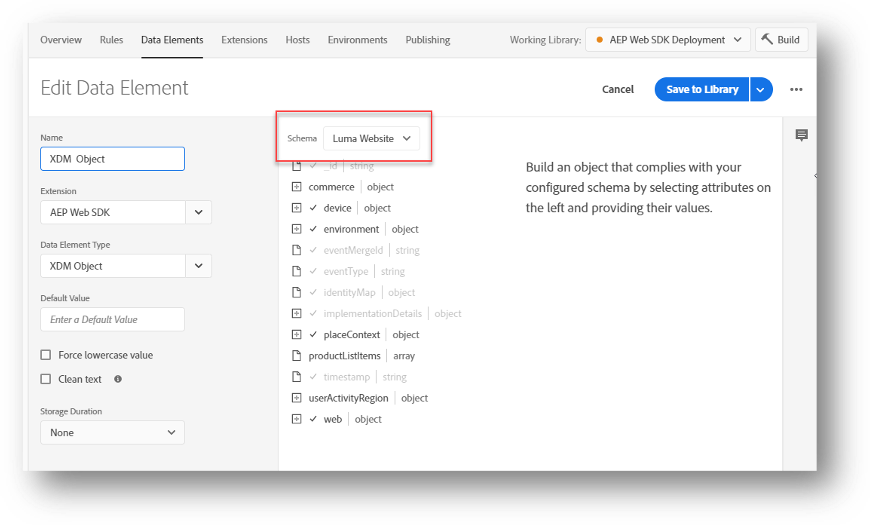

    >[!IMPORTANT] You may have noticed other schema that you didn't create or that the other schemas you created weren't present. That's because the schema dropdown you just used doesn't work for development sandboxes yet. That is on the near-term roadmap. If that is true, then where did the Luma Website Schema come from? The answer is the Production sandbox of your wwfovlab. The DMA Academy facilitation team created that schema for you in your Production environment so that it would be accessible here. Does it matter that it's from the production sandbox? No. The only thing this mapper really does is put the data into the correct JSON format. It's the Edge Configuration you set up earlier and what you configured in the extension that determine where the data actually goes. 

1. When looking at the schema, you'll see some nodes have checkmarks and others do not. Some areas are greyed out as well. The greyed-out nodes are ones that you can't set, and the check marks indicate that fields in those nodes have values in them. Let's start by setting the page name, one of the most basic elements in data collection. Expand the **[!UICONTROL Web]** node followed by the **[!UICONTROL webPageDetails]** node. 
1. Click on the **[!UICONTROL name]** node and you'll see a **[!UICONTROL Value]** field appear. Click the **[!UICONTROL data element]** icon next to the **[!UICONTROL Value]** field and select the `page_name` data element. When finished, your configuration will look like this:


    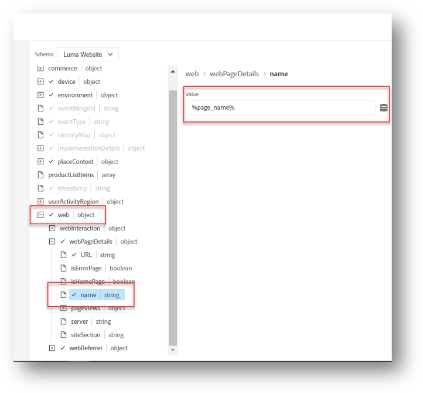

    Notice that you are in the XDM Object data element and you are now referencing the page_name element. 

1. Next, expand the **[!UICONTROL PageViews]** node and click on the **[!UICONTROL value]** node. In the now visible **[!UICONTROL Value]** field, enter the number `1`:

    

    >[!NOTE] What did we just do? You just incremented the page count by 1 every time this XDM Object data element is used. If you come from an Analytics background, this is going to feel strange. For those of you not from an Analytics background, recall from the Analytics training and deployment that the type of call made on the page determines if the data is considered page view (s.t() call) or a trackLink (s.tl() call). In the new Platform way of thinking, there are no "pageview" or "trackLink" calls (or even Analytics calls, for that matter), only data collection events. As such, you have to make sure any data collection event that you want to treat as a pageview sets a pageViews event to a value of 1. You'll see this pattern repeated later when you tag the checkout flow. 


    >[!NOTE] One other item to notice is that the Value field can take either a data element, as you did for the page_name, or a literal string/number as you did here. But be careful. Unlike other JavaScript collection libraries like AppMeasurement or at.js, where everything is a string, Platform requires strict data type conformity. Notice how the **[!UICONTROL value]** node indicates that it needs a value of type **[!UICONTROL Number]**? If you were to put a string of text in that field, Platform would reject this call. This is also a new way of thinking for those accustomed to just sending in strings of data to SaaS solutions. 

1. Click **[!UICONTROL Save to Library]** to save your changes and you should now see the **[!UICONTROL XDM Object]** in your data element list. 

    >[!NOTE] You may have noticed that there is no field in the schema for the authentication_state data element. Authentication state is a custom value that would need to be added to the XDM schema as a new field in a new mixin. Previously, we set this value in eVar1 of the Analytics data collection calls, but for Platform, it would be a custom XDM field. We're not going to have you create that here, but know that it is possible, and will be required for almost every customer, to create custom fields in the future. 


### Add Web SDK 'Send Event' Data Collection Calls

Now that you have a basic XDM schema mapped in the XDM Object data element, you're going to use that data element in tandem with the AEP Web SDK to send event action to stream the data into Platform and, more specifically, your Luma Web Dataset. You'll also be introduced to the idea of the event merge ID.


#### Event Merge ID Data Element

Since you just finished creating data elements, you may be wondering why we're creating another one here. The answer is that it makes more sense to explain it here than it would in the previous section. 

The AEP Web SDK represents the biggest fundamental change in data collection that the Experience Cloud has ever undergone. Even before Adobe acquired Omniture in 2009, and through all of the acquisitions since, there have always been solution-specific data collection calls that go to their solution-specific databases. ID service and Target go at the top and Analytics (and AAM) goes at the bottom. There have been strides made to consolidate those calls, such the using the Analytics call to send data to AAM server-side, but none of those have come close to the fundamental change that AEP Web SDK brings. Additionally, with Platform, the idea of a Target or Analytics database will, eventually, also be a thing of the past. However, it's going to be several years before our customers will be in a place to leave solution-specific databases. 

Given that we now want a consolidated JavaScript library that can send to both Platform and solution-specific databases, the Web SDK team was left with a challenge of how to make solution-agnostic Platform calls also work for solution-specific databases. For example, the Web SDK is a very "chatty" JavaScript library, in that it sends multiple calls to Adobe's Experience Edge. Yet, if we were to forward each of those calls to Analytics as well as Platform, our client's Analytics Data Collection costs (billed per hit) would skyrocket. So how do we reconcile these differences? Enter Event Merge ID.

The idea behind Event Merge ID is similar to that of Analytics for Target (A4T) data collection. Recall from your earlier Target and Analytics exercises that the SDID parameter is an ID generated by the ID service that is in both the Target and Analytics calls. When the SDIDs match, Target sends its hit to Analytics server-side and Analytics then merges the Target data into the Analytics hit, making only one Analytics server call. The same is true here. When an Event Merge ID is in the Web SDK event call, each event call is sent to Platform, but Analytics will use the Event Merge ID to consolidate each hit with the same ID into a single Analytics call. 

If we aren't sending that data to Analytics, should we bother with an Event Merge ID? Yes, because other downstream activities might require you to merge the data later as well. The engineering team responsible for the AEP Web SDK extension also made it very easy to set in Launch. 


1. If necessary, click on the **[!UICONTROL Data Elements]** tab in Launch.
1. Add a new data element and name it `event_merge_id`.
1. Set the **[!UICONTROL Extension]** to `AEP Web SDK` and the **[!UICONTROL Data Element Type]** to **[!UICONTROL Event Merge ID]**.
1. There is no other configuration necessary, so click the **[!UICONTROL Save to Library]** button and you should see your newly created data element. You'll get to use this new data element shortly as you update your Launch rules.


#### Add AEP Web SDK Data Collection Calls

In this next section you will be adding two AEP Web SDK "Send Event" calls: one just as the page loads, which will act as a Target call would in terms of being the network call used for personalization actions, and another call at the bottom to act as a final data collection call.

1. Click on the **[!UICONTROL Rules]** tab.
1. Click into the **[!UICONTROL All Pages- Top]** rule and click **[!UICONTROL Add]** in the action section. 
1. On the resulting screen, change the **[!UICONTROL Extension]** dropdown to `AEP Web SDK` and the **[!UICONTROL Action Type]** to **[!UICONTROL Send Event]**. 

    >[!NOTE] You may have noticed a Reset Event Merge ID action in the Action Type dropdown. This is brought to your attention so that in a scenario where a single page application (SPA) is in use, you can reset the event merge ID when needed

1. In the newly visible fields, click the **[!UICONTROL data element]** icon for the **[!UICONTROL XDM Data]** field and select the **[!UICONTROL XDM Object]** data element that you configured earlier.

    >[!NOTE] The send event action requires that all the XDM that needs to be sent in this call be in a single data element. This is why the XDM Mapper is essentially a data element that references other data elements


    >[!NOTE] The Type dropdown shows you what kinds of event types you can expressly set in this call. Since this is a top-of-page personalization call, we don't want to set any specific type.

1. Set the **[!UICONTROL Merge ID]** field to use the `event_merge_id` data element that you just created.
1. Since this is going to be the page-top personalization calls, check the **[!UICONTROL Render visual personalization decisions]**. In other words, if we were using Target, this call would now be authorized to change content on the page. 
1. When finished, your configuration should look like this:

    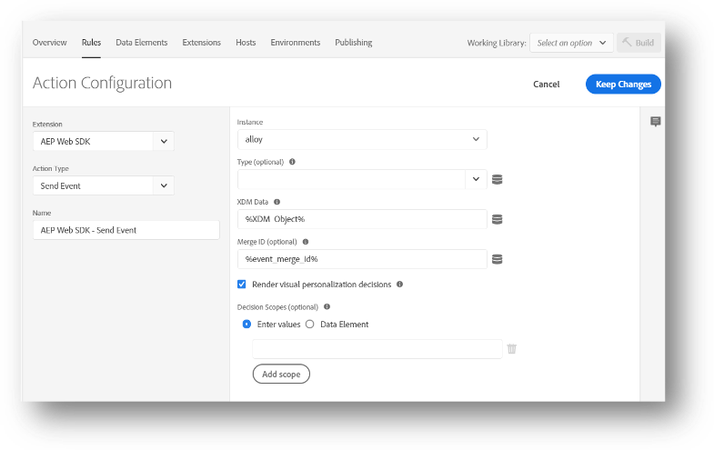


1. Assuming everything looks correct, click **[!UICONTROL Keep Changes.]**
1. Back on the rule overview page, scroll and add the text **[!UICONTROL – Personalization]** to the end of the rule name to more accurately reflect what this rule now does:

    

    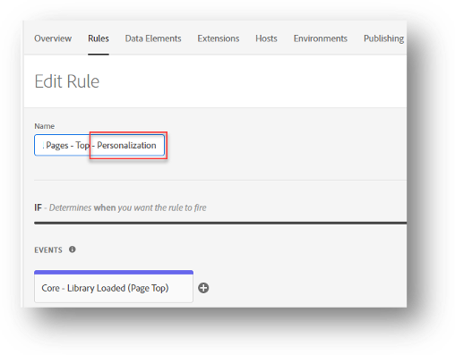


1. With the rule successfully updated, click **[!UICONTROL Save to Library.]**
1. Click into the **[!UICONTROL General Page Load]** rule and add an action.
1. On the resulting screen, change the **[!UICONTROL Extension]** dropdown to `AEP Web SDK` and the **[!UICONTROL Action Type]** to **[!UICONTROL Send Event]**. 
1. In the newly visible fields, click the **[!UICONTROL data element]** icon for the **[!UICONTROL XDM Data]** field and select the **[!UICONTROL XDM Object]** data element that you configured earlier.
1. Set the **[!UICONTROL Merge ID]** field to use the `event_merge_id` data element that you just created. Since this is the final data collection call, it needs to have the same event merge ID as the top of page call did.
1. Your final configuration should look like this:


    


    >[!NOTE] Because this send event call will be made at the bottom of the page, you don't want it to render any personalizations.

1. Click **[!UICONTROL Keep Changes]**
1. Back on the Rule overview page, change the **[!UICONTROL Save to Library]** button to **[!UICONTROL Save to Library and Build]** since this is the last change you're going to make before testing it out on the site. Once your library is built, you'll see a green dot next to it:


    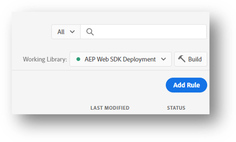


## Deploy and Validate AEP Web SDK on the Luma Website

In this section you're going to place your development Launch tags on your AEM Author instance. You'll then replicate that file to your Publish instance and verify that the Web SDK is sending event calls. For years, most of the Experience Cloud solutions have been sending data via query string parameters. It wasn't until recently that at.js and AppMeasurement had options for sending JSON in a payload, but Web SDK sends all of its data (less a handful of query string parameters) via JSON payload. As such, you'll need something other than the Adobe Experience Cloud Debugger to validate that the data looks correct.

 


1. Start your AEM Author and Publish instances in mPaaS.
1. While your AEM instances are starting, download the [Getting Started: Technical Exercise](https://adobe.sharepoint.com/sites/GCOE-DMA/DMA%20Academy%20Technical%20Foundations/1%20Base%20Website%20Setup/1%20Getting%20Started/Getting%20Started%20-%20DMA%20Academy%20Technical%20Foundations.pdf?csf=1&e=rPKDOu) guide that was updated for Cohort 2. 
1. In the updated Getting Started guide are instructions for installing the **[!UICONTROL Adobe Experience _Platform_]** Debugger (which is different than the Adobe Experience _Cloud_ Debugger that you've been using to date.). This is the next version of the debugger, and it also includes specific functionality for viewing data sent via the Web SDK. However, the new debugger is still very new, and it isn't quite as user friendly as its future versions undoubtedly will be. As such, you’ll need to either install the new Adobe Experience Platform Debugger OR use Charles Proxy (installation instructions also in the Getting Started guide), OR use the native developer tools for whatever browser you're using. 

    These instructions will be using Charles Proxy simply because it is the easiest tool for demonstration and screenshots. That said, there will be instructions for using the Platform debugger included in this first validation for those who would rather not use Charles Proxy.

1. Once you have your debugger of choice installed and ready to go, return to the Launch property of your assigned wwfovlab### org you've been working in and click the **[!UICONTROL Environments]** nav element.
1. Click the **[!UICONTROL Install]** icon for the **[!UICONTROL Development]** environment to trigger the **[!UICONTROL Web Install Instructions]** dialog box:

    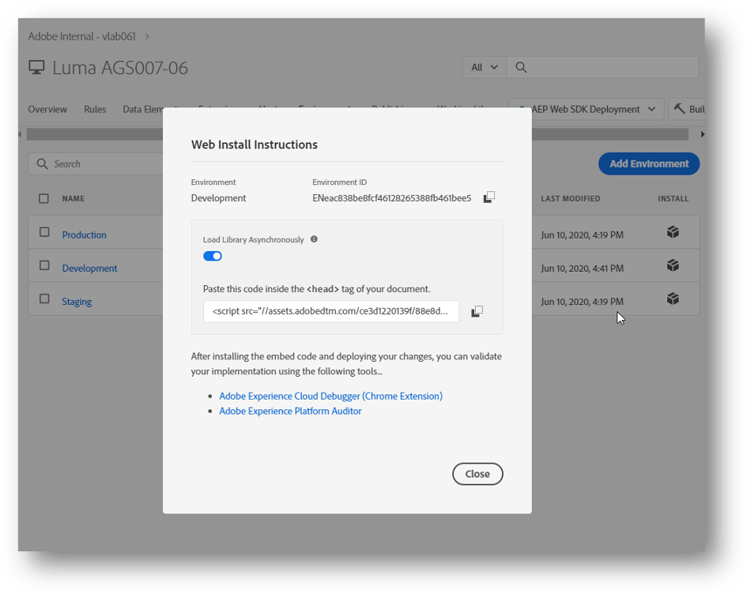


1. Click the **[!UICONTROL Copy]** icon to copy the embed code to the clipboard:

    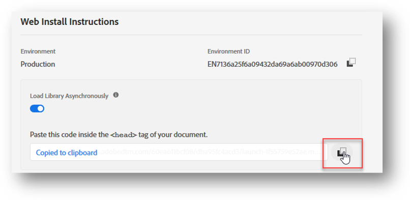


1. In Chrome, navigate to your AEM Author instance and navigate to the CRXDE Lite interface (**[!UICONTROL AEM Logo > Hammer> CRXDE Lite Card]**).
1. Add the Launch header code to the datalayer.html code by taking the following steps: 
    1. In folder structure on the left, browse to `/apps/datalayer` and double-click on the `datalayer.html` node. The datalayer.html file will open in the main editing area:


          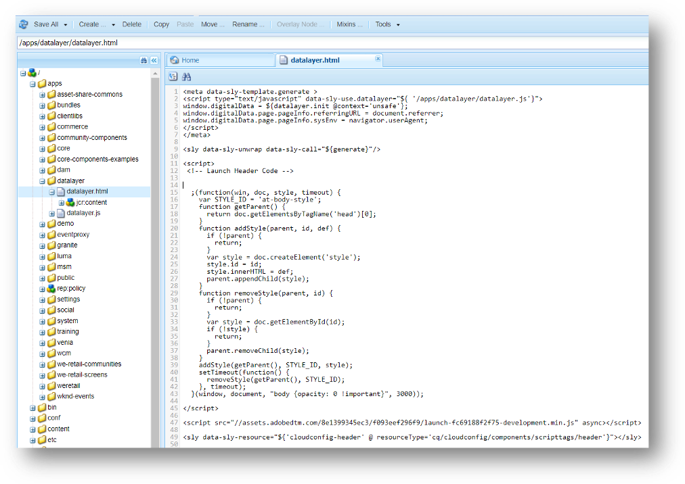

        Recall that you have two pieces of code that you put in here during the digital foundations exercises. One is the pre-hiding snippet for Target and the other is the Launch library reference from your AGS### org. 

    1. Because you will have access to these wwfovlabs only for a short period of time, you are going to want to make it as easy as possible to put this code back. Cut out everything between the `<sly/>` elements and store it in a text file somewhere you can find it later:

        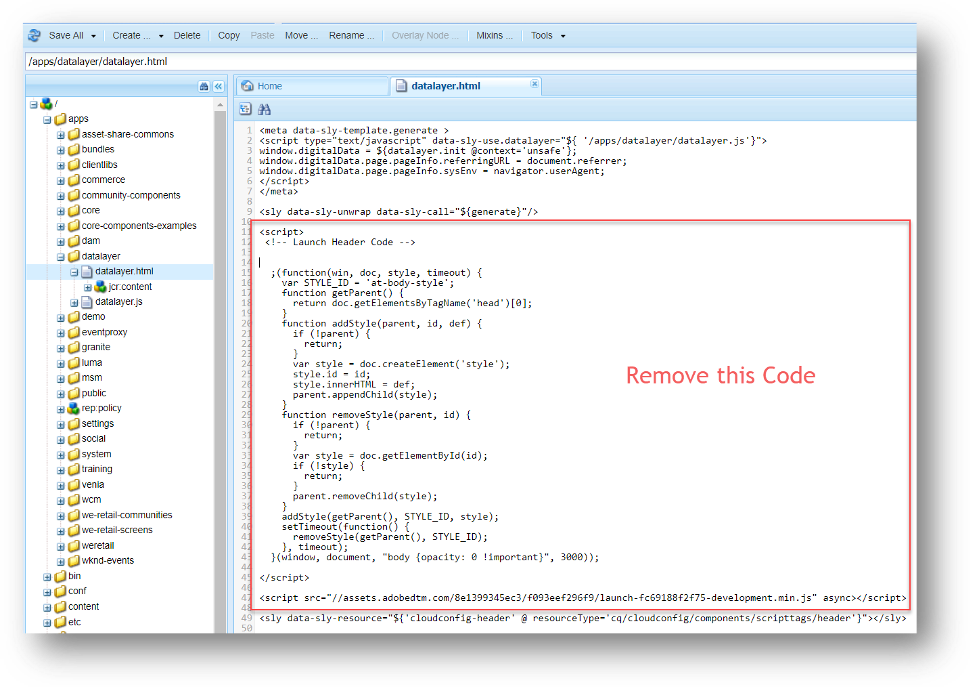


    1. Place the Launch embed code that you just copied into the area of the code that you just removed, adding some custom white space before and after your Launch embed code will make it easier to read. When finished, your datalayer.html file should look like this:

        

        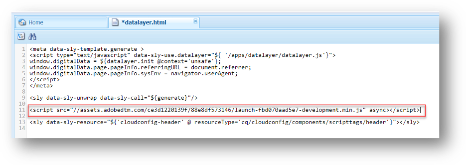


    1. Return to the Launch UI, close the **[!UICONTROL Web Install Instructions]** overlay, and click on **[!UICONTROL Extensions]**.
    1. Click **[!UICONTROL Configure]** on the **[!UICONTROL AEP Web SDK]** extension, scroll down, and click the **[!UICONTROL Copy to Clipboard]** button:


        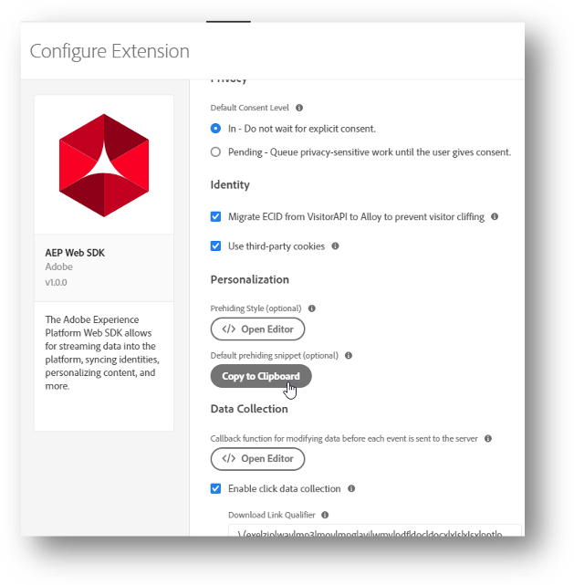


    1. Return to the AEM Author UI and paste the code you just copied to the clipboard immediately above the Launch code. When finished, your file should look like this:
        
        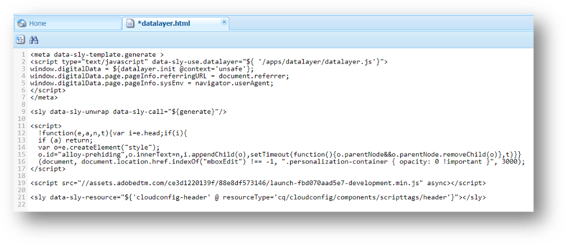


    1. Perform a CTRL+S (or command +s) to save your changes (there is also a **[!UICONTROL Save All]** button in the top left corner if needed). 

1. Replicate your changes to the Publish instance by clicking on the **[!UICONTROL Replication]** tab followed by the **[!UICONTROL Replicate]** button in the bottom right window. You'll know it's been replicated to the publish instance when you see a time stamp in the **[!UICONTROL lastPublished]** field.

    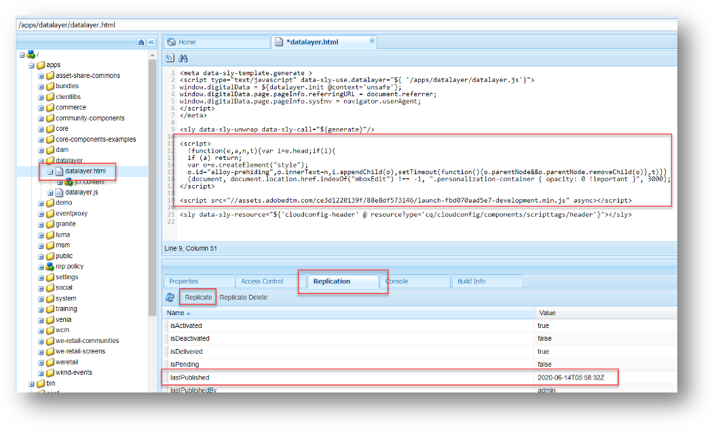


1. To see your changes, browse to your publish instance in an incognito browser so you get an uncached version of the homepage. View the page source and you will see that your Launch tags are above the &lt;/head> tag and below the data layer:


    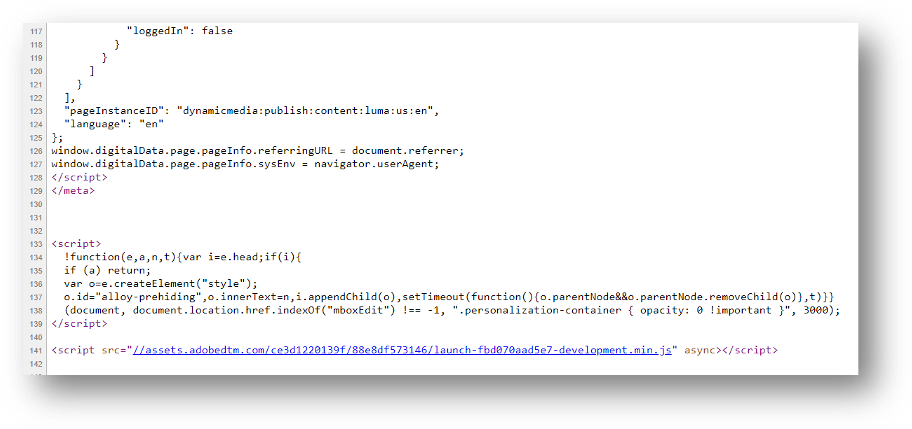


    With your Launch library deployed, you're ready to move on to validation.

1. Open a new incognito browser and start Charles Proxy or enable the Adobe Experience Platform Debugger in that new incognito browser.

    >[!TIP] If you decided to use Charles Proxy, you will want to add `data.adobevlab.com` to the focused hosts list to make this and all remaining validation easier.

1. Navigate to your AEM publish instance and in Charles (or the Platform Debugger), find the following three network calls to:

    1. `adobedc.demdex.net`
    1. `dpm.demdex.net`
    1. `data.adobevlab.com`

    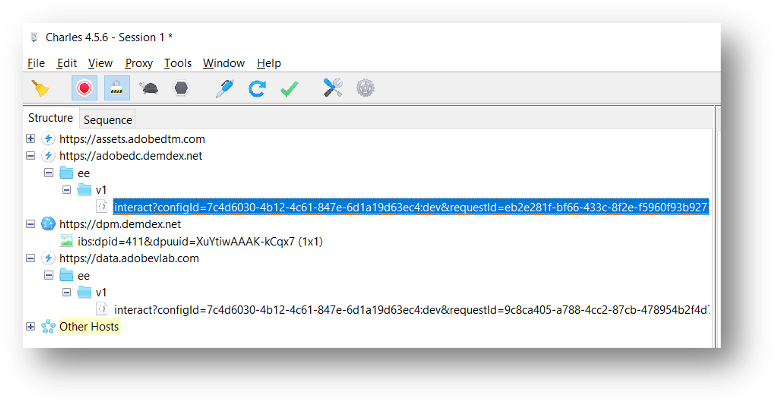


    >[!NOTE] You'll also see the network call to Launch, but that's not a net new change for using the AEP Web SDK.

    >[!TIP] The calls that go to the .demdex.net domain only appear for the first page of a first visit. If you don't seem them, try again in a net new incognito window.

    If you're using the new Platform debugger, click on the **[!UICONTROL AEP Web SDK]** in the left rail will show you two of those network calls (the `adobedc.demdex.net` and data.adobevlab.com):

    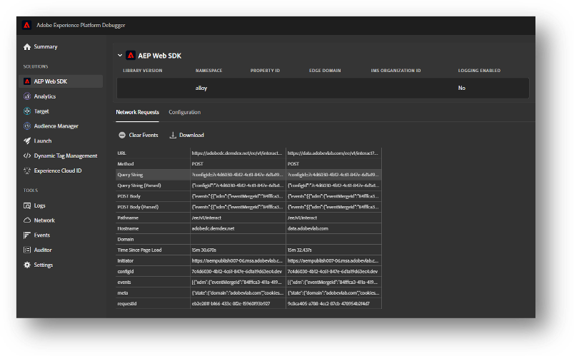

    And a click on **[!UICONTROL Audience Manager]** in the left rail will show you the dpm.demdex.net call:

    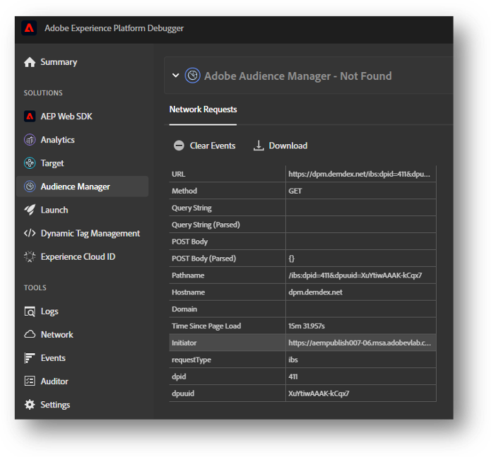

1. Look at these network calls and notice some of the differences and similarities between them and the current solution-specific network calls:

    1. Since this JavaScript library needs to be backward compatible non-Platform solutions, the dpm.demdex.net call is just like the ID sync call from the ECID service for syncing the ECID with the Advertising Cloud. 
    1. The `adobedc.demdex.net` call is the new version of the dpm.demdex.net call that was responsible for retrieving an ECID. It was also consolidated with the top-of-page call you set up in Launch (the first send event call). Because all network calls are asynchronous in the Web SDK, we are able to consolidate these first-time visitor network calls.
    1.  If you look at the response to the `adobedc.demdex.net` call (only possible with Charles or web developer console), you'll see Experience Edge responding with ECID information as well as the payload that fired the dpm.demdex.net call similar to how AAM response to the ECID service calls today:

        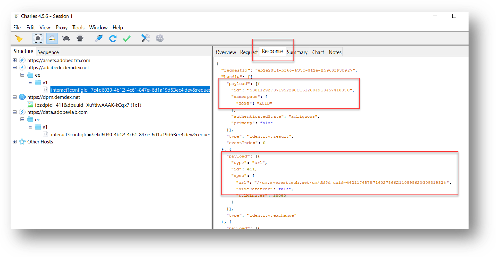
 
        >[!NOTE] You will see references to the edge using the term Konductor. In the response above, you can see kndctr in some of the response elements. Konductor is the internal name for Experience Edge, similar to how the Analytics data collection engine is often internally referred to as Mod Stats. 

    1. Look at the payload for both the `adobedc.demdex.net` and `data.adobevlab.com` network calls. Notice how the JSON is that of the XDM schema you set up for the Luma Website Data:

        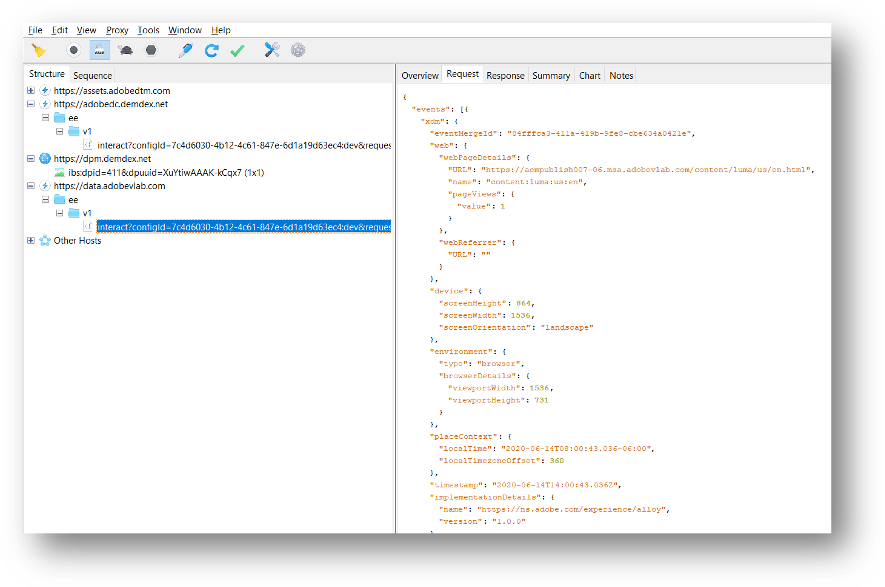


        >[!TIP] To see the request in the Adobe Experience Platform debugger, click into the POST body field

        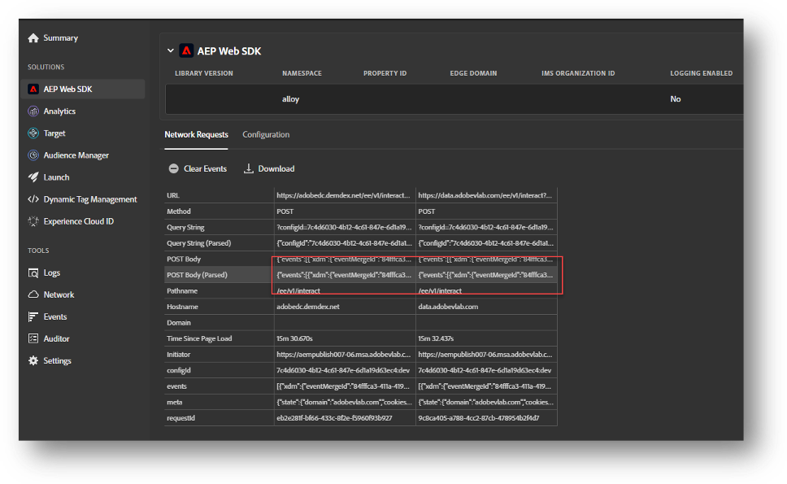

        An overlay will appear that will show you the JSON that was passed into Platform:

        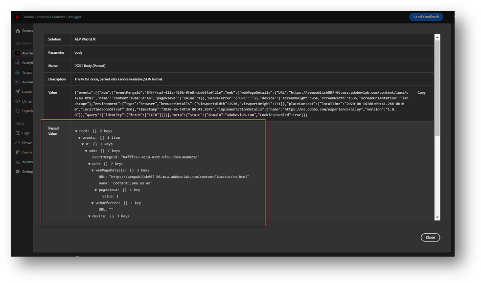

    1. The page name and pageview counts are in the webPageDetails node:

        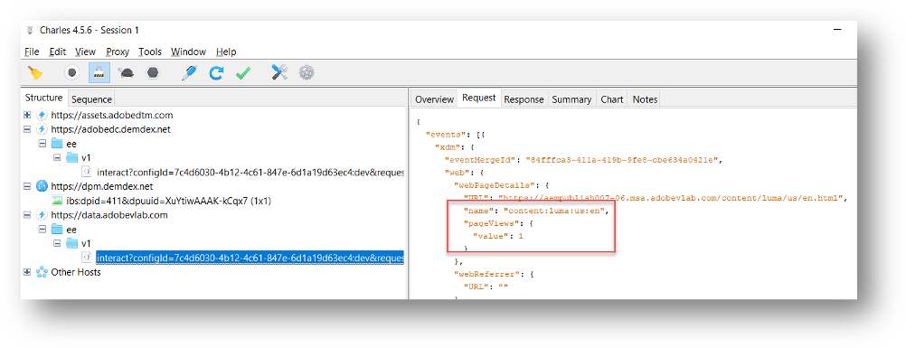


    1. Looking at the path of the network calls, you'll see the phrase `interact`. This is to indicate that the Web SDK is expecting interaction from the server such as getting an ECID, AAM response, or a Target response. You'll see that URL change to `collection` in scenarios where data just needs to be collected, such as a click on a navigation link:


        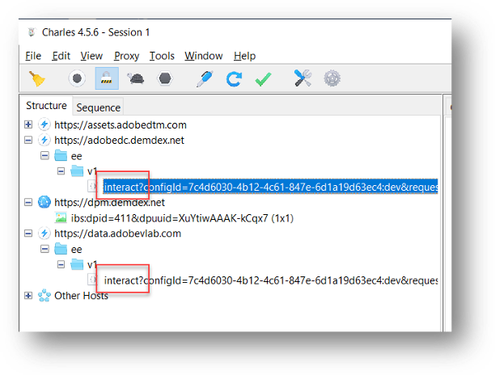


    1. The only two actual query string parameters passed are the config ID (what you configured in the Edge Configurator) and the request ID, which is unique to each request.
    1. You should also see the event merge ID at the top of both calls is identical. As mentioned before, this ID can be used in downstream systems as a way to deduplicating these requests as needed since all of the information in these two hits is essentially identical given our very simple implementation.
    1. Up to this point, there isn't much difference between how the Web SDK sends in data vs any other streaming API request. However, there is one start difference. Near the bottom of the request payload is a reference to how the ECID is passed in this hit. Recall that when you set up the XDM schema for the web collected data that you didn't specify any identity fields. With the Web SDK, the ECID is set as an identifier "on the fly" by Konductor before being passed to Platform:


        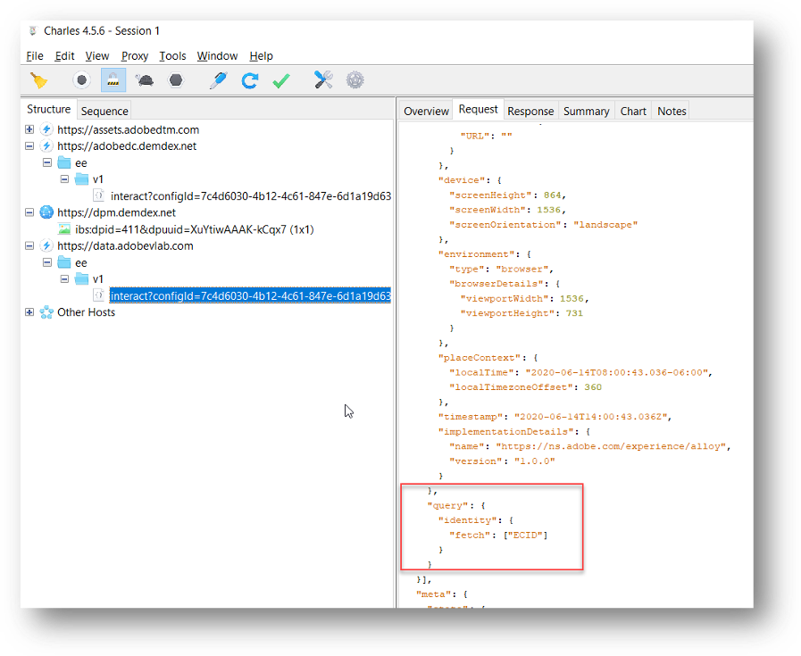


        If you look at the response, you can see that ECID is being reported as an identifier with the ECID namespace:


        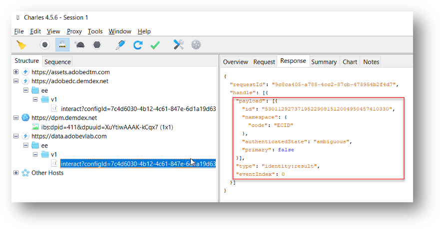


        >[!NOTE] The use of identity map like this is not a best practice for customer data sent in via other means. Streaming S2S API calls that you sent in an earlier exercise use identity fields that trigger the identity service. The Web SDK here uses identity map, which by passes the identity services. That can be problematic for so many reasons that won't be elaborated on here. The important thing to remember is just that customers should NOT be using identity map at any other time. That is reserved for the AEP Web SDK **only!**

    1. Lastly, if you look at the cookies set by the Web SDK Library, you'll see the backward- compatible AMCV cookie in addition to two new cookies related to consent and how Konductor stores the profile ID for late retrieval. 

    
        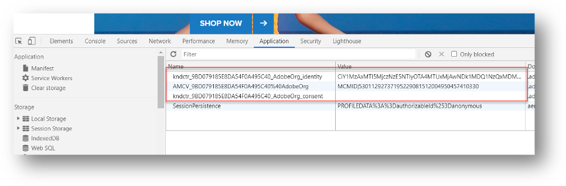


1. Click around the site and notice that the `adobedc.demdex.net` call is no longer being sent and that your `data.adobevlab.com` is the only domain used. You'll also see that you get a page top and page bottom `interact` call, but that you also get a `collect` call (as mentioned earlier) that is triggered when you click on links to move to the next page:

    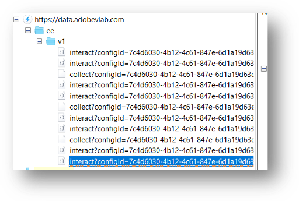


1. View the responses for each of these calls and notice how only the `interact` calls are getting a JSON response.

    >[!NOTE] Knowingly putting this many server calls on a page is completely contrary to how SaaS consultants have operated for more than a decade. Having a library this "chatty" may also be concerning. However, it's important to remember that this is a net new way of thinking. Keep in mind that the event merge ID will help consolidate these calls later (so that customers aren't billed).


    >[!NOTE] The reason this library and Konductor aren't quite ready to replace all existing libraries is because the systems around the library aren't quite ready. For example, the system for mapping XDM to Analytics eVars and Props isn't where it needs to be to fully support a complex, Enterprise-grade Analytics implementation. That said, it should be able to support a simpler Analytics use case. 

1. Now that you can see the data being passed in, it's time to go see how it shows up in Platform. Return the Platform sandbox that you've been using.
1. Click on **[!UICONTROL Datasets]**, then click into the `Luma Website Data` dataset. Hopefully by now, you should see that some of the data has been ingested (or is currently being ingested). 
1. Click the **[!UICONTROL Preview Dataset]** button in the upper right corner:


    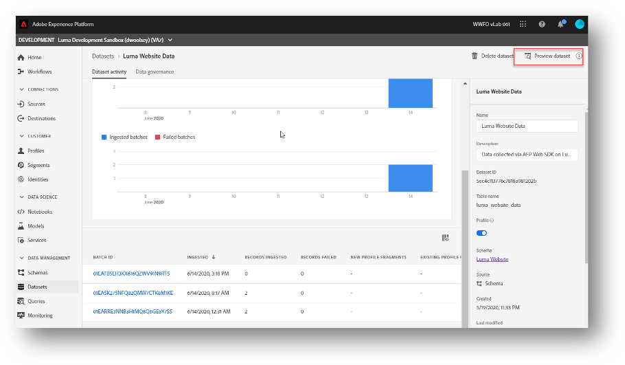


1. On the `Luma Website Data` preview page, you'll see the left nav matches the XMD Schema and the Web SDK calls. Expand the **[!UICONTROL Web]** node and you can see the pageName and pageViews.value nodes that you set in Launch:


    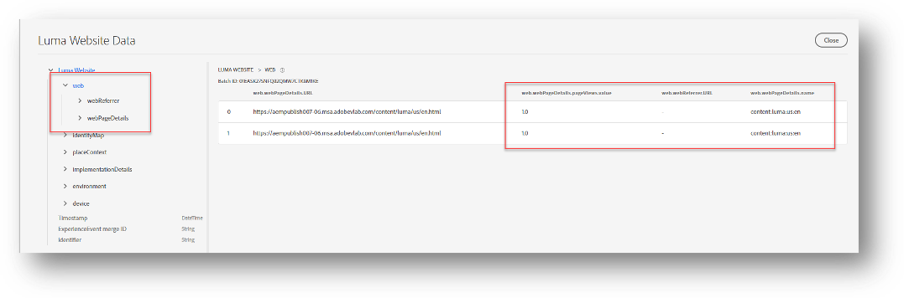


1. Click **[!UICONTROL Close]** to close the data preview overlay. 

>[!IMPORTANT] This is not the end of this week's exercises. This is only the end of Part 1. Part 2 will be released as soon as possible**

**Original Exercise Creator:**

David Woolsey

**Change Log**


<table>
  <tr>
   <td>Ver.
   </td>
   <td>Issue Reporter
   </td>
   <td>Changes
   </td>
   <td>Date
   </td>
  </tr>
  <tr>
   <td>1.0
   </td>
   <td>
   </td>
   <td>Original Launch
   </td>
   <td>6/15/2020
   </td>
  </tr>
  <tr>
   <td>1.1
   </td>
   <td>David Woolsey and Deepu Prasad
   </td>
   <td>Fixed cart_revenue data element to be a double and fixed an incorrect screenshot on the personalization send event action
   </td>
   <td>6/16/2020
   </td>
  </tr>
</table>


## Hands-on Technical Exercise: Adobe Experience Platform Web SDK – Part 


## Overview

As you concluded of Part 1 of this exercise, the website data was flowing into Platform's data lake, but it isn't yet in Profile. How could it be? How would Platform know that someone on the website is someone in the CRM system? The next section will be dedicated to showing you how to send Web SDK-collected data into an existing Profile, and the last part of this document will focus on instrumenting the Luma checkout flow with AEP Web SDK.

## Sending AEP Web SDK Data to Real-time Customer Profile

In this section, you're going to learn how to send authenticated data into Profile via the AEP Web SDK and have it stitch to the Real-time Customer Profile. 


1. If necessary, log into [experience.adobe.com/platform](https://experience.adobe.com/platform) for your assigned wwfovlab### and ensure that you are in your sandbox.
1. Click on **[!UICONTROL Identities]** and locate the Declared ID identity that you created in earlier exercises. Stay on this page as you'll need some information from it shortly.
1. In a new tab, log into launch.adobe.com for your assigned wwfovlab###, click into your Launch property, and set the working library to the `AEP Web SDK Deployment` library.
1. Click on the **[!UICONTROL Rules]** tab and then into the `All Pages – Top – Authenticated` rule.
1. Add an action and set the **[!UICONTROL Extension]** to **[!UICONTROL AEP Web SDK]** and the **[!UICONTROL Action Type]** to **[!UICONTROL Sync Identity.]**
1. Switch tabs to your Platform sandbox that should still be on the identities screen. 
1. Copy the **[!UICONTROL Identity Symbol]** for the Declared ID namespace (should be DeclaredId) and paste it into the **[!UICONTROL Namespace]** field of the Launch action:

    
    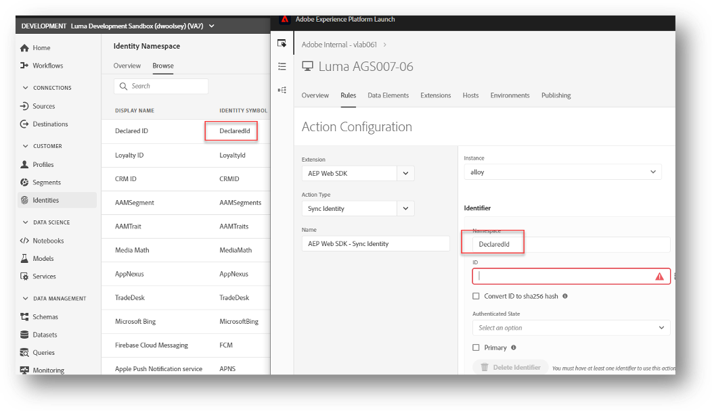


1. In the **[!UICONTROL ID]** field, select the `hashed_email` data element.
1. Set the **[!UICONTROL Authentication State]** to **[!UICONTROL Authenticated]**. When finished, your configuration should look like this:

    
    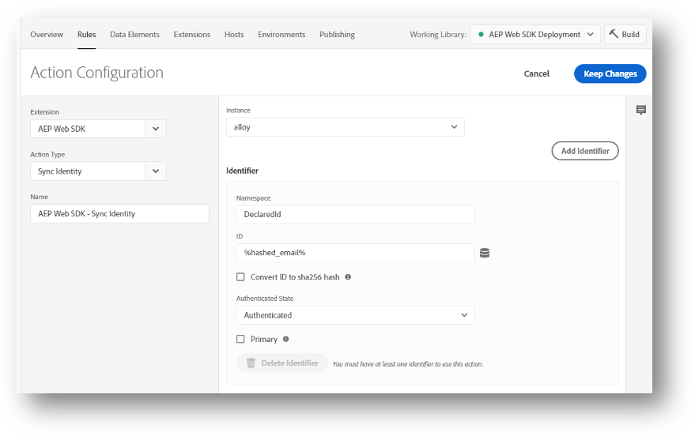


1. Click **[!UICONTROL Keep Changes]** and then perform a **[!UICONTROL Save to Library and Build]** action to save these changes and build the development library. 

    >[!NOTE] Recall that this rule fires only when someone is authenticated. 


    >[!NOTE] This step may seem very familiar because it's essentially the same process that you followed when you synced the hashed_email with the `AdobeCampaignID` and customer attributes alias with the ID service. 

1. Once the library finishes building, navigate to your publish AEM instance. For consistency’s sake, you may want to use the Chrome browser profile you used in the Campaign Classic exercises that is attached to the user on your Luma site. That said, any browser will work. 
1. Open Charles Proxy or the debugging tool of your choice.
1. Log into the site using the same email address as the one you used in your Platform profile. 
1. You should see the **[!UICONTROL IdentityMap]** node update with your authenticated information:

    


    


1. Click around the site some more and you'll notice that you now have 3 interact calls per page instead of just 2. When IDs are synced, an interact call is sent. You'll be able to spot the ID sync interact call because, unlike the other two send events calls, it won't have an event merge ID or any of the other XDM elements that you set (like the pageview value or the pagename):

    

    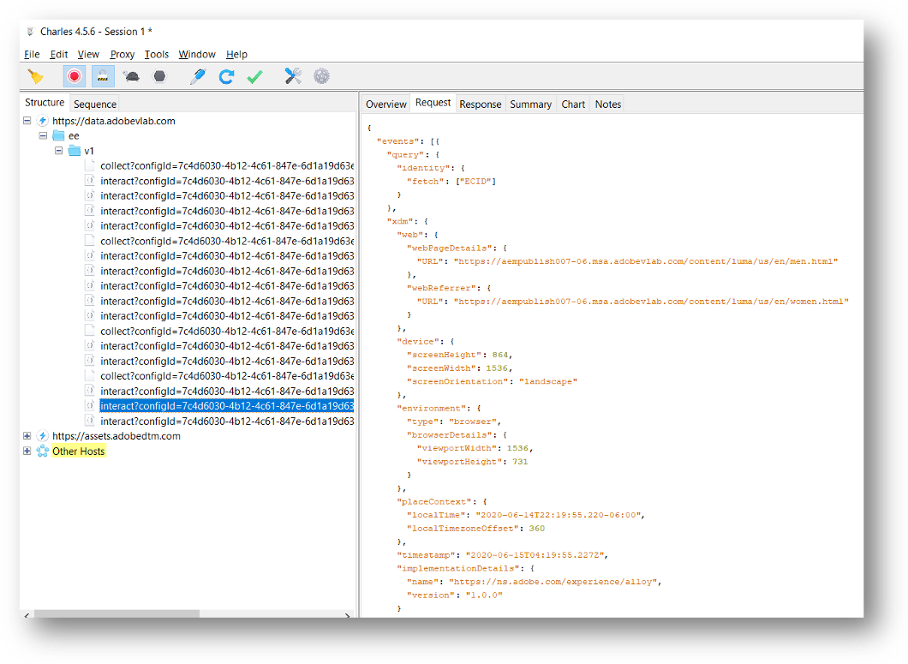


    >[!NOTE] When you onboarded the CRM data in the earlier exercises, you should have added the same Declared ID that you just sent in from the webpage. This is how Platform will know that the same generic ECID on the site is going to stitch to a specific profile. 

1. Return to the Platform UI and click on **[!UICONTROL Datasets]**.
1. Click into your `Luma Website Data` dataset and wait for the latest batch to process:

    
    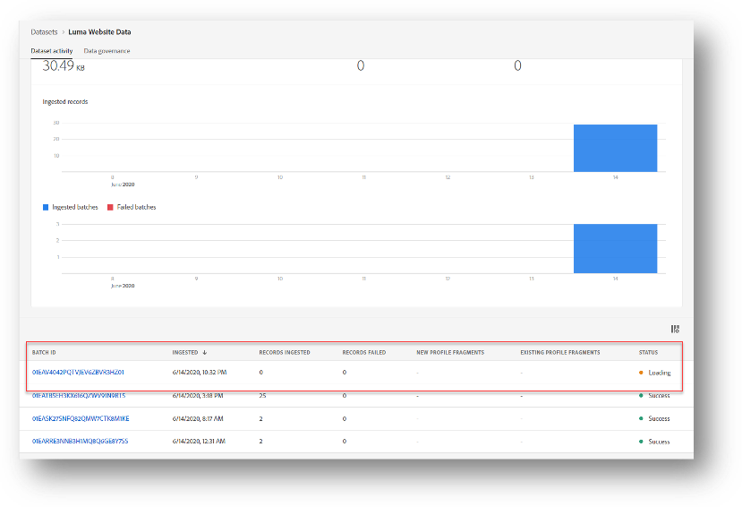


1.  As soon as the batch finishes processing, click on **[!UICONTROL Profiles]** in the left rail.
1. Use the profile lookup to find your profile. Since you have the declared ID handy in your debugger calls, go ahead and look up your profile via the Declared ID namespace:

    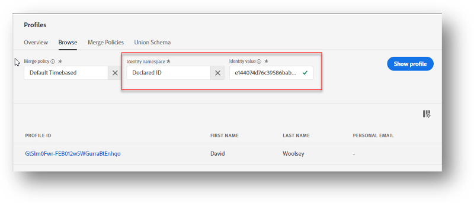


1. Click into your profile and then click on the **[!UICONTROL Events]** tab. You should now see several pageviews associated with your profile:

    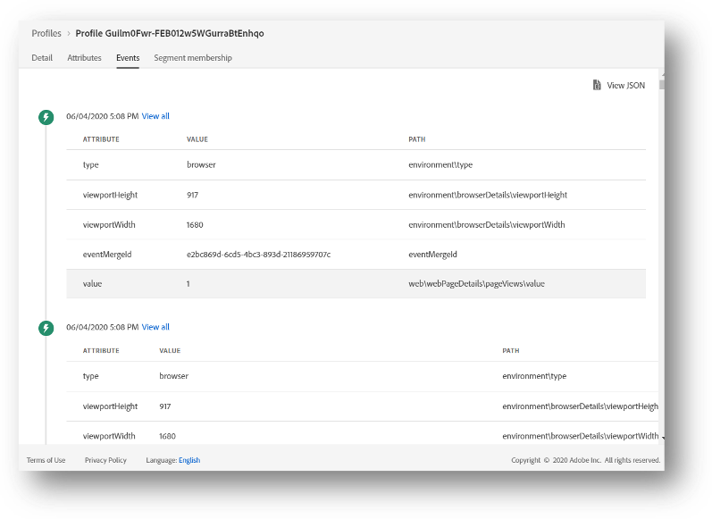


    >[!IMPORTANT] At the time of this writing, the Profile service was still not working. As such, if you don't see the events collected from the webpage, continue to the next step anyway.


    >[!NOTE] If you were to log out of the site, browse around the site, and then return to the profile viewer after the batch has processed, you would still see the new events. Just like all stitched data, once the ECID and Declared ID have been stitched to the profile, there is no unstitching them, even though the end user may have logged out. This is an example of how we need to be careful how the Web SDK is used today, as it is still very new and some features like this still need to be worked out. 

## Adding Platform Commerce Elements to Checkout

Now that you have some of the basic data being captured and passing into Platform and Profile, it's time to move to the slightly more complicated task of capturing data around the retail checkout flow. It's in this section that you're going to see even more differences around how Platform and the Web SDK work versus current solutions like Analytics. You'll also see how a static data layer that is on the Luma site might need to be replaced by a more modern Event-Driven Data Layer (EDDL) to maximize scalability with the Web SDK.


### Update Commerce Rules


1. If necessary, log into launch.adobe.com for your assigned wwfovlab###, click into your Launch property, and set the working library to the `AEP Web SDK Deployment` library.

    The first thing we need to do is add the checkout and purchase commerce events to the existing data layer. This may sound unusual, because in a traditional Analytics implementation, you'd simply set the s.events variable in an Analytics setVariable action on a checkout page to "scCheckout" just like we did in the earlier Analytics exercise. However, there currently is no "Set XDM" variable action. Recall that the Web SDK sendEvent action requires that all of the XDM needing to be sent has to be done in a single data element. That's why the XDM Object data element is a data element that references other data elements. 


    However, this presents us with a problem. The pagename and pageview count elements you set earlier could be sent on every page/interact call. However, the checkout and purchase pages only need their respective XDM values incremented on their respective pages. So how does one dynamically update an XDM schema that's set on every page to include values only at the right time? 


    The answer is that you set those commerce events in data elements and then map those data elements to the right XDM node. When those commerce event data elements have values, then those values are present to the XDM node and are passed in on the next call. When the commerce events are blank, the data elements are empty, and no values are set in the XDM (sort of…more on this later).  As such, the commerce event data elements need to be set by the on-page data layer. This, however, presents us with another problem: the current on-page data layer has no nodes or events to indicate a checkout or purchase happened. There is nothing in the data layer that says, "this is a checkout page" or "this is a purchase confirmation page”. 


    To get around that problem, you're going to have the checkout and purchase page rules programmatically add a node to the data layer so that the corollary data element can be set and the right XDM field populated at the right time. If this seems a little confusing, that's fine. Proceed through the next couple of steps and then revisit this explanation to see if it makes more sense. 

1. Click on the **[!UICONTROL Rules]** tab and then click into the `Checkout Page` rule. 
1. Add an action, leave the **[!UICONTROL Extension]** set to **[!UICONTROL Core]**, but set the **[!UICONTROL Action Type]** to **[!UICONTROL Custom Code]**.
1. Open the code editor and paste in this code snippet:

    
    ```javascript
    digitalData.cart.commerceEvent= {"checkout":{"value":1}};
    ```

    Then click **[!UICONTROL Save]**.


    >[!NOTE] This will create a new commerceEvents.checkout node in the existing data layer when this rule fires. 

1. Click **[!UICONTROL Keep Changes]** when done and then **[!UICONTROL Save to Library]** on the resulting page to save your newly created rule.
1. Back on the rules page, click into the `Order Confirmation Page` rule.
1. Like the checkout page, add a new action, set the **[!UICONTROL Action Type]** to **[!UICONTROL Custom Code]**, then paste this following into the code editor:

    ```javascript
    digitalData.commerceEvent = {'purchase': {'value':1}};
    ```

    >[!NOTE] Even though this code will fire on a different page than the checkout page, we used the same commerce event node just for the sake of consistency.


### Add Commerce Data Elements

Now that the data layer will be updated with these new nodes when the checkout and purchase pages load, we need to set the "1" value into a data element so it can be mapped to the right XDM node.


1. Click on **[!UICONTROL Data Elements]** in the Launch UI.
1. Click **[!UICONTROL Add a Data element]** and name the new element `checkout_page_de`.
1. Leave the Core as the extension and change the **[!UICONTROL Data Element Type]** to **[!UICONTROL JavaScript Variable]**.
1. In the **[!UICONTROL JavaScript variable name]** field, set the value to `digitalData.cart.commerceEvent.checkout.value` (the name of the node that you just dynamically inserted via the Checkout Page rule). This will set the data element value to 1, which we can then use in the XMD Mapper to indicate a checkout happened in much the same way we indicate that a pageview happened. 
1. Click **[!UICONTROL Save to Library]**.
1. Add another data element called `purchase_de` and set the **[!UICONTROL Data Element Type]** to **[!UICONTROL JavaScript Variable]**.
1. In the JavaScript variable name field, set the value to `digitalData.commerceEvent.purchase.value` and click **[!UICONTROL Save to Library]**.

    Now that the two commerce events are being added to the data layer and passed to their respective data elements when set, we also need to account for the products that are going to be added. However, there is another twist here: there can be several products in a single order. As such, each product will need to be added to an array of products and then passed to the right XDM node. You may recall that the productListItems node in both the Web SDK and Offline Purchase schemas is an array. As such, only an array can be handed to them and passed on to Platform. 

1. To start this product array, create a new data element name `product_info`.
1. Set the **[!UICONTROL Data Element Type]** to **[!UICONTROL Custom code]** and place the following code into the code editor:

    ```javascript
    xdmProducts = [];
    var product = {};

    for (var i=0; i<digitalData.cart.cartEntries.length; i++){
        
        product={
        "SKU":digitalData.cart.cartEntries[i].sku,
        "quantity":parseInt(digitalData.cart.cartEntries[i].qty,10),
        "priceTotal":parseFloat(digitalData.cart.cartEntries[i].price)
        };
    
        xdmProducts.push(product);   
    }
    return xdmProducts
    ```


    Then click **[!UICONTROL Save]**.


    >[!NOTE] There are a couple important elements to call out in this code. The first is that since the product information is an array and we can only pass a completed array to the XDM node in the mapper, the format/names of the fields have to match the XDM schema. Instead of allowing the Launch extension to put things in the right format from a data element, you must fill in the correct format because Launch will not format it for you in this scenario. In this screenshot of the schema, you can see that the fields in the code match the schema:


    
    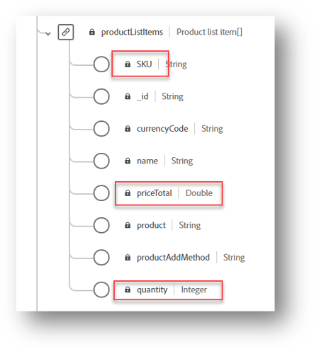


    The other thing to notice is that object type is strictly enforced. The priceTotal and quantity fields need to be Double or Integer, not a string. As such, you'll see some JavaScript parsing to ensure that the strings in the data layer are properly recast into the correct type:


    
    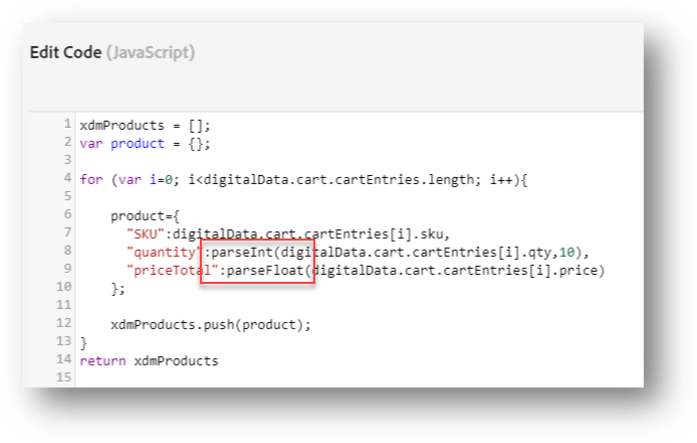


1. Click **[!UICONTROL Save to library]** to save your two new data elements. Now your data element page should look like this, with the three new data elements:

    
    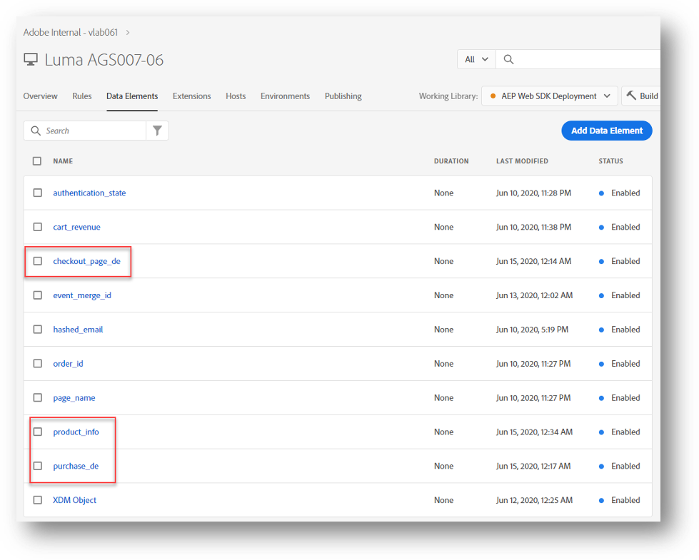


### Map Commerce Data Elements to XDM

Now that you have your data elements being populated, it's time to map them in the XDM Mapper tool.


1. While still on the Data Elements page, click on the **[!UICONTROL XDM Object]** data element.
1. When the mapper loads, expand the **[!UICONTROL Commerce]** and **[!UICONTROL Checkout]** nodes and click on the **[!UICONTROL value]** node.
1. Set the **[!UICONTROL value]** node to `checkout_page_de` data element:

    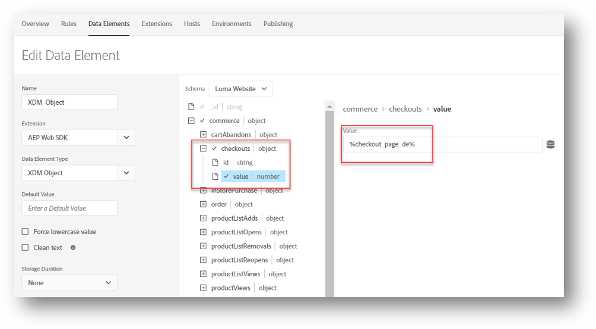


    >[!NOTE] Like the pageview metric, this value is just going to be a "1" in the XDM that is sent to platform. We just had the checkout page rule add a node to the data layer with a value of 1 so that this data element could also set the XDM to a value of 1.

1. Expand the **[!UICONTROL purchases]** node (of the commerce node) and set the **[!UICONTROL value]** node to the `purchase_de` data element.
1. In addition to the checkouts and purchases, we also have other attributes about the order that are in data elements we created earlier and can easily be mapped to the proper XDM node. Namely:

    <table>
    <tr>
    <td>
    <strong>XDM Node Path</strong>
    </td>
    <td><strong>Data Element</strong>
    </td>
    </tr>
    <tr>
    <td>commerce > order > priceTotal
    </td>
    <td>cart_revenue
    </td>
    </tr>
    <tr>
    <td>commerce > order > purchaseID
    </td>
    <td>order_id
    </td>
    </tr>
    </table>


    When finished, your order node should look like this:


     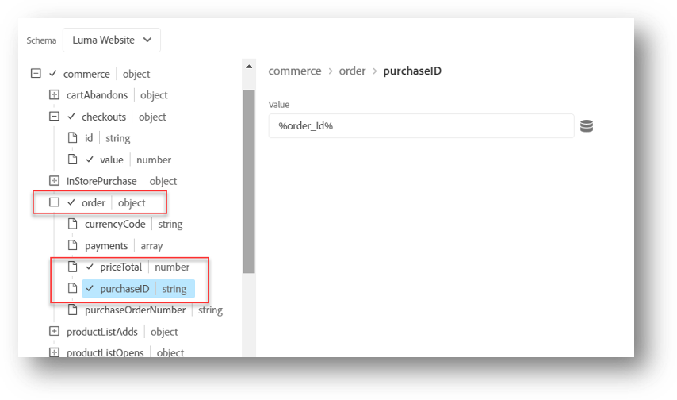


1. Next, we need to ensure that the product SKUs are include in the XDM. Though it may seem a little counterintuitive at first, the productlistItems are not in the commerce node. Instead, scroll down, then find and click on the **[!UICONTROL productListItems]** node.
1. Because this node is an array, the center screen will ask if you want to provide the items manually or provide the entire array. Since our array is dynamically populated, choose the **[!UICONTROL Provide entire array]** radio button.
1. Set the **[!UICONTROL Data element providing array]** field to the `product_info` data element. When finished, your configuration should look like this:


    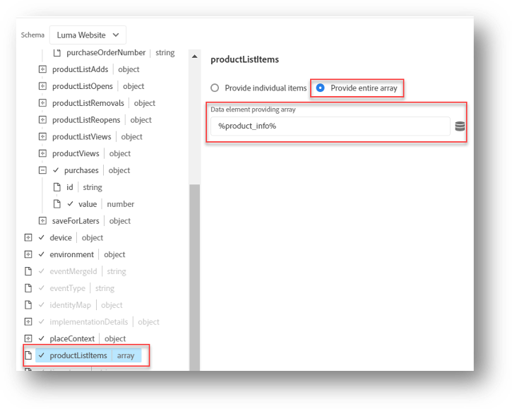


1. Click **[!UICONTROL Save to library]** and now XDM mappings are in your development library.
1. There is one more piece of code that you need to set before moving to the last tagging activity. Click on **[!UICONTROL Extensions]** then click **[!UICONTROL Configure]** on the **[!UICONTROL AEP Web SDK]** extension.
1. As called out earlier, there is a code editor in the **[!UICONTROL Data Collection]** section, and the description of the field explains what it’s for:

    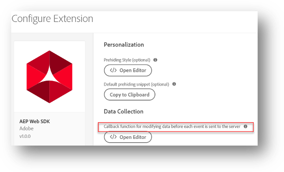


    In other words, if you need code to execute just before a sendEvent is triggered, this is where you do it. 

1. Click the **[!UICONTROL Open Editor]** button and paste in the following code at the bottom:


    ```javascript
    if(content.xdm.commerce){
        if(content.xdm.commerce.checkouts.value === ""){
            delete content.xdm.commerce.checkouts;
        }
        if(content.xdm.commerce.purchases.value === ""){
            delete content.xdm.commerce.purchases;
            if(content.xdm.commerce.order.purchaseID || content.xdm.commerce.order.purchaseID ===""){
                delete content.xdm.commerce.order.purchaseID;
                delete content.xdm.commerce.order;
            }
        }
    }
    ```


    When finished, your code editor should look like this:


    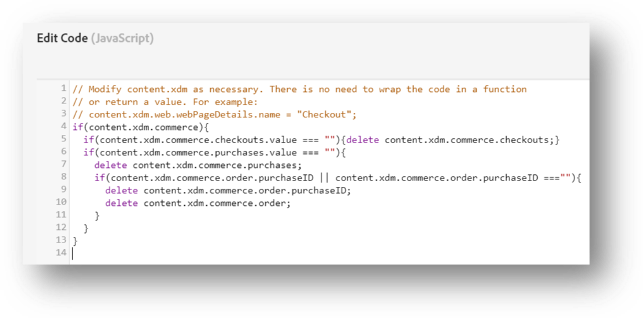

    >[!NOTE] You may be wondering what this code is doing. The answer is somewhat surprising and speaks to an earlier comment about how empty data elements are not truly empty. A carryover from Launch's predecessor, DTM, causes a problem for the AEP Web SDK. In DTM (and now Launch), data elements that are defined but not populated return an empty string. For years, this hasn't been a problem because all of Adobe's code passed everything as strings. However, since Platform requires strict object typing conformance, if a blank string is passed where a number should be passed, the hit will be rejected from Platform. In our case, the checkout_page_de is only set on the checkout page. However, since the XDM mapper runs with every send event call, the commerce.checkout.value node would still be added to the XDM with a blank string where the 1 would be. This causes all hits to fail, which is clearly undesirable behavior. 
    >
    > This WAD/bug has been reported and will be fixed in the very near future. But for a quick workaround just for DMA Academy, this code simply finds all blank strings from the commerce event nodes and removes them before the final XDM call is sent. Hopefully, this issue will be fixed in the next couple releases and you'll never need to do something like this for an actual client implementation, but it is nice to know that there is somewhere that code can be executed as a last minute resort to fix issues like this ahead of an actual release.


    >[!TIP] If you're familiar with Launch, you may be thinking that this setting in the advanced Launch Property config simply needs to be unchecked:


    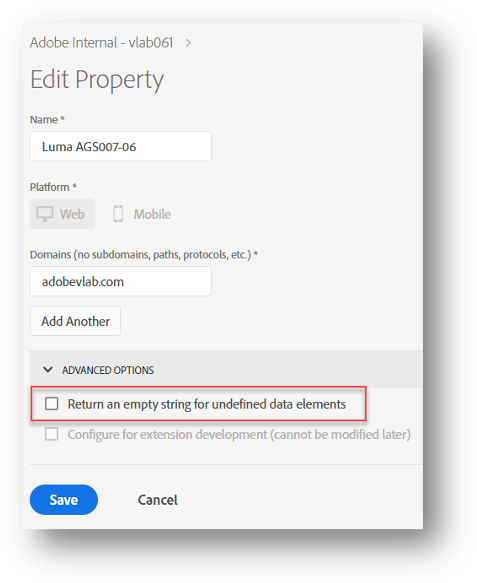


    It's important to call out that this setting is unchecked (rather, these instructions don't instruct you to check that box), but even more importantly, this setting isn't the problem. This setting says to return a blank string if the data element is not defined. This is for situations where some custom code in launch would reference a data element that may have been deleted and doesn't exist anywhere in Launch anymore. The issue we're dealing with is what happens when the data element exists (is defined) and is referenced but has no actual value. 

1. Click **[!UICONTROL Save]** to save the code and then the **[!UICONTROL Save to Library]** option to save to the dev library.


### Add the Cart Add Event

So far, you've tagged page-level events with AEP Web SDK send event calls, but what about events that happen between page loads? How do we tag for this? This section will answer that question as you tag the cart add event.


1. Like the page level events, we first need to define where the data is going to come from to populate the XDM. For cart additions, recall that there is a custom JavaScript function on the site code that passes the SKU added in the payload of the event. To get that SKU into the XDM mapper, we first have to set it in a data element. To start that process, click to the **[!UICONTROL Data Elements]** tab.
1. Add a new data element named `cart_add_product` and set the **[!UICONTROL Data Element Type]** to **[!UICONTROL Custom Code]**.
1. Open the code editor and paste in this code snippet:

     ```javascript
     return event.nativeEvent.detail.prodSku
     ```

1. Click **[!UICONTROL Save]** to close the editor and save your new data element to the library.
1. Next, we need to create the XDM for this call and get it into a single data element. We've been using the same XDM Object data element throughout this document, but we only need a small subset of data passed in. Plus, the XDM Object productListItem node gets its information from the data layer, not the JavaScript event. Therefore, a new XDM-specific data element needs to be created just for this action. Begin that process by adding a new data element.
1. Name the element `XDM Cart Add Object` (keeping with the convention of naming all data elements that contain XDM objects).
1. Change the **[!UICONTROL Extension]** to **[!UICONTROL AEP Web SDK]** and set the **[!UICONTROL Data Element Type]** to **[!UICONTROL XDM Object]**.
1. When the new XMD Mapper appears, select the `Luma Website` schema from the dropdown.
1. Expand the **[!UICONTROL commerce > productListAdds]** nodes and select the **[!UICONTROL value]** node.
1. In the **[!UICONTROL Value]** field simply type the number `1`:

    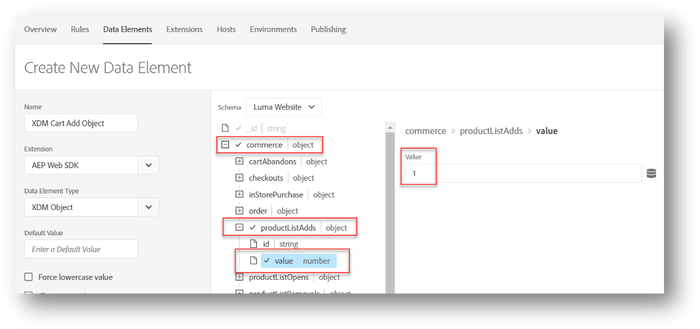


    >[!NOTE] Since this schema will be passed only on cart adds, we can manually set the 1 instead of needing to use a dynamically populated data element.

1. Scroll down and select the **[!UICONTROL productlistItems]** node. Since this is an array, you'll see the option to provide the whole array or items individually. Again, since this XDM will only ever be used for cart adds and there will only ever be one product added to the cart at a time, we can manually set this value. 
1. Leave the **[!UICONTROL Provide individual items]** radio button selected and click the **[!UICONTROL Add Item]** button.
1. You will see a new item added to the center screen, but more importantly, you'll see a new item (item 1) in the **[!UICONTROL productListItems]** node. Expand it:


    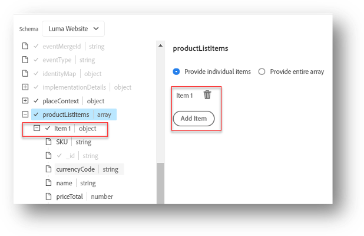


1. Select the **[!UICONTROL SKU]** node and in the resulting **[!UICONTROL Value]** field, add the `cart_add_product` data element. Again, since this is the only value that will ever be in the SKU, you can manually reference it. 
1. With the XDM object now built, click **[!UICONTROL Save to Library]** and your new data element will be on the second page of data elements:


    


1. Now, we have just one thing left: to send the event call. Click on the **[!UICONTROL Rules]** tab and click into the `Cart Add` rule.
1. Add an action, change the **[!UICONTROL Extension]** to **[!UICONTROL AEP Web SDK]** and the **[!UICONTROL Action Type]** to **[!UICONTROL Send Event]**.
1. Since this send event call will only be part of a cart add call, set the **[!UICONTROL Type]** dropdown to **[!UICONTROL commerce.productListAdds]**.
1. Set the **[!UICONTROL XDM Data]** field to the `XDM Cart Add Object` data element.
1. There is no need for an event merge ID or personalization, so click **[!UICONTROL Keep Changes]**
1. That was the last change you'll need to make in Launch, so perform a **[!UICONTROL Save to Library and Build]** and once the library is built, you'll be ready to move to the final validation.


## Validate Checkout Data Collection

Now that the checkout flow is tagged with the Web SDK code, it's time to validate that it's being sent to Platform correctly and making it to Real-time Customer Profile.


1. Open start Charles Proxy or your debugger of choice.
1. Browse to your AEM publish instance and log in with the same user you logged in with previously. If you're using the same browser, be sure to perform a hard refresh so that all of your changes in Launch are now on the site.
1. Add an item to your cart. When the item is added, you should see a send event with the **[!UICONTROL event type]** set to **[!UICONTROL commerce.productListAdds]** and the **[!UICONTROL productListAdds]** value set to `1` along with the **[!UICONTROL productListItems]** set to the SKU of whatever it was you added:

    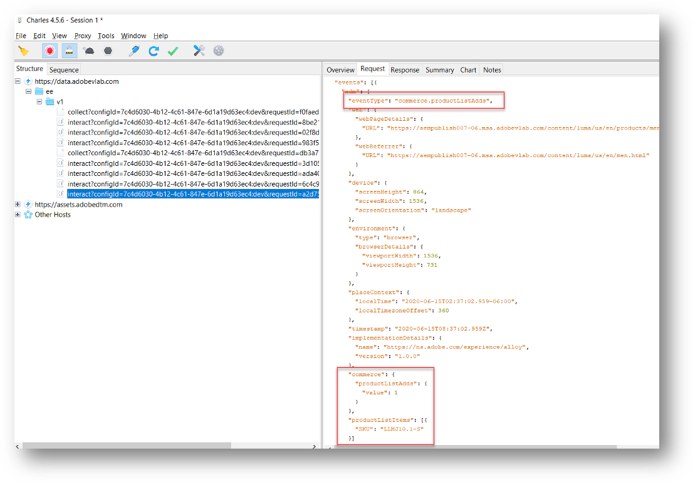


1. Proceed to the checkout page (where you enter an address). When you arrive, you should see a send event with the **[!UICONTROL commerce]** node updated with the **[!UICONTROL checkouts]** value set to `1`, along with the **[!UICONTROL productListItems]** set to the SKU of whatever was in your cart:


    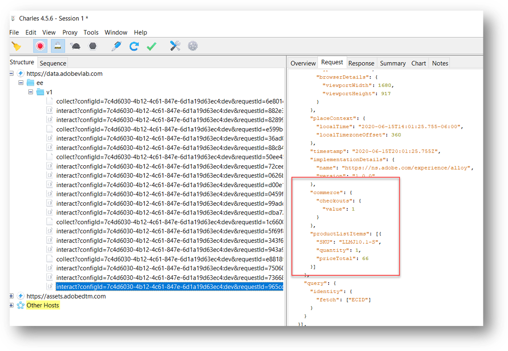


1. Proceed through the rest of the checkout flow, and on the purchase confirmation page, you should see a send event with the **[!UICONTROL commerce]** node updated with the following:
    1. **[!UICONTROL purchases]** value set to `1`.
    1. **[!UICONTROL productListItems]** set to the sku of whatever was in your cart.
    1. **[!UICONTROL order]** node updated with the `priceTotal` and `purchaseID`.

        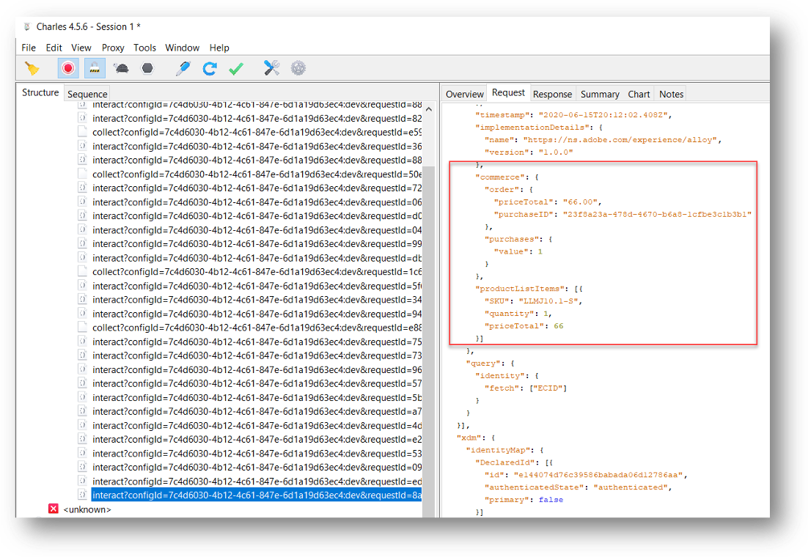


1. With your data collected, return to your Platform sandbox and click into your `Luma Website Data` dataset. 
1. Once you see that the data has processed, move to the **[!UICONTROL Profiles]** tab and perform a lookup for your profile using an identity namespace of your choosing. 
1. Click into your profile and switch to the **[!UICONTROL Events]** tab. Notice that you now several events. These events are ordered from newest to oldest and represent every hit you saw in your debugging tool, including the ID syncs.
1. One way to identify which event represents which action is to click the **[!UICONTROL View all]** link at the top of the event:


    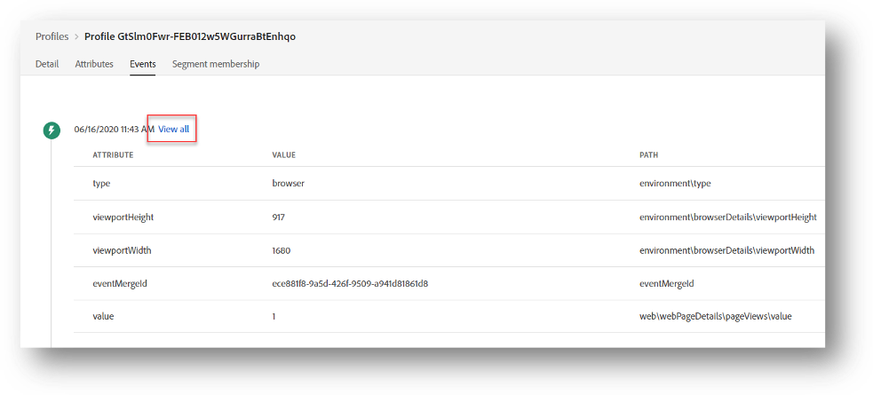


    This will show you all of the elements that the Web SDK sent to Platform

1. Look at the details of the top 3 or 4 events and you should find the event that represents a purchase when you find the purchses event along with the order and SKU information:


    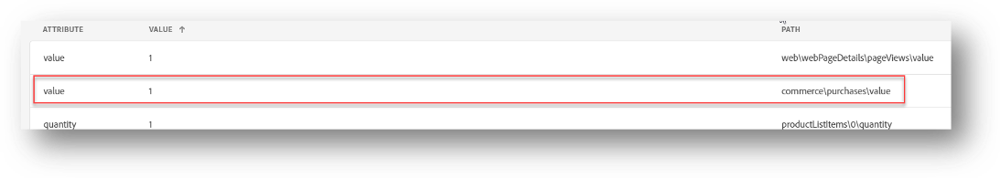


    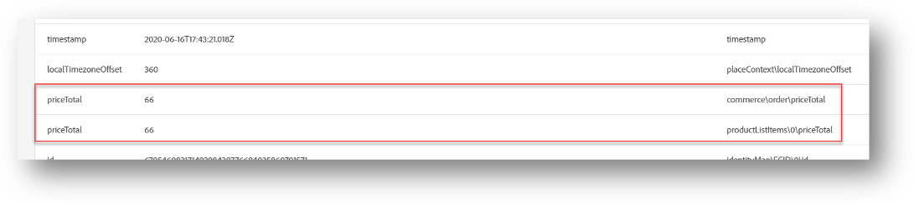


    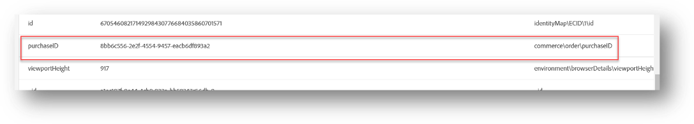

    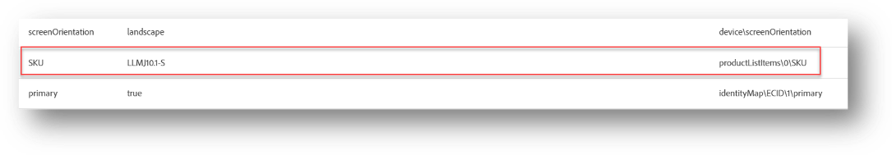


1. There is also an easier way to tell what some events are. Scroll down until you see a link click event:

    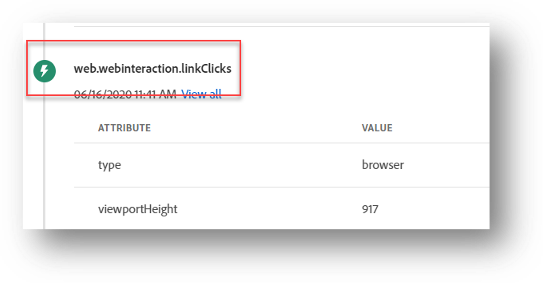
 


    This represents the event type that was passed in the network call. This event type is set automatically when a the collect calls were made after clicking on links on the website. 

1. Keep scrolling down until you find the cart add (product List adds) event:


    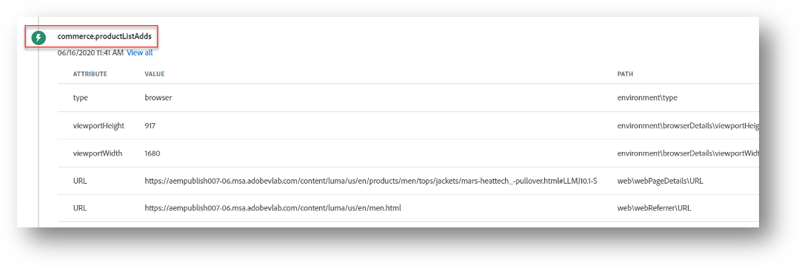


    >[!NOTE] Recall that we set this event type when we setup the Launch rule to capture the cart add. If it is easier to find these events with a defined event type, why didn't we set all the event types for the rest of the commerce events? The answer is that since the checkout and purchase events are the same things as the page view event for those pages, we can't set an event type. The Type dropdown in the Launch interface is a static dropdown. So unless we send yet another sendEvent call on the page for commerce events (and then do so for every future event we want to track) OR create an exception condition in the General Page Load rule so that it won't fire on every page that is also a commerce event (and then add an exception condition for future event page thereafter), there's no way to dynamically set an event type in Launch. Again, this is just another example of the "newness" of the Webs SDK and another opportunity for future improvement. That being said, we could have at least set a pageview type to make this view easier to understand.

1. Continue to scroll down and the offline purchase event you sent in a previous exercise:

    
    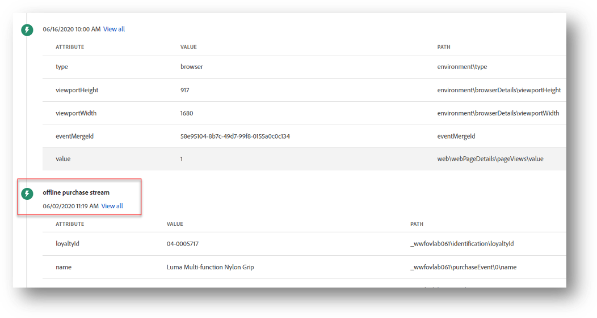


    Think back Luma’s question about whether offline interactions at the live, in-person booths had an affect on their online sales. How would the data that you just saw in your profile help answer that question?


    With the AEP Web SDK deployed and data coming in, you've completed this exercise!


**Original Exercise Creator:**

David Woolsey

**Change Log**


<table>
  <tr>
   <td>Ver.
   </td>
   <td>Issue Reporter
   </td>
   <td>Changes
   </td>
   <td>Date
   </td>
  </tr>
  <tr>
   <td>1.0
   </td>
   <td>
   </td>
   <td>Original Launch
   </td>
   <td>6/16/2020
   </td>
  </tr>
  <tr>
   <td>1.1
   </td>
   <td>Sandro Looser
   </td>
   <td>Fixed XDM Node Path table to add the 'order' node
   </td>
   <td>6/17/2020
   </td>
  </tr>
</table>

