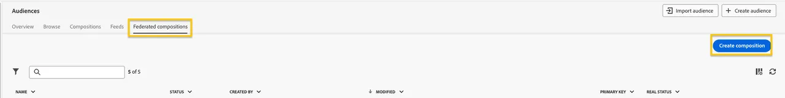

# Audience Creation Exercise

This exercise guides you through creating an audience from your Data Warehouse using Federated Audience Composition. We build an audience to qualify SecurFinancial customers who have a credit score of 650 or above and do not currently have a loan in their SecurFinancial portfolio.

## Steps

1. In the **Customer > Audiences** portal, click the **Federated compositions** tab.
2. Click **Create composition**.

   
   
3. Label your composition as `SecurFinancial Customers - No Loans, Good Credit`. Click **Create**.

4. Click the **+** button in the canvas and select **Build audience**. The right-hand rail should appear.

5. Click **Select a schema** and select the **FSI_CRM** schema, then click **Confirm**.

6. Click **Continue**. In the query builder window, click the **+** button and then **Custom Condition**. Create the following conditions:

   `CURRENTPRODUCTS does not contain loan`
   `AND`
   `CREDITSCORE greater than or equal to 650`
   `AND`
   `CONSENTSMARKETINGPREFERRED equal to email`

   *The last condition ensures marketing preference data is used to segment customers who have opted for email as their preferred channel of communication*.
   
   **Note:** The value field is case-sensitive.

   Your query should now look as follows:

   

7. Click the next **+** button, then click **Save audience**. Label this step as `SecurFinancial Customers - No Loans, Good Credit`. Use the same value as the audience label.

8. Add the following audience mappings:

   - **Source Audience Field:** EMAIL
   - **Source Audience Field:** CURRENTPRODUCTS
   - **Source Audience Field:** FIRST NAME

9. Select the primary identity and namespace to use for profiles:

   - **Primary identity field:** Email
   - **Identity namespace:** Email
   
10. Click **Save** and then click **Start** to run the query of the composition you just built.

**Note:** We used product and credit information to build our audience which didn't move sensitive data, like credit score, to downstream platforms for activation.

For more information about audience composition, visit [Experience League](https://experienceleague.adobe.com/en/docs/federated-audience-composition/using/compositions/create-composition/create-composition){target="_blank"}.

Now that our federated audience has been created, we'll move forward with [mapping it to an S3 account](map-federated-audience-to-s3.md).
