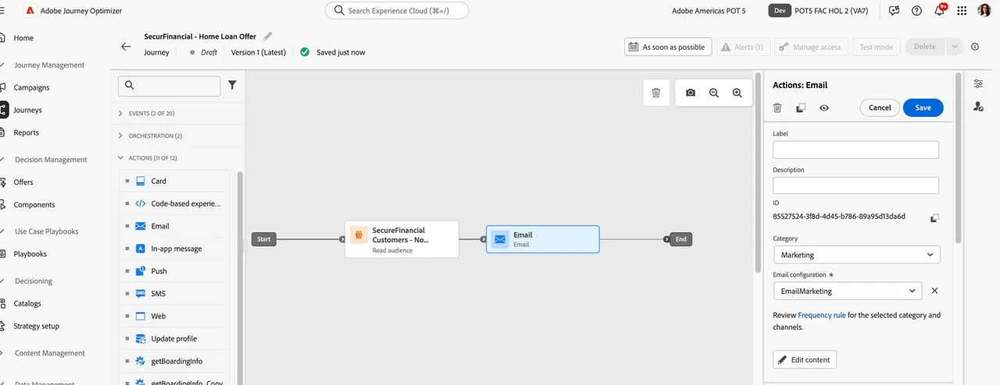

# Build a Journey with Federated Audience Data

In this lesson, you learn how a federated audience can be used in journeys within Adobe Journey Optimizer (AJO). This includes using queried attributes from Federated Audience Composition to personalize messaging. To continue with the SecurFinancial customer story and address the customer retargeting and personalization use case, we orchestrate a journey for prequalified customers. The goal is to send a personalized email based on attributes federated from SecurFinancial's Data Warehouse.

## Steps

### Build a Journey with a Read Audience

1. Navigate to the **Journeys** portal and click the **Create Journey** button.

2. Update the Journey Properties with a new name: `SecurFinancial - Home Loan Offer - [your lab user ID]`.

3. Click on **Orchestration**, then drag and drop the **Read audience** tile to the canvas.

4. Click on the **pencil icon** next to the Audience box on the right side of the screen.

5. In the search bar, search for `SecureFinancial Customers - No Loans, Good Credit`, then click **Save**.

    

6. Leave all the settings as default in the right side menu and then click **Save**.

    

### Personalize Email

1. Click on **Actions**, then click and drag the **Email** tile to the canvas.

2. On the right side menu, click on **Email configuration** and select **EmailMarketing**. Then click on **Edit content**.

3. In the subject line, add: `Learn more about SecurFinancial Home Loan`. Then click on **Edit email body**.

4. Click the **Content template** button in the top right corner. Find and select the `SecureFinancial Template`, then click **Confirm**.

    

    

5. Review the template and click **Use Template**.

6. You will now be in the Email Designer. Hover over the `{profile.person.name.firstName}` macro and click the **personalization avatar**.

7. In the personalization window, drill down to the following folder path: `[sandbox] > audienceEnrichment > CustomerAudienceUpload`

8. Click into the **read audience** folder. The enrichment attributes from your federated audience can be found here.

9. Select the **First Name** attribute to the expression builder. The email will dynamically express the first name value of the customer to personalize the email.

10. Click **Save**.

11. Now that the first name personalization has been added, add `Hi, ` in front of the personalization variable. Then click **Save**.

 

12. Click on the **Back** button twice to return to the journey canvas. Then in the **Action: Email** menu to the right, click **Save**.

     

Congratulations! You have created a journey in AJO using a federated audience and federated enrichment attributes. 

Now we'll look at how to [enrich existing audiences](audience-enrichment-demo.md) in Experience Platform with federated data from the data warehouse.
