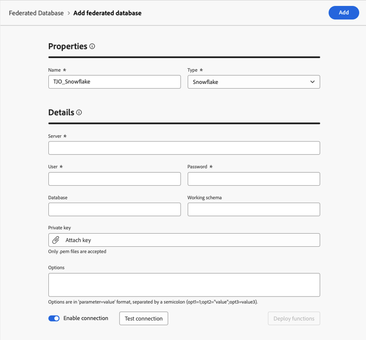
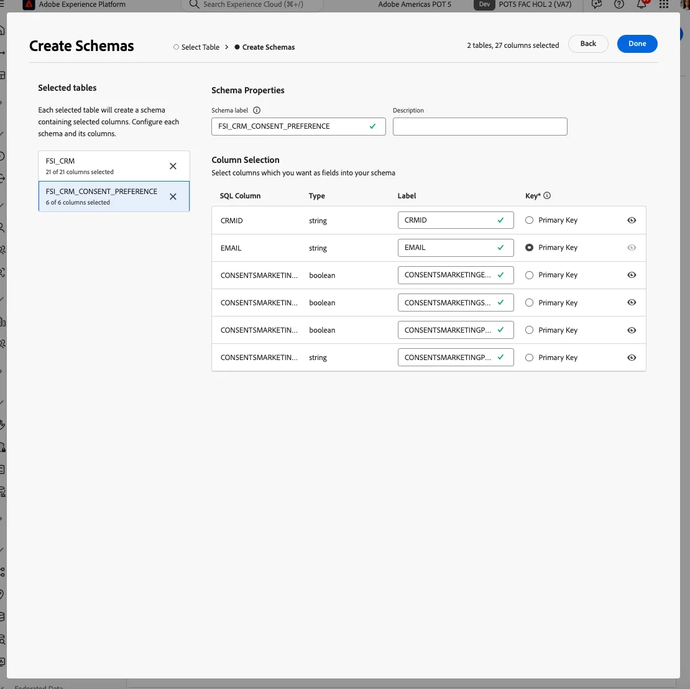
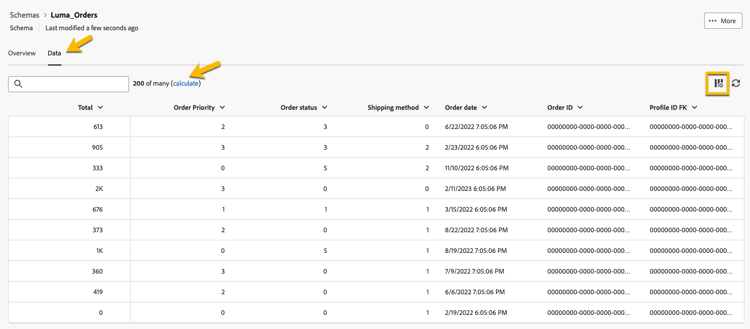
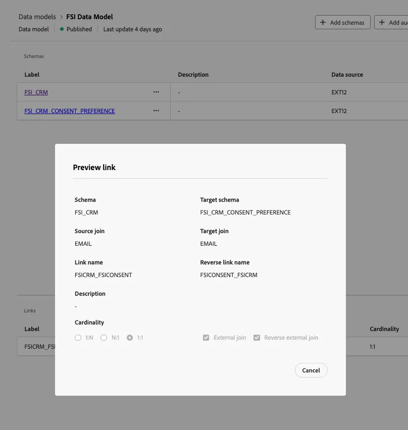

# Data Warehouse connection

In this lesson, we configure a connection between Adobe Experience Platform and your enterprise Data Warehouse to enable Federated Audience Composition. This allows you to query data directly from supported warehouses without replication. Additionally, we create Schemas and Data Models based on the Data Warehouse tables. 

For this lab, we connect to a Snowflake account. Federated Audience Composition supports a growing list of cloud warehouse connections. See the [updated list of integrations](https://experienceleague.adobe.com/en/docs/federated-audience-composition/using/start/access-prerequisites){target="_blank"}.

## Steps

1. Browse to the **FEDERATED DATA** section on the left rail.
2. In the **Federated Databases** link, click on the **Add federated database** button.
3. Add a name and select **Snowflake**.
4. Fill in the details, click on the **Test connection** button, and then on the **Deploy functions** button.

   

   

   

## Create a Schema

To create schemas in Federated Audience Composition, follow these steps:

1. In the **FEDERATED DATA** section, click **Models**.
2. Browse the **Schema** tab and click on the **Create Schema** button.
3. Select your source database in the list, and click on the **Add tables** tab.
4. Select the following tables:
   - FSI_CRM
   - FSI_CRM_CONSENT_PREFERENCE

   

   

After selecting your tables, review the columns of each table and select your primary key. For this exercise, we select **EMAIL** as the primary key in both tables.

   

   

## Preview Data in a Schema

To preview the data in the table represented by your schema, browse to the **Data** tab.

Click on the **Calculate** link to preview the total number of records.

  

## Create a Data Model

Data models allow you to create a link between tables. The link can be created between tables in the same database, such as tables in Snowflake, or between tables in different databases, such as a link between a table in Snowflake and a table in Amazon Redshift.

To create a data model in Federated Audience Composition, follow these steps:

1. In the **FEDERATED DATA** section, click **Models** then click **Data Model**.
2. Click the **Create data model** button.
3. Provide a name for your data model.
4. Click on **Add schemas** and select **FSI_CRM** and **FSI_CRM_CONSENT_PREFERENCE** schemas.
5. Create a link between these tables by clicking on **Create links**.

When creating a link, choose the applicable cardinality:

- **1-N**: One occurrence of the source table can have several corresponding occurrences of the target table, but one occurrence of the target table can have at most one corresponding occurrence of the source table.
- **N-1**: One occurrence of the target table can have several corresponding occurrences of the source table, but one occurrence of the source table can have at most one corresponding occurrence of the target table.
- **1-1**: One occurrence of the source table can have at most one corresponding occurrence of the target table.

Below is a preview of the link created for the lab exercises. The link enables a join between the CRM and consent tables, using the primary key of **EMAIL** to perform a join.

   

Now, we're ready to [create and audience](audience-creation-exercise.md).
