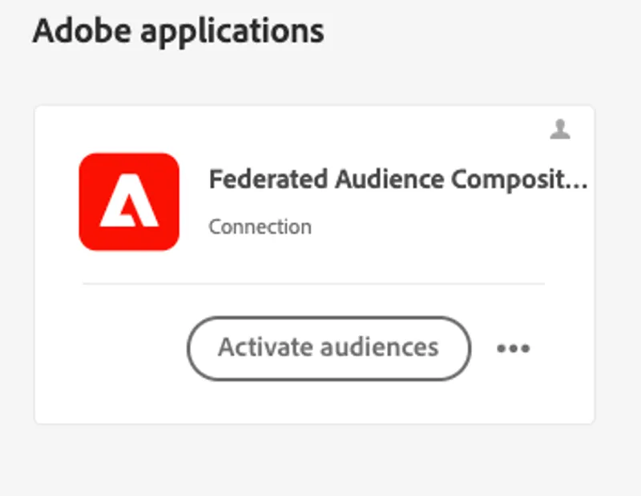

# Enrich Experience Platform Audiences with Federated Data

Federated Audience Composition enables you to enrich existing audiences in Adobe Experience Platform (AEP) by utilizing composed audience data that has been federated from the enterprise data warehouse. This data will not be persisted in Adobe Experience Platform customer profiles.

## Reading an AEP Audience within a Federated Composition

In this visual exercise, we use the **SecurFinancial Loan Application Page Visitor** audience stored in AEP's Profile Service to start our federated composition. It uses the federated data in Snowflake to determine pre-approval based on credit score and loan activity.

### Steps

1. **Map AEP audience** to the Federated Audience Composition destination.
2. **Build your composition** with the mapped audience as a Read audience.
3. **Reconcile the identities** in your read audience to join with federated data.

 

 

We'll look at another example of using federated data to [support "in-the-moment" personalization](drive-in-the-moment-personalization.md)!
