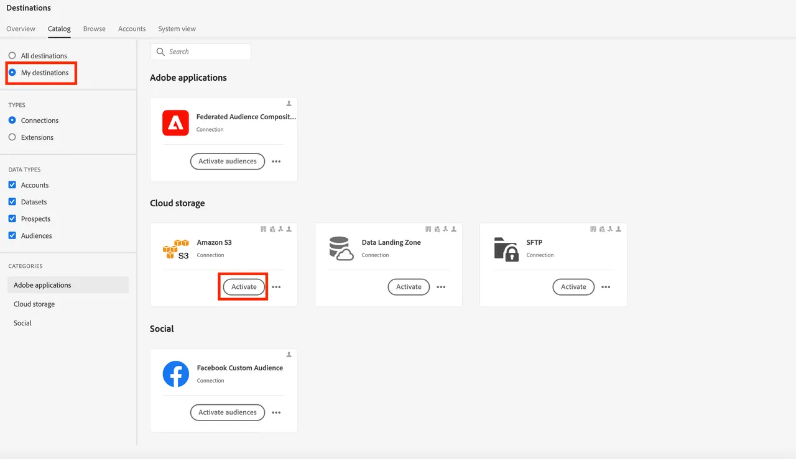

# Map Federated Audience to S3 to Leverage Audience Attributes for Enrichment

In this exercise, you'll learn how to leverage audience attributes in your data warehouse to enrich your audience's experience in downstream activation workflows using RTCDP destinations. For SecurFinancial, these federated attributes can be used to enhance the customer audience's personalization experience offline. In this example, we will map the federated audience to a pre-configured Amazon S3 destination.

## Steps

1. Navigate to the **Destinations** portal.

2. Click the **3 dot menu** button next to the pre-configured Amazon S3 destination, then click **Activate Audiences**.

   

3. Select the **S3 destination**, then click **Next**.

   

4. Select the **SecureFinancial Customers - No Loans, Good Credit** audience.

    

5. In the **Scheduling** section, leave all default settings and click **Next**.

6. In the **Mapping** step, ensure the following is included and selected as the **Deduplication Key**. Then click **Next**:
   - `xdm: personalEmail.address`

   

7. In the following mapping step, you can select enrichment attributes based on audience field mappings in the federated audience composition. Click the **pencil (edit)** icon to view the pre-selected attributes.

   

   

8. Review your audience mapping and hit **Finish**.

We're ready to move on to [building a journey](build-journey-federated-audience.md).
