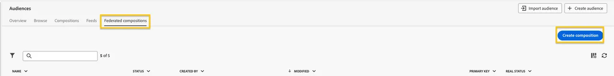
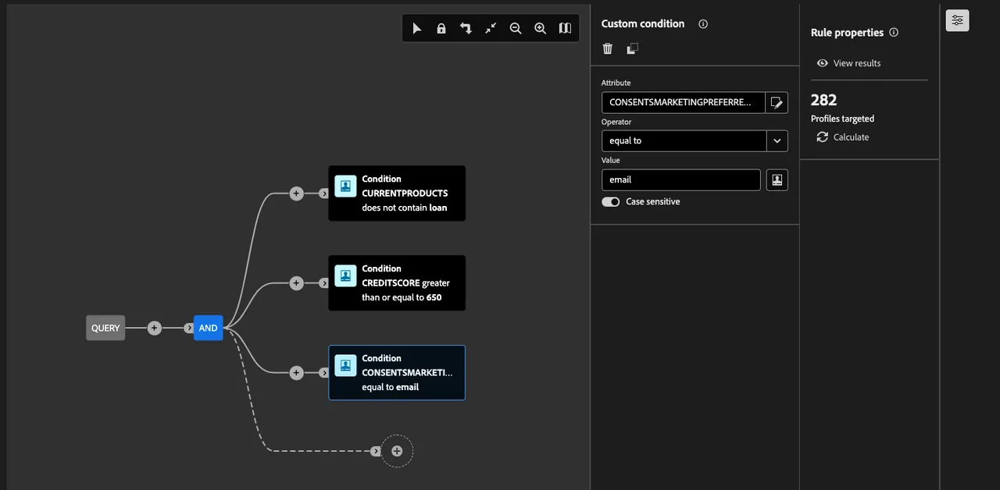

# Create a Federated Audience

Next, we guide you through creating an audience from the Snowflake data warehouse using Federated Audience Composition. The audience is comprised of SecurFinancial customers who have a credit score of 650 or above and do not currently have a loan in their SecurFinancial portfolio.

## Steps

1. In the **Customer > Audiences** portal, click the **Federated compositions** tab.
2. Click **Create composition**.

   
   
3. Label your composition. In our example: `SecurFinancial Customers - No Loans, Good Credit`. Click **Create**.

4. Click the **+** button in the canvas and select **Build audience**. The right-hand rail appears.

5. Click **Select a schema**, select the appropriate schema, then click **Confirm**.

6. Click **Continue**. In the query builder window, click the **+** button and then **Custom Condition**. Write the conditions. Our example uses:

   `CURRENTPRODUCTS does not contain loan`
   `AND`
   `CREDITSCORE greater than or equal to 650`
   `AND`
   `CONSENTSMARKETINGPREFERRED equal to email`

   *The last condition ensures marketing preference data is used to segment customers who have opted for email as their preferred channel of communication*.
   
   **Note:** The value field is case-sensitive.
   
   

7. Click the next **+** button, then click **Save audience**. Label this step. In our example, we'll label it as `SecurFinancial Customers - No Loans, Good Credit`. 

8. Add the pertinent audience mappings. In this example:

   - **Source Audience Field:** EMAIL
   - **Source Audience Field:** CURRENTPRODUCTS
   - **Source Audience Field:** FIRST NAME

9. Select the primary identity and namespace to use for profiles. These are the identities and fields used for our data:

   - **Primary identity field:** Email
   - **Identity namespace:** Email
   
10. Click **Save** and then click **Start** to run the query of the composition.

>[**SUMMARY**]
>
> In this example, product and credit information was used to build our audience through direct access of enterprise data from Snowflake, without making a copy of it Adobe Experience Platform. Once the external system processes the query, only the relevant email, current products, and first name values are brought over to the audience definition for downstream activation. This applies to all destinations RTCDP supports.

For more information about audience composition, visit [Experience League](https://experienceleague.adobe.com/en/docs/federated-audience-composition/using/compositions/create-composition/create-composition){target="_blank"}.

Now that our federated audience has been created, we'll [map it to an S3 account](map-federated-audience-to-s3.md).
