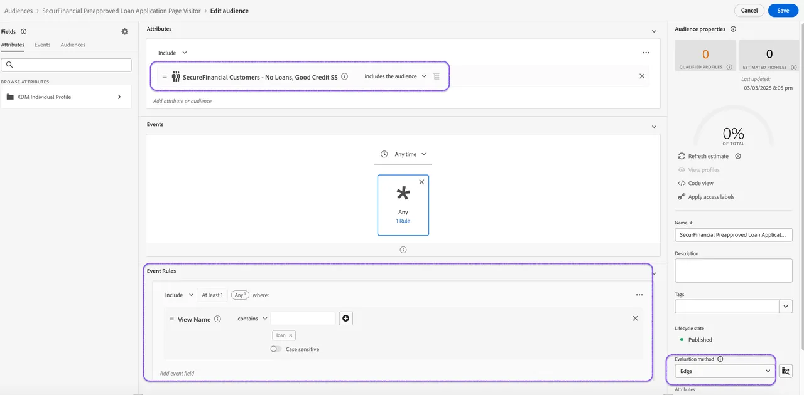

# Deliver "in-the moment" personalization using Edge Network

Federated Audience Composition enables you to enrich existing audiences in Adobe Experience Platform (AEP) by utilizing composed audience data that has been federated from the enterprise data warehouse. This data will not be persisted in Adobe Experience Platform but you can use the [event forwarding](https://experienceleague.adobe.com/en/docs/experience-platform/tags/event-forwarding/overview){target="_blank"} capabilities to send this data straight to your data warehouse.

In this exercise, we use a federated audience queried with credit score and loan activity to enrich the behavioral audience of loan application web page visitors.

By evaluating this audience on the Edge, we instantly retarget the preapproved loan application page visitors with personalized offers on the site.

## Steps

1. **Save and Start** your federated audience composition. Once the composition has run, the federated audience will appear in the audience portal.
2. **Build an audience rule** using profile attributes and experience events from Profile Service, incorporating your federated audience.

Let's wrap this up with a [summary of learnings and final takeaways](conclusion.md)!
