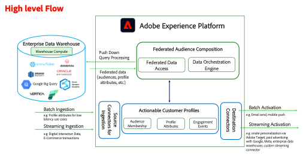

# Federated Audience Composition High-level Architecture & Flow

Before we dive into the steps for supporting the business scenario for SecurFinancial, we'll review the high-level architecture and flow for this composable CDP approach.

Federated Audience Composition module in Adobe Experience Platform expands access to data warehouse datasets without copying the underlying data thereby minimizing data movement and duplication. 

This also provides organizations the required Composable architecture, who have already completed the required data management work on their warehouse and wants to use a zero-copy pattern where Adobe Experience Platform becomes the engagement engine.

It allows businesses to quickly process information stored in one or more data warehouses. It removes the need to ingest data to Adobe Experience. Additionally, it provides access to new datasets that reside in enterprise data warehouses but have up until now been inaccessible for customer experience workflows. Examples may include historical transactions or personal data that will be useful at an aggregated audience level for customer engagement.

Now we'll move on to creating a [Data Warehouse Connection](data-warehouse-connection.md).
