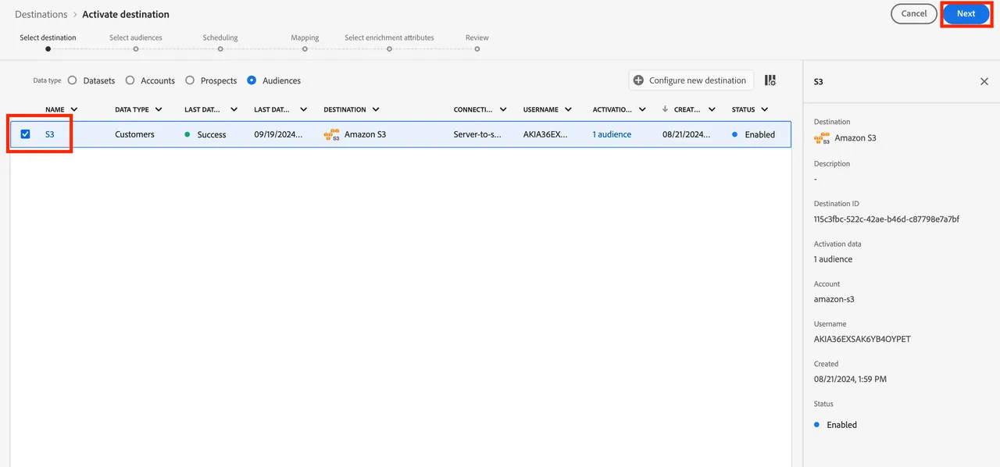
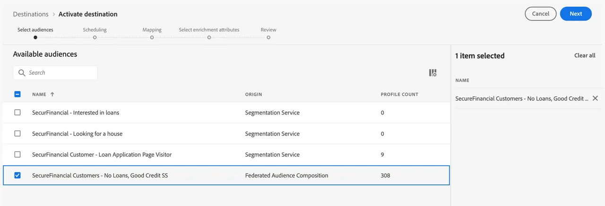
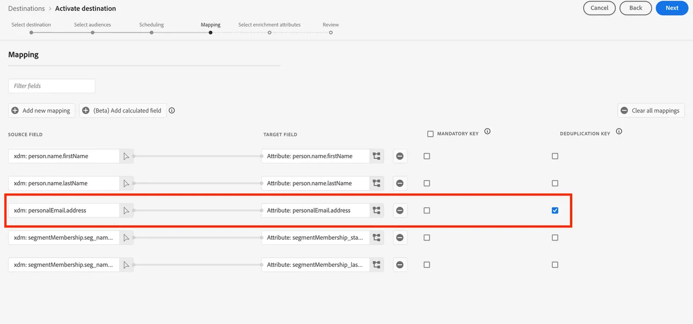
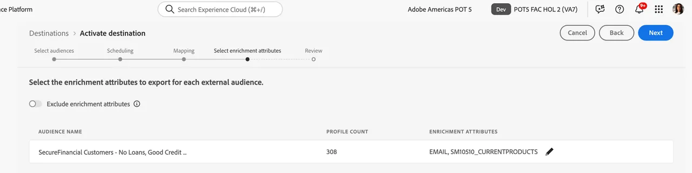
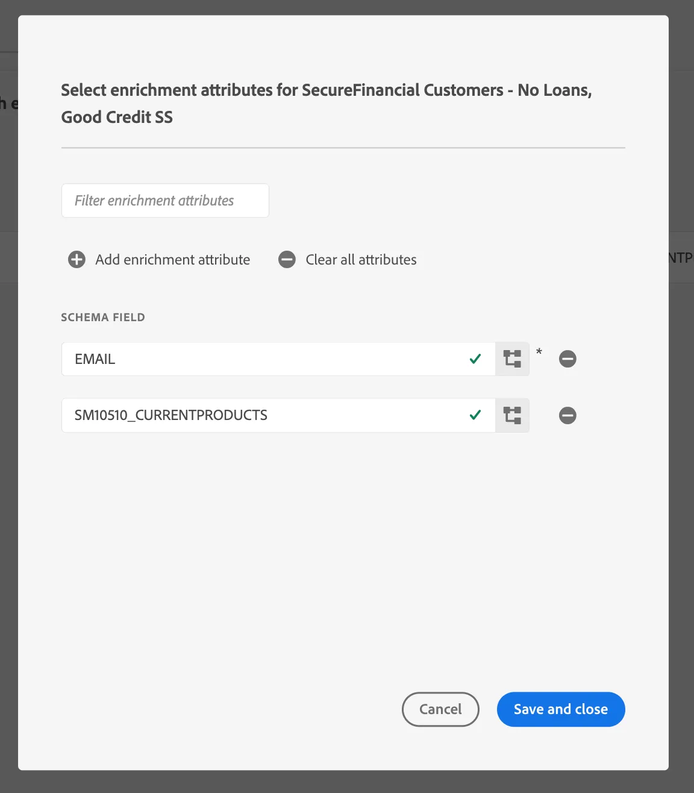

# Map a Federated Audience to an S3 destination to leverage audience attributes for enrichment

You can leverage audience attributes in your data warehouse to enrich your audience's experience in downstream activation workflows using RTCDP destinations. For SecurFinancial, these federated attributes can be used to enhance the customer audience's personalization experience offline. Below, the federated audience is mapped to a pre-configured Amazon S3 destination.

## Steps

1. Navigate to the **Destinations** portal.

2. Click the **3 dot menu** button next to the pre-configured Amazon S3 destination, then click **Activate Audiences**.

   

3. Select the **S3 destination**, then click **Next**.

   

4. Select the appropriate audience. In our example: **SecureFinancial Customers - No Loans, Good Credit** audience.

    

5. In the **Scheduling** section, use the default settings and click **Next**.

6. In the **Mapping** step, choose the de-duplication key. In our example, `xdm: personalEmail.address` is included and selected as the **De-duplication Key**. Then click **Next**:
   
   

7. In the mapping step, select enrichment attributes based on audience field mappings in the federated audience composition. Click the **pencil (edit)** icon to view the pre-selected attributes.

   

   

8. Review your audience mapping and hit **Finish**.

>[**!SUMMARY**]
>
> We successfully built an audience and activated it to an S3 destination with ease. Any other solution can pick up this Audience and use it straightaway. The user-friendly interface allows marketing teams to quickly build and activate audiences without moving underlying data. Customers taking this approach have gone LIVE with their first use in about a month. 

Now we'll [build a journey](build-journey-federated-audience.md).
