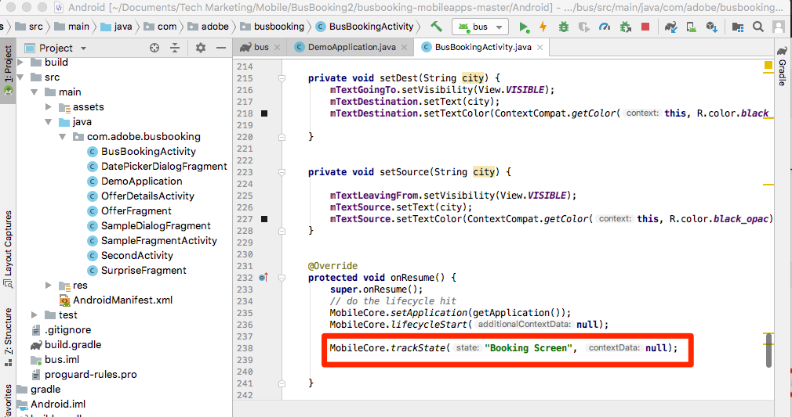
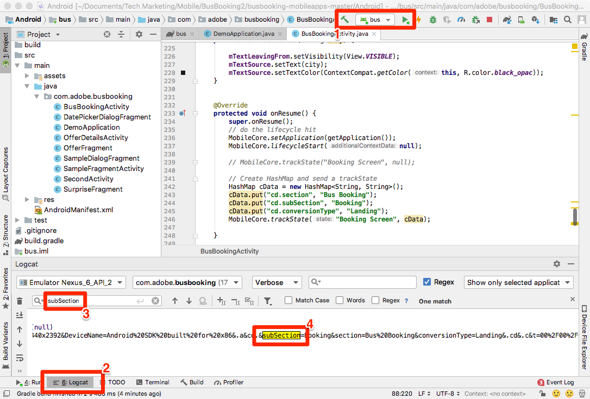

# Add Adobe Analytics

In this lesson, you will enable Adobe Analytics tracking in your app.

[Adobe Analytics](https://docs.adobe.com/content/help/en/analytics/landing/home.html) is an industry-leading solution that empowers you to understand your customers as people and steer your business with customer intelligence.

In the [Add Extensions](launch-add-extensions.md) and [Install the Mobile SDK](launch-install-the-mobile-sdk.md) lessons, you added the Adobe Analytics extension to your Launch property and imported it into the sample application.  Now all you have to do is add code to track the states and actions in your app!

## Learning Objectives

At the end of this lesson, you will be able to:

* Verify that Lifecycle metrics are being sent to Adobe Analytics
* Add code to track states in your app with additional data
* Add code to track actions in your app with additional data

There are many things that could be implemented for Analytics in Launch. This lesson is not exhaustive, but should give you a solid overview of the main techniques you will need for implementing in your own app.

## Prerequisites

You should have already completed the lessons in the [Configure Launch](launch-create-a-property.md) section. In that section, you added the Analytics extension and  configured your tracking server and report suite ID(s).

## Lifecycle Metrics and Adobe Analytics

Lifecycle metrics are environment-based metrics and dimensions that can be easily enabled in an app using the Experience Platform Mobile SDK.

You already enabled Lifecycle metrics when you added the Core extension to your property and followed the Mobile Install Instructions provided in the interface. These metrics and dimensions, including environment- and app-specific metrics like app version, number of engaged users, OS version, time parting, days since last use, etc. can be very helpful in the analysis of your app, especially as you build Analytics segments from them to apply to all of your reports. The full list of metrics is available in the [documentation](https://docs.adobe.com/content/help/en/mobile-services/android/metrics.htmlh).

## Importing the ACPCore Library

In the earlier lesson called ["Install the Mobile SDK"](launch-install-the-mobile-sdk.md), you added an import statement to make the AdobeCore library available in the BusBookingActivity file. This same library will be used for additional API calls in the activities in this lesson. In the next exercises, you will use APIs to track states ("trackState") and actions ("trackAction") in your app, which are defined in the AdobeCore library.  In the new Experience Cloud Platform Mobile SDK, the trackState and trackAction APIs have been moved from the Analytics library to the Core library, making it possible to leverage these APIs for purposes other than just Adobe Analytics tracking.

## Track States

In your app, you may have many different screens of content that you are providing for your users. These are the equivalent of pages on a website. Adobe Analytics provides a method for you to send in these "page view hits" and view them in the same reports that you are used to for your web properties. This method is called "trackState."

In this tutorial you will place the code for a trackState call into only one screen (page) in your app. In real life, you will replicate this on all of the other screens/states in your app.

Below are syntax and a code example from the documentation you can copy-and-paste in this tutorial or in your own app.

**Syntax:**

```java
public static void trackState(final String state, final Map<String, String> contextData)
```

**Example:**

```java
HashMap cData = new HashMap<String, String>();
contextData.put("key", "value");
MobileCore.trackState("state name",contextData);
```

### Track a State without Data

1. With the sample app open in Android Studio, go to BusBookingActivity, and scroll down near the bottom to the onResume function
1. Add a trackState method call
1. Set the `state name` to "Booking Screen"
1. Instead of adding any extra data, add `null` as a placeholder in the API call
1. Or copy and paste in the following:

    ```java
    MobileCore.trackState("Booking Screen", null);
    ```



**To validate the trackState**

1. Save, build and run the project
1. When the simulator runs and opens the home screen of the app, view the Android Studio Logcat debugging console
1. Search the console for `pageName=Booking%20Screen`
1. Note that pageName variable is set to `Booking Screen` (with the %20 as an encoded space), and there are no other custom data pairs. Although technically you are setting a "state name" and not a "page name," the parameter name used is `pageName` in order to provide consistency with website implementations.

    

### Track a State with Data

1. Go back into BusBookingActivity, and add an import to the top of the file `import java.util.HashMap;` beneath the existing imports
1. In the `onResume()` function, comment out (or delete) the basic trackState call from the last exercise
1. Add a new trackState method call, this time with data by creating and naming a HashMap, using the "put" command to include some key/value pairs, and then calling that HashMap in the call to trackState
1. Leave the `state name` as "Booking Screen"
1. Or copy and paste in:

    ```java
    HashMap cData = new HashMap<String, String>();
    cData.put("cd.section", "Bus Booking");
    cData.put("cd.subSection", "Booking");
    cData.put("cd.conversionType", "Landing");
    MobileCore.trackState("Booking Screen", cData);
    ```

    

**To validate the trackState with data**

1. Save, build and run the project again
1. When the simulator runs and opens the home screen of the app, view the Android Studio Logcat debugging console
1. Search for `subSection` (or any of the keys or values that you entered into the code)
1. Now see that in addition to the pageName being set, you also have the key/value pairs that were sent in on the hit

    

>[!NOTE]
>
>In case you are familiar with "props and eVars" in Analytics, you will notice that these variable names are not in the SDK. All key/value data coming from the SDK will be sent as [contextData variables](https://docs.adobe.com/content/help/en/analytics/implementation/javascript-implementation/variables-analytics-reporting/context-data-variables.html), and as such will need to be mapped to props or eVars (or other variables) by using [Processing Rules](https://docs.adobe.com/content/help/en/analytics/admin/admin-tools/processing-rules/processing-rules.html) in the Analytics UI.

## Track Actions

Similar to tracking non-page-load actions on a website, you often want to track an action that a user takes in your app, E.g. clicks on things that don't load another screen. This is handled very similarly to the trackState you used above, except that this method is called `trackAction`.

Below are syntax and a code example from the documentation.

**Syntax:**

```java
public static void trackAction(final String action, final Map<String, String> contextData) data;
```

**Example:**

```java
HashMap<String, String> contextData = new HashMap<String, String>();
contextData.put("key", "value");
MobileCore.trackAction("action taken", contextData);
```

### Track Interaction with the Destination Switcher

In this sample bus booking app, you can switch the origin city with the destination city by clicking on the arrow between these two values. You've decided that you want to track the interaction with this feature in Adobe Analytics.


This switcher is controlled in the BusBookingActivity file in the sample project. In this exercise, you will send a trackAction hit whenever people click on it.

#### To add the trackAction code

1. With the sample project open in Android Studio, go to BusBookingActivity
1. Locate the "mBtnFlip.setOnClickListener" function, on or around line 57
1. Expand the function if needed, so that you can see all of the code
1. In the onClick function, under the call to `flipSourceDesti()`, add a `trackAction()` call
1. Set the action name to "Flip Destination", and add "null" for the contextData parameter (as we don't really need to send in any additional info this time)
1. You can copy and paste the following code

    ```java
    MobileCore.trackAction("Flip Destination", null);
    ```

The function now looks like this:


#### To validate the trackAction code

1. After adding the code, save the project, run and build
1. Click the garbage icon to clear the Logcat console
1. Click the Destination Switcher arrow in the simulator, noticing that a new request (or more) in the console appears.
1. Search for `Flip%20Destination` in Logcat
1. Notice that both the action and pev2 parameters Flip%20Destination (with encoded space)
1. Notice the `pe=lnk_o` key/value on the same line, showing that this is a "custom link" hit, triggered by trackAction

    <!---->

Nice work! You have completed the Analytics lesson. Of course, there are many other things that you can do to enhance our Analytics implementation, but hopefully this has given you some of the core skills you will need to tackle the rest of your needs.

## Additional Benefits of trackState and trackAction

In these last exercises, you were able to send data from the app into Adobe Analytics by using the trackState and trackAction APIs. Because the Experience Platform Mobile SDK is rooted in Launch, there are many more things that you can do in the Launch interface leveraging the code you just added.

In Launch you are able to create Rules triggered by the trackState and trackAction APIs, and have them execute additional actions, such as making requests to other Adobe solutions or external partners.

[Next "Add Adobe Audience Manager" >](audience-manager.md)
