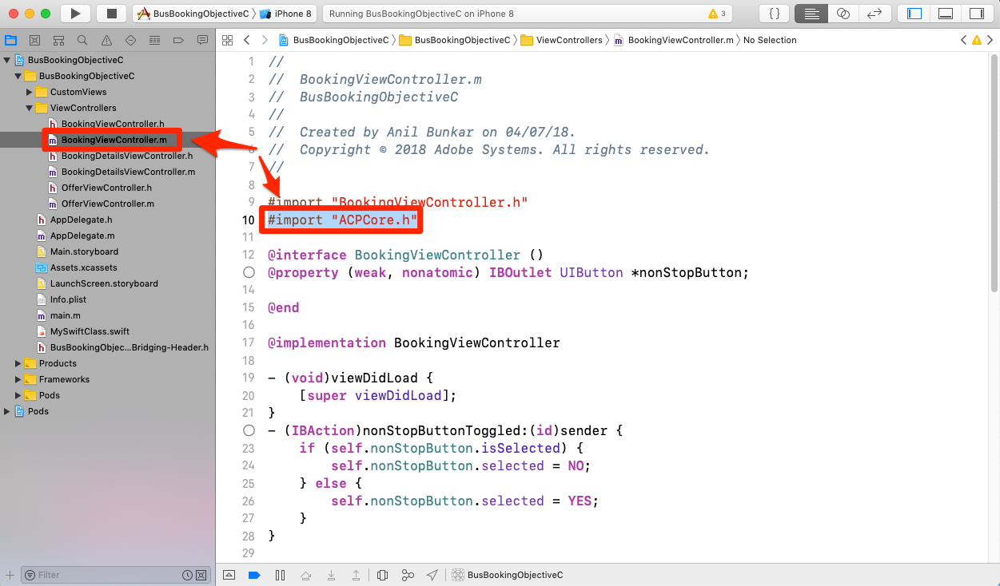
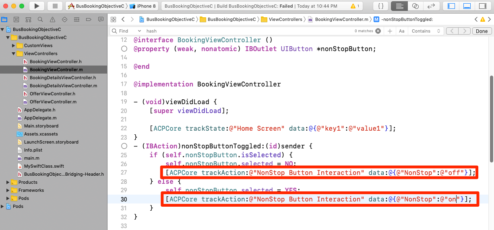
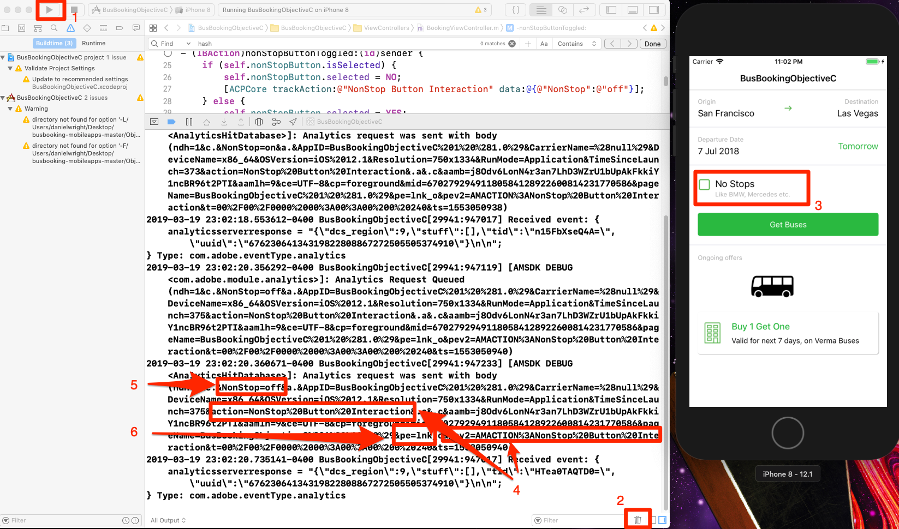

# Add Adobe Analytics

In this lesson, you will enable Adobe Analytics tracking in your app.

[Adobe Analytics](https://docs.adobe.com/content/help/en/analytics/landing/home.html) is an industry-leading solution that empowers you to understand your customers as people and steer your business with customer intelligence.

In the [Add Extensions](launch-add-extensions.md) and [Install the Mobile SDK](launch-install-the-mobile-sdk.md) lessons, you added the Adobe Analytics extension to your Launch property and imported it into the sample application.  Now all you have to do is add code to track the states and actions in your app!

## Learning Objectives

At the end of this lesson, you will be able to:

* Verify that Lifecycle metrics are being sent to Adobe Analytics
* Add code to track states in your app with additional data
* Add code to track actions in your app with additional data

There are many things that could be implemented for Analytics in Launch. This lesson is not exhaustive, but should give you a solid overview of the main techniques you will need for implementing in your own app.

## Prerequisites

You should have already completed the lessons in the [Configure Launch](launch-create-a-property.md) section. In that section, you added the Analytics extension and  configured your tracking server and report suite ID(s).

## Lifecycle Metrics and Adobe Analytics

Lifecycle metrics are environment-based metrics and dimensions that can be easily enabled in an app using the Experience Platform Mobile SDK. In fact, you've already added them!

You already enabled Lifecycle metrics when you added the Core extension to your property and followed the Mobile Install Instructions provided in the interface. These metrics and dimensions, including environment- and app-specific metrics like app version, number of engaged users, OS version, time parting, days since last use, etc. can be very helpful in the analysis of your app, especially as you build Analytics segments from them to apply to all of your reports. The full list of metrics is available in the [documentation](https://docs.adobe.com/content/help/en/mobile-services/ios/metrics.html).

### Viewing the Analytics Lifecycle Hit

Although you can see the Lifecycle hits in any debugging program/packet sniffer, we will simply show them in the Xcode debugging console.

1. Build and run your project in Xcode so that it launches the simulator
1. In the Xcode debugging console, type `lifecycle` into the filter at the bottom to limit what shows up, and then scroll to the bottom of the entries
1. Notice the `Analytics request was sent with body` section
1. Lifecycle metrics include things like AppID, CarrierName, DayOfWeek, DaysSinceFirstUse, and other metrics/dimensions listed in the [documentation](https://docs.adobe.com/content/help/en/mobile-services/ios/metrics.html)

    

## Import the ACPCore Library

In the next exercises, you will use APIs to track states ("trackState") and actions ("trackAction") in your app. In order to use these APIs, you need to import the library which contains them.  In the new Experience Cloud Platform Mobile SDK, the trackState and trackAction APIs have been moved from the Analytics library to the Core library, making it possible to leverage these APIs for purposes other than just Adobe Analytics tracking.  

In this tutorial, you will only track one state, however in your actual app, you will want to track multiple states.

**To import the ACPCore Library**

1. Open BookingViewController.m file in Xcode
1. At the top of the file &mdash;typically alongside other import statements&mdash;add `#import "ACPCore.h"`
1. Save
1. You are now ready to use trackState or trackAction APIs in this file

    <!---->

## Track States

In your app, you may have many different screens of content that you are providing for your users. These are the equivalent of pages on a website. Adobe Analytics provides a method for you to send in these "page view hits" and view them in the same reports that you are used to for your web properties. This method is called "trackState."

In this tutorial you will place the code for a trackState call into only one screen (page) in your app. In real life, you will replicate this on all of the other screens/states in your app. You will also explore a few different ways of sending data (key/value pairs) with the hit.

Below is syntax and a code example from the documentation you can copy-and-paste in this tutorial or in your own app.

**Syntax:**

```objective-c
+ (void) trackState: (nullable NSString*) state data: (nullable NSDictionary*) data;
```

**Example:**

```objective-c
[ACPCore trackState:@"state name" data:@{@"key":@"value"}];
```

### Track a State without Data

1. With the sample app open in Xcode, go to BookingViewController.m, and in the `viewDidLoad()` function, add a trackState method call
1. Set the `state name` to "Home Screen"
1. Instead of adding any extra data, add `null` as a placeholder in the method call
1. Or copy and paste in the following:

    ```objective-c
    [ACPCore trackState:@"Home Screen" data:nil];
    ```

    

**To validate the trackState**

1. Save, build and run the project
1. When the simulator runs and opens the home screen of the app, view the Xcode console
1. Filter the console to entries with "home" and look at the bottom entry which shows that the `Analytics request was sent with body`
1. Note that pageName variable is set to `Home Screen`, and there are no other custom data pairs. Although technically you are setting a "state name" and not a "page name," the parameter name used is `pageName` in order to provide consistency with website implementations.

    

### Track a State with Data

1. Go back into BookingViewController.m, and in the `viewDidLoad()` function, comment out (or delete) the basic (no data added) trackState call from the last exercise
1. Add a new trackState method call, this time with data, using `key1` as the key and `value1` as the value
1. Leave the `state name` as "Home Screen"
1. Or copy and paste in:

    ```objective-c
    [ACPCore trackState:@"Home Screen" data:@{@"key1":@"value1"}];
    ```

    

**To validate the trackState with data**

1. Save, build and run the project again
1. When the simulator runs and opens the home screen of the app, view the Xcode console
1. Leave the filter as "home" and look at the bottom entry which shows that the `Analytics request was sent with body`
1. Now see that in addition to the pageName being set, you also have the key/value pair that was sent in on the hit

    

>[!NOTE]
>
>In case you are familiar with "props and eVars" in Analytics, you will notice that these variable names are not in the SDK. All key/value data coming from the SDK will be sent as [contextData variables](https://docs.adobe.com/content/help/en/analytics/implementation/javascript-implementation/variables-analytics-reporting/context-data-variables.html), and as such will need to be mapped to props or eVars (or other variables) by using [Processing Rules](https://docs.adobe.com/content/help/en/analytics/admin/admin-tools/processing-rules/processing-rules.html) in the Analytics UI.

### Additional Data-Sending Options

In the previous two exercises you made two requests, one with additional data and one without. However, what if you want to send multiple data points to Analytics with a screen or state load? Below are two options.

#### Option 1: Multiple Key/Value Pairs

In the trackState call, you have the option of sending multiple key/value pairs, simply by comma separating them in the data set. For example:

```objective-c
[ACPCore trackState:@"Home Screen" data:@{@"key1":@"value1",@"key2":@"value2",@"key3":@"value3"}];
```

#### Option 2: Dictionary Object

You can also define a dictionary in your code and then send that in with the trackState as well. Of course, if you have already defined some dictionary objects in your code, and want to send them into Analytics, this can be the perfect option for you. For example:

```objective-c
NSDictionary *theStuff = @{@"key1": @"value1",@"key2": @"value2"};
[ACPCore trackState:@"Home Screen" data:theStuff];
```

**Extra Credit**
Go ahead and try these two options out in your code, viewing the results in the Xcode debugging console. You can use the same filter as before, and check the results to make sure that you have the variables and values coming through

## Track Actions

Similar to tracking non-page-load actions on a website, you often want to track an action that a user takes in your app, E.g. clicks on things that don't load another screen. This is handled very similarly to the trackState you used above, except that this method is called `trackAction`.

Below is syntax and a code example from the documentation that you can copy-and-paste in this tutorial or in your own app.

**Syntax:**

```objective-c
+ (void) trackAction: (nullable NSString*) action data: (nullable NSDictionary*) data;
```

**Example:**

```objective-c
[ACPCore trackAction:@"action name" data:@{@"key":@"value"}];
```

### Track Interaction with the 'No Stops' Checkbox

In this sample bus booking app, there is a checkbox that let's users decide if they want to limit their search results to  options. You've decided that you want to track the interaction with that checkbox in Adobe Analytics.


This checkbox is controlled in the BookingViewController.m file in the sample project. In this exercise, you will send a trackAction hit whenever people check or uncheck the box.

#### Setting the trackAction Code

1. With the sample project open in Xcode, go to BookingViewController.m, and locate the "nonStopButtonToggled" function
1. In the `if` statement, the first section deselects the box if it is already selected. In this scenario, you want to send in a hit with a value "off", using the following code:

    ```objective-c  
    [ACPCore trackAction:@"NonStop Button Interaction" data:@{@"NonStop":@"off"}];
    ```

1. In the next section (the "else" section), it checks the box if it isn't already checked. In this scenario, you want to send in a hit with a value "on", using the following code:

    ```objective-c
    [ACPCore trackAction:@"NonStop Button Interaction" data:@{@"NonStop":@"on"}];
    ```

Notice the other customizations in the code:

* You are setting the `action name` to "NonStop Button Interaction." This value will populate the "action" parameter of the request and the custom link report/dimension in Adobe Analytics
* The name of the `key` you are using is "NonStop." This is the key name that you can look for in Processing Rules in the Analytics Admin Console, so that you can map these values to a prop or eVar.

The function now looks like this:



#### To validate the trackAction code

1. After adding the code, save the project, run and build
1. Click the garbage icon to clear the console
1. Check the box in the simulator, noticing that two requests in the console appear. The last one is the sending of the data to Adobe Analytics from the code you just added.
1. Notice that both the action and pev2 parameters are set to "NonStop Button Interaction" (with encoded spaces)
1. Notice that the "NonStop=on" key/value pair are present, and can then be assigned to a prop/eVar in Processing Rules
1. Notice the "pe=lnk_o" key/value, showing that this is a "custom link" hit, triggered by trackAction

    

Nice work! You have completed the Analytics lesson. Of course, there are many other things that you can do to enhance our Analytics implementation, but hopefully this has given you some of the core skills you will need to tackle the rest of your needs.

## Additional Benefits of trackState and trackAction

In these last exercises, you were able to send data from the app into Adobe Analytics by using the trackState and trackAction APIs. Because the Experience Platform Mobile SDK is rooted in Launch, there are many more things that you can do in the Launch interface leveraging the code you just added.

In Launch you are able to create Rules triggered by the trackState and trackAction APIs, and have them execute additional actions, such as making requests to other Adobe solutions or external partners.

[Next "Add Adobe Audience Manager" >](audience-manager.md)
