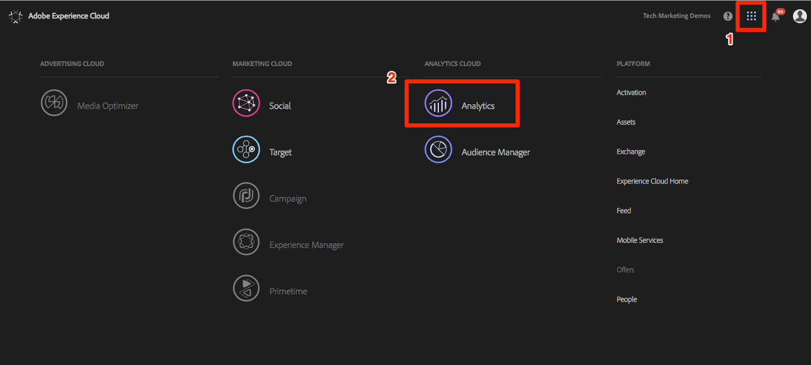
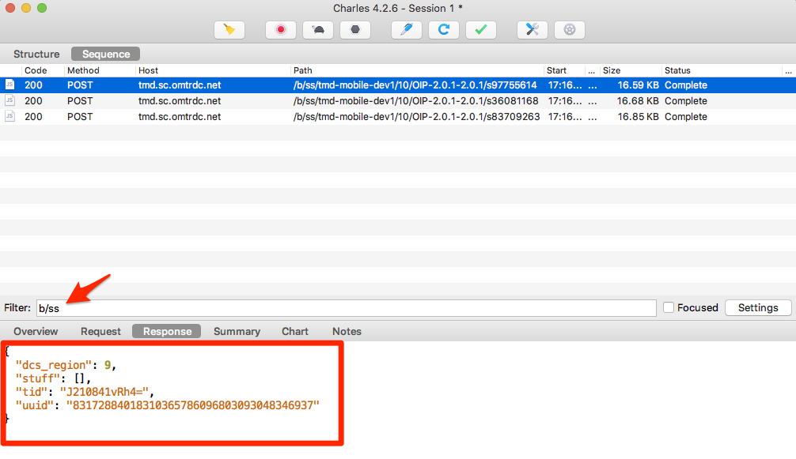

# Add Adobe Audience Manager

This lesson will guide you through the steps to implement Adobe Audience Manager into the Experience Platform Mobile SDK using Server-Side Forwarding.

[Adobe Audience Manager](https://docs.adobe.com/content/help/en/audience-manager/user-guide/aam-home.html) (AAM) provides industry-leading services for online audience data management, giving digital advertisers and publishers the tools they need to control and leverage their data assets to help drive sales success.

## Learning Objectives

At the end of this lesson, you will be able to:

1. Describe the two main ways to implement Audience Manager in a mobile app
1. Add Audience Manager using Server-Side Forwarding of the Analytics beacon
1. Validate the Audience Manager implementation

## Prerequisites

In order to complete this lesson, you will need:

1. To have completed the lessons under the Configuring Launch section, namely [Create a Launch Property](launch-create-a-property.md), [Add Extensions](launch-add-extensions.md), [Create a Library](launch-create-a-library.md), and [Install the Mobile SDK](launch-install-the-mobile-sdk.md).

1. Admin access to Adobe Analytics so that you can enable Server-Side Forwarding for the report suite you are using for this tutorial. Alternatively, you can ask an existing admin at your organization to do this for you, following the instructions below.

If you don't already have Audience Manager implemented, please follow these instructions to [obtain your Audience Manager Subdomain](https://docs.adobe.com/content/help/en/audience-manager-learn/tutorials/web-implementation/how-to-identify-your-partner-id-or-subdomain.html).

## Implementation Options

There are two ways to implement Audience Manager in an app:

* Server-Side Forwarding (SSF)&mdash;for customers with Adobe Analytics, this is the easiest and recommended way to implement. Adobe Analytics forwards data to AAM on Adobe's backend, so that you don't have to make requests from the app directly to Audience Manager. This also enables key integration features and conforms with our best practices for Audience Manager code implementation and deployment.

* Client-Side DIL&mdash;This approach is for customers who do not have Adobe Analytics. Audience Manager methods in the app send data directly into Audience Manager. In this case you would use the Audience Manager extension in Launch when you are setting up your mobile Launch property.

When you previously set up the Analytics extension in the [Add Extensions](launch-add-extensions.md) section of this tutorial, you checked the box to initiate server-side forwarding of data from Analytics to Audience Manager. This will dynamically insert the code needed to handle the response of Audience Manager segments back into your app. We will not be adding the Audience Manager extension in this tutorial, because again, this is only for the use case of when you do NOT have Adobe Analytics.

## Enable Server-Side Forwarding

There are two main steps in doing a SSF implementation:

1. Turning on a "switch" in the Analytics Admin Console to forward data from Analytics to Audience Manager *per report suite*.
1. Putting the SDK code in place, **which you have done** via Launch simply by checking the box in the Analytics extension to forward data to AAM.

### Enable Server-Side Forwarding in the Analytics Admin Console

A configuration in the Adobe Analytics Admin Console is required to start forwarding  data from Adobe Analytics to Adobe Audience Manager. Be advised that it can take the system up to four hours to start forwarding the data, so keep that in mind as you are troubleshooting the forwarding.

#### To Enable SSF in the Analytics Admin Console

1. Log into Analytics via the Experience Cloud UI. If you don't have Admin access to Analytics, you will need to talk to your Experience Cloud or Analytics admin to assign you access or complete these steps for you.

    

1. From the top navigation in Analytics, choose **[!UICONTROL Admin > Report Suites]**, and from the list, select (or multi-select) the report suite(s) that you want to forward to Audience Manager.

   

1. From the Report Suites screen and with the report suite(s) selected, choose **[!UICONTROL Edit Settings > General > Server-Side Forwarding]**.

    

    >[!WARNING]
    >
    >As stated above, you will need to have administrator privileges to see this menu item.

1. Once on the Server-Side Forwarding page, read the info and check the box to **[!UICONTROL Enable Server-Side Forwarding]** for the report suite(s).

1. Click **[!UICONTROL Save]**

    

>[!NOTE]
>
>Since SSF needs to be enabled per report suite, don't forget to repeat this step for your real report suites when you are deploying SSF in your actual app's report suite.
>
>Also, if the SSF option is grayed out, you will need to "map the report suite(s) to your Experience Cloud Org in order to enable the option. This is explained in [the documentation](https://docs.adobe.com/content/help/en/core-services/interface/about-core-services/report-suite-mapping.html).

This switch will start the actual forwarding of data to AAM, as long as you have the Adobe Experience Platform Identity Service implemented. The rest of SSF implementation happens in the code, which was handled in Launch when you checked the box in the Analytics extension to forward to AAM.

Server-Side Forwarding code is now implemented for your app!

### Validate the Server-Side Forwarding

The main way to validate that the Server-Side Forwarding is up and running is by looking at the response to any of your Adobe Analytics hits coming from the app.

If you are not doing server-side forwarding (SSF) of data from Analytics to Audience Manager, then there is really no response to the Analytics beacon (besides a 2x2 pixel). However, once we enable SSF, then there are items that you can verify in the Analytics request and response that will let you know that it is working correctly.

Since the Xcode console does not show the response to the beacons, you should use another debugger/packet sniffer that does show the response, like Charles Proxy, for example (which is what I will show in my screenshot below).

1. Open your debugger and filter for `b/ss`, which will limit what you see to the Adobe Analytics requests
1. Build and Run your sample app from the previous exercises
1. For any of your Analytics requests, look at the response. It should contain a `dcs_region` parameter, a `uuid` parameter, and should also have a "stuff" object. This object is where AAM segment IDs will be sent back to the browser (for any segments the user belongs to, which are assigned in AAM to a cookie destination). If you have the "stuff" object, SSF is working!

    

>[!WARNING]
>
>Beware the False "Success" - If there is a response, and everything seems to be working, make **sure** that you have that "stuff" object. If you don't, you may see a message in the response that says "status":"SUCCESS". As crazy as this sounds, this is actually proof that it is **NOT** working correctly. If you see this, it means that you have completed the step in Launch to forward to AAM, but that the forwarding in the Analytics Admin Console has not yet completed. In this case you need to verify that you have enabled SSF in the Analytics Admin Console. If you have, and it hasn't been 4 hours yet, be patient.

[Next "Publish your Property" >](publish.md)