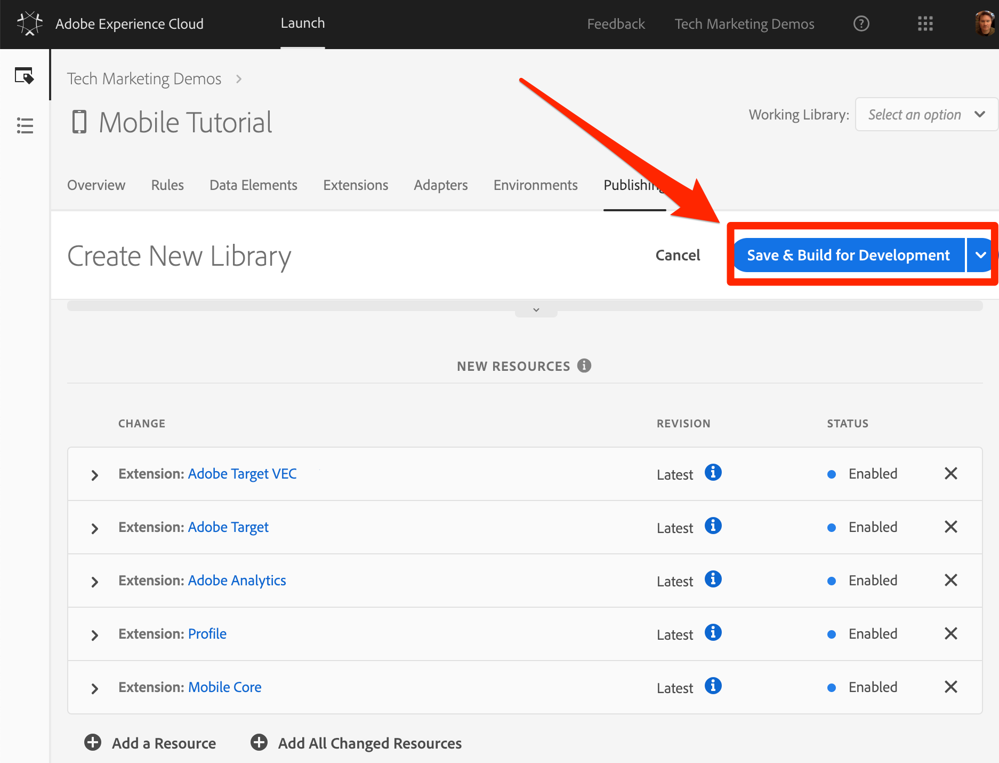

# Add a Library

In this lesson, you will create a library for your new Launch property. A library packages together all of the desired Launch settings and generates  the specific implementation instructions required to install the library in your mobile app.

## Learning Objectives

At the end of this lesson, you will be able to:

* Create a library
* Add changes to a library
* Build a library

## Save Your Changes to a Library

After configuring your extensions, you need to package them into a library that you can deploy in your app so you can use your solutions.

**To add and build a library**

1. Go to the **[!UICONTROL Publishing]** tab

1. Click **[!UICONTROL Add New Library]**

   

1. Name the Library `Initial Setup`

1. Select **[!UICONTROL Environment > Development]**

1. Click **[!UICONTROL Add All Changed Resources]**

   

1. Note that after clicking **[!UICONTROL Add All Changed Resources]** Launch summarizes the changes you just made when adding extensions.

1. Click **[!UICONTROL Save & Build for Development]**

   

1. After a few moments, the status dot will turn green indicating the library built successfully.

    

[Next "Install the Launch Property and the SDK" >](launch-install-the-mobile-sdk.md)
