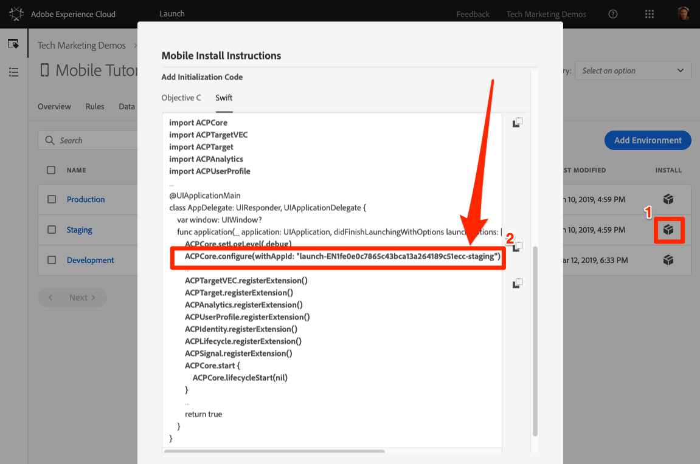
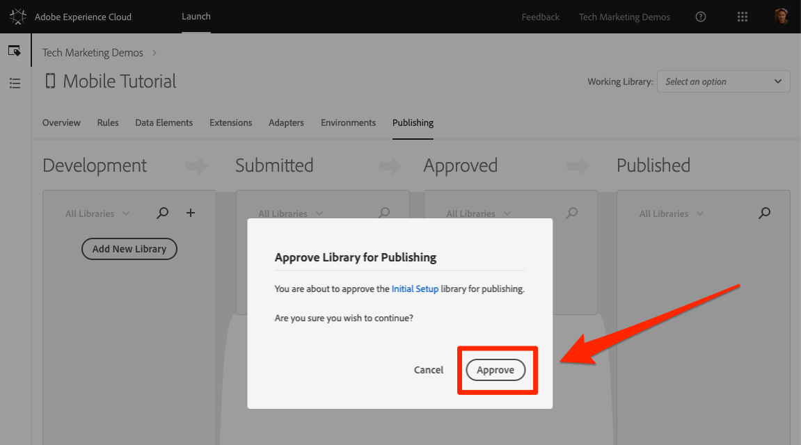
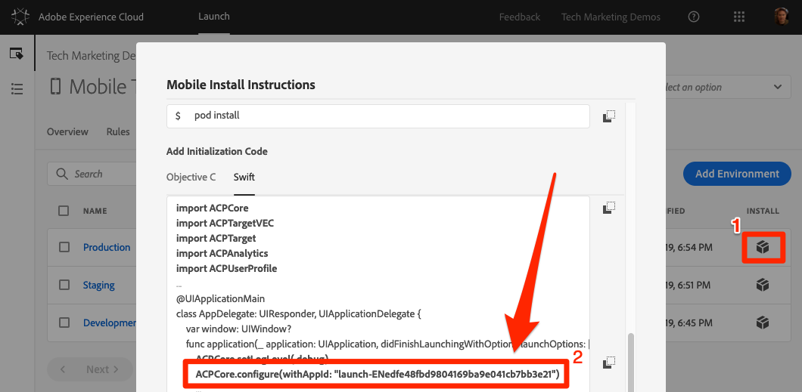

# Publish your Launch Property

Now that you have implemented some key solutions of the Adobe Experience Cloud in your Development environment, it's time to learn the publishing workflow.

## Prerequisites

Your Launch user account needs permission to "Approve" and "Publish" in order to complete this lesson. If you are unable to complete any of these steps because the user interface options are not available to you, reach out to your Experience Cloud Administrator for access. For more information on Launch permissions, see [the documentation](https://docs.adobe.com/content/help/en/launch/using/reference/admin/user-permissions.html).

## Learning Objectives

At the end of this lesson, you will be able to:

1. Publish a Development library to the Staging environment
1. Update your app to load different Launch environments
1. Publish a Staging library to the Production environment

## Publish to Staging

 Now that you have created and validated your library in the Development environment, it is time to publish it to Staging.

1. Go to the **[!UICONTROL Publishing]** page

1. Open the dropdown next to your library and select **[!UICONTROL Submit for Approval]**

   

1. Click the **[!UICONTROL Submit]** button in the dialog:

   

1. Your library will now appear in the [!UICONTROL Submitted] column in an unbuilt state:

1. Open the dropdown and select **[!UICONTROL Build for Staging]**:

   
1. Once the green-dot icon appears, the library can be previewed in the Staging environment.

In a real-life scenario, the next step in the process would typically be to have your QA team validate the changes in the Staging library.

**To Validate the Changes in the Staging Library**

1. In your Launch property, open the [!UICONTROL Environments] page

1. In the [!UICONTROL Staging] row, click the Install icon

    to open the modal
   

If you use a different workspace for your Staging app, you would need to make sure that this workspace has all of the Pods and app updates that you made throughout this tutorial. At this point, the only difference in the installation instructions from your development environment is the Launch reference in the Core Configuration, as highlighted in the screenshot above. You would need to update the corresponding line in your AppDelegate.swift file and rebuild your app.

In real-life, once your QA team has signed off by reviewing the changes in the Staging environment it is time to publish to production.

## Publish to Production

1. Go to the [!UICONTROL Publishing] page

1. From the dropdown, click **[!UICONTROL Approve for Publishing]**:

   

1. Click the **[!UICONTROL Approve]** button in the dialog box:

   

1. The library will now appear in the [!UICONTROL Approved] column in the unbuilt state (yellow dot):

1. Open the dropdown and select **[!UICONTROL Build and Publish to Production]**:

   

1. Click the **[!UICONTROL Publish]** in the dialog box:

   

1. The library will now appear in the [!UICONTROL Published] column:

   

Again, notice that the Production environment uses a Launch reference in the Core Configuration, as highlighted in the screenshot below.  If you use a different workspace for your Staging app, you would need to make sure that this workspace has all of the Pods and app updates that you made throughout this tutorial.
   

>[!WARNING]
>
>The next time you make changes to your Launch configuration you will need to create a new Library in the Development environment. Remember, that adding and removing extensions will require updates to the app itself. Be careful about keeping your Launch environments and app code in sync with each other to avoid issues.

That’s it! You've completed the tutorial and published your first mobile property in Launch!