# Add Adobe Analytics

In this lesson, you will implement the [Adobe Analytics extension](https://docs.adobe.com/content/help/en/launch/using/extensions-ref/adobe-extension/analytics-extension/overview.html) and create rules to send data to Adobe Analytics.

[Adobe Analytics](https://docs.adobe.com/content/help/en/analytics/landing/home.html) is an industry-leading solution that empowers you to understand your customers as people and steer your business with customer intelligence.

## Learning Objectives

At the end of this lesson, you will be able to:

1. Add the Adobe Analytics extension
1. Set global variables using the extension
1. Add the page view beacon
1. Add additional variables using rules
1. Add click-tracking and other event-based beacons
1. Add Analytics plugins

There are many things that could be implemented for Analytics in Launch. This lesson is not exhaustive, but should give you a solid overview of the main techniques you will need for implementing in your own site.

## Prerequisites

You should have already completed the lessons in [Configure Launch](launch.md) and [Add the Identity Service](id-service.md).

Additionally, you will need at least one report suite ID and your tracking server. If you don't have a test/dev report suite that you can use for this tutorial, please create one. If you are unsure how to do that, see [the documentation](https://docs.adobe.com/content/help/en/analytics/admin/manage-report-suites/new-report-suite/new-report-suite.html). You can retrieve your tracking server from your current implementation, Adobe Consultant or Customer Care representative.

## Add the Analytics Extension

The Analytics extension consists of two main parts:

1. The extension configuration, which manages the core AppMeasurement.js library settings and can set global variables
1. Rule actions to do the following:
    1. Set Variables
    1. Clear Variables
    1. Send the Analytics Beacon

**To add the Analytics extension**

1. Go to **[!UICONTROL Extensions > Catalog]**
1. Locate the Adobe Analytics extension
1. Click **[!UICONTROL Install]**

   

1. Under [!UICONTROL Library Management > Report Suites], enter the report suite ids you would like to use with each Launch environment. If your users has access to Adobe Analytics, note that as you start typing in the box, you will see a pre-populated list of all of your report suites. (It's okay to use one report suite for all environments in this tutorial, but in real life you would want to use separate report suites, as shown in the image below)

   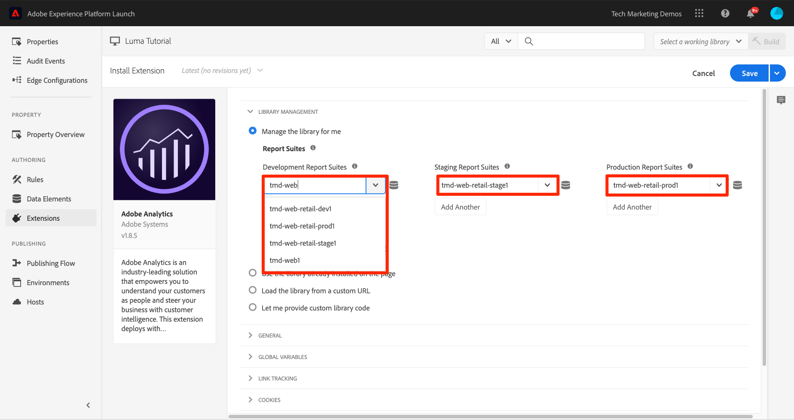

   >[!TIP]
   >
   >We recommend using the [!UICONTROL Manage the library for me option] as the [!UICONTROL Library Management] setting as it makes it much easier to keep the `AppMeasurement.js` library up-to-date.

1. Under [!UICONTROL General > Tracking Server], enter your tracking server, e.g. `tmd.sc.omtrdc.net`. Enter your SSL Tracking Server if your site supports `https://`

   

1. In the [!UICONTROL Global Variables section], under [!UICONTROL Additional Settings], set the [!UICONTROL Page Name] variable using your `Page Name` data element. Click the  icon to open the modal and choose the page `Page Name` data element)

1. Click **[!UICONTROL Save to Library]**

   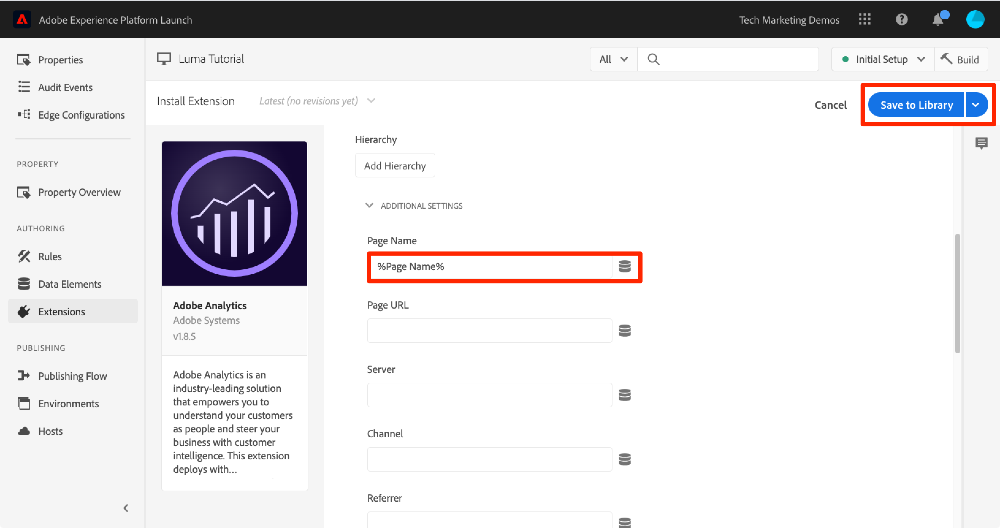

>[!NOTE]
>
>Global variables can be set in the extension configuration or in rule actions. Be aware that when setting variables in the extension configuration, the data layer must be defined *before* the Launch embed codes.

## Send the Page View Beacon

Now you will create a rule to fire the Analytics beacon, which will send the [!UICONTROL Page Name] variable set in the extension configuration.

You have already created an "All Pages - Library Loaded" rule in the [Add a Data Element, a Rule and a Library](launch-data-elements-rules.md) lesson of this tutorial, which is triggered on every page when the Launch library loads. You *could* use this rule for Analytics as well, however this setup requires all data layer attributes used in the Analytics beacon to be defined before the Launch embed codes. To allow more flexibility with the data collection, you will create a new "all pages" rule triggered on DOM Ready to fire the Analytics beacon.

**To Send the Page View Beacon**

1. Go to the **[!UICONTROL Rules]** section in the left navigation and then and then click **[!UICONTROL Add Rule]**

   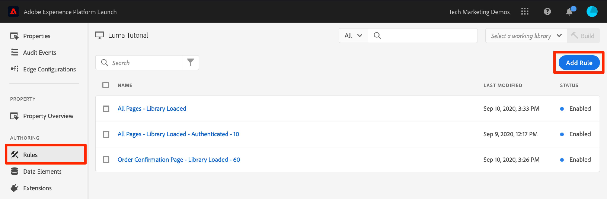

1. Name the rule `All Pages - DOM Ready`
1. Click **[!UICONTROL Events > Add]** to open the `Event Configuration` screen

   

1. Select **[!UICONTROL Event Type > DOM Ready]** (Note that the order of the rule is "50")
1. Click **[!UICONTROL Keep Changes]**
   

1. Under Actions, click the  to add a new action

   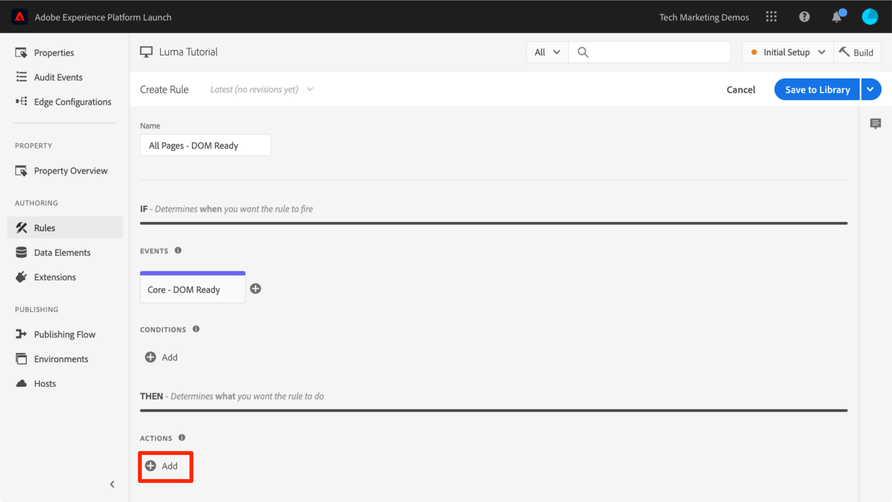

1. Select **[!UICONTROL Extension > Adobe Analytics]**

1. Select **[!UICONTROL Action Type > Send Beacon]**

1. Leave Tracking set to `s.t()`. Note that if you wanted to make an `s.tl()` call in a click-event rule you could do that using the Send Beacon action, as well.

1. Click the **[!UICONTROL Keep Changes]** button

   

1. Click **[!UICONTROL Save to Library and Build]**

      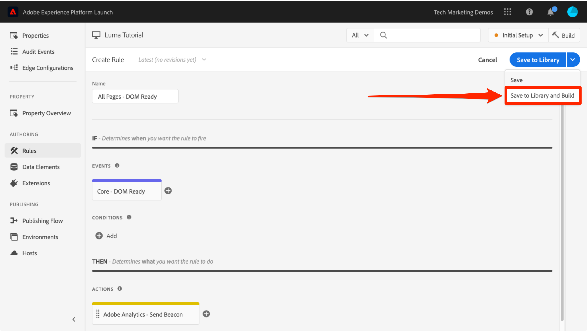

### Validate the Page View Beacon

Now that you have created a rule to send an Analytics beacon, you should be able to see the request in the Experience Cloud Debugger.

1. Open the [Luma site](https://luma.enablementadobe.com/content/luma/us/en.html) in your Chrome browser
1. Click the Debugger icon  to open the **[!UICONTROL Adobe Experience Cloud Debugger]**
1. Make sure the Debugger is mapping the Launch property to *your* Development environment, as described in the [earlier lesson](launch-switch-environments.md)

   

1. Click to open the Analytics tab
1. Expand your Report Suite name to show all of the requests made to it
1. Confirm the request has fired with the Page Name variable and value

      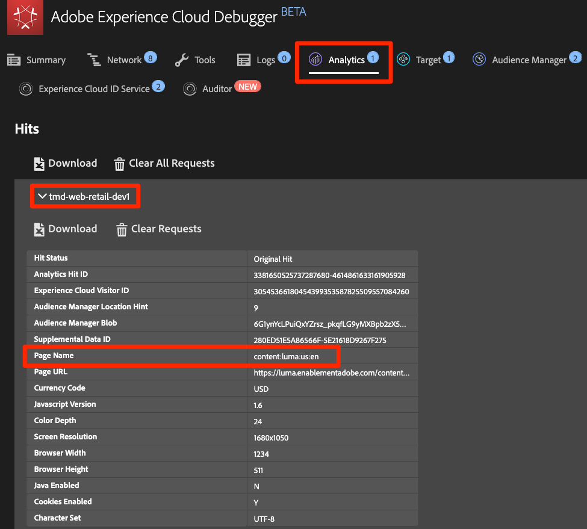

>[!NOTE]
>
>If the Page Name is not showing up for you, go back through the steps in this page to make sure that you haven't missed anything.

## Add Variables with Rules

When you configured the Analytics Extension, you populated the `pageName` variable in the extension configuration. This is a fine location to populate other global variables such as eVars and props, provided the value is available on the page before the Launch embed code loads.

A more flexible location to set variables&mdash;as well as events&mdash;is in rules using the `Set Variables` action. Rules allow you to set different Analytics variables and events under different conditions. For example, you could set the `prodView` only on product detail pages and the `purchase` event only on order confirmation pages. This section will teach you how to set variables using rules.

### Use Case

Product Detail Pages (PDP) are important points for data collection on retail sites. Typically, you want Analytics to register that a product view occurred and which product was viewed. This is helpful in understanding which products are popular with your customers. On a media site, article or video pages could use similar tracking techniques to the ones you will use in this section.  When you load a Product Detail Page, you might want to put that value into a "Page Type" `eVar`, as well as set some events and the product id. This will allow us to see the following in our analysis:

1. How many times product detail pages are loaded
1. Which specific products are viewed and how many times
1. How other factors (campaigns, search, etc) affect how many PDP's people load

### Create Data Element for Page Type

First you need to identify which pages are the Product Detail pages. You will do that with a Data Element.

**To Create the Data Element for Page Type**

1. Click **[!UICONTROL Data Elements]** in the left navigation
1. Click **[!UICONTROL Add Data Element]**

   

1. Name the data element `Page Type`
1. Select **[!UICONTROL Data Element Type > JavaScript Variable]**
1. Use `digitalData.page.category.type` as the **[!UICONTROL JavaScript variable name]**
1. Check the **[!UICONTROL Clean text]** and **[!UICONTROL Force Lower Case]** options
1. Click **[!UICONTROL Save to Library]**

   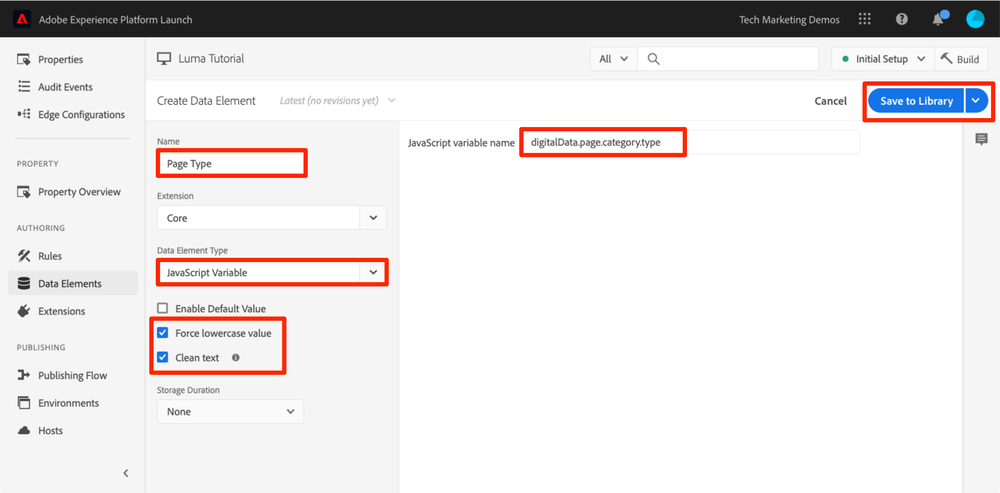

### Create Data Element for Product Id

Next, you will collect the product id of the current Product Detail page with a Data Element

**To Create the Data Element for Product Id**

1. Click **[!UICONTROL Data Elements]** in the left navigation
1. Click **[!UICONTROL Add Data Element]**

   

1. Name the data element `Product Id`
1. Select **[!UICONTROL Data Element Type > JavaScript Variable]**
1. Use `digitalData.product.0.productInfo.sku` as the **[!UICONTROL JavaScript variable name]**
1. Check the **[!UICONTROL Clean text]** and **[!UICONTROL Force Lower Case]** options
1. Click **[!UICONTROL Save to Library]**

   

### Add the Adobe Analytics Product String Extension

If you are already familiar with Adobe Analytics implementations, you are probably familiar with the [products variable](https://docs.adobe.com/content/help/en/analytics/components/variables/dimensions-reports/reports-products.html). The products variable has a very specific syntax and gets used slightly different ways depending on the context. To help make the population of the products variable easier in Launch, three additional extensions have already been created in the Launch extension marketplace! In this section you will add an extension created by Adobe Consulting to use on the Product Detail page.

**To add the add the `Adobe Analytics Product String` extension**

1. Go to the [!UICONTROL Extensions > Catalog] page
1. Find the `Adobe Analytics Product String` extension by Adobe Consulting Services and click **[!UICONTROL Install]**
   
1. Take a moment to read the instructions
1. Click **[!UICONTROL Save to Library]**

   

### Create the Rule for Product Detail Pages

Now, you will use your new data elements and extension to build your Product Detail page rule. For this functionality, you will create another page load rule, triggered by DOM Ready. However, you will use a condition so that it only fires on the Product Detail pages and the order setting so that it fires _before_ the rule that sends the beacon.

**To build the Product Detail page rule**

1. Go to the **[!UICONTROL Rules]** section in the left navigation and then and then click **[!UICONTROL Add Rule]**

   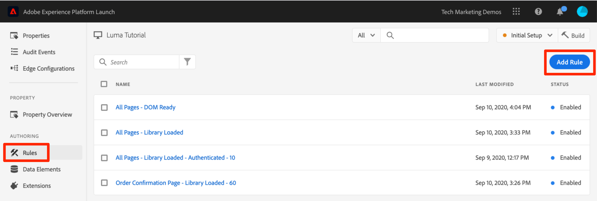

1. Name the rule `Product Details - DOM Ready - 40`
1. Click **[!UICONTROL Events > Add]** to open the `Event Configuration` screen

   

1. Select **[!UICONTROL Event Type > DOM Ready]**
1. Set the **[!UICONTROL Order]** to 40, so that the rule will run *before* the rule containing the Analytics > Send Beacon action
1. Click **[!UICONTROL Keep Changes]**
   

1. Under **[!UICONTROL Conditions]**, click the  to open the `Condition Configuration` screen
   

   1. Select **[!UICONTROL Condition Type > Value Comparison]**
   1. Use the data element picker, choose `Page Type` in the first field
   1. Select  **[!UICONTROL Contains]** from the comparison operator dropdown
   1. In the next field type `product-page` (this is the unique part of the page type value pulled from the data layer on PDP's)
   1. Click **[!UICONTROL Keep Changes]**

      

1. Under Actions, click the  to add a new action

   

1. Select **[!UICONTROL Extension > Adobe Analytics Product String]**
1. Select **[!UICONTROL Action Type > Set s.products]**

1. In the **[!UICONTROL Analytics E-commerce Event]** section, select **[!UICONTROL prodView]**

1. In the **[!UICONTROL Data layer variables for product data]** section, use the Data Element picker to choose the `Product Id` data element

1. Click **[!UICONTROL Keep Changes]**

      


1. Under Actions, click the  to add a new action

      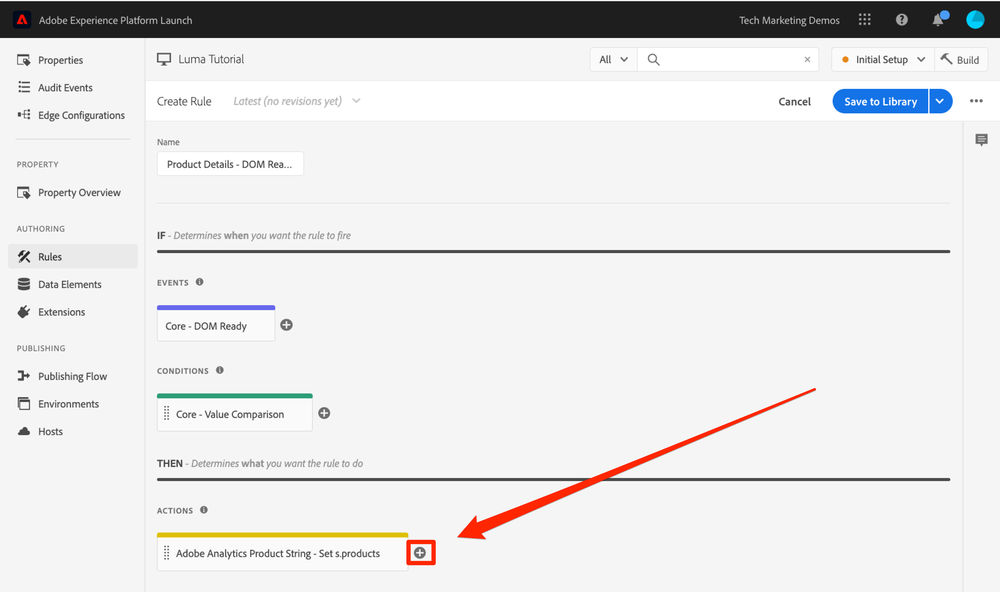

1. Select **[!UICONTROL Extension > Adobe Analytics]**
1. Select **[!UICONTROL Action Type > Set Variables]**
1. Select **[!UICONTROL eVar1 > Set as]** and enter `product detail page`
1. Set **[!UICONTROL event1]**, leaving the optional values blank
1. Under Events, click the **[!UICONTROL Add Another]** button
1. Set the **[!UICONTROL prodView]** event, leaving the optional values blank
1. Click **[!UICONTROL Keep Changes]**

      

1. Click **[!UICONTROL Save to Library and Build]**

      

### Validate the Product Detail Page Data

You  just created a rule that sets variables before the beacon is sent. You should now be able to see the new data going out in the hit in the Experience Cloud Debugger.

**To validate the Product Detail page data**

1. Open the [Luma site](https://luma.enablementadobe.com/content/luma/us/en.html) in your Chrome browser
1. Navigate to any product detail page
1. Click the Debugger icon  to open your **[!UICONTROL Adobe Experience Cloud Debugger]**
1. Click to the Analytics tab
1. Expand your Report Suite
1. Notice the Product Detail Variables that are now in the debugger, namely that `eVar1` has been set to "product detail page", that the `Events` variable has been set to "event1" and "prodView", that the products variable is set with the product id of the product you are viewing, and that your Page Name is still set by the Analytics extension

      

## Send a Track Link Beacon

When a page loads, you typically fire a page load beacon triggered by the `s.t()` function. This automatically increments a `page view` metric for the page listed in the `pageName` variable.

However, sometimes you don't want to increment page views on your site, because the action that is taking place is "smaller" (or maybe just different) than a page view. In this case, you will use the `s.tl()` function, which is commonly referred to as a "track link" request. Even though it is referred to as a track link request, it doesn't have to be triggered on a link click. It can be triggered by *any* of the events that are available to you in the Launch rule builder, including your own custom JavaScript.

In this tutorial, you will trigger an `s.tl()` call using one of the coolest JavaScript events, an `Enters Viewport` event.

### The Use Case

For this use case, you want to know if people are scrolling down on our Luma home page far enough to see the *Featured Products* section of our page. There is some internal discord at our company about whether people are even seeing that section or not, so you want to use Analytics to determine the truth.

### Create the Rule in Launch

1. Go to the **[!UICONTROL Rules]** section in the left navigation and then click **[!UICONTROL Add Rule]**
   
1. Name the rule `Homepage - Featured Products enters Viewport`
1. Click **[!UICONTROL Events > Add]** to open the `Event Configuration` screen

   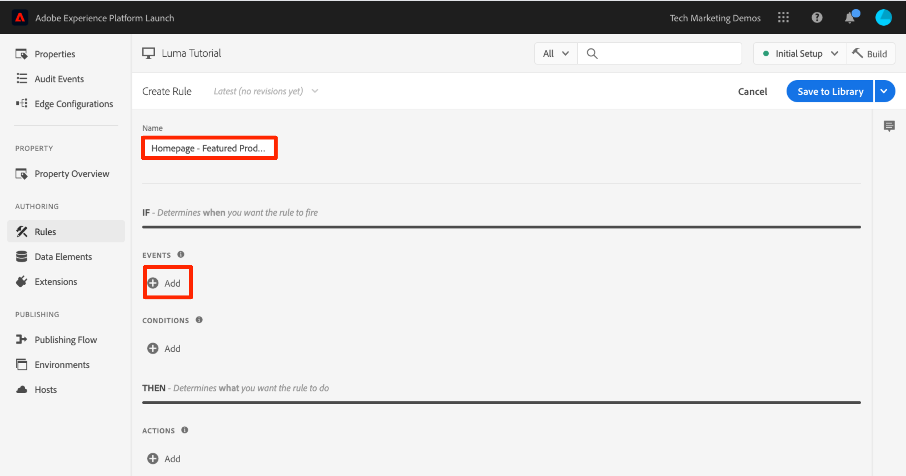

1. Select **[!UICONTROL Event Type > Enters Viewport]**. This will bring up a field where you need to enter the CSS selector that will identify the item on your page that should trigger the rule when it enters view in the browser.
1. Go back to the home page of Luma and scroll down to the Featured Products section.
1. Right-click on the space between the "FEATURED PRODUCTS" title and the items in this section, and select `Inspect` from the right-click menu. This will get you close to what you want.
1. Right around there, possibly right under the selected section, you are looking for a div with `class="we-productgrid aem-GridColumn aem-GridColumn--default--12"`. Locate this element.
1. Right-click on this element and select **[!UICONTROL Copy > Copy Selector]**

      

1. Go back to Launch, and paste this value from the clipboard into the field labeled `Elements matching the CSS selector`.
   1. On a side note, it is up to you to decide how to identify CSS selectors. This method is a bit fragile, as certain changes on the page may break this selector. Please consider this when using any CSS selectors in Launch.
1. Click **[!UICONTROL Keep Changes]**
   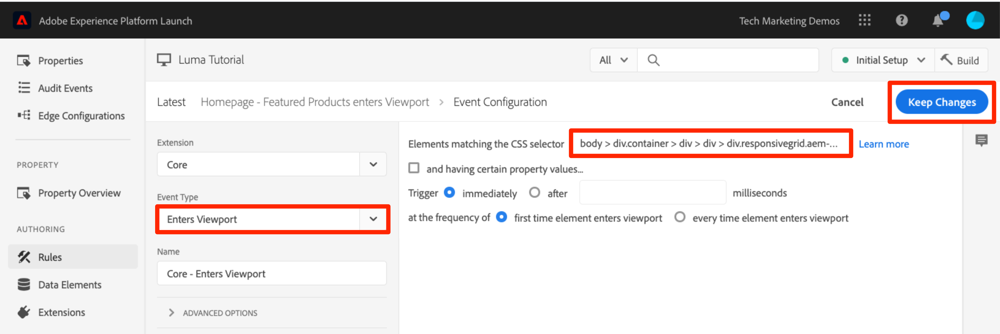

1. Under Conditions, click the  to add a new condition
1. Select **[!UICONTROL Condition Type > Value Comparison]**
1. Use the data element picker, choose `Page Name` in the first field
1. Select  **[!UICONTROL Equals]** from the comparison operator dropdown
1. In the next field type `content:luma:us:en` (this is the page name of the home page as pulled from the data layer - we only want this rule to run on the home page)
1. Click **[!UICONTROL Keep Changes]**

      

1. Under Actions, click the  to add a new action
1. Select **[!UICONTROL Extension > Adobe Analytics]**
1. Select **[!UICONTROL Action Type > Set Variables]**
1. Set `eVar3` to `Home Page - Featured Products`
1. Set `prop3` to `Home Page - Featured Products`
1. Set the `Events` variable to `event3`
1. Click **[!UICONTROL Keep Changes]**

      

1. Under Actions, click the  to add another new action

1. Select **[!UICONTROL Extension > Adobe Analytics]**
1. Select **[!UICONTROL Action Type > Send Beacon]**
1. Choose the **[!UICONTROL `s.tl()`]** tracking option
1. In the **[!UICONTROL Link Name]** field, enter `Scrolled down to Featured Products`. This value will be placed into the Custom Links report in Analytics.
1. Click **[!UICONTROL Keep Changes]**

      

1. Click **[!UICONTROL Save to Library and Build]**

      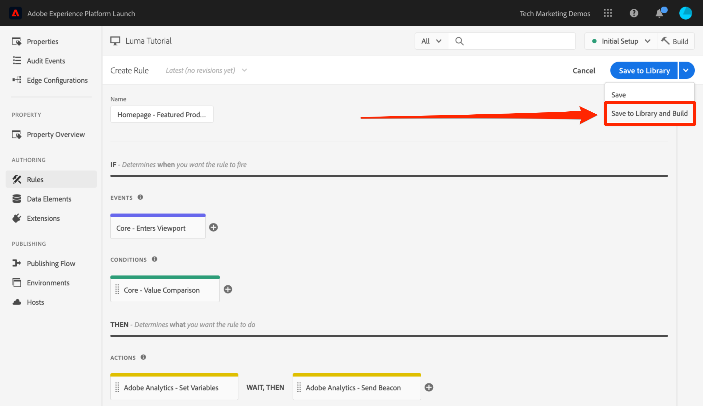

### Validate the Track Link Beacon

Now you will want to make sure that this hit goes in when you scroll down to the Featured Products section of the Home Page of our site. When you first load the homepage, the request shouldn't be made, but as you scroll down and the section comes into view, the hit should fire with our new values.

1. Open the [Luma site](https://luma.enablementadobe.com/content/luma/us/en.html) in your Chrome browser and make sure you are at the top of the home page.
1. Click the **[!UICONTROL debugger icon]**  to open your [!UICONTROL Adobe Experience Cloud Debugger]
1. Click to the Analytics tab
1. Expand your Report Suite's hit
1. Notice the normal page view hit for the home page with the page name, etc. (but nothing in eVar3 or prop3).

      

1. Leaving the Debugger open, scroll down on your site until you can see the Featured Products section
1. View the Debugger again, and another Analytics hit should have appeared. This hit should have the params associated with the s.tl() hit that you set up, namely:
   1. `LinkType = "link_o"` (this means that the hit is a custom link hit, not a page view hit)
   1. `LinkName = "Scrolled down to Featured Products"`
   1. `prop3 = "Home Page - Featured Products"`
   1. `eVar3 = "Home Page - Featured Products"`
   1. `Events = "event3"`

      

## Add a Plug-in

A Plug-in is a piece of JavaScript code that you can add to your implementation to perform a specific function that is not built into the product. Plug-ins can be built by you, by other Adobe Customers/Partners, or by Adobe Consulting.

To implement plug-ins, there are basically three steps:

1. Include the doPlugins function, where the plug-in will be referenced
1. Add the main function code for the plug-in
1. Include the code that calls the function and sets variables, etc.

### Make the Analytics Object Globally Accessible

If you are going to add the doPlugins function (below) and use plug-ins, you need to check a box to make the Analytics "s" object available globally in the Analytics implementation.

1. Go to **[!UICONTROL Extensions > Installed]**

1. In the Adobe Analytics extension, Click **[!UICONTROL Configure]**

      

1. Under **[!UICONTROL Library Management]**, select the box labeled `Make tracker globally accessible`. As you can see in the help bubble, this will make the tracker be scoped globally under window.s, which will be important as you refer to it in your customer JavaScript.
   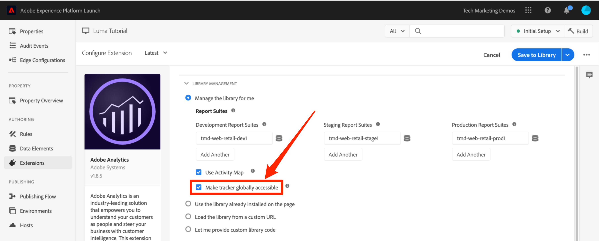

### Including the doPlugins Function

To add plug-ins, you need to add a function called doPlugins. This function is not added by default, but once added, is handled by the AppMeasurement library, and is called last when a hit is being sent into Adobe Analytics. Therefore, you can use this function to run some JavaScript to set variables that are easier set this way.

1. While still in the Analytics extension, scroll down and expand the section titled `Configure Tracker Using Custom Code.`
1. Click **[!UICONTROL Open Editor]**
1. Paste the following code into the code editor:

   ```javascript

   /* Plugin Config */
   s.usePlugins=true
   s.doPlugins=function(s) {
   /* Add calls to plugins here */
   }
   ```

1. Keep this window open for the next step

### Add Function Code for the Plug-in

You are actually going to call two plug-ins in this code, but one of them is built into the AppMeasurement library, so for that one you do not need to add the function to call. However, for the second one, you do need to add the function code as well. This function is called getValOnce().

### The getValOnce() Plug-in

The purpose of this plug-in is to keep values from getting falsely duplicated in the code when a visitor refreshes a page or uses the browser's back button to go back to a page where a value was set. In this lesson, you will use it to keep the `clickthrough` event from being duplicated.

The code for this plug-in is available in the [Analytics Documentation](https://docs.adobe.com/content/help/en/analytics/implementation/javascript-implementation/plugins/getvalonce.html), but it is included here for your ease of copy/paste.

1. Copy the following code

   ```javascript
   /* Adobe Consulting Plugin: getValOnce v2.01 */
   s.getValOnce=function(vtc,cn,et,ep){if(vtc&&(cn=cn||"s_gvo",et=et||0,ep="m"===ep?6E4:864E5,vtc!==this.c_r(cn))){var e=new Date;e.setTime(e.getTime()+et*ep);this.c_w(cn,vtc,0===et?0:e);return vtc}return""};
   ```

1. Paste it into the code window in the Analytics extension (if you don't still have it open, re-open it as per the previous step), **completely below** the doPlugins function (not inside of it).

      

You can now call this plug-in from within doPlugins.

### Calling Plug-ins from Within doPlugins

Now that the code is there and can be referenced, you can make the calls to plug-ins within the doPlugins function.

First you will call a plug-in which has been incorporated into the AppMeasurement library, and so is known as a "utility." It is referred to as `s.Util.getQueryParam`, because it is part of the s object, is a built-in utility, and will grab values (based on a parameter) from the query string in the URL.

1. Copy the following code:

   ```javascript
   s.campaign = s.Util.getQueryParam("cid");
   ```

1. Paste it into the doPlugins function. This will look for a parameter called `cid` in the current page URL and place it into the s.campaign variable.
1. Now call the getValOnce function by copying the following code and pasting it in right below the call to getQueryParam:

   ```javascript
   s.campaign=s.getValOnce(s.campaign,'s_cmp',30);
   ```

      This code will make sure that the same value is not sent in more than once in a row for 30 days (see the documentation for ways to customize this code to your needs).

      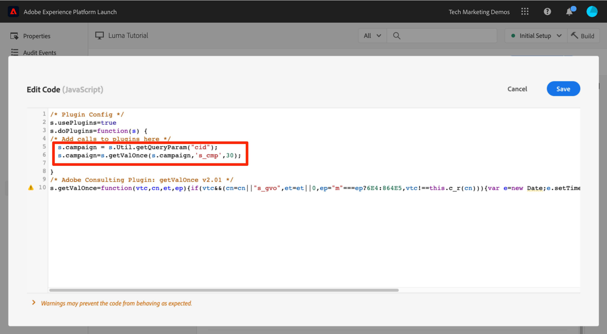

1. Save the code window
1. Click **[!UICONTROL Save to Library and Build]**

      

### Validate the Plug-ins

Now you can make sure that the plug-ins are working.

**To validate the plugins**

1. Open the [Luma site](https://luma.enablementadobe.com/content/luma/us/en.html) in your Chrome browser
1. Click the Debugger icon  to open the **[!UICONTROL Adobe Experience Cloud Debugger]**
1. Click to the Analytics tab
1. Expand your Report Suite
1. Notice the Analytics hit does not have a Campaign variable
1. Leaving the Debugger open, go back to the Luma site and add  `?cid=1234` to the URL and hit Enter to refresh the page with that query string included

   

1. Check the Debugger and confirm that there is a second Analytics request with a Campaign variable set to `1234`

      

1. Go back and refresh the Luma page again, with the query string still in the URL
1. Check the next hit in the Debugger, and the Campaign variable should **not** be present, because the getValOnce plug-in has made sure that it doesn't get duplicated and look like another person came in from the campaign tracking code.

   

1. BONUS: You can test this over and over by changing the value of the `cid` parameter in the query string. The Campaign variable should only be there if it is the **first** time you run the page with the value. If you are not seeing the Campaign value in the debugger, simply change the value of the `cid` in the query string of the URL, hit enter, and you should see it again in the debugger.

   >[!NOTE]
   >
   >There are actually a few different ways to grab a parameter out of the query string of the URL, including in the Analytics extension configuration. However, in these other non-plug-in options, they don't provide the ability to stop unnecessary duplication, as you have done here with the getValOnce plug-in. This is the author's favorite method, but you should determine which method works best for you and your needs.

Nice work! You have completed the Analytics lesson. Of course, there are many other things that you can do to enhance our Analytics implementation, but hopefully this has given you some of the core skills you will need to tackle the rest of your needs.

[Next "Add Adobe Audience Manager" >](audience-manager.md)
