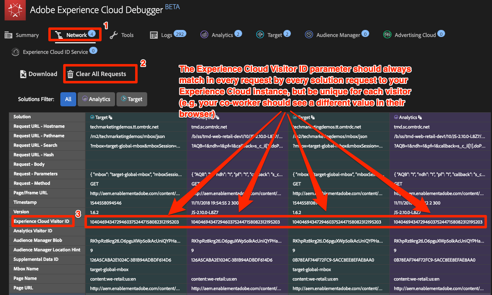
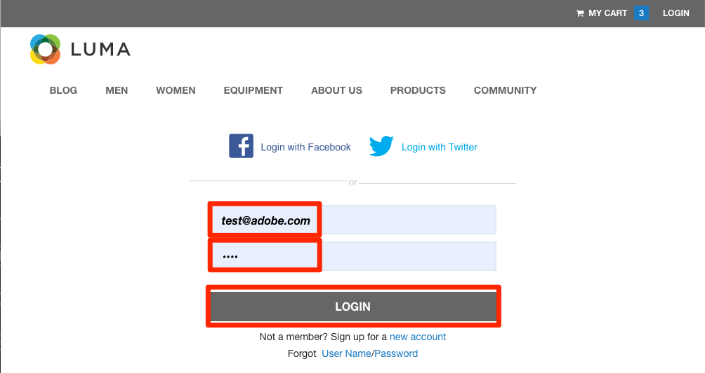
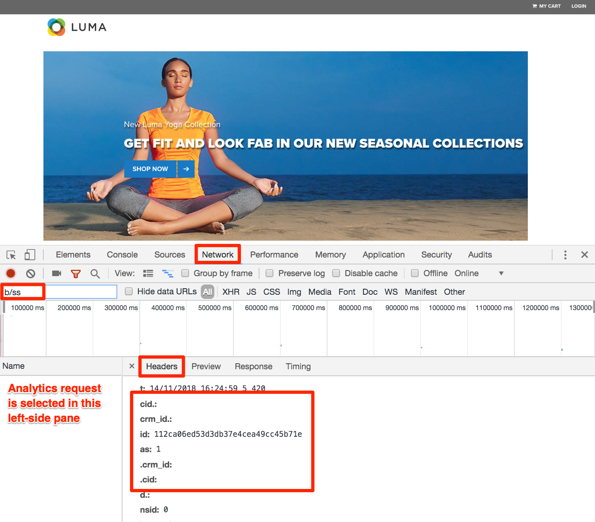

# Experience Cloud Integrations

In this lesson, you will review the key integrations between the solutions you  just implemented. The good news is that by completing the earlier lessons, you have already implemented the code-aspects of the integrations! You don't need to do any additional work in this lesson besides reading and validating.

## Learning Objectives

At the end of this lesson, you will be able to:

1. Explain the basic use cases for Audience Sharing, Analytics for Target (A4T) and Customer Attributes integrations
1. Validate the basic client-side implementation aspects of these integrations

## Prerequisites

You should complete all of the previous lessons in this tutorial before following the  instructions in this lesson.

>[!NOTE]
>
>There are many user-permissions requirements, account configurations, and provisioning steps that are required to fully use these integrations and which are beyond the scope of this tutorial. If you are not already using these integrations in your current implementation of the Experience Cloud, you should consider the following:
>
>* Review the full requirements of the [Core Services integrations](https://docs.adobe.com/content/help/en/core-services/interface/about-core-services/core-services.html)
>* Review the full requirements of the [Analytics for Target integration](https://docs.adobe.com/content/help/en/target/using/integrate/a4t/before-implement.html)
>* Have an Administrator of your Experience Cloud Organization [request provisioning of these integrations](https://www.adobe.com/go/audiences)

## Audiences

[Audiences](https://docs.adobe.com/content/help/en/core-services/interface/audiences/audience-library.htm) is part of the People Core Service and allows you to share audiences between solutions. For example you can create an audience in Audience Manager and use it to deliver personalized content with Target.

The main requirements to implement A4T&mdash;which you have already done&mdash;are to:

1. Implement the Adobe Experience Platform Identity Service
1. Implement Audience Manager
1. Implement other solutions which you would like to receive or create audiences, such as Target and Analytics

### Validate the Audiences integration

The best way to validate the Audiences integration is to actually build an audience, share it to another solution, and then fully use it in the other solution (e.g. confirm that a visitor who qualifies for an AAM segment can qualify for a Target activity targeted to that segment). However, this is beyond the scope of this tutorial.

These validation steps will focus on the critical part visible in the client-side implementation--the Visitor ID.

1. Open the [Luma site](https://luma.enablementadobe.com/content/luma/us/en.html)

1. Make sure the Debugger is mapping the Launch property to *your* Development environment, as described in the [earlier lesson](launch-switch-environments.md)

   

1. Go to the Network tab of the Debugger

1. Click **[!UICONTROL Clear All Requests]** just to clean things up

1. Reload the Luma page, making sure that you see both the Target and Analytics requests in the Debugger

1. Reload the Luma page again
  
1. You should now see four requests in the Network tab of the Debugger&mdash;two for Target and two for Analytics

1. Look in the row labeled "Experience Cloud Visitor ID." The IDs in every request by every solution should always be the same.

   

1. The IDs are unique per visitor, which you can confirm by asking a co-worker to repeat these steps.

## Analytics for Target (A4T)

The [Analytics for Target (A4T)](https://docs.adobe.com/content/help/en/target/using/integrate/a4t/a4t.html) integration allows you to leverage your Analytics data as the source for reporting metrics in Target.  

The main requirements to implement A4T&mdash;which you have already done&mdash;are to:

1. Implement the Adobe Experience Platform Identity Service
1. Fire the Target page load request before the Analytics page view beacon

A4T works by stitching together a server-side request from Target to Analytics with the Analytics page view beacon, which we call "hit-stitching."  Hit-stitching requires that the Target request which delivers the activity (or increments a Target-based goal metric) have a parameter which matches a parameter in the Analytics page view beacon. This parameter is called the supplemental data id (SDIDs).

### Validate the A4T Implementation

The best way to validate the A4T integration is to actually build a Target activity using A4T and validate the reporting data, however this is beyond the scope of this tutorial. This tutorial will show you how to confirm that the supplemental data ids match between the solution calls.

**To validate the SDIDs**

1. Open the [Luma site](https://luma.enablementadobe.com/content/luma/us/en.html)

1. Make sure the Debugger is mapping the Launch property to *your* Development environment, as described in the [earlier lesson](launch-switch-environments.md)

   

1. Go to the Network tab of the Debugger

1. Click **[!UICONTROL Clear All Requests]** just to clean things up

1. Reload the Luma page, making sure that you see both the Target and Analytics requests in the Debugger

1. Reload the Luma page again
  
1. You should now see four requests in the Network tab of the Debugger&mdash;two for Target and two for Analytics

1. Look in the row labeled "Supplemental Data ID." The IDs from the first page load should match between Target and Analytics. The IDs from the second page load should also match, but be different from the first page load.

   

If you make additional Target requests in the scope of a page load (not including single-page apps) that are part of A4T activities, it's good to give them unique names (not target-global-mbox) so that they will continue to have the same SDIDs of the initial Target and Analytics requests.

## Customer Attributes

[Customer Attributes](https://docs.adobe.com/content/help/en/core-services/interface/customer-attributes/attributes.html) is a part of the People Core Service that allows you to upload data from your customer relationship management (CRM) database and leverage it in Adobe Analytics and Adobe Target.

The main requirements to implement Customer Attributes&mdash;which you have already done&mdash;are to:

1. Implement the Adobe Experience Platform Identity Service
1. Set Customer Ids via the Id Service *before* Target and Analytics fire their requests (which you accomplished using the rule ordering feature in Launch)

### Validate the Customer Attributes Implementation

You have already validated that the Customer IDs are passed to both the Identity Service and to Target in earlier lessons. You can also validate the Customer ID in the Analytics hit as well.
At this time, the Customer ID is one of the few parameters that does not show up in the Experience Cloud Debugger, so you will use the browser's JavaScript Console to view it.

1. Open the Luma site
1. Open your browser's Developer Tools
1. Go to the Network tab
1. In the filter field, type `b/ss` which will limit what you see to the Adobe Analytics requests

    

1. Click the **[!UICONTROL LOGIN]** link in the top right corner of the site

   

1. Enter `test@adobe.com` as the username
1. Enter `test` as the password
1. Click the **[!UICONTROL LOGIN]** button

   

1. It should return you to the Homepage, which will also trigger a beacon that you can see in the Developer Tools. If you are taken to the account info page, click on the WE.RETAIL logo to return to the homepage.
1. Click on the request and select the Headers tab
1. Scroll down until you see some nested parameters
   1. cid - this is the standard delimiter for the Customer ID portion of the request
   1. crm_id - This is the custom integration code, which you specified in the Identity Service lesson
   1. id - The Customer ID value coming from your `Email (Hashed)` data element
   1. as - The Authentication State, with "1" meaning logged in

    

[Next "Publish your Property" >](publish.md)