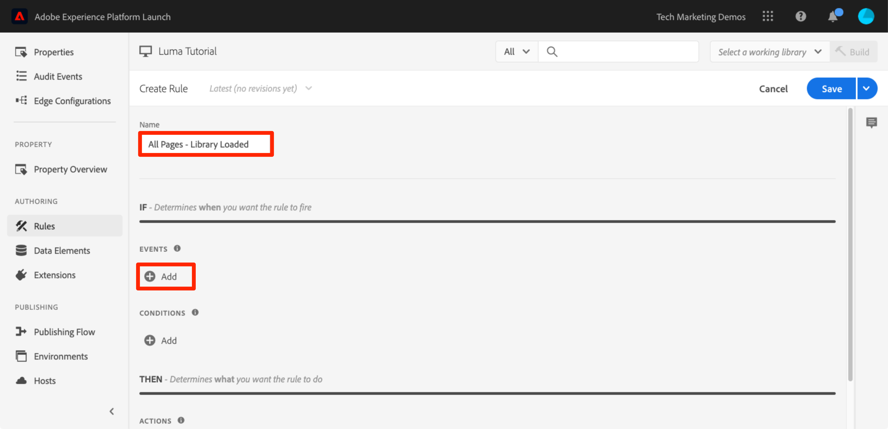
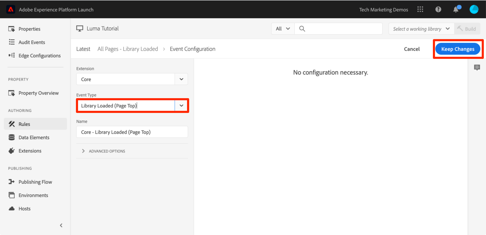
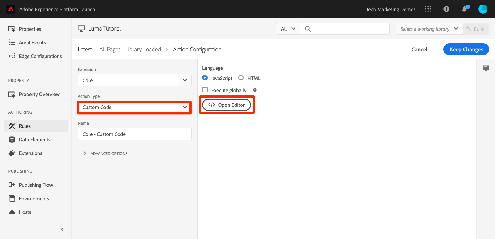
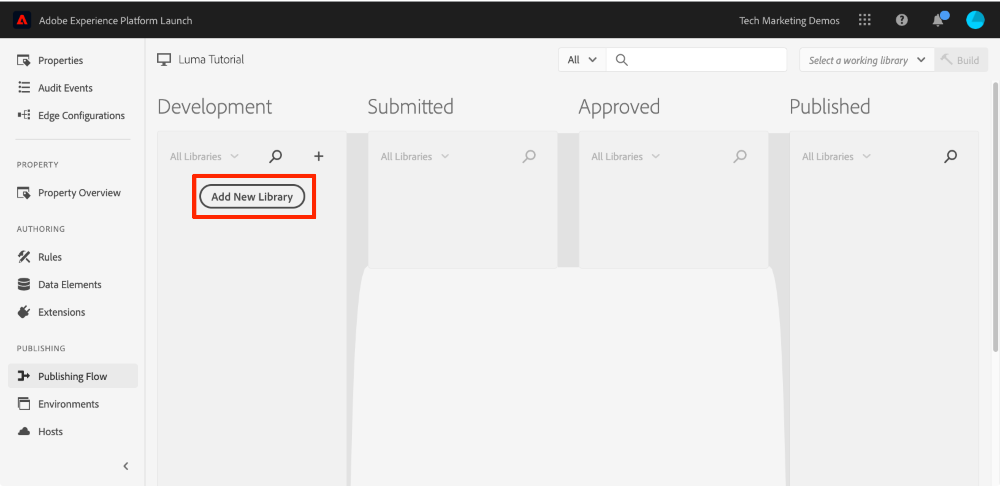
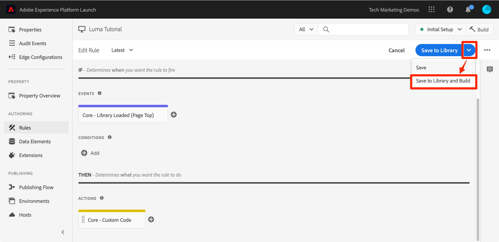

# Add a Data Element, a Rule and a Library

In this lesson, you will create your first Data Element, Rule, and Library.

Data Elements and Rules are the basic building blocks of Launch. Data Elements store the attributes you want to send to your marketing and advertising solutions, while Rules fire the requests to those solutions under the right conditions.  Libraries are the JavaScript files that load on the page to do all of the work. In this lesson, you will use all three to make our sample page do something.

## Learning Objectives

At the end of this lesson, you will be able to:

* Create a data element
* Create a rule
* Create a library
* Add changes to a library
* Validate that your library is loading in your web browser
* Use the "Working Library" feature to work more efficiently

## Create a Data Element for Page Name

Data elements are Launch’s version of a data layer. They can store values from your own data layer object, cookies, local storage objects, query string parameters, page elements, meta tags, etc. In this exercise, you will create a data element for Page Name, which you will use later in your Target and Analytics implementations.

**To create a data element**

1. In the left navigation, click **[!UICONTROL Data Elements]**

1. Since you haven't created any data elements yet in this property, a brief video appears with additional information on this topic. Watch this video, if you like.

1. Click the **[!UICONTROL Create New Data Element]** button:

   

1. Name the data element, e.g. `Page Name`

1. Use the [!UICONTROL JavaScript Variable] Data Element type to point to a value in your sample page's data layer: `digitalData.page.pageInfo.pageName`

1. Check the boxes for **[!UICONTROL Force lowercase value]** and **[!UICONTROL Clean text]** to standardize the case and remove extraneous spaces

1. Leave **[!UICONTROL None]** as the **[!UICONTROL Storage Duration]** setting since this value will typically be different on every page

1. Click the **[!UICONTROL Save]** button to save the data element

   .

>[!NOTE]
>
>**DTM Migrators:** New data element types have been added to Launch, which did not exist in DTM. Some of the new data element types include Local Storage, Session Storage, Page Info, and Random Number

>[!NOTE]
>
>Data element capabilities _can be extended with Extensions_. For example, the ContextHub extension allows you to add data elements using features of the extension.

## Create a Rule

Next you will use this data element in a simple rule. Rules are one of the most powerful features in Launch and allow you to specify what should happen as the visitor interacts with your website. When the criteria outlined in your rules are met, the rule triggers the action you have specified.

You are going to create a rule that outputs the Page Name data element value to the browser console.

**To create a rule**

1. In the left navigation, click **[!UICONTROL Rules]**

1. Since you haven't created any rules yet in this property, a brief video appears with additional information on the topic. Watch this video, if you like.

1. Click the **[!UICONTROL Create New Rule]** button:

   

1. Name the Rule `All Pages - Library Loaded`. This naming convention indicates where and when the rule will fire, making it easier to identify and re-use as your Launch property matures.

1. Under Events, click **[!UICONTROL Add]**. The Event tells Launch when the rule should fire and can be many things, including a page load, a click, a custom JavaScript event, etc.

   
  
   1. As the Event Type, select **[!UICONTROL Library Loaded (Page Top)]**. Note that when you select the Event Type, Launch pre-populates a name for the event using your selection. Also note that the default order for the event is 50. Ordering is a powerful feature in Launch which gives you precise control over the sequence of actions when you have multiple rules that are triggered by the same event. You will use this feature later in the tutorial.

   1. Click the **[!UICONTROL Keep Changes]** button
  
   

1. Since this rule should fire on all pages, leave **[!UICONTROL Conditions]** blank. If you open the Conditions modal, you will see that conditions can add both restrictions and exclusions based on a large variety of options, including URLs, data element values, date ranges, and more.

1. Under Actions, click **[!UICONTROL Add]**

1. Select **[!UICONTROL Action Type > Custom Code]**, which at this point is the only option. Later in the tutorial, as you add extensions, more options will become available.

1. Select **[!UICONTROL </> Open Editor]** to open the code editor

   

1. Add the following to the code editor. This code will output the value of the Page Name data element to the browser console so you can confirm it's working:

    ```javascript
    console.log('The page name is '+_satellite.getVar('Page Name'));
    ```

1. Save the code editor

   

1. On the Action configuration screen click **[!UICONTROL Keep Changes]**

1. Click **[!UICONTROL Save]** to save the rule

On the Rules page, you should see your new rule:


>[!NOTE]
>
>**DTM Migrators:** In Launch, rules are required in order to fire most marketing pixels. For example, in order to fire the Adobe Analytics beacon, you must use a rule to instruct Launch to do so.
>
>The Rule builder has been dramatically redesigned and rebuilt in Launch. Some of the main changes are:
>
>* There is just one Rule builder. DTM rule-types like "Page Bottom", "Click", and "Direct Call" are all just event-types in the Rule builder. This makes it much easier to update a rule should you need to change the trigger from, say, a DOM Ready event to a custom event.
>* There is a new "Custom Code" event-type
>* Extensions can add new event types to the Rule builder. For example, the Target extension could eventually add built-in support for its [at.js custom events](https://docs.adobe.com/content/help/en/target/using/implement-target/client-side/functions-overview/atjs-custom-events.html), so custom code wouldn't be needed to use this feature.
>* Extensions can add new actions to the Rule builder, reducing issues by deprecating reliance on custom code. You will be using many of these extension actions in this Tutorial.
>* Rules are required to fire requests associated with most marketing tools. This will require a mindset adjustment, especially for things like setting Customer IDs, firing Analytics beacons, and firing Target requests.

## Save Your Changes to a Library

After configuring a collection of extensions, data elements, and rules in the Launch interface, you need to package these capabilities and logic into a set of JavaScript code that you can deploy on your website so that marketing tags will fire when visitors come to the site. A library is the set of JavaScript code that will do this.

In an earlier lesson, you implemented the embed code of your development environment on the sample page. When you loaded the sample page a 404 error was returned for the embed code URL because a Launch library had not been built yet and assigned to the environment. Now you will put your new data element and rule in a library so that your sample page can do something.

**To add and build a library**

1. In the left navigation, click **[!UICONTROL Publishing Flow]**

1. Click **[!UICONTROL Add New Library]**

   

1. Name the Library, e.g. `Initial Setup`

1. Select **[!UICONTROL Environment > Development]**

1. Click **[!UICONTROL Add All Changed Resources]**

   

1. Note that after clicking **[!UICONTROL Add All Changed Resources]** Launch summarizes the changes you just made.

1. Click **[!UICONTROL Save & Build for Development]**

   

After a few moments, the status dot will turn green indicating the library successfully built.


## Validate Your Work

Now validate that your rule is working as expected.

Reload your sample page. If you look at the Developer Tools -> Network tab, you should now see a 200 response for your Launch Library!


If you look at the Developer Tools -> Console, you should see the text "The page name is home"


Congratulations, you created your first data element and rule and built your first Launch library!

## Use the Working Library Feature

When you are making a lot of changes in Launch, it is inconvenient to have to come to the Publishing tab, add changes, and build the library each time you want to see the result.  Now that you have created your "Initial Setup" library, you can use a feature called "Working Library" to rapidly save your changes and rebuild the library in a single step.

Make a small change to your "All Pages - Library Loaded" rule. In the left navigation, click **[!UICONTROL Rules]** and then click on the `All Pages - Library Loaded` rule to open it up.


On the `Edit Rule` page, click the ***[!UICONTROL Working Library]*** dropdown and select your `Initial Setup` library.


Once you've selected the library, you should see that the **[!UICONTROL Save]** button now defaults to **[!UICONTROL Save to Library]**. When you make a change in Launch, you can use this option to automatically add the change directly to your working library and/or rebuild it.

Test it out. Open your Custom Code action and just add a colon after the text "The page name is" so the entire code block reads:

```javascript
console.log('The page name is: '+_satellite.getVar('Page Name'));
```

Save the code, keep the changes in the action, and now click the **[!UICONTROL Save to Library and Build]** button.



Wait a moment until the green dot reappears next to the [!UICONTROL Working Library] dropdown. Now, reload your sample page and you should see your change reflected in the console message (you may have to clear your browser cache and reload, in order to see the change to the page):


This is a much faster way of working and you will use this approach for the rest of the tutorial.

[Next "Switch Environments with the Experience Cloud Debugger" >](launch-switch-environments.md)
