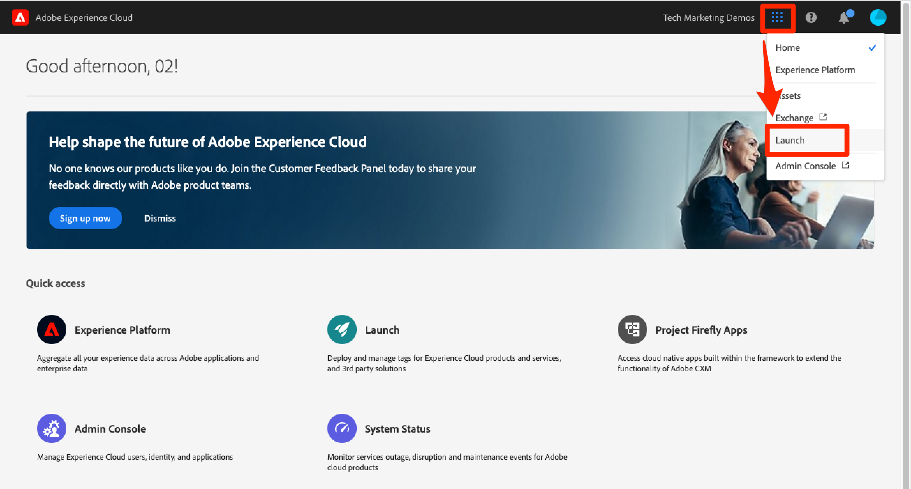
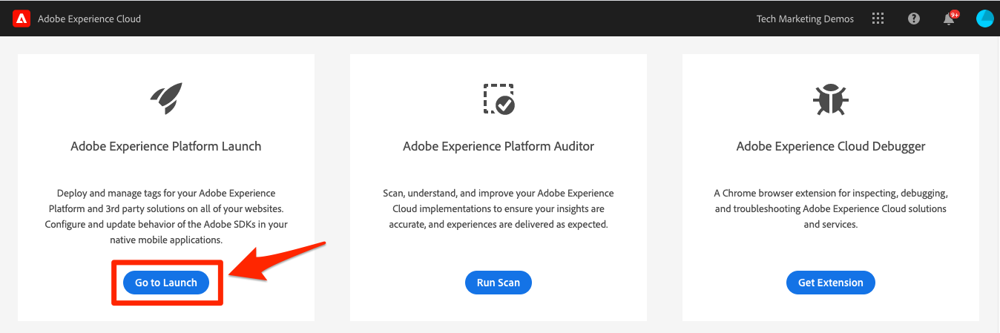

# Create a Launch Property

In this lesson, you will create your first Launch property.

A property is basically a container that you fill with extensions, rules, data elements, and libraries as you deploy tags to your site.

## Prerequisites

In order to complete the next few lessons, you must have permission to Develop, Approve, Publish, Manage Extensions, and Manage Environments in Launch. If you are unable to complete any of these steps because the user interface options are not available to you, reach out to your Experience Cloud Administrator to request access. For more information on Launch permissions, see [the documentation](https://docs.adobe.com/content/help/en/launch/using/reference/admin/user-permissions.html).

## Learning Objectives

At the end of this lesson, you will be able to:

* Log into the Launch user interface
* Create a new Launch property
* Configure a Launch property

## Go to Launch

**To get to Launch**

1. Log into the [Adobe Experience Cloud](https://experiencecloud.adobe.com)

1. Click the  icon to open the app switcher

1. Select **[!UICONTROL Launch]** from the menu 

1. Under **[!UICONTROL Adobe Experience Platform Launch]**, click the **[!UICONTROL Go to Launch]** button

   

You should now see the `Properties` screen (if no properties have ever been created in the account, this screen might be empty):

If you use Launch frequently, you can also bookmark the following URL and log in directly [https://launch.adobe.com](https://launch.adobe.com)

## Create a Property

A property is basically a container that you fill with extensions, rules, data elements, and libraries as you deploy tags to your site. A property can be any grouping of one or more domains and subdomains. You can manage and track these assets similarly. For example, suppose that you have multiple websites based on one template, and you want to track the same assets on all of them. You can apply one property to multiple domains. For more information on creating properties, see ["Companies and Properties"](https://docs.adobe.com/content/help/en/launch/using/reference/admin/companies-and-properties.html) in the product documentation.

**To Create a Property**

1. Click the **[!UICONTROL New Property]** button:

    

1. Name your property (e.g. `Luma Tutorial` or `Luma Tutorial - Daniel`)
1. As the domain, enter `enablementadobe.com` since this is the domain where the Luma demo site is hosted. Although the "Domain" field is required, the Launch property will work on any domain where it's implemented. The main purpose of this field is to pre-populate menu options in the Rule builder.
1. Expand the **[!UICONTROL Advanced Options]** section and check the box to **[!UICONTROL Run rule components in sequence]**
1. Click the **[!UICONTROL Save]** button

   

Your new property should display on the Properties page. Note that if you check the box next to the property name, options to **[!UICONTROL Configure]** or **[!UICONTROL Delete]** the property appear above the property list. Click on the name of your property (e.g. `Luma Tutorial`) to open the `Overview` screen.

[Next "Add the Launch Embed Code" >](launch-add-embed.md)
