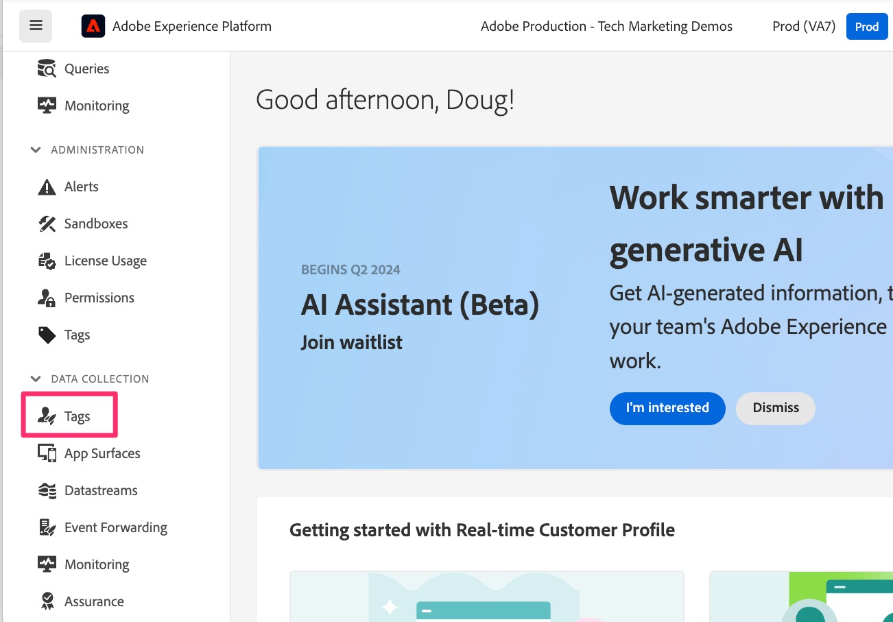
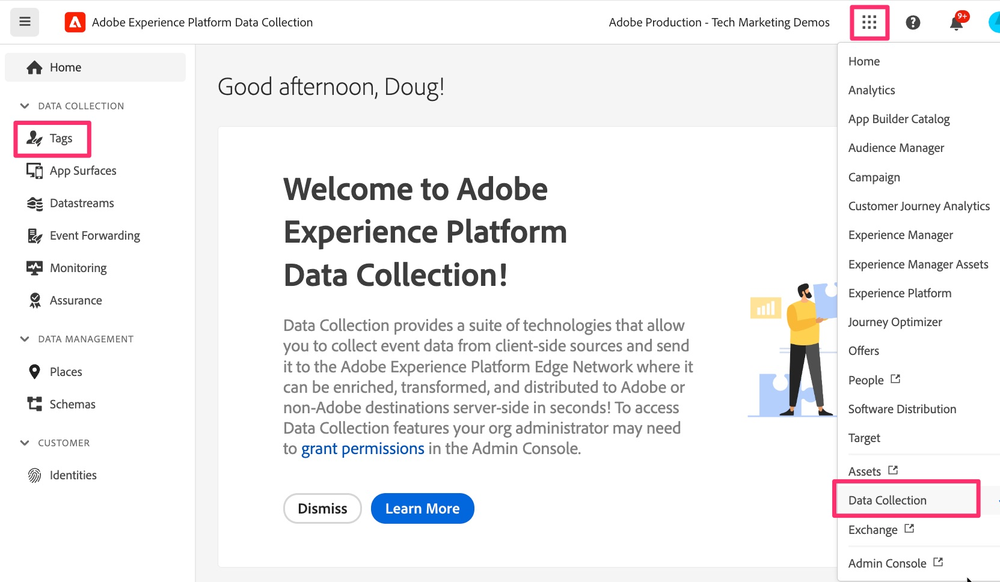
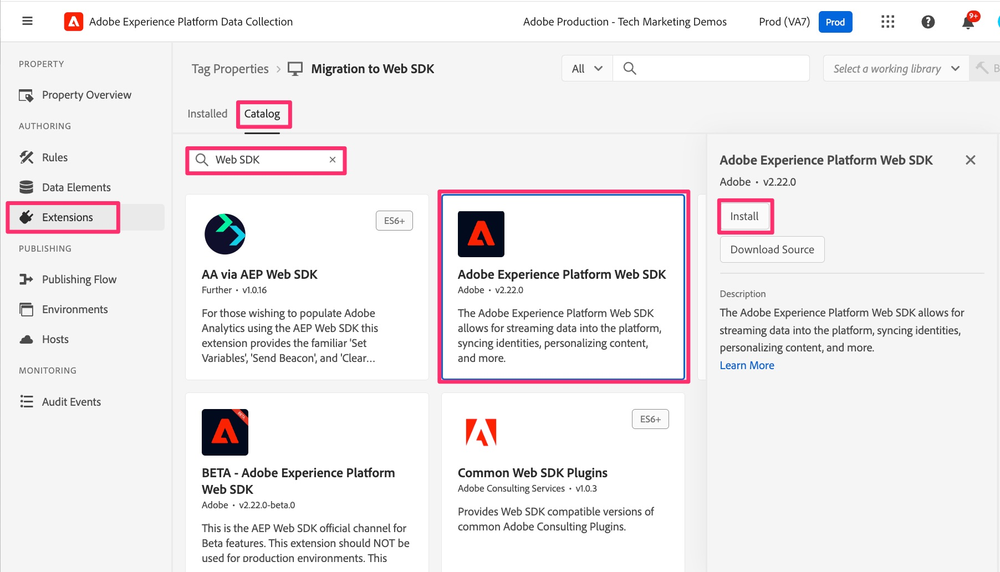
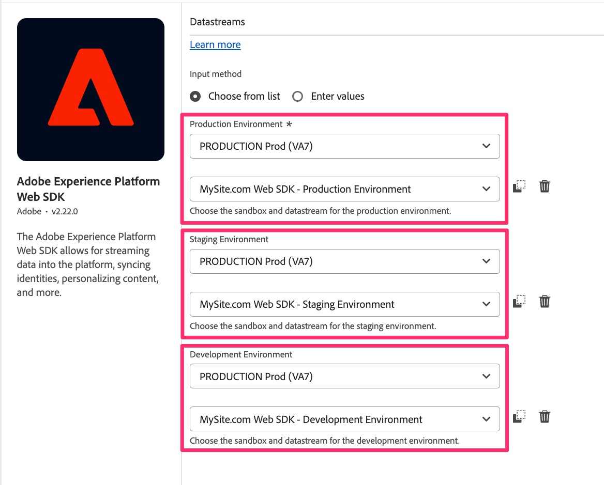

# Add and configure the Web SDK extension

Learn how to add and configure the Web SDK extension in your Tags property, to give you the functionality you need in further lessons to complete the migration.
Follow these steps to add and configure the extension:

1. Navigate to Experience Platform Data Collection. This can be accomplished in one of two ways:
    1. Go to the [Adobe Experience Platform interface](https://platform.adobe.com/), then select **[!UICONTROL Tags]** near the bottom of the left navigation.
        
    1. If you don't have access to Platform, you can use the application switcher (9 dots) at the top right of the window and select Data Collection (after having logged into Experience.Adobe.com).
        
1. Find and select your tag property that you are migrating to the Web SDK.
1. In the left navigation of the tag property, select **[!UICONTROL Extensions]**.
1. Select **[!UICONTROL Catalog]** near the top to see a list of all available extensions.
1. Search for and select the **[!UICONTROL Adobe Experience Platform Web SDK]** extension, then click **[!UICONTROL Install]** on the right.

    {style="border:1px solid lightslategray"}

1. The extension configuration settings appear. Locate the Datastreams section, and set the Experience Platform sandbox that you want to use for this migration ("Environment" drop-downs for all three environments). If you are only migrating Adobe Analytics and will not be sending data to Adobe Experience Platform, choose the **Production** sandbox. If you are going to be sending this behavioral analytics data to the Experience Platform for use in the applications there, choose the sandbox that you want to use for that. You will probably at first want to select a development sandbox until you are done with migration and done adding/testing your Platform service.
1. Very importantly, connect your code and settings here in Tags to the Edge by selecting the datastreams that you created in the previous step for Production, Staging, and Development environments.

    {style="border:1px solid lightslategray"}

1. Scroll down and notice that the **Identity** settings are selected by default. Leave these checkboxes selected, as they help identify your site visitors correctly as you migrate over to the Web SDK. More information is available in the documentation, linked to below.

1. Select **[!UICONTROL Save]**.

>[!NOTE]
>
>Your Tags property now has a basic installation and configuration of the Web SDK extension. We will be using parts of the Web SDK extension as we create or modify data elements and rules during this migration tutorial, but we won't be changing any more of the extension configuration items in the tutorial. Additional configuration items can and should be used for additional use cases. For detailed documentation regarding these configurations, see [Configure the Web SDK tag extension](https://experienceleague.adobe.com/en/docs/experience-platform/tags/extensions/client/web-sdk/web-sdk-extension-configuration).
