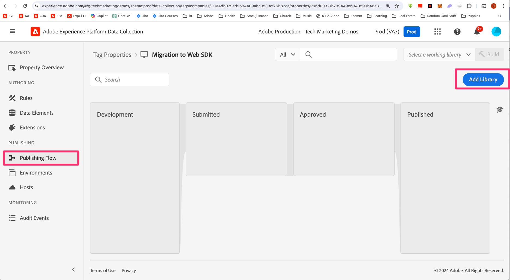
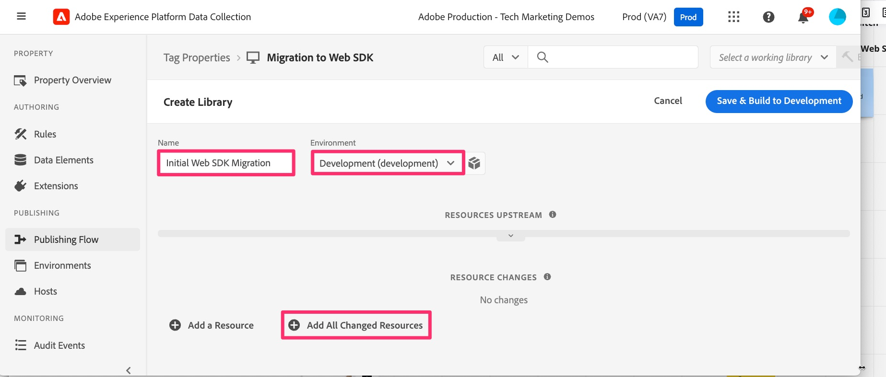
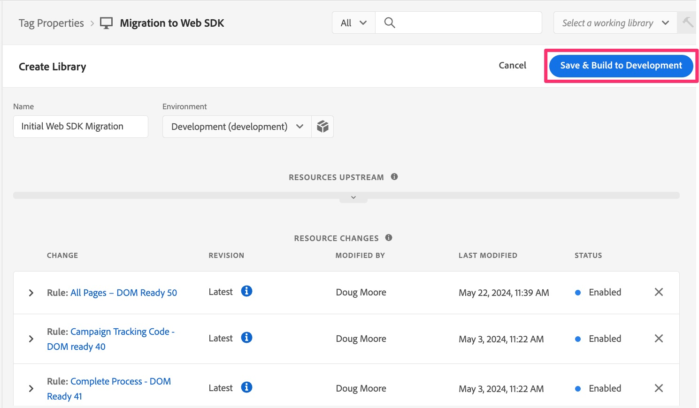
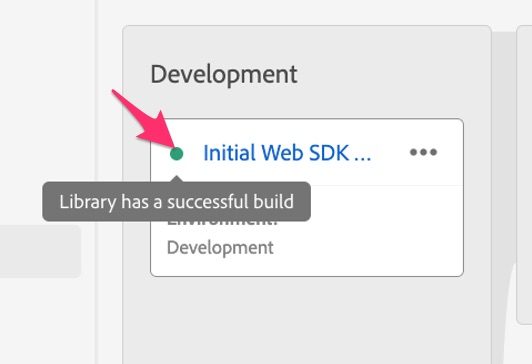
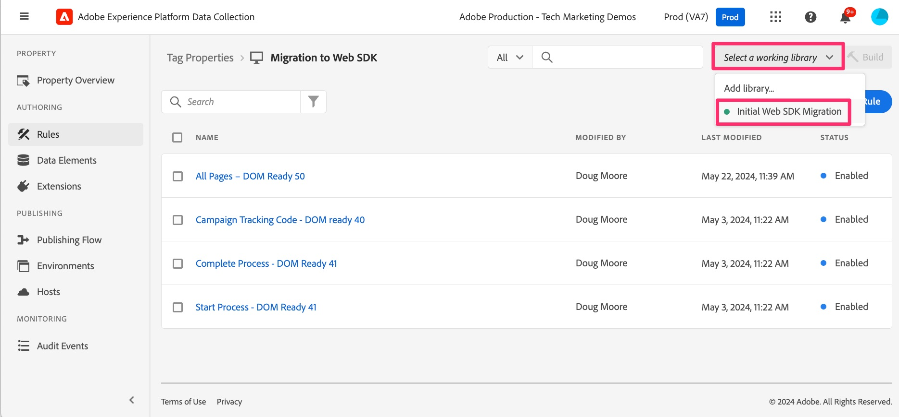

# Build the implementation changes to the development library

Learn how to build any changes that you have made to the development library in your tags property, so that you can test the results on your development website.

As you go along in this tutorial, or really anytime that you make changes to your implementation, you will need to build/publish those changes in order to see them on your development, staging, or production sites. I'm sure you have done this before, since this is a migration document and not a first time implementation document. In reality, you will want to do this quite often, as you perform each function and want to test it out and make sure that it is working correctly, sending the right data to Analytics.

Therefore, there will be a few reminders in this tutorial to build or publish your changes. If you need to, put a bookmark on this page and don't be shy about building to your development library. You can do it at any time.

So, let's build what we have done so far. By the way, we may sometimes interchange "build" and "publish" in this tutorial. What is most important is to know if you are "building" to a development or staging library, or if you are "publishing" to the production library and environment, regardless of which word we use. 

## Build migration changes to development in Experience Platform tags

1. While in your property in Experience Platform tags, select **Publishing Flow** from the left navigation, and then add a new library.

    

1. Name the library whatever you want, for example **Initial Web SDK Migration**.
1. Select the **Development** environment.
1. Select **Add All Changed Resources** to add all of the items that you have been working on.

    

1. Save and Build to Development

    

1. When the build finishes, you will be able to see if the build was successful. Mouse over the green dot to the left of the new library in your publishing flow, and in fact if it is green it will have finished successfully, and will tell you so.

    

### Select a working library

Here's a nice shortcut as you make your way through edits in tags. Instead of going through the whole publishing flow every time you make a change, you can choose a working library, and save and build with the click of a button. Do it. You'll thank me later.

1. From pretty much anywhere in the tags UI, click Select a working library from the top right of the UI, and choose the one you want. For this tutorial, choose Initial Web SDK Migration.

    
