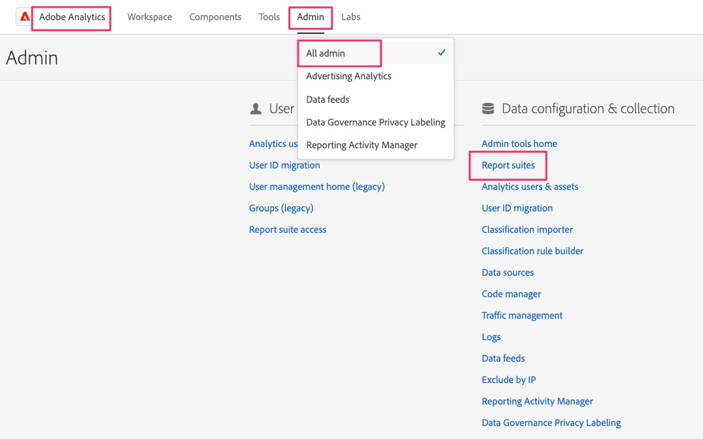
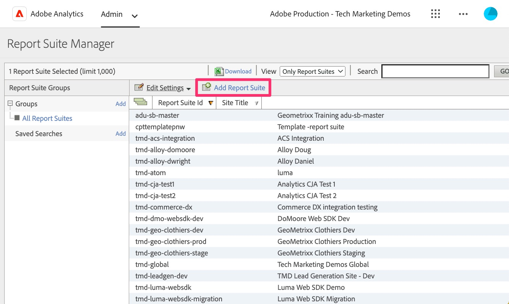
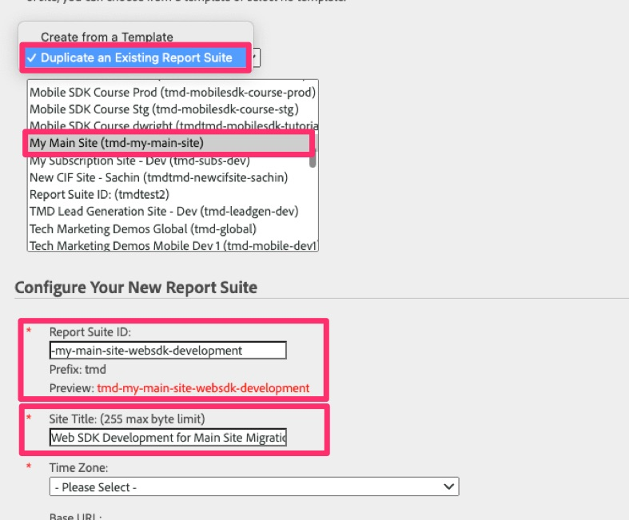

---

title: Create a validation report suite
description: Create a report suite in Adobe Analytics that you can use to validate Web SDK data as you migrate your site(s) over from the old implementation.
solution: Data Collection, Analytics
feature: Web SDK
jira: KT-16756

---
# Create a validation report suite

Create a report suite in Adobe Analytics that you can use to validate Web SDK data as you migrate your site(s) over from the old implementation.

Depending on the size and complexity of your Analytics implementation, migration to the Web SDK could take a while. During that time, you will want to validate your work, making sure that data is flowing into Adobe Analytics reports correctly. Instead of pushing that data into a report suite alongside production data, or even with any other development data, it is a best practice to create a fresh, new report suite that you can use for this migration. In the next lesson we will be creating and configuring new "datastreams" for development, staging, and production. When we do this we will need to know the report suite ID for the configuration.

## Create the new report suite

1. Open Adobe Analytics and navigate to the **report suite** settings in the Admin Console

   .

1. Select **[!UICONTROL Add Report Suite]**
    
   

1. Fill out the form to create a new report suite. Although you can choose to create the new report suite from a template, even a blank template, it will probably work out better for you to choose the **Duplicate an Existing Report Suite** option and choose your report suite that you are migrating to Web SDK. This will allow you to have the same names and settings as you test your newly migrated data, making it easier to validate as you go along. Fill out all of the required fields and save your new migration development report suite.

    

1. Make note of your new report suite's ID, as you will need it in the next lesson as you set up datastreams for Web SDK implementation. The site title will be good to remember too, as you can use it in Analysis Workspace to choose the migration development report suite in your Analytics project.

>[!TIP]
>
>For a video walk-through of creating report suites, see [Understanding and creating report suites](https://experienceleague.adobe.com/en/docs/analytics-learn/tutorials/intro-to-analytics/analytics-basics/understanding-and-creating-report-suites){target="_blank"}.

