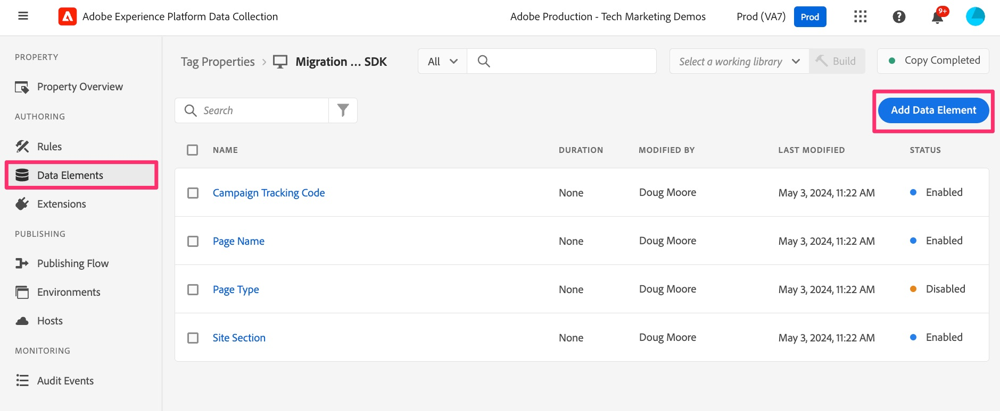
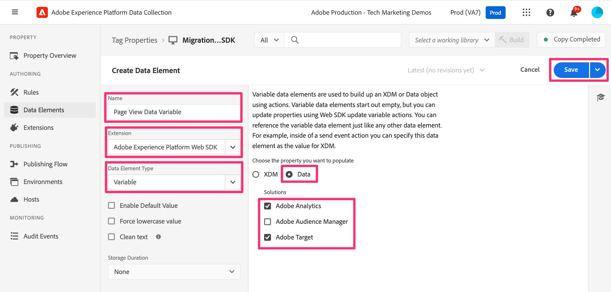

# Create a Variable data element

Add a data element that will be built up over multiple rules and then sent in to the Edge Network and forwarded to Adobe Analytics.

This data element will create the "Data" object, which will be used to pass Adobe Analytics variables (props, eVars, events, etc.) back into Adobe Analytics and Adobe Target. So, just like building up the "s object" in an AppMeasurement implementation in Analytics, we will build up this type:Variable object to be accessed and updated across rules, and it can be used to populate props and eVars into Analytics.

1. In the data collection interface, click **Data Elements** in the left-hand navigation. 

    You'll be taken to the data elements landing page where you'll see all of your pre-existing data elements. We need to create a new data element to facilitate the migration. Click **Add Data Element**.

    

1. Configure your Data Element.
    1. Name your data element whatever you want to - something that will help you remember that this is building out the data on your page, and that this will be the type "Variable." For this tutorial, we will call it **Page View Data Variable**.
    1. Select **Adobe Experience Platform Web SDK** from the Extension drop-down. 
    1. Select **Variable** from the **Data Element Type** drop-down.  
    1. In the right-hand panel, select the **Data** radio button.  
    1. Check the **Adobe Analytics** solution and either of the other solutions that you are migrating as well, E.g. **Adobe Target** showing in this screenshot.  
1. Click **Save**. 

    
