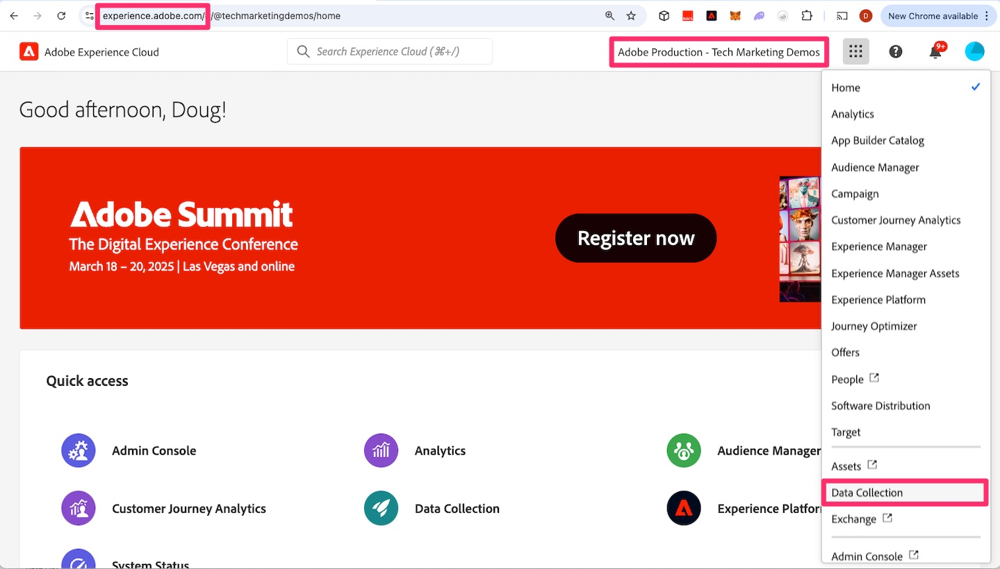
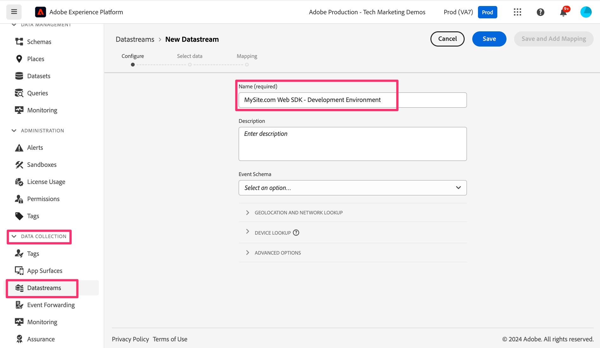
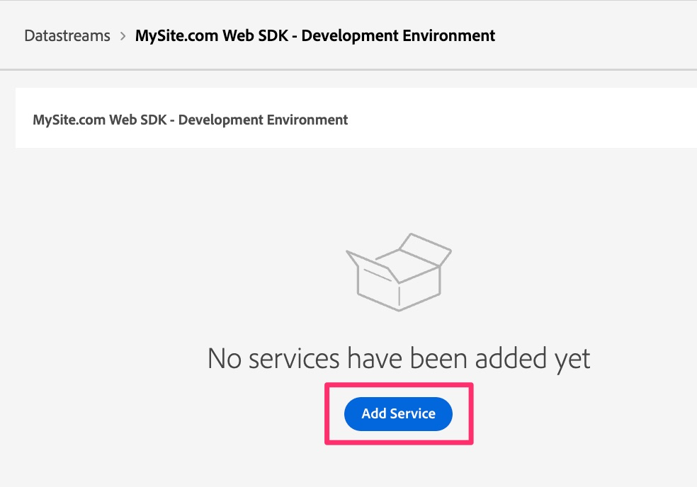

# Create and configure a datastream

Learn how to create and configure a new datastream so that your website data can be routed to Adobe Analytics.

In this lesson you will learn how to create and configure the system so that your data flows from your website to the Adobe Edge, and then gets routed from there to Adobe Analytics. 

## Create a new development datastream

1. Open the Adobe Data Collection interface 
    1. Navigate in your browser to https://experience.adobe.com
    1. Make sure that your correct Organization is selected at the top of the page (E.g. Adobe Production - Tech Marketing Demos in the image below)
    1. Click on the "nine dots," AKA the application switcher, and select **Data Collection**

        

1. Go to **[!UICONTROL Datastreams]** in the left navigation
1. Select **[!UICONTROL New Datastream]**
1. Enter the desired **[!UICONTROL Name]**, and include an indicator that this will be used for the Web SDK development environment. For example, you might name this after your site, as is shown below. Make a note of it, as this name is referenced later when you configure the Web SDK extension in your tag property. Enter a description if desired.

   >[!NOTE]
   >
   >You only need to select a schema if using the [Data Prep for Data Collection](https://experienceleague.adobe.com/en/docs/platform-learn/data-collection/edge-network/data-prep) feature, which we will not do in this tutorial. Please visit the link to learn more.

1. Select **[!UICONTROL Save]**

   

1. Once the datastream is saved, a new screen will come up, letting you know that you don't have any services configured yet. In other words, your data will get to Edge servers, but will not be sent to any applications until we add a service. We will now configure the datastream to send the data to Adobe Analytics. Click **[!UICONTROL Add Service]**.
    
1. In the service drop-down menu, select **[!UICONTROL Adobe Analytics]**.
1. In the report suite ID field, enter the ID (not the title, but rather the report suite ID) of the validation report suite that you created in the [Create a validation report suite](create-a-validation-report-suite.md) activity. Click **[!UICONTROL Save]**.

## Staging and production datastreams

You will now want to **go through the same steps again** two more times: once for your staging environment and once for your production environment. Following are a couple of notes as you set up these additional two datastreams.

### The staging datastream

* When naming the datastream (and when adding the description), you can/should have the same name with the difference of adding "staging" instead of "development."
* Add the Adobe Analytics service, as you did before, and set the report suite to the same development report suite.
* If you'd like a cleaner environment for looking at staging numbers in your Adobe Analytics reports, you can create a new report suite just for staging, and then make sure that you are pointing to that report suite in this datastream's Analytics service.

### The production datastream

* When naming the datastream (and when adding the description), you can/should have the same name with the difference of adding "production" instead of "development."
* When choosing the report suite to map the data to, instead of choosing the development report suite or even a new report suite, you can map this datastream to your **current** production report suite being fed by the AppMeasurement implementation. That way, after you have completed the migration and have tested it and are happy with the numbers, you can remove the old AppMeasurement code, send the Tags libraries through to production, and you will be feeding the new production data into the same production report suite, so that you will have continuity between old and new implementations.
