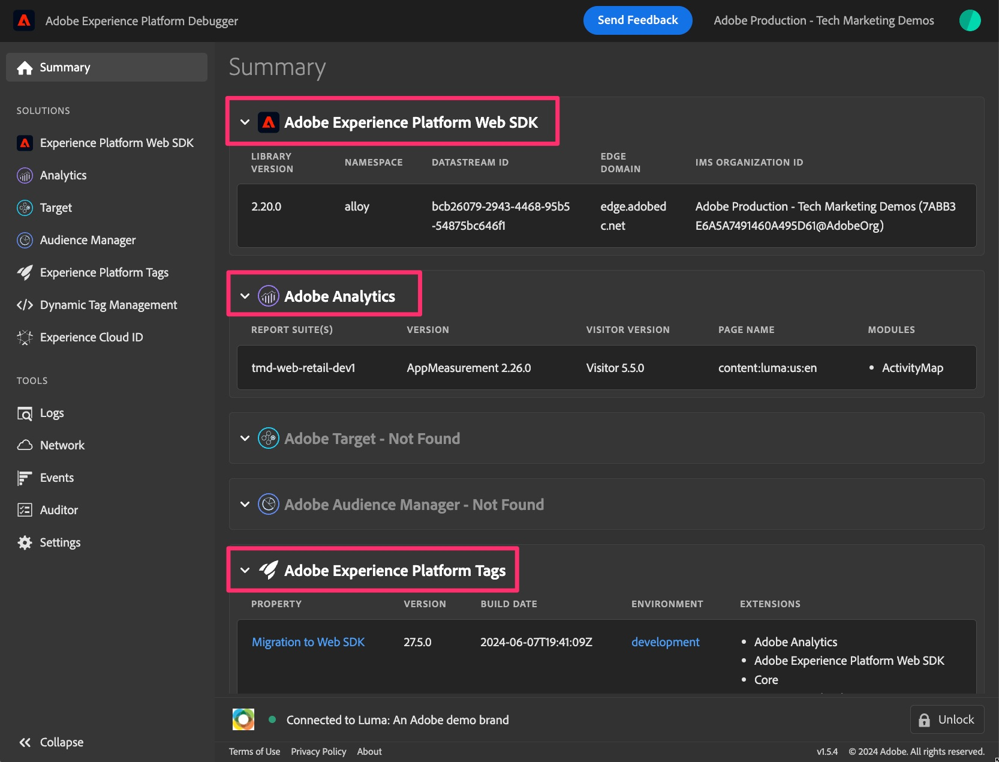
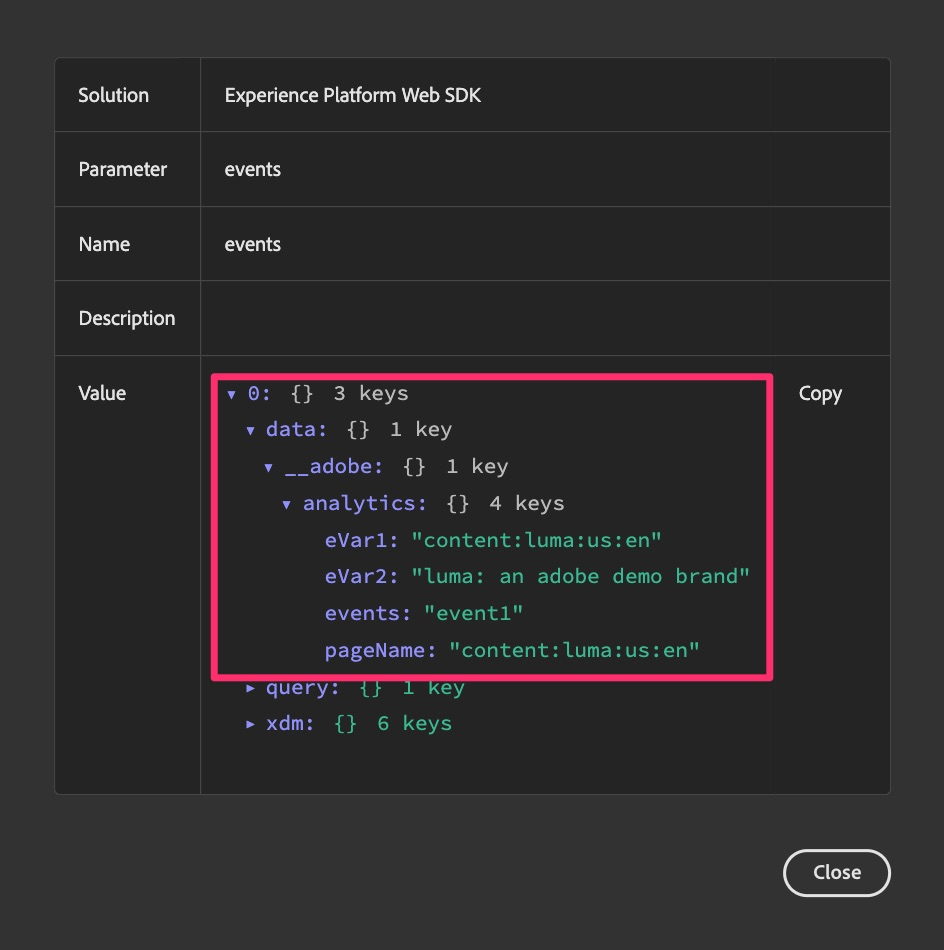

# Debug and validate your Web SDK migration

In this exercise, you will learn how to debug and validate your data as you migrate to the Web SDK. We want to encourage two different validation activities that can help you make sure that everything is flowing correctly:

1. **Validation activity #1** is running the Adobe Experience Platform Debugger, which is a browser extension, and allows you to check along the way that your data is being sent into Analytics correctly. It is recommended that you do this activity often, as you make changes to your tags property and publish the changes to a development library.
1. **Validation activity #2** is going into Adobe Analytics, setting up one or more projects to receive data from the Web SDK (via your newly created migration report suite), and verifying that your data is actually coming into the reports correctly as you click around your site, etc.

## The Adobe Experience Platform Debugger

This debugger is a browser extension and is available on the Chrome store. There is a [video tutorial](https://experienceleague.adobe.com/en/docs/platform-learn/data-collection/debugger/overview) that explains how to download and use the debugger, and it is recommended that you first go through that in order to know the basic usage.

Once you have the debugger up and running, you can use it to make sure that the data is flowing from your site and through the Edge Network correctly. This tutorial will stay with pretty basic use, but please do use the debugger to its full capacity to check your data.

**Assumption (always dangerous, but hopefully fine in this case):** Since we are migrating the  tags property over to the Web SDK in this example, we don't need to put a new embed code on the site. It will have already been there. However, if you decide you want to do more of a "lift and shift" approach onto a completely new tags property, you will have new embed codes to put on your development, staging, and production environments. So in this tutorial's case, as long as we have the Web SDK extension installed and configured with rules sending data in, we will get the data showing up in the debugger. 

### View Web SDK data in the debugger

Now that you have migrated your default page rule (or if you have migrated any rules) and published it to a library in the development environment, you should be able to run your site and see the data flowing into the debugger.

Steps for viewing your data:

1. Open the development environment of your site in the browser
1. Open the debugger by clicking on the browser extension from the extensions tray at the top of your browser window

    

    >[!TIP]
    >
    >In the bottom right corner of the debugger is a "Lock" icon and label, and to the left of it, you can see which page you are debugging. When on your site, click the lock icon, which will lock the debugger to your site's window. Otherwise, if you were to click into a different browser tab/window, the debugger would respond to that site. During the debuggin of your site, it's just easier to make sure that the debugger is always give you information for your site.

1. Make sure you are on the **Summary** page of the debugger ("Home" icon on the top left). **Refresh your site** in its browser window. If the debugger is picking up the embed code on your site, and if you did not delete the Analytics code (as per this tutorial), you will see indications that there was code for both the Adobe Experience Platform Web SDK and Adobe Analytics, as well as Adobe Experience Platform Tags. Others will be grayed out.

    

1. To see the data added via the Web SDK, Click the **Experience Platform Web SDK** link in the left rail
1. Click **Clear events** just to get rid of any hits that have happened 
1. Refresh your site again, and come back to the debugger
1. Then click on the data field next to **events** in the table

    

1. In the Value field, expand down through 0, data, __adobe, and analytics
1. You should see the variables that you set in the rule(s) that are firing on that page, including the default page load rule and any special rules as well.

    

1. Perform these steps anytime you have changed something in your tags property and have published the changes to development, so that you can see the effect of the changes you have made to your Analytics implementation.

## Validate data in Analysis Workspace

The main gist of this recommendation is to take your current analytics data coming in from your Tags implementation using the Adobe Analytics extension, and compare it to the same reports that are will now be filled by the Web SDK. 
There are possibly multiple ways to set up these comparisons, but I'm going to give you two examples of how to do this.

### Option 1: Compare the data using two panels in a single project

1. Create a new project in Analysis Workspace and add two panels
1. Set the report suite in panel 1 to your current Adobe Analytics production report suite
1. Set the report suite in panel 2 to your new Web SDK development report suite
1. Put the same report into both panels, using a time period that includes full days only where data was sent to both report suites
1. Compare the data

This could look something like this (understanding that there is no data in these empty demo report suites):

As you can see, the report is the same in both panels, and the calendar is the same as well. The difference is the report suite, as stated in the steps above. 
**Advantage of this option:** You can go one by one with reports/dimensions and test exactly what you want to test, as you make changes in the implementation.

### Option 2: Compare the data using two projects

1. Open an existing project that uses your current Adobe Analytics extension data
1. Do a "Save as" to make a copy of that project, naming it to something like "Web SDK migration validation project"
1. Change the report suite for the copied project so that it is pointing at your Web SDK development report suite
1. Open each project in a different window, and size them so that you can see them next to each  other on your monitor
1. Compare the data

This will look very much like the image above, except each panel is in its own project and in a different window.
**Advantage of this option:** In this case you don't have to add and configure all of your reports over again, but you get to see how your current reports will look using the new Web SDK extension with minimal setup.

It's possible that you want to do both, which is also another great option.

>[!IMPORTANT]
>
>Now that you have completed validating your default page load rule, you can move on in the tutorial. However, we implore you to test/validate often, probably at least every time that you change a rule or make other significant changes. Remember that if you find an issue as you move along, you will be happier if you only have to check ONE thing instead of testing several changes that you have made since the last validation. 

Happy validating!
