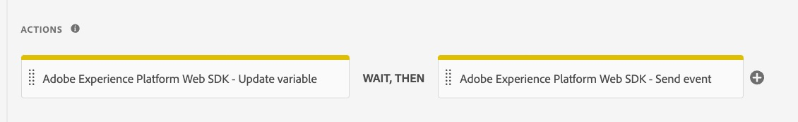
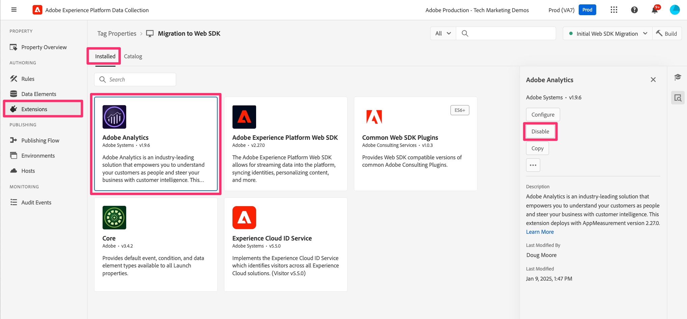

---

title: Delete the Adobe Analytics extension items
description: When debugging and validation is complete, remove all references to the Adobe Analytics extension items and remove the extension itself.
solution: Data Collection, Analytics
feature: Web SDK
jira: KT-16766

---

# Delete the Adobe Analytics extension items

When debugging and validation is complete, remove all references to the Adobe Analytics extension items and remove the extension itself.

## Overview

Once you are satisfied that everything in your property has been migrated over to the Web SDK, and you have completed debugging and validation (in your development environment), you are ready to remove the references to the Adobe Analytics extension. How fast you remove these items, and how many times you test while you are doing it is up to you. If you would like to be more on the careful side, remove references slowly and test in between each removal. If you are confident that everything is working correctly and migrated correctly, you can "rip off the band-aid" and remove all items. We would still recommend testing at the end of the exercise, of course.

## Remove old actions from rules

Again, we're going to assume that you have already tested everything and that it is working correctly. At this point you can go into your rules one by one and remove the actions that belong to the Adobe Analytics extension.

1. Open up one of your rules, E.g. your default page load rule.
1. Having been through the migration for this rule, you probably have 4 (or more) actions.

    

1. You can see that the first two have the "Adobe Analytics" identifier on them. These are the actions that we will want to delete.
1. Mouse over the first one, like the "Adobe Analytics - Set Variables" action, and an X will appear allowing deletion. Click the X and see the action disappear. Remove any and all Adobe Analytics actions in the rule, in this case the Set Variable action and the Send Beacon action.
1. This will leave only the Web SDK actions

    

1. Save to library
1. Build the library and test your site, to make sure that there are no new errors and that everything is working properly
1. Repeat this action for your other rules, building to your development library and testing between each removal (or as often as you are comfortable). You can just test in the debugger, or also check the reports in the migration report suite, again depending on your comfort level.

## Remove extensions

Now that you have removed the references to your Adobe Analytics extension, you can remove (or disable) the extension, as well as any other extensions that use it or are dependent on it. I personally like a careful approach, and so "disable" is my choice instead of uninstalling, at least initially.

1. Select **Extensions** from the left rail in the UI.
1. Make sure that the **Installed** tab is selected.
1. Select the Adobe Analytics extension.
1. On the right rail, choose to disable the extension (or click on the three dots and uninstall if you prefer).

    

1. Do the same for the Experience Cloud ID Service extension, as you will no longer need that. The Web SDK extension handles the ID, and so you not need the additional extension.
1. Do the same for any other extensions that are associated with the Adobe Analytics extension, but only after you have made the necessary migration changes. 
1. Build the changes to your development environment.

