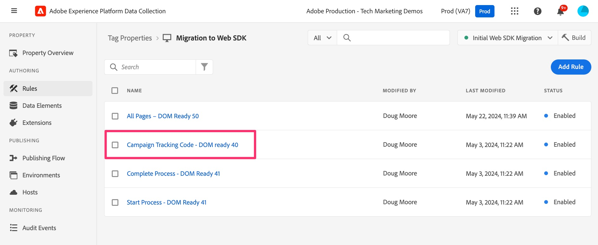
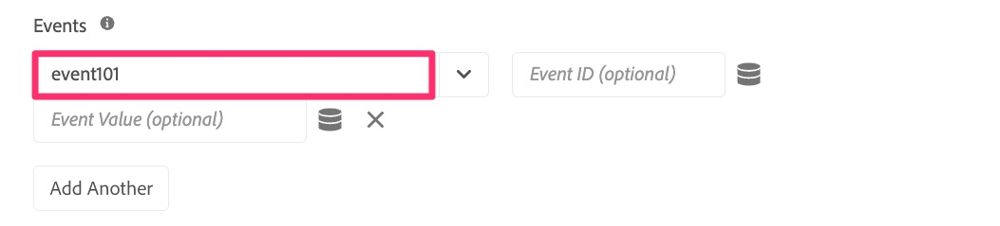
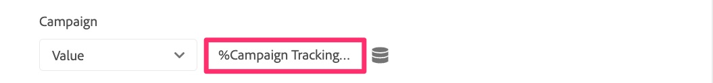
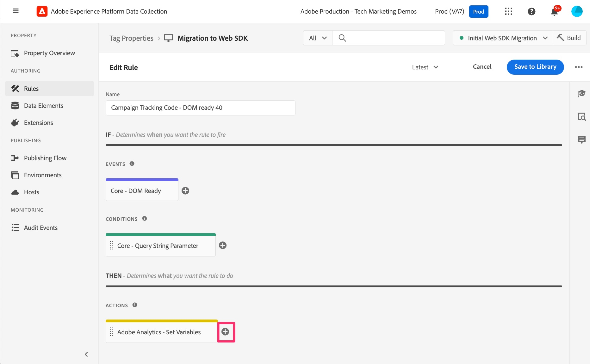
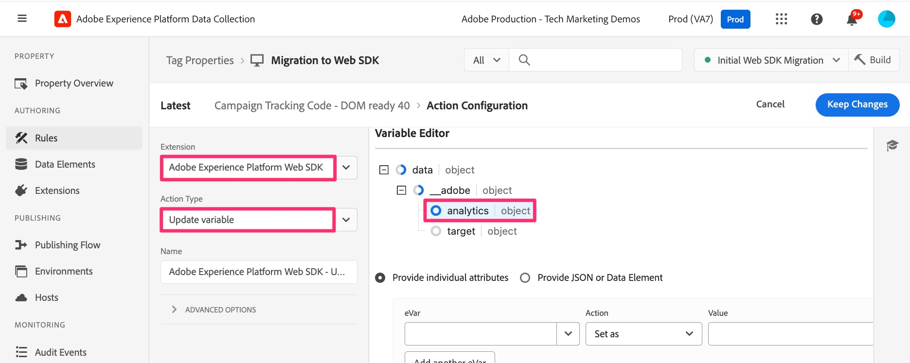
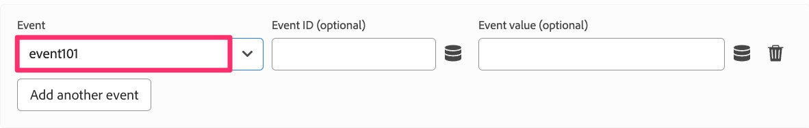
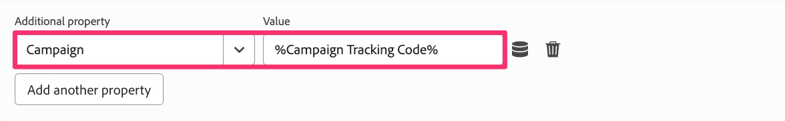

# Migrate additional page rules

In this exercise you will learn how to migrate additional page-based rules to the Web SDK extension. You will find this similar to the exercise that you already did when migrating your default page load rule to Web SDK. The methods still apply. The biggest difference is that with these rules, you will not be adding a Send Event action, because in most cases, your rule does not contain an Analytics extension's Send Beacon action.

## Overview

Let's back up a little, and talk about Analytics implementations as they are with the Adobe Analytics tags extension (also known as an "AppMeasurement" implementation, since that is the name of the JavaScript file).

I won't assume to know exactly how you are implemented, but in many implementations using Experience Platform tags (formerly known as "Launch"), there are any number of rules that only fire conditionally, based upon something on the page or in the URL. Examples of this may include:

* Search results rule, only firing when an internal search has performed and the search results page comes up
* Campaign landing page rule, only firing when there is a tracking code in the URL
* Page type rule, only firing for a page that is a certain type of page, E.g. product details page, shopping cart page, etc.
* Any other page that fires conditionally

The key point here is that all of these use cases only fire **sometimes** on a page, and we would **also** expect the default page rule to fire. Therefore, we don't want to include a Send Beacon (AA extension) or a Send Event (Web SDK extension) with any of these rules, or else it would result in two hits going in for the same page load.

Therefore, these rules build up the object, but they don't send the data in. We just make sure that these rules fire **before** the default page load rule, so that after they build up the object, the Send Beacon/Send Event action on the default page load rule sends everything in. Now, it is likely that you know all of this, and that that is how your site is set up. But if you are new to your own implementation, or if you need to "fix" your implementation to resemble this method, this exercise is especially helpful for you.

## Example migration of conditional rule

Here is an example of migrating a rule that fires conditionally. I will use the example above of a campaign landing page. As I said above, this follows the same pattern that we have already worked with in our default page rule, except that it is even easier because we are only setting variables and not firing any hits.

1. Locate the conditional rule. In this example, we find the campaign tracking code rule and select it.

    

1. When the rule opens, we can see that there is a condition on this rule firing based on a query string parameter. We don't need to change anything about the condition, because we only want to update/migrate the action, not the event or the condition.
1. Click into the **Adobe Analytics - Set Variable** action
1. Make a note of anything being set in the action. In this example, we notice that **event101** is set, as well as the **Campaign** variable.

    
    

1. We only clicked in here to make the note, and we don't need to change anything, so now we can simply click **cancel**.
1. Create a new action by clicking on the **plus icon** in the actions section

    

1. Configure the new rule
    1. Select **Adobe Experience Platform Web SDK** from the Extension drop-down.  
    1. Select **Update Variable** from the Action Type drop-down.
    1. In the right-hand panel, select the **Analytics** object within the data object

        

1. Now set event101 and the campaign variable to the same values that they were set in the existing action.

    
    

1. Now you can **Keep changes** and **Save to Library**, and your rule has been migrated to Web SDK.

>[!IMPORTANT]
>
>Like the default page load rule, we left the Analytics extension's **Set Variable** action in the rule so that we can compare data as we validate our migration. Don't forget to come back in later and remove the Analytics extension's action as you do the final cleanup.
