# Migrate custom code to the Web SDK

In this exercise, you will learn how to migrate custom code from the Adobe Analytics extension to the Adobe Experience Platform Web SDK extension in Experience Platform Tags.

## The big disclaimer

I'm sure you won't be surprised that I'm going to add something like this to a document that starts telling you the best/easiest/most effective way to work with code. There are clearly many different ways that code can be written, edited, and handled. In this exercise I'm going to provide you with a way to easily take code that you have in an existing rule and copy it, add a change, and have it work for the migrated rule. If you think of a better way to do it, that's fantastic, and I not only welcome you to use it, but to share it with us and with your peers in the Experience League community (especially in the community post regarding this tutorial). Same goes for the bottom half of the page, working with implementation plug-ins. I'll suggest a way here, and then you do what feels good to you. OK, let's get into the details.

>[!IMPORTANT]
>
>In the spirit of the last paragraph, it is also important to recommend that you take this opportunity during your migration to Web SDK to take a good look at your code and see if any of it should be updated or even deleted. In the paragraphs and steps below you will see how to migrate your code, and even if it is easier to just move all of it over in one fell swoop, I would be remiss not to recommend doing a spring cleaning, so to speak. 

## Migration of what code?

The code that we will first address in this section is the code that you may have in the "Custom Code" window in any Adobe Analytics actions, including the **Set Variable** actions. In other words, open one of your rules, and look down in the actions section. If you have an "Adobe Analytics - Set Variables" action, click to open it. 

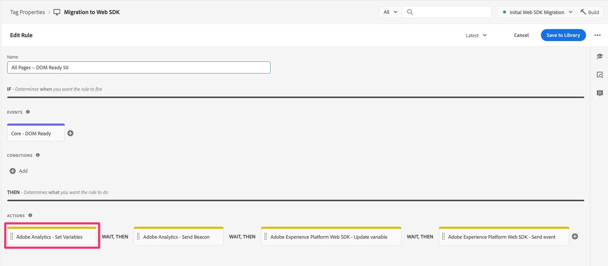

Then scroll down on the right side to the bottom, and you will see the "Open Editor" button for the Custom Code window. Click to open.

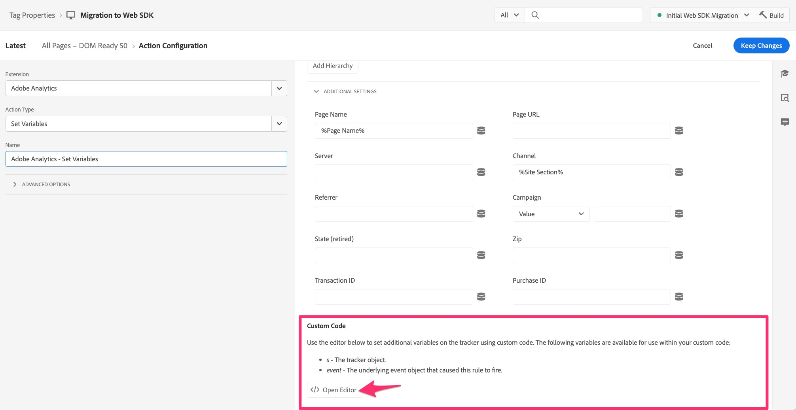

If you have code in there, it will need to be migrated so that it can be executed and sent into Adobe Analytics using the Web SDK.
The main idea here is that we are going to convert the "s" object to "content.__adobe.analytics".

We will simply need to add some additional code before the first call to the s object, so that it can be understood and handled by the Web SDK. The place we add the newly altered code is in the Custom Code window of the "Adobe Experience Platform Web SDK - Update variable" action.

So, for example, let's say that you have the following code block in the custom code window:

```javascript
const products = window.digitalData.products;
const productIndex = event.element.dataset.productIndex;
const product = products[productIndex];
s.products = [
product.cat3Tag,
product.id,
1,
product.price
].join(";");
```

The code that you need to include is as follows:

```javascript
content.__adobe = content.__adobe || {};
content.__adobe.analytics = content.__adobe.analytics || {};
const s = content.__adobe.analytics;
```

Therefore, follow these steps to migrate the custom code:

1. Copy your custom code out of the window in the Adobe Analytics Set Variables action
1. Close that code window, and close (cancel out of) the action.
1. Open the Web SDK - Update variable action by clicking on it (or if you don't have one yet, add one).

    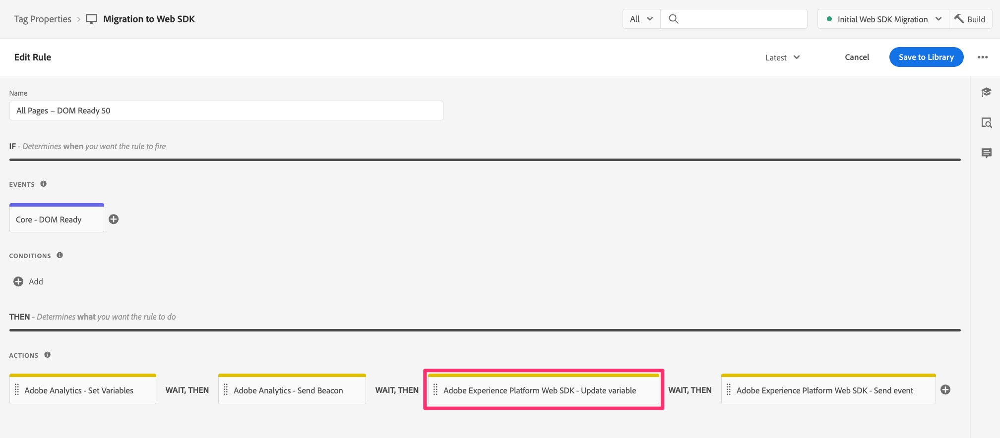

1. Select the analytics object at the top of the right-side window

    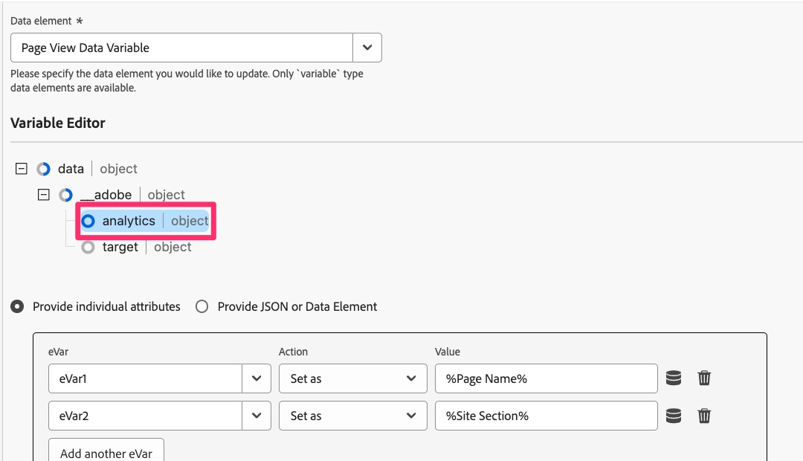

1. Scroll down to the bottom and open the Custom Code window

    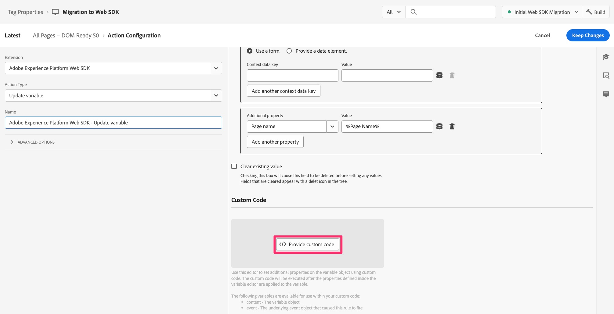

1. Paste in the code that you brought over from the Analytics custom code window
1. Now place the new lines of code into the middle of the existing code, so that it is above the first mention of the s object, as in the following example:

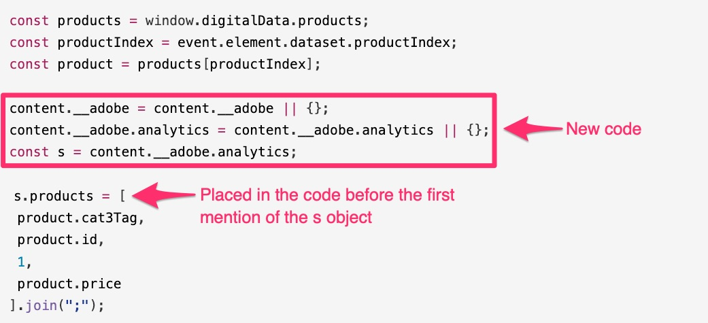

You can now save the code in the Custom Code window, and keep the changes in the Update Variables action. You'll also want to save the rule and publish the new changes in the working library.

## What about Plug-ins?

If you have an "appMeasurement" implementation of Adobe Analytics, using the Analytics extension in Experience Platform Tags (formerly  known as "Launch"), then it is likely that you are using one or more JavaScript "plug-ins" to set variables or to do other tasks. If these JavaScript functions and calls are in a code window inside of a rule, then the information above on this page should help you migrate the code over to Web SDK.
However, it is also more likely that your plug-in code is in the code window in the configuration of the Adobe Analytics extension itself. To check if you have plug-ins and other code to migrate, open the Analytics extension by going into Data Collection and Tags, open your property, and then click **Extensions** in the left navigation.

1. Select the **Installed** tab toward the top of the page, and then select your Adobe Analytics extension.
1. Then on the right side of the page, click **Configure**

    

1. Expand the  **Configure Tracker Using Custom Code** section
1. Click to **Open Editor**

    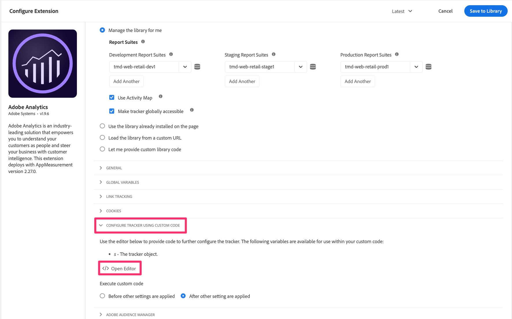

At this point, you will be able to see the code that you have in there, and you may have JavaScript "plug-ins," I.e. code snippets that help you get some data you want and assign it to custom dimensions, etc.

Not everything in this code window may be considered plug-ins in it's truest Adobe Analytics sense. This will be important to understand as you decide how to migrate your code. 

### Recommendation for migrating code from the extension's main code window

Well, again, not everything in the code window might be an official Adobe Consulting-created plug-in. Some of it might be code that you wrote, whether or not you call that a plug-in. We recommend two changes. They are to use a new extension, and also to copy and paste the rest of your code into a new place.

**First**, there is an extension available in Tags called **Common Web SDK Plugins**. This extension is a subset of the total list of implementation plug-ins that are listed in the Adobe Analytics documentation. By installing this extension into your Tags property, you are installing the code for the included plug-ins. Then, to use these plug-ins, you find them when creating new **data elements**. More on that in a moment.

**Second**, there is a code window in the configuration of the Web SDK extension where you can put all (or some) of your code, IF you want that code to run right before the events get sent into Adobe Analytics. Steps to finding that code window are:

1. Assuming that you have already added the Web SDK extension to your property, navigate to **Extensions** and select the **Installed** tab
1. Select the **Adobe Experience Platform Web SDK extension**, and open it by clicking **Configure** on the right rail.

    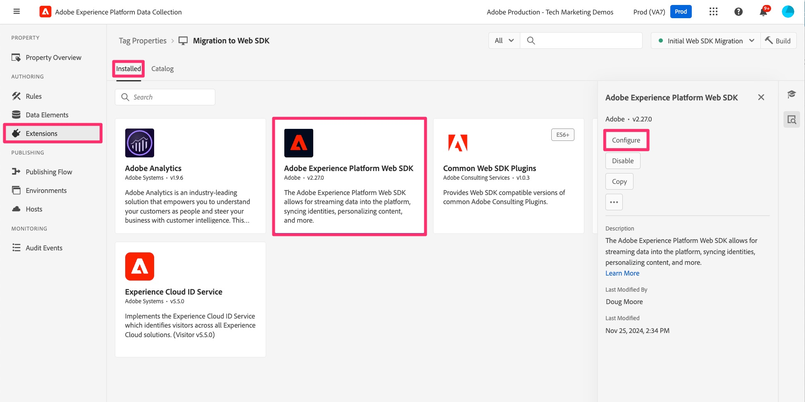

1. Scroll down to the **Data Collection** section and click to open the code window for **onBeforeEventSend**.

    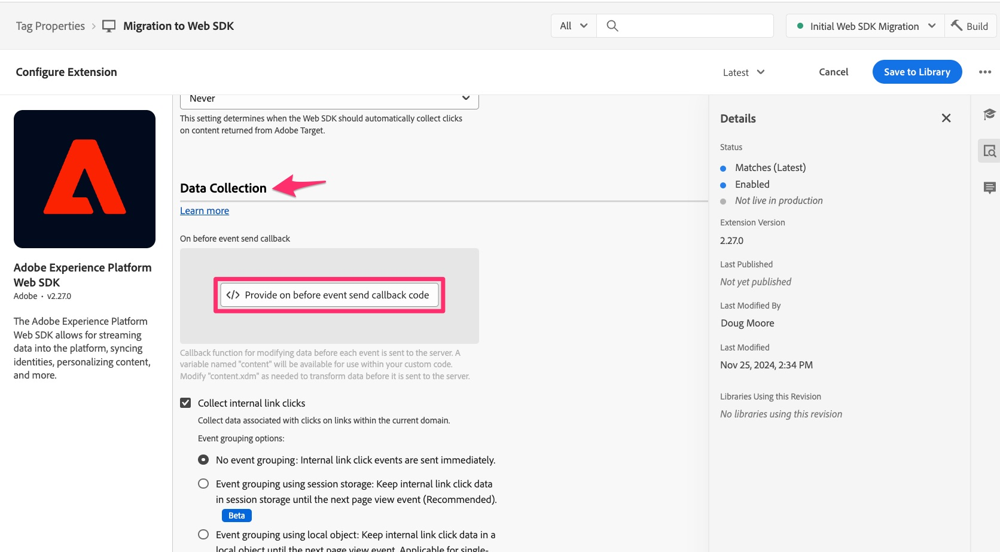

This is where you will paste any code that you want to run right before the event gets sent into Analytics from the Web SDK. That is basically what the doPlugins function was doing in your old Analytics implementation. 

The **good news** is that this should run **anytime** you do a send event, so whether that happens on page load or with a custom link, this code should run, set your variables, etc.

#### Do I need to change my code?

Well, yes and no. Yes, you do need to change a couple of small things, but no, you won't need to change the bulk of your code as long as you do change these small things:

_**Code change 1:**_
After (or before, your choice) you paste your "plug-in" code into the code window in the Web SDK extension, **remove** the "doPlugin" lines from your code. You won't need them, and they will cause an error since they are part of appMeasurement.js but not the Web SDK code.

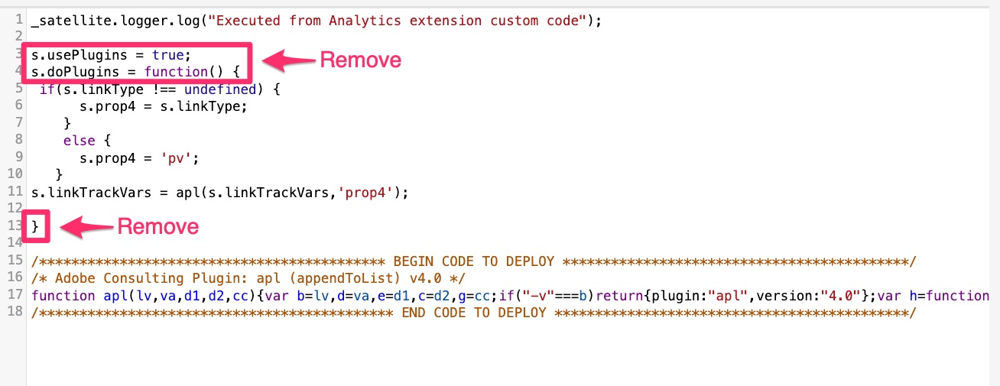

_**Code change 2:**_
The other change that you will need to do is to add some code so that the "s" object is defined, very similar to what is discussed above regarding the code in rule actions. In this case, we will need to define the code just a little bit differently, adding a "data" node that is already defined in the rule action, but not here.
This definition should be placed at the top of the code window. The code that needs to be copied in (when placing the code into the Web SDK extension) is as follows:

```javascript

content.data.__adobe = content.data.__adobe || {};
content.data.__adobe.analytics = content.data.__adobe.analytics || {};
const s = content.data.__adobe.analytics;

```

_**With both code changes:**_
Here is the code listed above, but with both changes we just discussed:

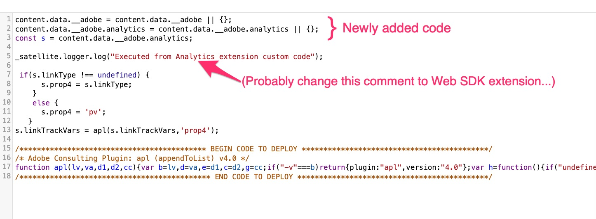

### Steps for migrating main extension code to Web SDK

As stated above, the recommendation is twofold: to use the new Common Web SDK Plugins extension and also to copy and paste your code from the Analytics extension configuration into the Web SDK extension configuration. With this in mind, along with the important note at the top of the page to clean up your code, Here are the recommended steps at a high level:

1. Copy all of your code from the Analytics extension's configuration code window and paste it into the onBeforeEventSend window in the Web SDK extension's configuration (although we might be copying over code that needs to be removed or updated, we will make a few passes at the code in the new window).
1. Go through your code now in the Web SDK extension and look for calls to plug-ins or function definition for plug-ins that are defined in the **Common Web SDK Plugins** extension. You can find the list of plug-ins in the Web SDK data element definition window after installing the plugins extension. You can also find it in the [documentation for that extension](https://exchange.adobe.com/apps/ec/108520).
1. For each of the plug-ins that you find in the new Web SDK plugins extension, remove the extension and the call to it from your code, and make sure that you then compensate for that removal by creating a data element and then calling that data element in the appropriate rule to set variables, etc.
1. Next take a pass through the code to see if there are any calls to functions that were defined IN the appMeasurement.js file. **Code Change 1** above is an example of this, and you can make this removal of doPlugins code at this time, if you haven't already. For other instances, this will be most evident when you have a call to a function that is not defined anywhere in your code. You can also check with Adobe Customer Support or with your peers in the Experience League Community to make sure that this is the case with that code.
1. Next take a pass through your code to update or delete any old code that no longer applies to your analytics needs, as recommended at the top of this page.
1. Now do **Code Change 2** listed above, adding the extra lines so that any references to the s object will not cause errors in your code.
1. Last but certainly not least, test, test, and test some more. After that, test again. Make sure that your code is providing the results that you expect both in the Experience Platform debugger as well as in the reports in Adobe Analytics.

>[!NOTE]
>
>Two last thoughts about the steps above.
>First, you may be thinking that it would be easier to just leave all of the plug-in code in there instead of removing it and using the new Common Web SDK Plugins extension. This is true and fine, but by using the extension you gain the advantages of using a UI, defining a reusable data element, and also automatically receiving any code updates in the future. It's probably worth making the switch.
>
>Second, speaking of "making the switch," you may also decide now to update ALL of your custom code so that it doesn't reference the old "s" object at all, which is kind of an extension of step 5 above. This is, of course, totally acceptable and a great idea. This migration tutorial is just trying to make it a little easier to migrate your custom code, in case you have a ton of it and don't have the resources to update all of it right now. You decide.

We'll end this lesson the way we started it, with an acknowledgement that there are many ways to write code, and this document gives you some steps to follow if you want to do it this way. The main thing is that your code works and gets you the results that you are expecting, so feel free to do it your way, and did I mention that you should test?
