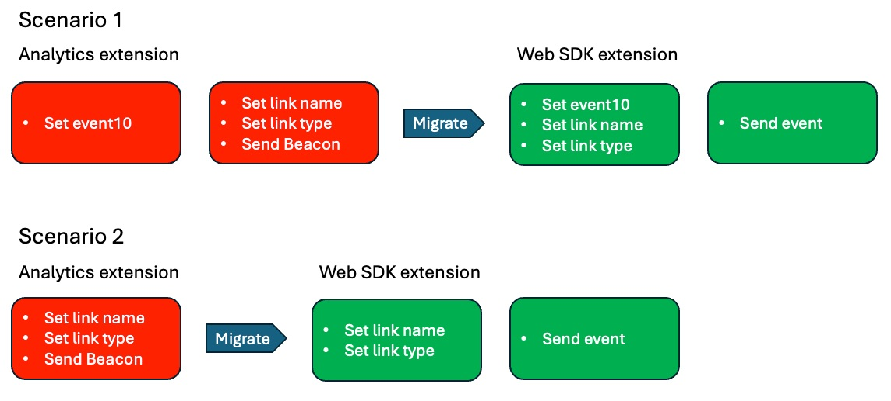
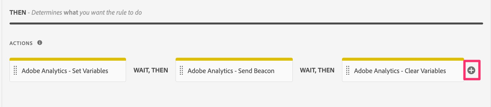
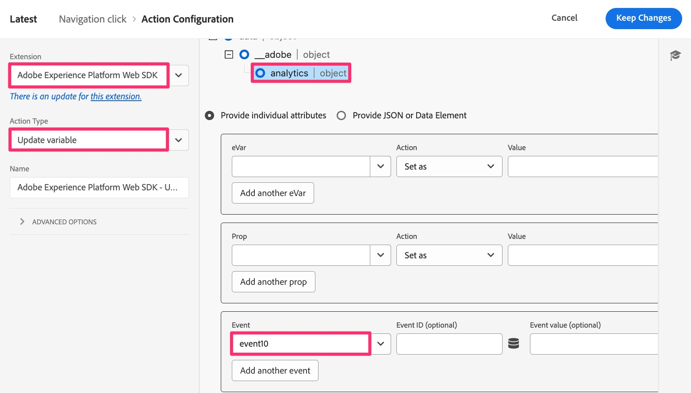
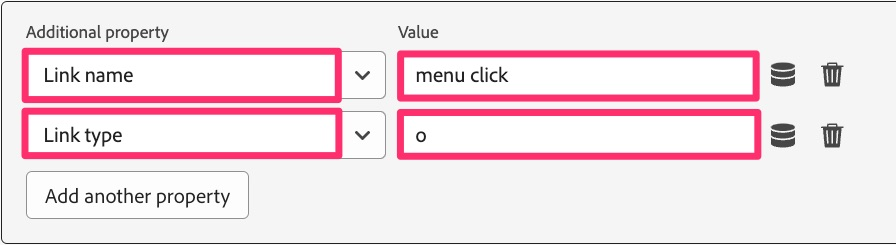
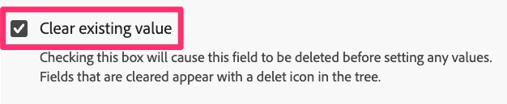
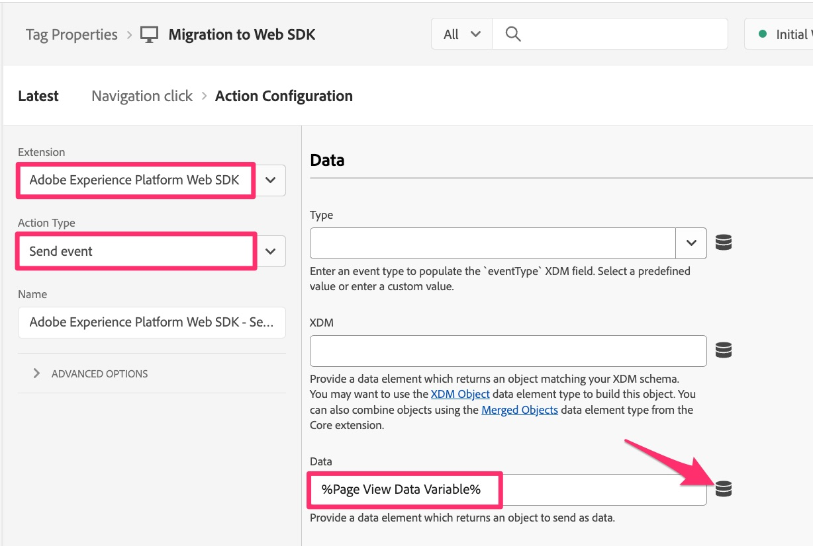

# Migrate custom link rules

In this exercise, you will learn how to migrate rules that send in custom link hits (as opposed to page views).

## Overview

When you are sending in a custom link hit using the Analytics extension, or AppMeasurement code, when you configure the **Send Beacon** action, you also choose if you are going to send a page view hit or a custom link hit, and if you choose a custom link hit, it will ask you for the **Link Name** and the **Link Type** for that hit. If you are not sending any other variable data besides the link name and type, you don't need to have an additional action that sets variables (props, eVars, and events).
For this reason, as you migrate rules that are custom link rules, you will have **one of the two** following scenarios in the rules:

1. The existing rule will contain an **Adobe Analytics - Set Variables** action that sets props, eVars, events, etc., and then contains an **Adobe Analytics - Send Beacon** action that sets the hit to a custom link hit (A.K.A. an s.tl() hit), sets the link name and type, and sends in the data.
    1. In  this case, it will likely also contain a final action that is called **Adobe Analytics - Clear Variables** as well, in order to "zero out" the value from the variables after the data has been sent to Adobe servers.
1. The existing rule will contain only the **Adobe Analytics - Send Beacon** action that sets the hit to a custom link hit, sets the link name and type, and sends in the data.

### An important change

The reason that this matters as you migrate your Adobe Analytics implementation over to the Web SDK is this:
The setting of the link name and type, which is required for the hit to be a custom link hit, is NOT in the "Send Beacon-equivalent" action (Send event). Rather, that setting of the link name and type are in the "Set Variables-equivalent" action (Update variable).
The result of this is that regardless of whether you have scenario 1 or scenario 2 above, you will need to end up with both an Update variable action and also a Send event action.

The following is a visual representation of this difference in implementations.

## Migration steps

Open your rule custom link rule and identify if it resembles scenario 1 or scenario 2 from above.
**If your rule resembles scenario 1:**

1. Open the Set Variables action and write down all of the variables (props, eVars, events, etc.) that are being set in that action (for example, in the image above, event10 is being set).
1. Open the Send Beacon action, verify that it is set to send an s.tl() hit. Write down the Link Type and Link Name values.
1. In the Actions section of your custom link rule, click the plus icon to add another rule.
    
    
    
1. Configure the action
    1. Set the **Extension** to Adobe Experience Platform Web SDK
    1. Set the **Action Type** to Update variable
    1. Select the **Analytics** object
    1. Set your props, eVars, and events from your Analytics Set Variables action (in this example, event10)
        
        

    1. In the same rule, scroll down to the **Additional property** drop-down field, and add the **Link name** field, setting it to the value you pulled from your Send Beacon rule. In the image below, the example is setting the name to the string value "menu click."
    1. Also add the **Link type** field from the same drop-down, adding "o" as the value (assuming your link type in the Send Beacon action was "Custom Link"). This will send in the link type "other," which equates to a custom link. If your link type was a download link, then choose "d" for the value in this new link type field, and if your link type was an exit link, choose "e" for the value in this new link type field.

        

1. Below the Additional properties, you will see a checkbox labeled **Clear existing value**. If your existing rule has an **Adobe Analytics - Clear Variables action** (as shown above in step 3), you need simply to check this box, and you will not need to add a clear variables action for the Web SDK.

    

1. Add another action by clicking the plus icon.
1. Configure your Send event action
    1. Set the **Extension** to Adobe Experience Platform Web SDK
    1. Set the **Action Type** to Sent event
    1. Click the data element icon and choose the **Page View Data Variable** data element 

    

1. **Keep changes**, **Save to Library** and you can **Build** the library from that same page, since we already set a working library.

## Drawing an important migration conclusion

* In this lesson, you learned how to migrate custom link rules.
* In the [Migrate your default page load rule](migrate-your-default-page-load-rule.md) exercise, you learned how to migrate rules that both set variables and also send in an Analytics beacon.
* In the [Migrate additional page rules](migrate-additional-page-rules.md) lesson, you learned how to migrate your rules that set variables but do not send a beacon into Adobe Analytics.

As you can imagine, the same methods can be used across many different rules to migrate your Analytics extension to the Web SDK.
In  most cases, you are simply **updating the actions** in the rules. You are not changing the event or the conditions upon which it is fired. You are only changing what is happening in the actions section when the rules fire.
Most, if not all, of your rules will fall into these categories. If you have a rule that does not, consider the same paradigm of migrating the action, and not what triggered the rule.
