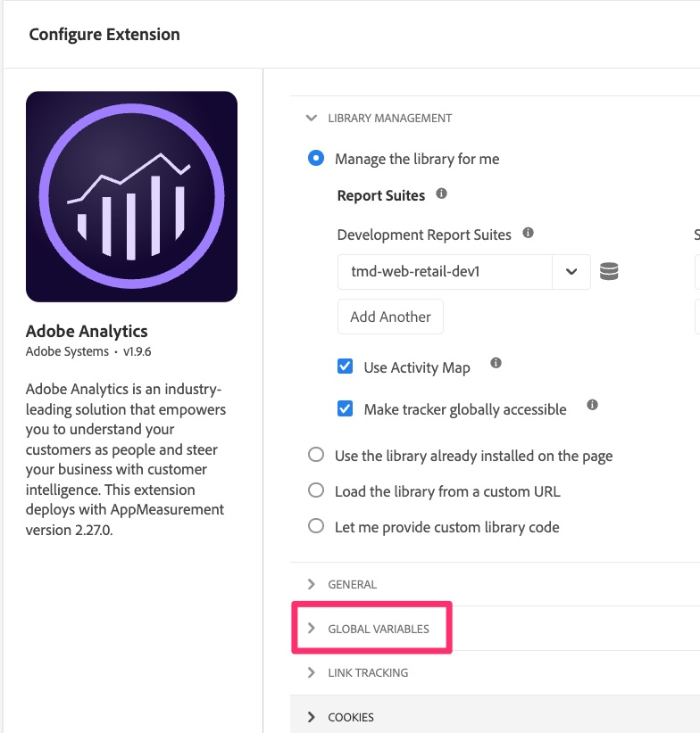
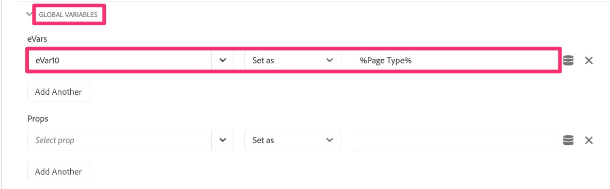
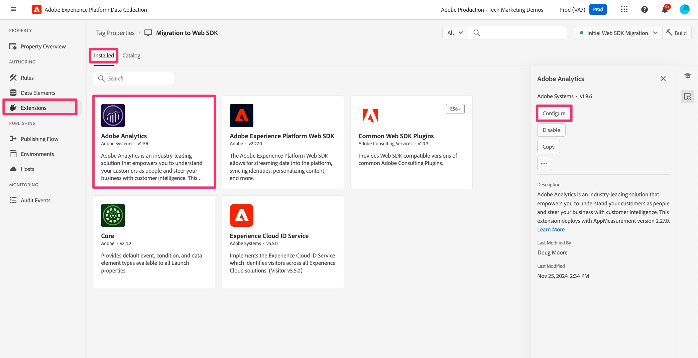
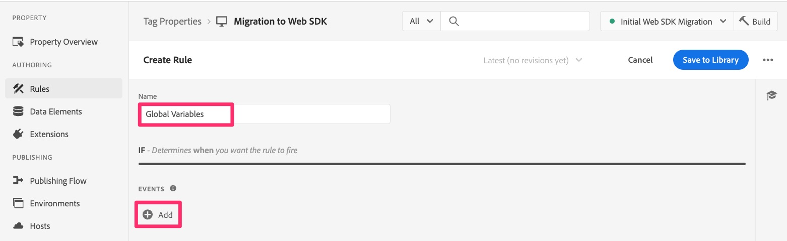
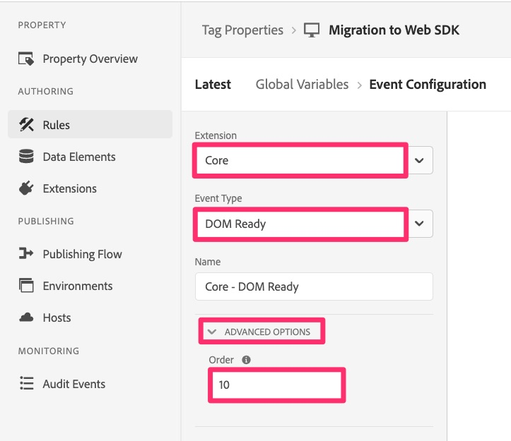
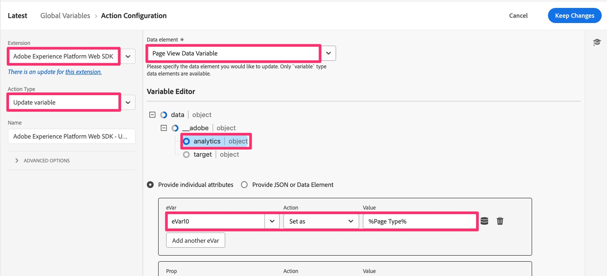

# Migrate global variables

In this exercise you will learn learn how to migrate global variables from the Analytics extension configuration to Web SDK.

## Overview

In the Adobe Analytics extension, there is a configuration section called "Global Variables." 

Global variables are variables that are set on the Analytics tracking object when that object is initialized on the page. Any variables you set here will be set when the tracking object is created on each page. 

If you have variables being set here, we need to migrate these to the Web SDK as well. 

## Where to add global variables in the Web SDK

The **bottom line** here is that there is not an equivalent area in the configuration of the Web SDK extension, so it won't be quite as easy as just copying over the variables like we did in the Default Page Load Rule exercise. 
Instead, the short answer is: **Create a new rule that runs before the other rules on every page, and set the variables in there.**

If you don't need steps defined for you, go do that and you are done with this lesson. If you would like help, continue...

### Steps for migrating Global Variables to Web SDK

1. Open the Adobe Analytics extension configuration

    

1. Scroll down to the Global Variables section (image above), open it, and make a note of any/all of the variables being set. You will need to know these variables and values in a later step.
1. Cancel back out of the Analytics extension.
1. Select **Rules** in the left navigation, and click **Add Rule**.
1. Name your new rule "Global Variables".
1. Click the Add button under Events.

    

1. Configure your event to trigger before your other rules. You will need to know the event type and the order that you have used in other rules. Example values:
    1. Set the **Extension** to Core
    1. **Event Type** could be DOM Ready, depending on your implementation
    1. Expand the **Advanced Options**
    1. Set the **Order** to a lower number than your other rules, so that it will execute first.
        
        >[!NOTE]
        >
        >The main thing here is that this rule fires before the default page load rule, so that any variables set in this rule can get sent into Analytics via the sendEvent rule. However, we are suggesting that this rule run **first** overall, because the variables set in the Global Variables section in the Analytics extension could be altered in other rules. We are mimicking that functionality. In the sample above, we are assuming that "10" is a lower order number than any of your other rules. If that is not correct, please change the number to a number lower than your other rules.
1. Select **Keep Changes** to save your work.
1. You do not need to add conditions to this rule, so you can leave that section of rule creation alone.
1. Click the plus icon under **Actions** section
1. Configure the new action
    1. Choose the Adobe Experience Platform Web SDK **Extension**
    1. For **Action Type**, choose Update Variable
    1. On the right, choose your variable **Data Element** (for this tutorial, it was called "Page View Data Element," but yours may vary)
    1. Select **Analytics** under the data object
    1. Populate the variables that you saved from the Global Variables section in the Analytics extension configuration (in this tutorial's example, setting eVar10 to the page type data element)
    
    

1. Keep changes
1. Save the rule to your working library and build

Your global variables are now migrated to Web SDK and will fire on any page load.
