# Migrate your default page load rule

In this exercise, you will learn how to migrate a default page load rule in Adobe Experience Cloud Tags from the Analytics extension to the Web SDK extension.

## Overview

Let's back up a little. It is likely that you have a rule in Tags (formerly known as "Launch") that is fired on every page - one that sets one or more default variables, and then fires a beacon, or a hit, to Adobe Analytics. This rule is currently using "actions" in the Adobe Analytics extension to do these things. As we migrate our implementation to Web SDK, we need to be able to remove any references (like the actions) to the Analytics extension, and replace them with actions that belong to Web SDK. In the steps below, we will assume the above; i.e. that you have a default page load rule which both sets variables and sends in a tracking beacon to Analytics.

## Migrate the Set Variables action

In this activity, we will create a Web SDK action that is the equivalent of the **Set Variables** action in the Adobe Analytics extension. 

1. While in the Data Collection UI and in your property, go into the **[!UICONTROL Rules]** screen by selecting it in the left navigation.
1. Select the rule that is your **Analytics default load rule**. If you don't know which rule is your default load rule, speak with someone who has a knowledge of the rules and what is in them. Again, we are looking for a rule that runs on every page, sets some default variables (e.g. page name), and then sends a beacon into Analytics. We will be making changes to this rule. Mine is called "All Pages - DOM Ready 50," but yours could be named anything.

    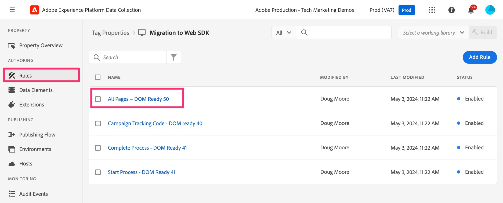

1. In order to migrate the current actions from the Analytics extension to the Web SDK extension, we need to know what variables are being set. Therefore, click into the **Adobe Analytics - Set Variables** action so that you can see which variables are being set (e.g. PageName, props, eVars, events, etc.).

    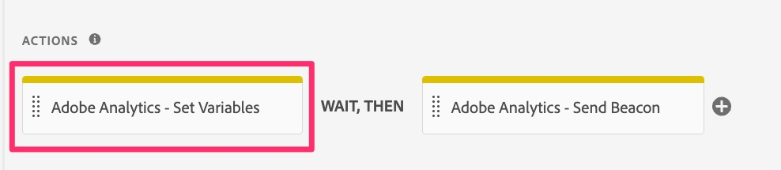
    1. Notice which variables are being set in that rule 
    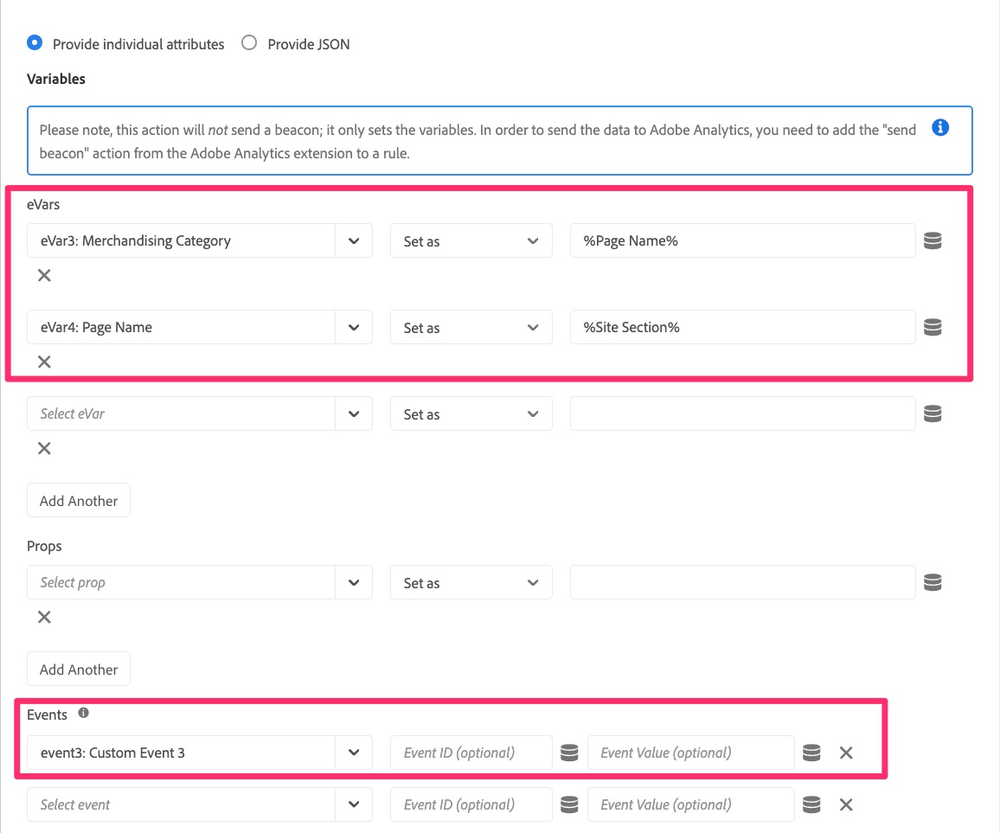

1. At the top of the page, change the radio button to **Provide JSON** and you will be presented with a code view of the variables that are set. This code view and the UI view are interchangeable, and when you set anything in one UI, it will be updated in the other UI as well. 

    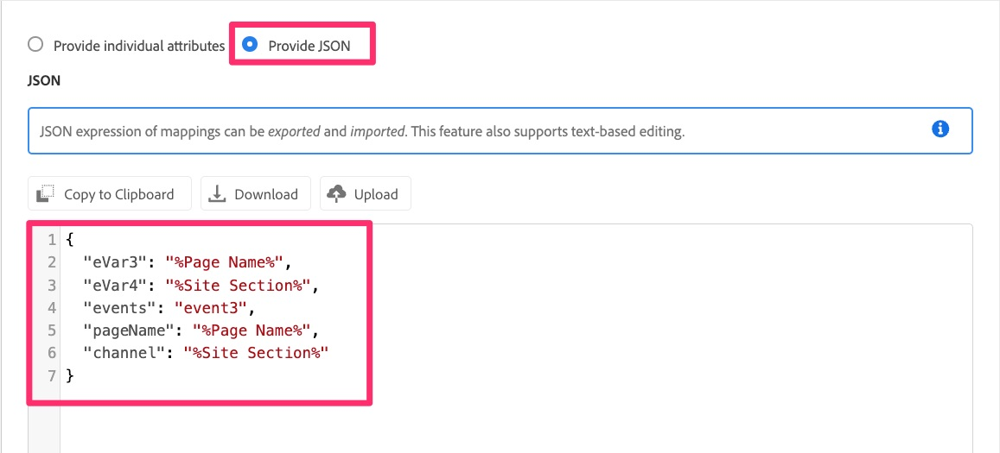

1. Copy this data to the clipboard or save it to a file to use right away, because in the next steps you are going to paste that code into a new Web SDK action.
1. Cancel out of the Analytics Set Variables action so that you are back on the rule.

    >[!IMPORTANT]
    >
    >You have choices in this step, including the following:
    >1. Instead of adding a new action, you can just alter the existing actions, which when saved would immediately cut any data over to the new Web SDK report suite and no longer show up in the current Analytics report suite.
    >1. You can create a new action to send the data into Analytics via the Web SDK, leaving the Analytics action in place for now. This will give you a chance to compare the data in the new Web SDK report suite to the current Analytics report suite. **This is the one that we will do in this tutorial.** Keep in mind that this method WILL result in double hits while you compare the data, also resulting in a cost for the extra server calls, until you remove the old Analytics extension's actions. Obviously you will not want to keep the Analytics extension's actions in there forever, but rather just long enough to validate that the data is flowing correctly into the new Web SDK extension's report suite.

1. Click the **plus button** to add a new Web SDK action.

    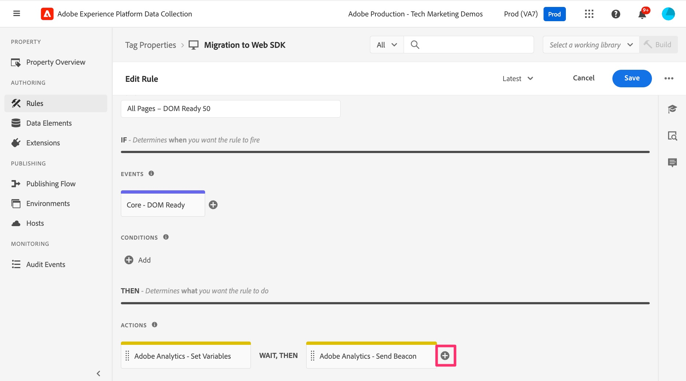

1. Select **Adobe Experience Platform Web SDK** from the Extension drop-down.  
1. Select **Update Variable** from the Action Type drop-down.
1. In the right-hand panel, select the **Analytics** object within the data object
1. Also make sure that the Data element listed at the top of the right panel is indeed your new variable-type data element.

    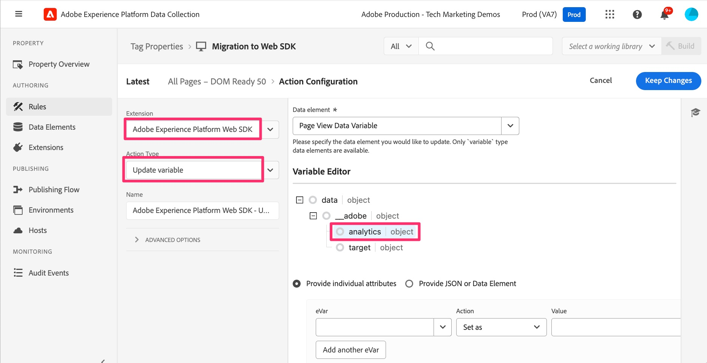

1. Now change the radio button to **Provide JSON or Data Element** and paste the code that you copied in the previous step from Set Variables into this code window. Remember that what we are showing here in the tutorial are only examples. You are copying and pasting your own variables.

    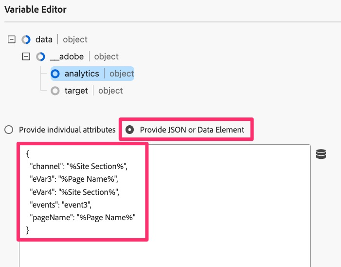
    This JSON copy tool was made especially for making migration easier, and I'm sure you can see how easy this is instead of having to make extensive notes from the old action and apply them into the new action. 

1. You can, at any time, switch the radio button back and forth to see the values in either the code version (shown above) or the UI version of seeing the attributes. Select the **Provide individual attributes** radio button to see the attributes populated.

    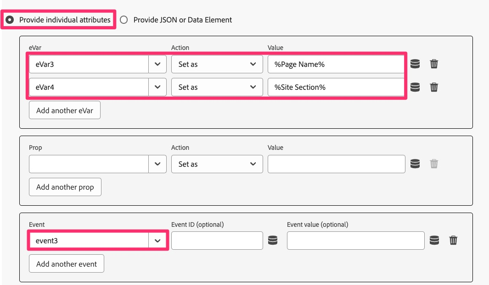
    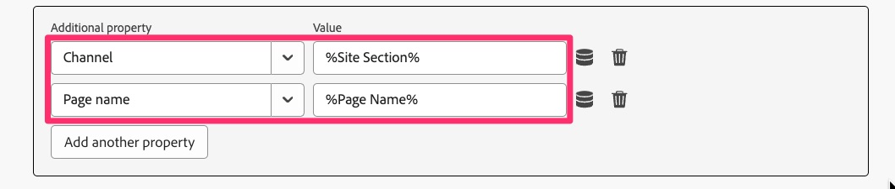

1. When you can see your variables set correctly, click **Keep Changes/Save.**

## Migrate the Send Beacon action

In this activity, we will create a Web SDK equivalent of the Analytics "Send Beacon" action, called **Send Event**. 

1. Go back into your default page rule that you were just in.
1. In the actions section, click the **plus button** to add another action. This will be our **Send Event** action.

    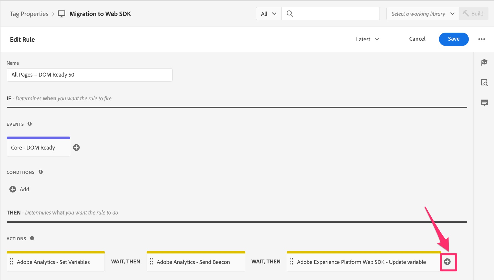

1. To configure the action, select **Adobe Experience Platform Web SDK** from the Extension drop-down.  
1. Select **Send Event** from the Action Type.  
1. In the right-hand panel, select the data element icon next to the **Data** Object. 

    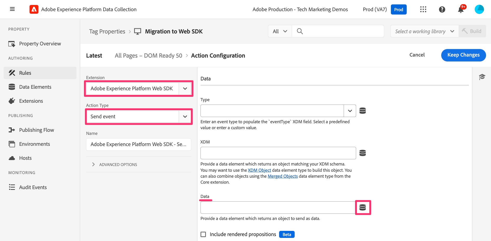

1. Select the Page View Data Variable (or whatever you called your new "data" type data element) and then click the **Select** button. 

    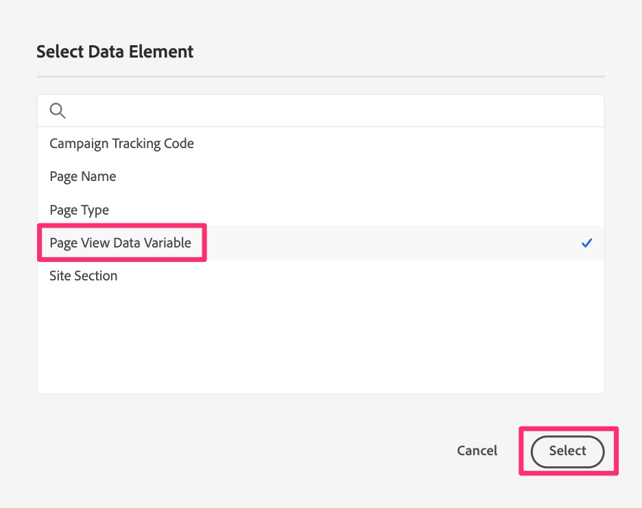

1. Click **Keep Changes/Save**.
1. You should now see all four actions (two old ones and two new ones) in your rule

    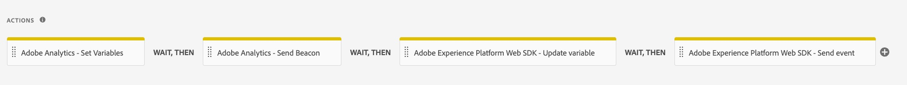

## Should I delete the Analytics extension's actions?

Great question. The answer lies in whether or not you want to validate your new actions before you get rid of the old ones. As I mentioned above, if you leave both the Analytics and Web SDK actions that send data in (Send Beacon and Send Event), like we have chosen to do in this tutorial, then you will have the same data going into two report suites (namely, the production report suite from the Analytics extension and your new validation report suite from the Web SDK extension). This results in doubling your server calls into Analytics, and there is a cost associated with it. However, this is how many customers are choosing to do it, so that they can validate the new data before shutting off the old data. We will have an exercise at the end of this tutorial that shows how to clean up the old stuff once you are happy with the validation, but if you want to do it now in order to save server calls, and not worry about validation, feel free to skip to the end of the tutorial, or else just delete the Analytics extension's actions out of the rules as you go along.
