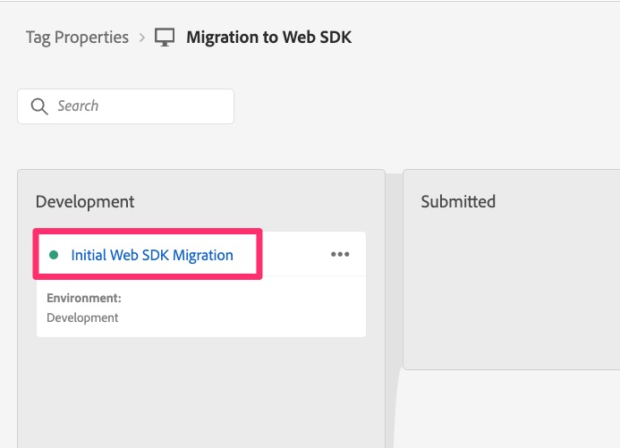
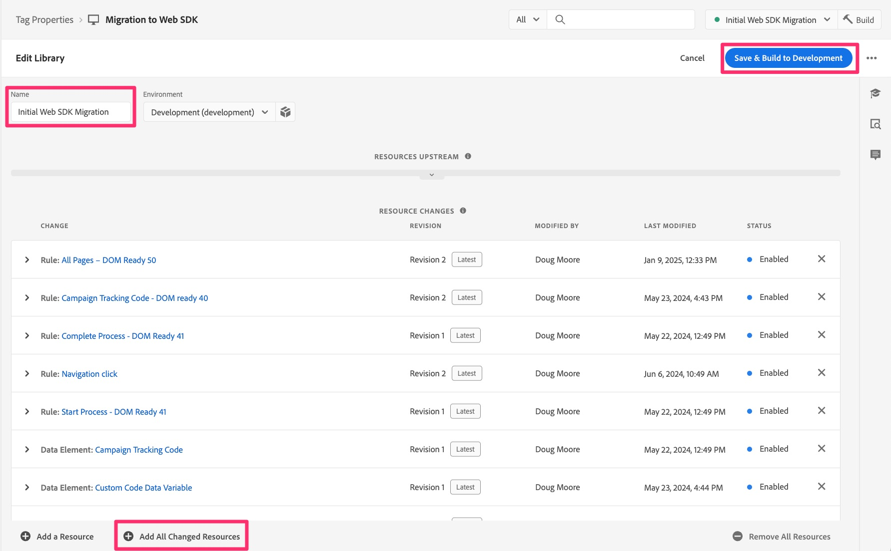
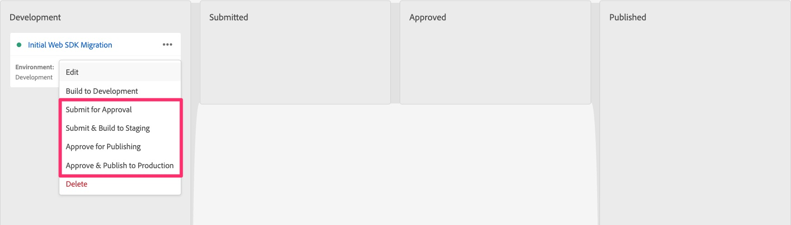

# Publish the migration to staging and production

When all development is completed for the migration and validated, build to staging and then publish to production when ready.

## Overview

This is really the last main step of your migration, and it is to move the library that you have been using to develop and test your migration along to your staging environment for final testing there, and then on to the production environment.

If you go back to the [Create and configure a datastream](create-and-configure-the-analytics-datastream.md) lesson, you will see at the end of it that we pointed the staging datastream to send the analytics data to the same development report suite (or alternatively to a new staging report suite). You will also be reminded there that we pointed the production datastream to send data to the existing production report suite that you have been using.
This is just good information to have as we now push the migrated library along the publishing path to staging and production.

## Pushing to staging and production environments

Here are the steps that will push our library along to staging and production environments:

1. In the Tags interface, select Publishing Flow on the left navigation
1. You should see your migration library under Development (name being whatever you have chosen at the beginning of this migration process)

    

1. If you are certain that you have already added every single change to the library, you can move the library forward under the three dots, and skip the next several steps. If you're not sure, follow the next five steps.
1. Click on the library name to go into the library details
1. Verify you are in the right library via the name
1. Select Add All Changed Resources at the bottom of the page
1. Then click Save & Build to Development to add all queued changes to the library

    

1. This will then take you back into the publishing flow interface, and if the build completes successfully, there will be a green dot next to your library.
1. You can then move your library forward in the publishing process, based on your needs. You can set it for approvals, move it directly to staging to test and approve there, or even move it for approval or publishing directly on production. Again, this depends on the publishing needs at your organization.

    

Congratulations! At this point, your Analytics implementation is fully on the Web SDK!

I'm going to add an important note here that we had at the beginning of this tutorial:

>[!IMPORTANT]
>
>It is important to note that one of the main reasons that you are doing this migration of your implementation is to prepare to use Adobe Experience Platform applications, like Customer Journey Analytics, Real-Time CDP, or Journey Optimizer (as noted in #3 above). Using your website data for this purpose will include additional steps that are not included in this tutorial, but this tutorial will certainly be a prerequisite for that further progression of your implementation. Therefore, do complete this tutorial, and then you can go on to perform the steps necessary to send this same website data to the Experience Platform as well.

Good luck on your journey forward with analytics and other content and marketing endeavors!
