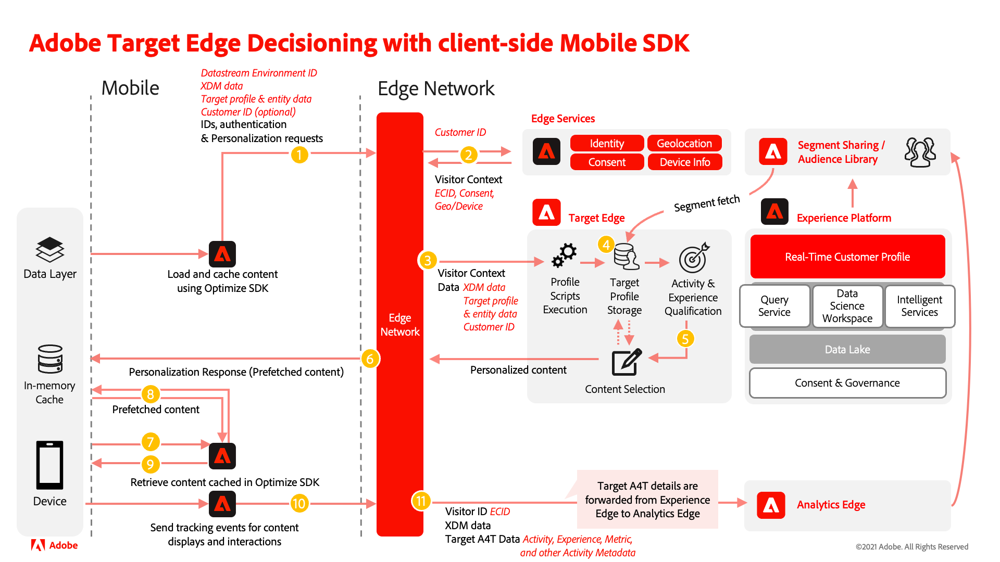

# Comparison of the Target extension to the Offer Decisioning and Target extension

The Offer Decisioning and Target extension differs from the Adobe Target extension for mobile apps. The following tables are a reference to help you evaluate areas of your implementation you may need to focus on during the migration process. 

After reviewing the information below and assessing your current technical Target extension implementation, you should be able to understand the following:

- Which Target features are supported by Offer Decisioning and Target
- Which Adobe Target extension functions have Offer Decisioning and Target equivalents
- How Target settings are applied with Offer Decisioning and Target
- How the data flows using the Offer Decisioning and Target extension

## Operational differences

| | Target extension | Offer Decisioning and Target extension |
|---|---|---|
| Process | Changes to a Target implementation may follow a process that has a different cadence or QA requirements compared to other applications like Analytics. | Changes to a Offer Decisioning and Target extension implementation should consider all downstream applications, and the QA and publish process should be adjusted accordingly. |
| Collaboration | Data specific to Target can be passed directly in the Target calls. If the Target reporting source is Adobe Analytics (A4T), data specific to Target can also be passed to Adobe Analytics when appropriate tracking methods in the Target extension are called for Target content display and interaction. | Data passed in the Offer Decisioning and Target extension calls can be forwarded to both Target and Analytics if the Target reporting source is Adobe Analytics (A4T), Adobe Analytics is enabled in the data stream, and appropriate tracking methods in Offer Decisioning and Target extension are called when Target content is displayed and interacted with. |

## Basic differences

| | Target extension | Offer Decisioning and Target extension |
|---|---|---|
| Dependencies | Depends only on Mobile Core SDK | Depends on Mobile Core and Edge Network SDK |
| Library Functionality | Supports fetching content from Adobe Target only | Support fetching content from Adobe Target and Offer decisioning |
| Requests | Target calls are largely independent from other network calls | Target network calls are queued along with network calls for other Edge-based solutions like Messaging in the Edge SDK and executed serially. |
| Edge Network | Uses the Target server value or the the Adobe Experience Cloud Edge Network with the client code (clientcode.tt.omtrdc.net), both specified in the [Target configuration](https://developer.adobe.com/client-sdks/solution/adobe-target/#configure-the-target-extension-in-the-data-collection-ui) in the Data Collection UI | Uses the Edge network domain specified in Adobe Experience Platform [Edge Network configuration](https://developer.adobe.com/client-sdks/edge/edge-network/#configure-the-edge-network-extension-in-data-collection-ui) in Data collection UI. |
| Basic Terminology | mbox, TargetParameters | DecisionScope, Map (Android)/dictionary (iOS) for Target parameters |
| Default content | Allows passing client-side default content in TargetRequest which is returned if the network call fails or results in error. | Does not allow passing client-side default content. Does not return any content if network call fails or results in error. |
| Target parameters | Allows passing global TargetParameters per request and different TargetParameters per mbox | Allows passing global TargetParameters per request only |

## Feature comparison

| Feature | Target extension | Offer Decisioning and Target extension (Target via Edge) |
|---|---|---|
| Prefetch mode | Supported | Supported |
| Execute mode | Supported | Not supported |
| Custom parameters | Supported | Supported* |
| Profile parameters | Supported | Supported* |
| Entity parameters | Supported | Supported* |
| Target audiences | Supported | Supported |
| Real-Time CDP audiences | Not Supported | Supported |
| Real-Time CDP attributes | Not Supported | Supported |
| Lifecycle metrics | Supported | Supported via Data Collection rules |
| thirdPartyId (mbox3rdPartyId) | Supported | Supported via Identity Map and Target Third Party ID Namespace in the datastream |
| Notifications (display, click) | Supported | Supported |
| Response tokens | Supported | Supported |
| Mobile previews (QA mode) | Supported | Limited Support with Assurance |

>[!IMPORTANT]
>
> \* Parameters sent in a request apply to all scopes in the request. If you need to set different parameters for different scopes you must make additional requests.

## Noteworthy callouts

>[!NOTE]
>
>Keep the Target extension Tags configuration and settings in place even after you have migrated your app code to the Offer Decisioning and Target extension. This will help ensure Target continues to work for customers who haven't yet updated the app to the new version.
>
>If you use the Analytics for Target integration (A4T), be sure to also migrate your Analytics implementation with the Edge Bridge extension at the same time you migrate your Target implementation to the Offer Decisioning and Target extension.

>[!IMPORTANT]
>
> Keep the Target extension settings in place even after you have migrated your app code to the Offer Decisioning and Target extension. This will help ensure Target continues to work for users who haven't yet updated their app.

## Offer Decisioning and Target extension system diagram

The following diagram should help you understand the data flow using the Offer Decisioning and Target extension.

>[!NOTE]
>
>We are committed to helping you be successful with your mobile Target migration from the Target extension to the Offer Decisioning and Target extension. If you run into obstacles with your migration or feel like there is critical information missing in this guide, please let us know by posting in [this Community discussion](https://experienceleaguecommunities.adobe.com/t5/adobe-experience-platform-data/tutorial-discussion-migrate-adobe-target-to-mobile-sdk-on-edge/m-p/747484#M625).
