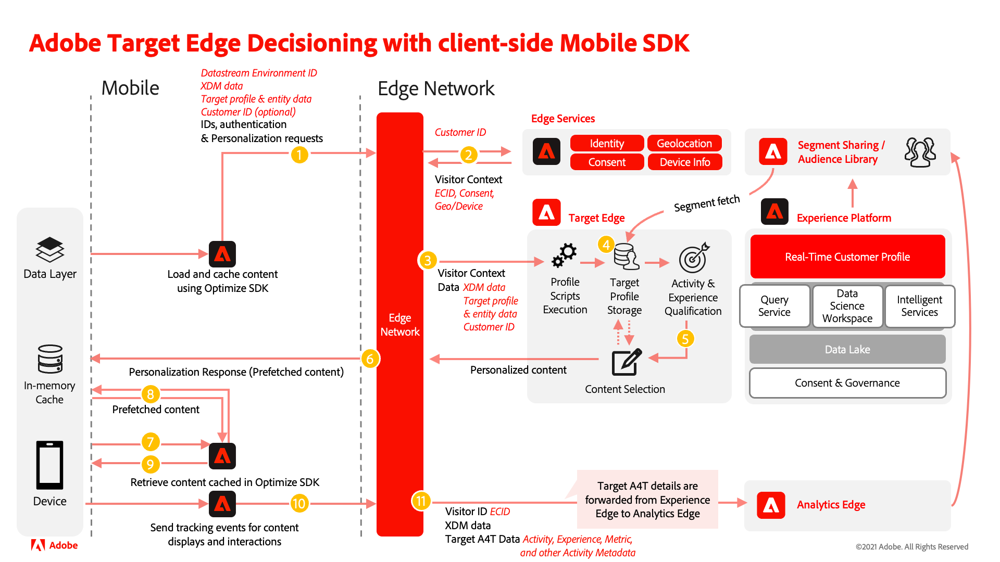

# Comparison of the Target extension to the Decisioning extension

The Adobe Journey Optimizer - Decisioning extension differs from the Adobe Target extension for mobile apps. The following tables are a reference to help you evaluate areas of your implementation you may need to focus on during the migration process. 

After reviewing the information below and assessing your current technical Target extension implementation, you should be able to understand the following:

- Which Target features are supported by Adobe Journey Optimizer - Decisioning
- Which Adobe Target extension functions have Adobe Journey Optimizer - Decisioning equivalents
- How Target settings are applied with Adobe Journey Optimizer - Decisioning
- How the data flows using the Adobe Journey Optimizer - Decisioning extension

## Operational differences

| | Target extension | Decisioning extension |
|---|---|---|
| Process | Changes to a Target implementation may follow a process that has a different cadence or QA requirements compared to other applications like Analytics. | Changes to a Decisioning extension implementation should consider all downstream applications, and the QA and publish process should be adjusted accordingly. |
| Collaboration | Data specific to Target can be passed directly in the Target calls. If the Target reporting source is Adobe Analytics (A4T), data specific to Target can also be passed to Adobe Analytics when appropriate tracking methods in the Target extension are called for Target content display and interaction. | Data passed in the Decisioning extension calls can be forwarded to both Target and Analytics if the Target reporting source is Adobe Analytics (A4T), Adobe Analytics is enabled in the data stream, and appropriate tracking methods in Decisioning extension are called when Target content is displayed and interacted with. |

## Basic differences

| | Target extension | Decisioning extension |
|---|---|---|
| Dependencies | Depends only on Mobile Core SDK | Depends on Mobile Core and Edge Network SDK |
| Library Functionality | Supports fetching content from Adobe Target only | Support fetching content from Adobe Target and Offer decisioning |
| Requests | Target calls are largely independent from other network calls | Target network calls are queued along with network calls for other Edge-based solutions like Messaging in the Edge SDK and executed serially. |
| Edge Network | Uses the Target server value or the the Adobe Experience Cloud Edge Network with the client code (clientcode.tt.omtrdc.net), both specified in the [Target configuration](https://developer.adobe.com/client-sdks/solution/adobe-target/#configure-the-target-extension-in-the-data-collection-ui) in the Data Collection UI | Uses the Edge network domain specified in Adobe Experience Platform [Edge Network configuration](https://developer.adobe.com/client-sdks/edge/edge-network/#configure-the-edge-network-extension-in-data-collection-ui) in Data collection UI. |
| Basic Terminology | mbox, TargetParameters | DecisionScope, Map (Android)/dictionary (iOS) for Target parameters |
| Default content | Allows passing client-side default content in TargetRequest which is returned if the network call fails or results in error. | Does not allow passing client-side default content. Does not return any content if network call fails or results in error. |
| Target parameters | Allows passing global TargetParameters per request and different TargetParameters per mbox | Allows passing global TargetParameters per request only |

## Feature comparison

| Feature | Target extension | Decisioning extension (Target via Edge) | 
|---|---|---|
| Prefetch mode | Supported | Supported | 
| Execute mode | Supported | Not supported |  
| Custom parameters | Supported | Supported* | 
| Profile parameters | Supported | Supported* | 
| Entity parameters | Supported | Supported* | 
| Target audiences | Supported | Supported | 
| Real-Time CDP audiences | Not Supported | Supported | 
| Real-Time CDP attributes | Not Supported | Supported | 
| Lifecycle metrics | Supported | Supported via Data Collection rules | 
| thirdPartyId (mbox3rdPartyId) | Supported | Supported via Identity Map and Target Third Party ID Namespace in the datastream | 
| Notifications (display, click) | Supported | Supported | 
| Response tokens | Supported | Supported |  
| Analytics for Target (A4T) | Client-side only | Client-side and server-side | 
| Mobile previews (QA mode) | Supported | Limited Support with Assurance | 

>[!IMPORTANT]
>
> \* Parameters sent in a request apply to all scopes in the request. If you need to set different parameters for different scopes you must make additional requests.

## Noteworthy callouts

>[!NOTE]
>
>Keep the Target extension Tags configuration and settings in place even after you have migrated your app code to the Decisioning extension. This will help ensure Target continues to work for customers who haven't yet updated the app to the new version.
>
>If you use the Analytics for Target integration (A4T), be sure to also migrate your Analytics implementation with the Edge Bridge extension at the same time you migrate your Target implementation to the Decisioning extension.

## Target extension functions and Decisioning extension equivalents

Many Target extension functions have an equivalent approach using the Decisioning extension outlined in the table below. For more details about the [functions](https://developer.adobe.com/target/implement/client-side/atjs/atjs-functions/atjs-functions/), refer to the Adobe Target Developer Guide.

| Target extension | Decisioning extension | Notes |
| --- | --- | --- | 
| `prefetchContent` | `updatePropositions` |  | 
| `retrieveLocationContent` | `getPropositions` | When using `getPropositions` API, no remote call is made to fetch non-cached scopes in the SDK.  | 
| `displayedLocations` | Offer -> `displayed()` |     In addition, `generateDisplayInteractionXdm` Offer method can be used to generate the XDM for item display. Subsequently, Edge network SDK's sendEvent API can be used to attach additional XDM, free-form data and send an Experience Event to the remote. | 
| `clickedLocation` | Offer -> `tapped()` | In addition, `generateTapInteractionXdm` Offer method can be used to generate the XDM for item tap. Subsequently, Edge network SDK's sendEvent API can be used to attach additional XDM, free-form data and send an Experience Event to the remote. | 
| `clearPrefetchCache` | `clearCachedPropositions` |  | 
| `resetExperience` | n/a | Use `removeIdentity` API from Identity for Edge Network extension for the SDK to stop sending the visitor identifier to the Edge network. For more details, see [the removeIdentity API documentation](https://developer.adobe.com/client-sdks/edge/identity-for-edge-network/api-reference/#removeidentity).   Note: Mobile Core's `resetIdentities` API clears all stored identities in the SDK, including the Experience Cloud ID (ECID) and it should be sparingly used! | 
| `getSessionId` | n/a | `state:store` response handle carries session-related information. Edge network extension helps manage it by attaching non-expired state store items to subsequent requests. | 
| `setSessionId` | n/a | `state:store` response handle carries session-related information. Edge network extension helps manage it by attaching non-expired state store items to subsequent requests. | 
| `getThirdPartyId`  |  n/a | Use updateIdentities API from Identity for Edge Network extension to supply the third party ID value. Then, configure the third party ID namespace in the datastream. For more details, see [the Target Third Party Id mobile documentation](https://developer.adobe.com/client-sdks/edge/adobe-journey-optimizer-decisioning/#target-third-party-id).  |
| `setThirdPartyId` | n/a | Use updateIdentities API from Identity for Edge Network extension to supply the third party ID value. Then, configure the third party ID namespace in the datastream. For more details, see [the Target Third Party Id mobile documentation](https://developer.adobe.com/client-sdks/edge/adobe-journey-optimizer-decisioning/#target-third-party-id). | 
| `getTntId` | n/a | `locationHint:result` response handle carries the Target location hint information. It is assumed Target edge will be co-located with Experience Edge.    Edge network extension uses the EdgeNetwork location hint to determine the Edge network cluster to send requests to. To share Edge network location hint across SDKs (hybrid apps), use `getLocationHint` and `setLocationHint` APIs from Edge Network extension. For more details, see [the `getLocationHint` API documentation](https://developer.adobe.com/client-sdks/edge/edge-network/api-reference/#getlocationhint). | 
| `setTntId` | n/a | `locationHint:result` response handle carries the Target location hint information. It is assumed Target edge will be co-located with Experience Edge.    Edge network extension uses the EdgeNetwork location hint to determine the Edge network cluster to send requests to. To share Edge network location hint across SDKs (hybrid apps), use `getLocationHint` and `setLocationHint` APIs from Edge Network extension. For more details, see [the `getLocationHint` API documentation](https://developer.adobe.com/client-sdks/edge/edge-network/api-reference/#getlocationhint).  | 

## Target extension settings and Decisioning extension equivalents

The Target extension has [configurable settings](https://developer.adobe.com/client-sdks/solution/adobe-target/#configure-the-target-extension-in-the-data-collection-ui) which are [configured in the datastream](https://developer.adobe.com/client-sdks/edge/adobe-journey-optimizer-decisioning/#adobe-experience-platform-data-collection-setup) with the Decisioning extension.

| Target extension | Decisioning extension | Notes |
| --- | --- | --- | 
| Client Code | n/a | Set automatically by the edge using the IMS Org details |
| Environment ID | Target Environment ID | Configured in the datastream |
| Target Workspace Property | Property Token | Configured in the datastream |
| Timeout | Not configurable | The timeout with the Decisioning extension is 10 seconds |
| Server Domain | Edge Network domain | Set in the Adobe Experience Platform Edge Network extension |

>[!IMPORTANT]
>
> Keep the Target extension settings in place even after you have migrated your app code to the Decisioning extension. This will help ensure Target continues to work for users who haven't yet updated their app.

## Decisioning extension system diagram

The following diagram should help you understand the data flow using the Adobe Journey Optimizer - Decisioning extension.

>[!NOTE]
>
>We are committed to helping you be successful with your mobile Target migration from the Target extension to the Decisioning extension. If you run into obstacles with your migration or feel like there is critical information missing in this guide, please let us know by posting in [this Community discussion](https://experienceleaguecommunities.adobe.com/t5/adobe-experience-platform-data/tutorial-discussion-migrate-target-from-at-js-to-web-sdk/m-p/575587#M463).
