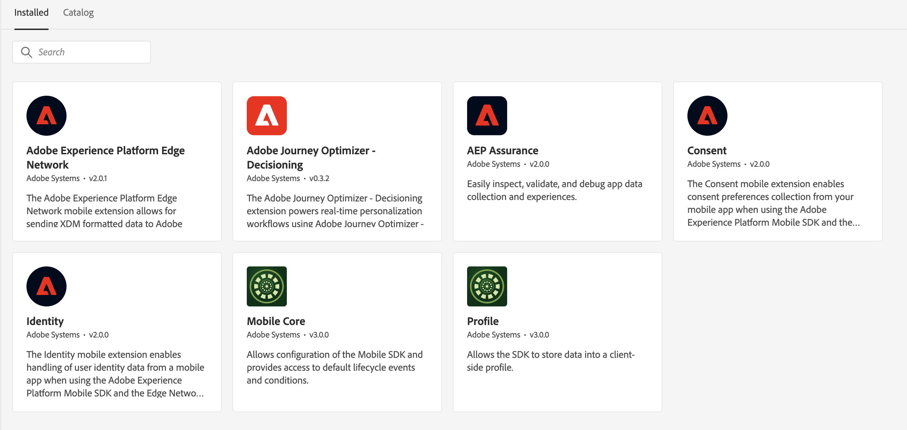
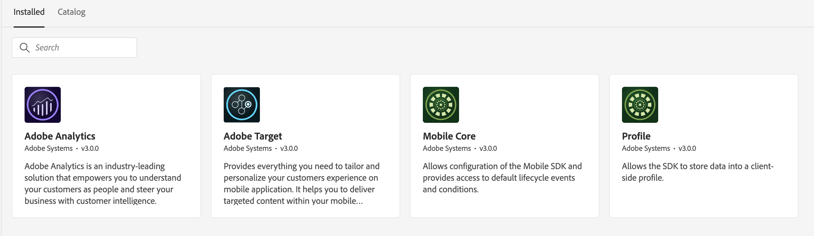

# Perform the initial Data Collection setup

Migrating from Target SDK to Optimize SDK requires an initial setup to enable proper data capture, features, and functions of Optimize SDK. The following steps must be completed before any website implementation changes take place:

- [Configure the appropriate permissions](https://experienceleague.adobe.com/en/docs/platform-learn/implement-web-sdk/overview#permissions){target="_blank"} in the Adobe Admin Console for Data Collection
- [Configure an XDM schema](https://experienceleague.adobe.com/en/docs/platform-learn/implement-mobile-sdk/initial-configuration/create-schema){target="_blank"} for passing structured data to the Edge Network  
- [Configure the schema](https://experienceleague.adobe.com/en/docs/platform-learn/implement-mobile-sdk/experience-cloud/target#update-your-schema){target="_blank"} to receive Adobe Target data
- [Configure an identity namespace](https://experienceleague.adobe.com/en/docs/platform-learn/implement-mobile-sdk/app-implementation/identity#set-up-a-custom-identity-namespace){target="_blank"} for cross-device personalization and mbox3rdPartyId functionality 
- [Create a datastream](https://experienceleague.adobe.com/en/docs/platform-learn/implement-mobile-sdk/initial-configuration/create-datastream){target="_blank"} to enable forwarding of data from Edge Network
- [Configure the datastream](https://experienceleague.adobe.com/en/docs/platform-learn/implement-mobile-sdk/experience-cloud/target#update-datastream-configuration){target="_blank"} to enable forwarding of data to Adobe Target
- [Configure the Tag property](https://experienceleague.adobe.com/en/docs/platform-learn/implement-mobile-sdk/experience-cloud/target#install-adobe-journey-optimizer---decisioning-tags-extension){target="_blank"} for Decisioning extension

## Extension configuration

>[!BEGINTABS]

>[!TAB Decisioning extension]

Tag extensions installed when using the Decisioning extension:

1. Adobe Journey Optimizer - Decisioning
1. Adobe Experience Platform Edge Network
1. Mobile Core
1. Profile
1. Consent
1. Identity
1. AEP Assurance (Optional, needed for debugging)

>[!TAB Target extension] 

Tag extensions installed when using the Target extension:

1. Adobe Target
1. Mobile Core
1. Profile
1. Adobe Analytics (Optional, needed if using Adobe Analytics as reporting source for Adobe Target activities)

>[!ENDTABS]

## Datastream configuration

The Target extension has [configurable settings](https://developer.adobe.com/client-sdks/solution/adobe-target/#configure-the-target-extension-in-the-data-collection-ui) which with the Decision extension are [configured in the datastream](https://developer.adobe.com/client-sdks/edge/adobe-journey-optimizer-decisioning/#adobe-experience-platform-data-collection-setup).

| Target extension | Decisioning extension | Notes |
| --- | --- | --- | 
| Client Code | n/a | Set automatically by the edge using the IMS Org details |
| Environment ID | Target Environment ID | Configured in the datastream |
| Target Workspace Property | Property Token | Configured in the datastream |
| Timeout | Not configurable | The timeout with the Decisioning extension is 10 seconds |
| Server Domain | Edge Network domain | Set in the Adobe Experience Platform Edge Network extension |

Next, learn how to [replace the Target SDK](replace-sdk.md).

>[!NOTE]
>
>We are committed to helping you be successful with your mobile Target migration from the Target extension to the Decisioning extension. If you run into obstacles with your migration or feel like there is critical information missing in this guide, please let us know by posting in [this Community discussion](https://experienceleaguecommunities.adobe.com/t5/adobe-experience-platform-data/tutorial-discussion-migrate-target-from-at-js-to-web-sdk/m-p/575587#M463).
