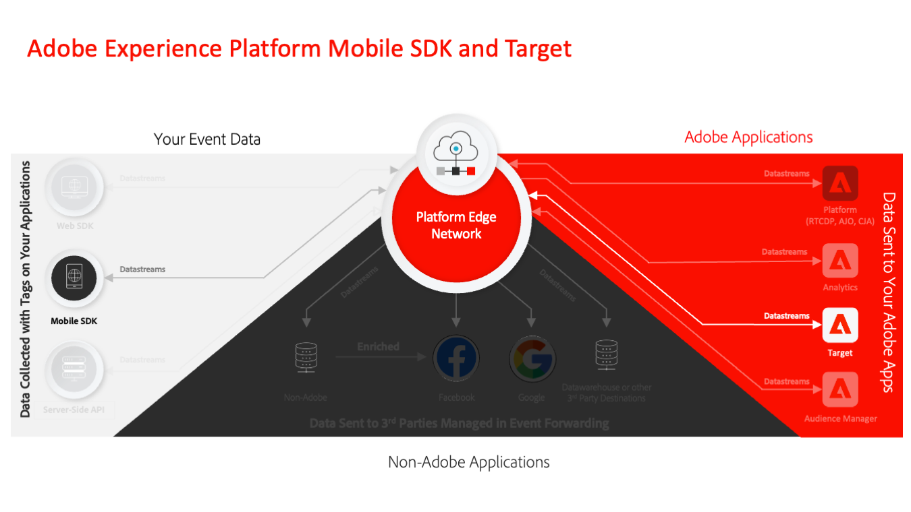

# Migrate your mobile app from the Adobe Target to the Adobe Journey Optimizer - Decisioning extension

This guide is for experienced Adobe Target implementers to learn how to migrate existing Adobe Experience Platfrom Mobile SDK implementations from the Adobe Target extension to the Adobe Journey Optimizer - Decisioning extension.

Adobe Experience Platform Mobile SDK powers end-to-end engagement in your mobile applications. The Target extension builds on the Mobile SDK to help you personalize app experiences with Adobe Target. The Decisioning extension is a newer approach to implement Adobe Target in mobile apps that uses Adobe Experience Platform Edge Network capabilities that help integrate Target with Platform-based apps such as Real-Time CDP and Journey Optimizer.

## Key benefits

Some of the benefits of the Adobe Journey Optimizer Decisioning extension compared to the Target extension include:

* Faster sharing of audiences from [Real-Time Customer Data Platform](https://experienceleague.adobe.com/en/docs/platform-learn/tutorials/destinations/target/next-hit-personalization)
* Integrating Target with Journey Optimizer to support [Offer Decisioning delivery](https://experienceleague.adobe.com/en/docs/target/using/integrate/ajo/offer-decision)
* A tighter integration with Adobe Analytics which does not rely on stitching information from separate network calls
* Additional implementation flexibility for developers

Arguably, the largest benefit to Target customers of migrating is for integration with Real-Time Customer Data Platform. Real-Time CDP offers tremendous audience-building capabilities based on the full range of data ingested into Experience Platform and its Real-time Customer Profile capability. A built-in data governance framework automates responsible use of that data. Customer AI allows you to easily use machine learning models to construct propensity and churn models whose output can be shared back to Adobe Target. And finally, customers of the optional Healthcare and Privacy & Security Shield addons can use the consent enforcement feature to  enforce individual customers' consent preferences. Platform Mobile SDK and the Decisioning extension is a requirement to use these Real-Time CDP features in your mobile channel.

## Migration steps

The level of effort to migrate from the Target extension to the Decisioning extension depends on the complexity of your current implementation and Target features used.

No matter how simple or complex your implementation is, it's important to fully understand your current  state before migrating. This guide helps you to break down the components of your current implementation and develop a manageable plan to migrate each piece. 

The migration process involves the following key steps:

1. Assess your current implementation, including:
    1. All Target SDK APIs used
    1. Modifications to Target's global settings
    1. Integration with Adobe Analytics
    1. Use of mbox, profile, and entity parameters
    1. Use of profile scripts and audiences
    1. Custom code unique to your implementation
1. Set up the initial components to connect to the Adobe Experience Platform Edge Network
1. Update the foundational implementation to replace the Target extension with the Decisioning extension
1. Enhance the Optimize SDK implementation for your specific use cases. This may involve passing additional parameters, using response tokens, and more.
1. Update objects in the Target interface, such as profile scripts, activities, and audience definitions
1. Validate the final implementation before making the switch in your production app

>[!INFO]
>
>Within the Adobe Experience Platform Mobile SDK ecosystem, extensions are implemented by SDKs imported into your applications which may have different names:
>
> * **Target SDK** implements the **Adobe Target extension**
> * **Optimize SDK** implements the **Adobe Journey Optimizer - Decisioning extension**

Next, review the detailed [comparison of the Target extension and the Decisioning extension](comparison.md) to gain a better understanding of the technical differences and identify areas requiring additional focus. 

>[!NOTE]
>
>We are committed to helping you be successful with your mobile Target migration from the Target extension to the Decisioning extension. If you run into obstacles with your migration or feel like there is critical information missing in this guide, please let us know by posting in [this Community discussion](https://experienceleaguecommunities.adobe.com/t5/adobe-experience-platform-data/tutorial-discussion-migrate-adobe-target-to-mobile-sdk-on-edge/m-p/747484#M625).
