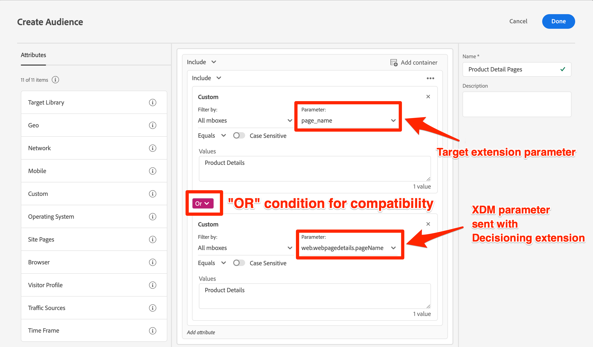

# Update Target audiences and profile scripts for Decisioning mobile extension compatibility


After you complete the technical updates to migrate Target to the Decisioning extension, you may need to update some of your audiences, profile scripts, and activities to ensure a smooth transition. 

>[!INFO]
>
>If you migrate all of your mbox parameters to the `data.__adobe.target` object, you will not need to update your audiences, profile scripts, and activities as shown below.


If you migrate mbox paramters to the `xdm` object, before publishing your changes to production, you should:

* Update audiences that use mbox parameters
* Update profile scripts that use mbox parameters
* Update any offers and activities use mbox parameter token replacement (for example, `${mbox.parameter_name}`)

## Adjust audiences

If you migrate mbox paramters to the `xdm` object, audiences that use custom mbox parameters should be updated to use the new XDM parameter names. For example, a custom parameter for `page_name` would likely be mapped to `web.webpagedetails.pageName`.

One approach to ensure compatibility with both the Target extension and the Decisioning extension is to update any relevant audiences so that `OR` conditions are used, as shown below:

{zoomable="yes"}

## Edit profile scripts
 
If you migrate mbox paramters to the `xdm` object, profile scripts should be updated to reference the new XDM parameter names, similar to audiences. Aside from the change of mbox parameter names, there is no difference in the way profile scripts work between a Target and Decisioning implementation.

One approach to ensure that compatibility is to use `OR` conditions in your profile script code.

Example profile script: 

```Javascript
if(mbox.param('pageName') == 'Product Details'){
  return true
}
```

Updated profile script for Platform Web SDK compatibility:

```Javascript
if((mbox.param('pageName') == 'Product Details') || (mbox.param('web.webPageDetails.pageName') =='Product Details')){
  return true
}
```

For more information and best practices, refer to the dedicated documentation about [profile scripts](https://experienceleague.adobe.com/en/docs/target/using/audiences/visitor-profiles/profile-parameters). 

## Update parameter tokens for dynamic content

If you migrate mbox paramters to the `xdm` object, and if you have any offers, recommendations designs, or activities that use [dynamic content replacement](https://experienceleague.adobe.com/en/docs/target/using/experiences/offers/passing-profile-attributes-to-the-html-offer), they may need to be updated accordingly to account for the new XDM parameter names.

Depending on how you are using token replacement for mbox parameters, you may be able to enhance your existing setup to account for both old and new parameter names. However, in situations where custom JavaScript code is not possible, such as in JSON offers, you should create copies and make updates after the migration is complete and live on your production site.

Example JSON offer:

```JSON
{
  "pageName" : "${mbox.page_name}",
  "layoutVariation" : "grid"
}
```

Example JSON offer using XDM object parameter names:

```JSON
{
  "pageName" : "${mbox.web.webPagedDetails.pageName}",
  "layoutVariation" : "grid"
}
```

If you choose to make adjustments after the migration to account for the new XDM mbox parameter names, be sure to pause any impacted activities during the migration event to prevent activity display errors to visitors.


Next, learn how to [validate the Target implementation](validate.md).

>[!NOTE]
>
>We are committed to helping you be successful with your mobile Target migration from the Target extension to the Decisioning extension. If you run into obstacles with your migration or feel like there is critical information missing in this guide, please let us know by posting in [this Community discussion](https://experienceleaguecommunities.adobe.com/t5/adobe-experience-platform-data/tutorial-discussion-migrate-target-from-at-js-to-web-sdk/m-p/575587#M463).
