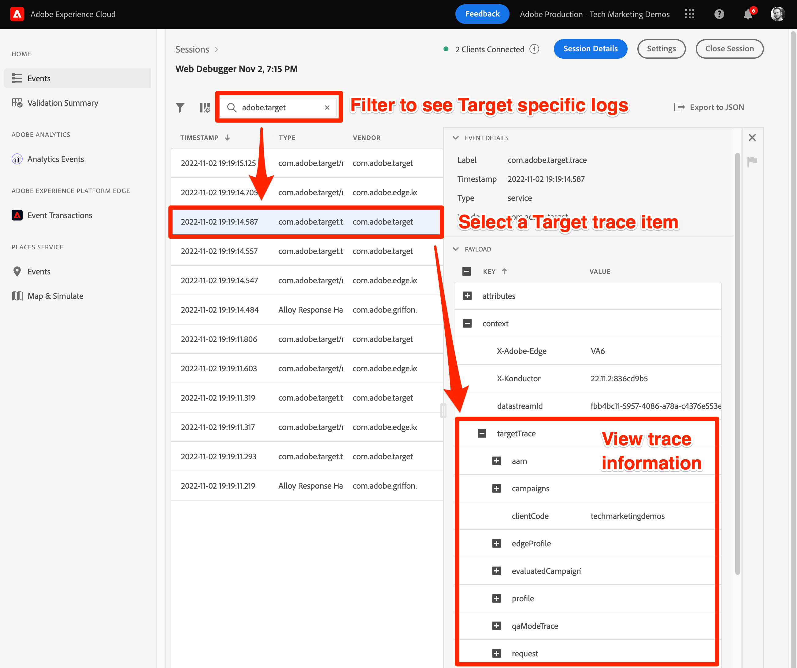
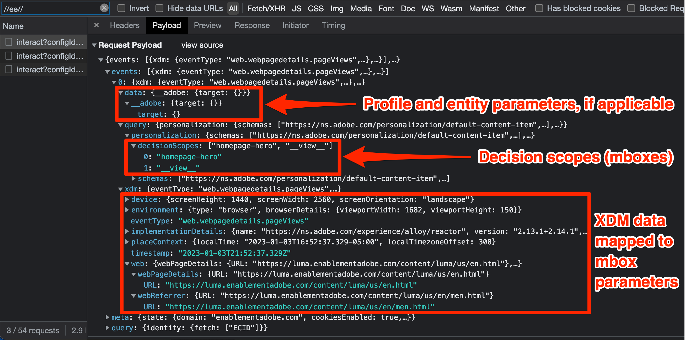
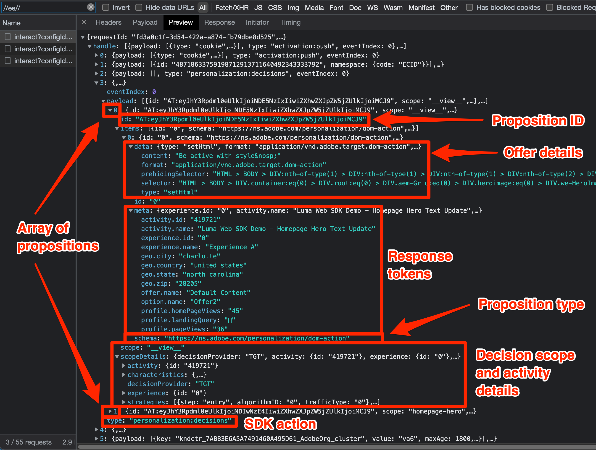
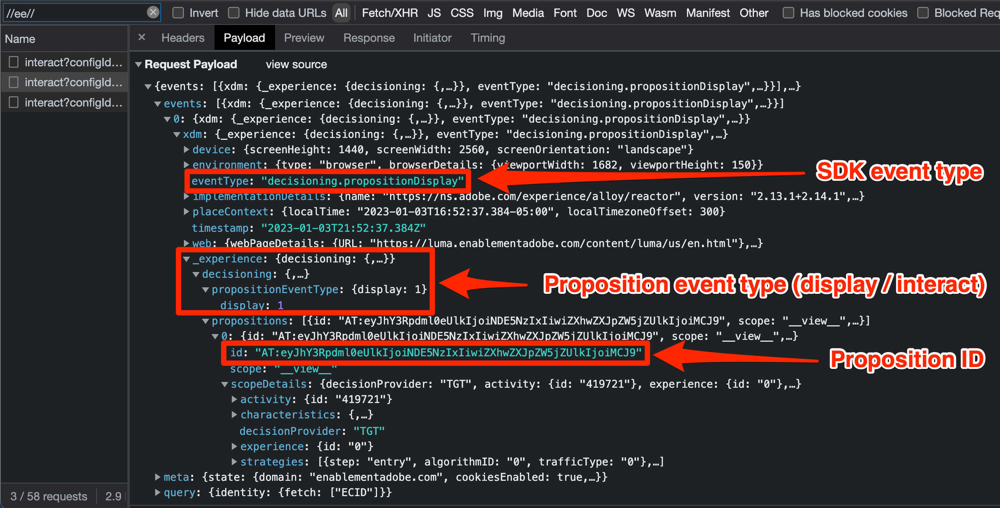

# Debug Target with the Platform Web SDK

Verifying Target activities and debugging Web SDK  to troubleshoot implementation, content delivery, or audience qualification issues. This page of the migration guide explains the differences between debugging with at.js and Platform Web SDK.

The table below summarizes features and support for testing and debugging approaches.

| Feature or tool | at.js support | Platform Web SDK support |
| --- | --- | --- |
| Activity QA URLs | Yes | Yes |
| `mboxDisable` URL parameter | Yes | Refer to information below to [disable Target functionality](#disable-target-functionality) |
| `mboxDebug` URL parameter | Yes | Use `alloy_debug` parameter for similar debug information |
| `mboxTrace` URL parameter | Yes | Use the Experience Platform Debugger browser extension |
| Adobe Experience Platform Debugger extension | Yes | Yes |
| `alloy_debug` URL parameter | Not applicable | Yes |
| Adobe Experience Platform Assurance | Not applicable | Yes |

## Adobe Experience Platform Debugger browser extension

The Adobe Experience Platform Debugger extension for Chrome and Firefox examines your web pages and helps you validate your Adobe Experience Cloud implementations.

You can run Platform Debugger on any web page and the extension has access to public data. To access non-public data using the extension, such as Target trace information, you must authenticate to Experience Cloud via the **[!UICONTROL Sign in]** link.

### Obtain and install the Adobe Experience Platform Debugger

The Adobe Experience Platform Debugger can be installed in Google Chrome or Mozilla Firefox browsers. Follow the appropriate link below to install the extension on your preferred browser:

- [Chrome](https://chrome.google.com/webstore/detail/adobe-experience-platform/bfnnokhpnncpkdmbokanobigaccjkpob)
- [Firefox](https://addons.mozilla.org/en-US/firefox/addon/adobe-experience-platform-dbg/)

After you install the Chrome extension or Firefox add-on, an icon () is added to the extension bar. Select this icon to open the extension.

Refer to the dedicated guide for more information about the [Adobe Experience Platform Debugger extension](https://experienceleague.adobe.com/docs/experience-platform/debugger/home.html) and how to debug all Adobe web applications.

## Preview Target activities with QA URLs

Both at.js and Platform Web SDK allow you to preview Target activities using Target QA URLs, and both implementation methods support the same QA features.

Target QA URLs working by instructing at.js or Platform Web SDK to write a specific cookie to your browser named `at_qa_mode`. This cookie is used to force qualification for a particular activity and experience.

>[!CAUTION]
>
>Target QA mode functionality is supported by Platform Web SDK version 2.13.0 or above. Target QA mode is enabled based on the `xdm.web.webPageDetails.URL` value passed in the `sendEvent` call. Any modifications to this value such as lowercasing all characters may prevent Target QA mode from working properly.

Refer to the dedicated guide for more information about [Target activity QA](https://experienceleague.adobe.com/docs/target/using/activities/activity-qa/activity-qa.html).

## Debug Target implementation

The table below outlines the differences between at.js and Platform Web SDK debugging tactics:

| at.js feature | Platform Web SDK equivalent |
| --- | --- |
| **Mbox Disable** - disable Target from fetching and rendering to check if the page is broken without Target interactions  Load page with URL parameter: `mboxDisable=true` | No direct equivalent. You can block all Platform Web SDK requests with your browser's developer tools. |
| **Mbox Debug** - logs every at.js action in the browser's console to help troubleshoot rendering issues  Load page with URL parameter: `mboxDebug=true` | **Alloy Debug** - logs detailed actions of the SDK, including but not limited to Target personalization actions.  Load page with URL parameter: `alloy_debug=true`    Or execute `alloy("setDebug", { "enabled": true });` in your developer console |
| **Target Trace** - with an mbox trace token generated in the Target UI, a trace object with details that participated in the decisioning process is available under `window.___target_trace` object.  Load page with URL parameter: `mboxTrace=window&authorization={TOKEN}` | Use the Adobe Experience Platform debugger extension or Platform Assurance. |

>[!NOTE]
>
>All the at.js debugging features listed above are available with enhanced capabilities in Adobe Experience Platform Debugger.

### Disable Target functionality

The Platform Web SDK does not currently have a feature to selectively suppress Target responses. However, it is possible to suppress the Platform Web SDK requests with your browser's developer tools, various browser extensions, or third-party applications. For example, to block the Platform Web SDK with Google Chrome:

1. Right click anywhere on the page and select **Inspect**
1. Select the **Network** tab
1. Filter by the string `//ee//` to view only Platform Web SDK calls
1. Reload the page
1. Right click one of the filtered network requests and select **Block request domain**
1. Reload the page and notice that the network request is blocked
1. When you are finished debugging, right click the blocked network request and select **Unblock**, or close the Developer Tools panel

### View debug logging

Debug logging for at.js using the `mboxDebug=true` URL parameter shows detailed information about each Target request, response, and attempt to render the content to the page. Platform Web SDK has similar debug logging using the `alloy_debug=true` URL parameter.

| Information Logged | at.js (`mboxDebug=true`) | Platform Web SDK (`alloy_debug=true`) |
| --- | --- | --- |
| Logging prefix for filtering | `AT:` | `[alloy]` |
| Page Load request details | Yes | Yes |
| Mbox or scope request details | Yes | Yes |
| Request status | Yes | Yes |
| Response details | Yes | Yes |
| Rendering status | Success and errors | Errors only |
| Rendering details | Yes | Yes |

>[!NOTE]
>
>Debug logs for at.js and Platform Web SDK provide similar level of detail with the notable exception that Web SDK only notifies of rendering errors due to invalid selectors. The debug logging does not currently confirm that rendering was successful.

### View Target traces

Target traces provide detailed information about activity qualifications and the visitor's Target profile. Since Target traces contain information that is not publicly available, viewing them requires an authorization token or authenticating within the Adobe Experience Platform Debugger browser extension window.

| Target trace method | at.js | Platform Web SDK |
| --- | --- | --- |
| `mboxTrace` URL parameter | Yes | No |
| Adobe Experience Platform Debugger browser extension | Yes | Yes |
| Adobe Experience Platform Assurance | No | Yes |

To view Platform Web SDK Target traces with the Adobe Experience Platform Debugger, do the following:

1. Navigate to a page on your site that has Target implemented with Platform Web SDK
1. Open the Adobe Experience Platform Debugger extension by selecting the icon () in your browser navigation bar
1. Select the **[!UICONTROL Sign In]** link
1. Authenticate using your Adobe Experience Cloud login
1. Select the **[!UICONTROL Logs]** tab on the left
1. Select the **[!UICONTROL Edge]** tab on the top
1. Optionally give your debugging session a name and click the **[!UICONTROL Connect]** button
1. Reload the page and the log should populate with detailed information about the edge network interactions
1. Focus on the log entries that start with "Target Traces" in the description and select **[!UICONTROL View]** to see Target trace details

{zoomable="yes"}

After selecting **[!UICONTROL View]**, an overlay will appear allowing you to see the following information related to the request:

- Matched activities
- Unmatched activities
- Request details
- Profile snapshot

Refer to the dedicated guide about [debugging Target content delivery](https://experienceleague.adobe.com/docs/target/using/activities/troubleshoot-activities/content-trouble.html) for more information about Target traces.

### Troubleshoot with Assurance

Target trace information is viewable in both the Adobe Experience Platform Debugger browser extension and within the Assurance application (formerly known as Project Griffon). To view Target traces within Assurance, do the following:

1. Open the Adobe Experience Platform Debugger browser extension and connect a remote debugging session as outlined above
1. Select the link with your session name above the debugging log
1. Platform Assurance loads and shows detailed logging for all Adobe applications configured in the data stream for your implementation
1. Filter the log by `adobe.target`
1. Select a log entry with the type `com.adobe.target.trace`
1. Expand the details of the payload and view the information under `context > targetTrace`

{zoomable="yes"}

## Examine network request and response

The request payload and response of the Platform Web SDK `sendEvent` calls differ from at.js. The outline below should help you understand the structure of the request and response while examining the network calls with your browser's developer tools.

### Content request payload

{zoomable="yes"}

- Profile, entity, and other non-mbox parameters are passed in the events array under `data.__adobe.target`
- Decision scopes are located in the events array under `query.personalization.decisionScopes`
- XDM data which are mapped to mbox parameters downstream are located in the events array under `xdm`

### Content response body

{zoomable="yes"}

- The Platform Web SDK returns actions for all Adobe applications under the `handle` object
- The `personalization:decisions` action signifies a response from Target or offer decisioning
- Target propositions are presented as an array, each with a unique proposition ID prefixed with `AT:`
- Decision scope and activity details are located within the propositions array
- Offer details are located in the `items` array under `data`
- Response tokens are located in the `items` array under `meta`

### Proposition event payload

{zoomable="yes"}

- Target specific SDK events are either `decisioning.propositionDisplay` for an impression or `decisioning.propositionInteract` for an interaction, such as a click
- The details of the proposition event are located in the events array under `xdm._experience.decisioning`
- The proposition ID of the display or interaction event should match the proposition ID of the content returned from Target

Congratulations, you've reached the end of the tutorial! Good luck migrating your Adobe Target implementatoin to Web SDK!

>[!NOTE]
>
>We are committed to helping you be successful with your Target migration from at.js to Web SDK. If you run into obstacles with your migration or feel like there is critical information missing in this guide, please let us know by posting in [this Community discussion](https://experienceleaguecommunities.adobe.com/t5/adobe-experience-platform-data/tutorial-discussion-migrate-target-from-at-js-to-web-sdk/m-p/575587#M463).
