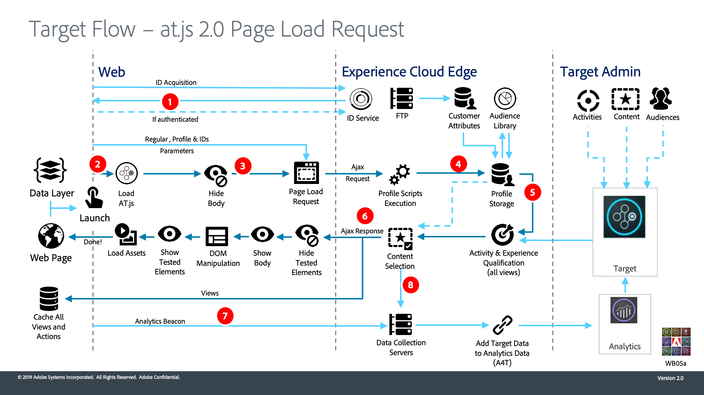

# Comparison of at.js to Platform Web SDK

The standalone Adobe Target at.js library differs significantly from Platform Web SDK. The following tables are a reference to help you evaluate areas of your implementation you may need to focus on during the migration process. 

After reviewing the information below and assessing your current technical at.js implementation, you should be able to understand the following:

- Which Target features are supported by Platform Web SDK
- Which at.js functions have Platform Web SDK equivalents
- How Target settings are applied with Platform Web SDK
- How the data flow of at.js and Platform Web SDK differ 

If you are new to Platform Web SDK, don't worry - the items below are covered in more detail throughout this tutorial.

## Feature comparison

| | Target at.js 2.x | Platform Web SDK |
|---|---|---|
| Update Target profile | Supported | Supported |
| Trigger view for SPAs | Supported | Supported |
| Target Recommendations | Supported | Supported |
| Fetch form based offers | Supported | Supported |
| Track events | Supported | Supported |
| A4T: Single page application | Supported | Supported |
| A4T: Click tracking | Supported | Supported |
| A4T: Client-side logging | Supported | Supported |
| A4T: Server-side logging | Supported | Supported |
| Apply offers | Supported | Supported |
| Re-render view in SPA without notifications | Supported | Supported |
| Hybrid applications | Supported | Supported |
| QA URLs | Supported | Supported |
| Mbox 3rd party IDs | Supported | Supported |
| Customer attributes | Supported | Supported |
| Remote offers | Supported | Supported |
| Redirect offers | Supported | Supported. However, a redirect from a page with Platform Web SDK to a page with at.js (and in the opposite direction) is not supported. |
| On-Device Decisioning | Supported | Not currently supported |
| Prefetch Mboxes | Supported | Partially supported. Contact customer support to enable this feature since it alters the activity prefetch behavior. |
| Custom Events | Supported | Not supported. See the [public roadmap](https://github.com/orgs/adobe/projects/18/views/1?pane=item&itemId=17372355{target="_blank"}) for current status. |
| Response tokens | Supported | Supported. Refer to the [dedicated response tokens documentation](https://experienceleague.adobe.com/docs/target/using/administer/response-tokens.html) for code examples and differences between at.js and Platform Web SDK | 
| Data Providers | Supported | Not supported. Custom code can be used to trigger a Platform Web SDK `sendEvent` command after data is retrieved from another provider. |

## Noteworthy callouts

| | Target at.js 2.x | Platform Web SDK |
|---|---|---|
| Flicker Mitigation | The prehiding snippet for asynchronous implementations uses a style ID of `at-body-style`. at.js looks for this element ID to remove the style once a response is received. | The default prehiding snippet uses a style ID of `alloy-prehiding`. The Web SDK is not compatible with the at.js prehiding snippet so it must be changed as part of the migration process. |
| Automatically rendering content on page load | Controlled with a Target global setting. Enabled when `pageLoadEnabled` is set to `true`. | Specified in the Platform Web SDK `sendEvent` command. Enabled by setting the `renderDecisions` option to `true`. |
| Manually rendering content | The `applyOffer()` and `applyOffers()` functions support setting HTML only | The `applyPropositions` command supports setting, replacing, or appending HTML for added flexibility |
| Tracking custom events | Supported with `trackEvent()` and `sendNotifications()` functions. These functions are specific to Target and do not impact Adobe Analytics metrics. | All data from Platform Web SDK `sendEvent` calls are forwarded to Target. Supplemental data needed specifically for Target should be included with the `sendEvent` command with an eventType of `decisioning.propositionDisplay` or `decisioning.propositionInteract` to ensure Adobe Analytics metrics are not impacted. |
| Target CNAME | Supported. This is separate from the CNAME used for Analytics and the Experience Cloud ID Service. | No longer relevant. A single CNAME can be used for all Platform Web SDK calls. |
| Debugging | The `mboxDisable`, `mboxDebug`, and `mboxTrace` URL parameters can be used for debugging with your browser's developer tools.  The Adobe Experience Platform Debugger is also a supported debugging tool. | The `mboxDisable`, `mboxDebug`, and `mboxTrace` URL parameters are not supported.  You can turn on Web SDK debugging by adding the `alloy_debug=true` to your query string or executing `alloy("setDebug", { "enabled": true });` in your developer console.  The Adobe Experience Platform Debugger browser extension can be used to initiate an edge trace for debugging.  Refer to the [debugging the Platform Web SDK](debugging.md) documentation for more information. |
| Analytics for Target (A4T) | Uses SDID values to stitch Target and Analytics calls | Natively supported without the need for stitching |

>[!NOTE]
>
>Migrating Target to Platform Web SDK while retaining an existing AppMeasurement Adobe Analytics implementation for a given page is not supported.
>
> It is possible to migrate your at.js (and AppMeasurement.js) implementation to Platform Web SDK one page at a time. If you take this approach, it is best to set the [`idMigrationEnabled`](https://experienceleague.adobe.com/docs/experience-platform/edge/fundamentals/configuring-the-sdk.html#id-migration-enabled) and [`targetMigrationEnabled`](https://experienceleague.adobe.com/docs/experience-platform/edge/fundamentals/configuring-the-sdk.html#targetMigrationEnabled) options to `true` with the `configure` command.

## at.js functions and Platform Web SDK equivalents

Many at.js functions have an equivalent approach using Platform Web SDK outlined in the table below. For more details about the [at.js functions](https://developer.adobe.com/target/implement/client-side/atjs/atjs-functions/atjs-functions/), refer to the Adobe Target Developer Guide.

| at.js 2.x function | Platform Web SDK equivalent | 
| --- | --- | 
| `getOffer()` and `getOffers()` | To request and [automatically render](https://experienceleague.adobe.com/docs/experience-platform/edge/personalization/rendering-personalization-content.html#automatically-rendering-content) Target VEC-based experiences, use the `sendEvent` command and set the `renderDecisions` option to true.  To request form-based experiences or to [manually render](https://experienceleague.adobe.com/docs/experience-platform/edge/personalization/rendering-personalization-content.html#manually-rendering-content) content, specify an array of `decisionScopes` (mboxes) with the `sendEvent` command. | 
| `applyOffer()` and `applyOffers()` | Use the [`applyPropositions`](https://experienceleague.adobe.com/docs/experience-platform/edge/personalization/rendering-personalization-content.html#applypropositions) command to apply content. You may choose to set, replace, or append HTML to a specific selector. |  
| `triggerView()` | Platform Web SDK automatically triggers a [view change](https://experienceleague.adobe.com/docs/experience-platform/edge/personalization/adobe-target/web-sdk-atjs-comparison.html#how-to-trigger-a-view-change-in-a-single-page-application) for the purposes of the SPA VEC if the `web.webPageDetails.viewName` property is set under the `xdm` option of the `sendEvent` command. | 
| `trackEvent()` and `sendNotifications()` |  Use the `sendEvent` command with a [specific `eventType`](https://experienceleague.adobe.com/docs/experience-platform/edge/personalization/adobe-target/web-sdk-atjs-comparison.html#how-to-track-events) set:  `decisioning.propositionDisplay` signals the rendering of an activity  `decisioning.propositionInteract` signals a user interaction with an activity, like a mouse click. | 
| `targetGlobalSettings()` | No direct equivalent. Refer to the [Target settings comparison](detailed-comparison.md) for additional details. |  
| `targetPageParams()` and `targetPageParamsAll()` | All data passed in the `xdm` option of the `sendEvent` command is mapped to Target mbox parameters. Since mbox parameters are named using serialized dot notation, migrating to Platform Web SDK may require you to update existing audiences and activities to use the new mbox parameter names.   Data passed as part of `data.__adobe.target` of the `sendEvent` command is mapped to [Target profile and Recommendations specific parameters](https://experienceleague.adobe.com/docs/experience-platform/edge/personalization/adobe-target/target-overview.html#single-profile-update).|
| at.js custom events |  Not supported. See the [public roadmap](https://github.com/orgs/adobe/projects/18/views/1?pane=item&itemId=17372355{target="_blank"}) for current status. [Response tokens](https://experienceleague.adobe.com/docs/experience-platform/edge/personalization/adobe-target/accessing-response-tokens.html) are exposed as part of the `propositions` in the response of the `sendEvent` call. |  

## at.js settings and Platform Web SDK equivalents

The at.js library can be configured and downloaded with various settings in the Target UI. These settings can also be updated with the [`targetGlobalSettings()`](https://developer.adobe.com/target/implement/client-side/atjs/atjs-functions/targetglobalsettings/) function. The table below compares these settings with those available with Platform Web SDK.

| at.js setting | Platform Web SDK equivalent |
| --- | --- |
| `bodyHiddenStyle` | Set the [`prehidingStyle`](https://experienceleague.adobe.com/docs/experience-platform/edge/fundamentals/configuring-the-sdk.html#prehidingStyle) with the `configure` command |
| `bodyHidingEnabled` | If a `prehidingStyle` is defined with the `configure` command, then this feature is enabled. If a style is not defined, then the Platform Web SDK does not attempt to hide any content. |
| `clientCode` | Automatically configured |
| `cookieDomain` | Not applicable |
| `crossDomain` | Set the `thirdPartyCookiesEnabled` option to `true` with the `configure` command to enable first and third-party cookies for cross-domain use cases |
| `cspScriptNonce` and `cspStyleNonce` | Refer to the documentation for [configuring a CSP](https://experienceleague.adobe.com/docs/experience-platform/edge/fundamentals/configuring-a-csp.html) |
| `dataProviders` | Not supported |
| `decisioningMethod` | All Platform Web SDK `sendEvent` commands use server-side decisioning. Hybrid and on-device decisioning are not supported. |
| `defaultContentHiddenStyle` and `defaultContentVisibleStyle` | Only applicable with at.js 1.x. Similar to at.js 2.x, any flicker mitigation for form-based experiences can be accomplished using custom code. |
| `deviceIdLifetime` | Not supported. If `targetMigrationEnabled` is set to `true` with the `configure` command, the `mbox` cookie is set with the device lifetime set to 2 years. This value is not configurable. |
| `enabled` | Target functionality is enabled or disabled with the data stream configuration |
| `globalMboxAutoCreate` | Set the `renderDecisions` option to `true` with the `sendEvent` command to automatically fetch and render VEC-based experiences.  Request a `decisionScope` for `__view__` if you prefer to manually render VEC-based experiences. |
| `imsOrgId` | Set the `orgId` with the `configure` command |
| `optinEnabled` and `optoutEnabled` | Refer to the Platform Web SDK [privacy options](https://experienceleague.adobe.com/docs/experience-platform/edge/consent/supporting-consent.html). The `defaultConsent` option applies to all Adobe solutions the Platform Web SDK supports. |
| `overrideMboxEdgeServer` and `overrideMboxEdgeServerTimeout` | Not applicable. All Platform Web SDK requests use the Adobe Experience Platform Edge network. |
| `pageLoadEnabled` | Set the `renderDecisions` option to `true` with the `sendEvent` command |
| `secureOnly` | Not supported. The Platform Web SDK sets all the cookies with the `secure` and `sameSite="none"` attributes. |
| `selectorsPollingTimeout` | Not supported. The Platform Web SDK uses a value of 5 seconds. Custom code can be used to manually render content if necessary. |
| `serverDomain` | Use the `edgeDomain` setting with the `configure` command |
| `telemetryEnabled` | Not applicable |
| `timeout` | Not supported. It's advised that you make sure any flicker mitigation code includes an appropriate timeout. |
| `viewsEnabled` | Not supported. Content for Target views is always fetched on the first `sendEvent()` call if `renderDecisions` is set to `true` or the `__view__` decisionScope is included in the request. |
| `visitorApiTimeout` | Not applicable |

## System diagram comparison

The following diagrams should help you understand the data flow differences between a Target implementation using at.js and an implementation using the Platform Web SDK.

### at.js 2.x system diagram

 

| Call | Details |
| --- | --- |
| 1 | Call returns Experience Cloud ID (ECID). If user is authenticated, another call syncs the customer ID. |
| 2 | at.js library loads synchronously and hides the document body (at.js can also be loaded asynchronously with an optional prehiding snippet implemented on the page). |
| 3 | Page Load request is made including all configured parameters, ECID, SDID, and customer ID. |
| 4 | Profile scripts execute and feed into the Profile Store. The Store requests qualified audiences from the Audience Library (for example, audiences shared from Analytics, Audience Manager, and so on). Customer Attributes are sent to Profile Store in a batch process. |
| 5 | Based on URL, request parameters, and profile data, Target decides which Activities and Experiences to return to the visitor for the current page and future views. |
| 6 | Targeted content sent back to page, optionally including profile values for additional personalization.  Targeted content on the current page is revealed as quickly as possible without flicker of default content.  Targeted content for future views of a single-page application is cached in the browser, so it can be instantly applied without an extra server call when the views are triggered. (See the next diagram for triggerView() behavior). |
| 7 | Analytics data sent from the page to the Data Collection Servers. |
| 8 | Target data is matched to Analytics data via the SDID and is processed into the Analytics reporting storage. Analytics data can then be viewed in both Analytics and Target via A4T reports. |

Refer to the developer guide for more information how to [implement Target using at.js for single-page applications](https://developer.adobe.com/target/implement/client-side/atjs/how-to-deployatjs/target-atjs-single-page-application/).

### Platform Web SDK system diagram

 

| Call | Details |
| --- | --- |
| 1 |The device loads the Platform Web SDK. The Platform Web SDK sends a request to the edge network with XDM data, the Datastreams Environment ID, passed-in parameters, and the Customer ID (optional). Page (or containers) is prehidden. |
| 2 | The edge network sends the request to the edge services to enrich it with the Visitor ID, consent, and other visitor context info, such as geolocation and device-friendly names. |
| 3 | The edge network sends the enriched personalization request to the Target edge with the Visitor ID and passed-in parameters. |
| 4 | Profile scripts execute and then feed into Target profile storage. Profile storage fetches segments from the Audience Library (for example, segments shared from Adobe Analytics, Adobe Audience Manager, the Adobe Experience Platform). |
| 5 | Based on URL request parameters and profile data, Target determines which activities and experiences to display for the visitor for the current page view and for future prefetched views. Target then sends this back to the edge network. |
| 6 | a. The edge network sends the personalization response back to the page, optionally including profile values for additional personalization. Personalized content on the current page is revealed as quickly as possible without flicker of default content.  b. Personalized content for views that are shown as a result of user actions in a Single Page Application (SPA) is cached for instant rendering without additional server calls.  c. The edge network sends the Visitor ID and other values in cookies (for example consent, Session ID, identity, cookie check, personalization, and so forth). |
| 7 | The edge network forwards Analytics for Target (A4T) details (activity, experience, and conversion metadata) to the Analytics edge. |

Refer to the developer guide for more information how to [implement Target using the Platform Web SDK for Single-page applications](https://experienceleague.adobe.com/docs/experience-platform/edge/personalization/adobe-target/spa-implementation.html).

After you have a good technical understanding of your current Target implementation and the features you use, the next step is to perform the [initial setup](initial-setup.md).

>[!NOTE]
>
>We are committed to helping you be successful with your Target migration from at.js to Web SDK. If you run into obstacles with your migration or feel like there is critical information missing in this guide, please let us know by posting in [this Community discussion](https://experienceleaguecommunities.adobe.com/t5/adobe-experience-platform-launch/tutorial-discussion-implement-adobe-experience-cloud-with-web/td-p/444996).
