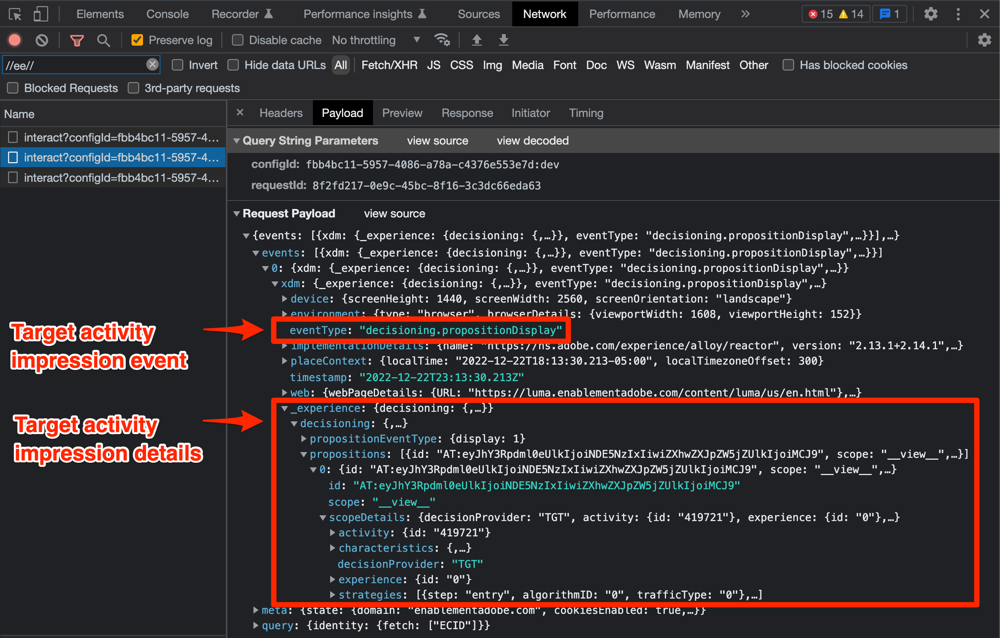

# Render Adobe Target Visual Experience Composer (VEC) activities

Target activities are set up using either the Visual Experience Composer (VEC) or the form-based composer. The Platform Web SDK can retrieve and apply VEC-based activities to the page just like at.js. For this part of the migration, you will:

* Install the Visual Editing Helper browser extension
* Execute a `sendEvent` call with the Platform Web SDK to request activities.
* Update any references from your at.js implementation that use `getOffers()` to execute a Target `pageLoad` request.

## Visual Editing Helper browser extension

The Adobe Experience Cloud Visual Editing Helper browser extension for Google Chrome lets you load websites reliably within the Adobe Target Visual Experience Composer (VEC) to rapidly author and QA web experiences.

The Visual Editing Helper browser extension works with web sites that use at.js or Platform Web SDK.

>[!IMPORTANT]
>
>The new Visual Editing Helper extension replaces the previous [Target VEC Helper browser extension](https://experienceleague.adobe.com/docs/target/using/experiences/vec/troubleshoot-composer/vec-helper-browser-extension.html). If the older VEC Helper extension is installed, it should be removed or disabled before using the Visual Editing Helper extension.

### Obtain and install the Visual Editing Helper

1. Navigate to the [Adobe Experience Cloud Visual Editing Helper browser extension in the Chrome Web Store](https://chrome.google.com/webstore/detail/adobe-experience-cloud-vi/kgmjjkfjacffaebgpkpcllakjifppnca).
1. Click Add to **Chrome** > **Add Extension**.
1. Open the VEC in Target.
1. To use the extension, click the Visual Editing Helper browser extension icon  in your Chrome browser's toolbar while in the VEC or QA Mode.

The Visual Editing Helper is automatically enabled when a website is opened in the Target VEC to power authoring. The extension doesn't have any conditional settings. The extension handles all the settings automatically, including SameSite cookies settings.

Refer to the dedicated documentation for more information about the [Visual Editing Helper extension](https://experienceleague.adobe.com/docs/target/using/experiences/vec/troubleshoot-composer/visual-editing-helper-extension.html) and [troubleshooting the Visual Experience Composer](https://experienceleague.adobe.com/docs/target/using/experiences/vec/troubleshoot-composer/troubleshoot-composer.html).

## Request and apply content automatically

After the Platform Web SDK is configured on the page, you can request content from Target. Unlike at.js which can be configured to automatically request content when the library loads, the Platform Web SDK requires you to explicitly execute a command.

If your at.js implementation has the `pageLoadEnabled` setting set to `true` which enables automatic rendering of VEC-based activities, then you would execute the following `sendEvent` command with the Platform Web SDK:

```Javascript
alloy("sendEvent", {
  "renderDecisions": true
});
```

>[!TIP]
>
> When using the tags feature (formerly Launch) to implement Web SDK, 'sendEvent' commands for VEC activities can be implemented in a rule using the [!UICONTROL Send event] action type with the [!UICONTROL Render visual personalization decisions] option selected.

When the Platform Web SDK renders an activity to the page with `renderDecisions` set to `true`, an additional notification call fires automatically to increment an impression and attribute the visitor to the activity. This call uses an event type with the value `decisioning.propositionDisplay`.



## Request and apply content on demand

Some Target at.js implementations may have `pageLoadEnabled` set to `false` and instead use the `getOffers()` function to execute a `pageLoad` request. This type of setup is used if your implementation requires additional processing of the `getOffers()` response before applying content to the page or to request content for multiple locations in a single call.

The following code uses `getOffers()` and `applyOffers()` to apply VEC-based activities on demand instead of automatically upon library load.

```JavaScript
adobe.target.getOffers({
  request: {
    execute: {
      pageLoad: {}
    }
  }
}).
then(response => adobe.target.applyOffers({ response: response }));
```

The Platform Web SDK does not have a specific `pageLoad` event. All requests for Target content are controlled with the `decisionScopes` option with the `sendEvent` command. The `__view__` scope serves the purpose of the `pageLoad` request. An equivalent Platform Web SDK `sendEvent` approach would be:

1. Execute a `sendEvent` command which includes the `__view__` decision scope
1. Apply the returned content to the page with the `applyPropositions` command
1. Execute a `sendEvent` command with the `decisioning.propositionDisplay` event type and proposition details to increment an impression

```Javascript
alloy("sendEvent", {
  // Request the special "__view__" scope for target-global-mbox / pageLoad
  decisionScopes: ["__view__"]
}).then(function(result) {
  // Check if content (propositions) were returned
  if (result.propositions) {
    var retrievedPropositions = result.propositions;
    // Apply propositions to the page
    return alloy("applyPropositions", {
      propositions: retrievedPropositions
    }).then(function(applyPropositionsResult) {
      var renderedPropositions = applyPropositionsResult.propositions;
      // Send a display notification with the sendEvent command
      alloy("sendEvent", {
        "xdm": {
          "eventType": "decisioning.propositionDisplay",
          "_experience": {
            "decisioning": {
              "propositions": renderedPropositions
            }
          }
        }
      });
    });
  }
});
```

>[!NOTE]
>
>It is possible to [manually render modifications](https://experienceleague.adobe.com/docs/experience-platform/edge/personalization/rendering-personalization-content.html#manually-rendering-content) made in the Visual Experience Composer. Manual rendering of VEC-based modifications is not common. Check if your at.js implementation uses the `getOffers()` function to manually execute a Target `pageLoad` request without using `applyOffers()` to apply the content to the page.

The Platform Web SDK offers developers a great deal of flexibility with requesting and rendering content. Refer to the [dedicated documentation about rendering personalized content](https://experienceleague.adobe.com/docs/experience-platform/edge/personalization/rendering-personalization-content.html) for additional options and details.

## Implementation example

The foundational Platform Web SDK implementation is now complete. Our basic example page with automatic Target content rendering enabled should look like this:

```HTML
<!doctype html>
<html>
<head>
  <title>Example page</title>
  <!--Data Layer to enable rich data collection and targeting-->
  <script>
    var digitalData = { 
      // Data layer information goes here
    };
  </script>

  <!--Third party libraries that may be used by Target offers and modifications-->
  <script src="https://ajax.googleapis.com/ajax/libs/jquery/3.6.1/jquery.min.js"></script>

  <!--Prehiding snippet for Target with asynchronous Web SDK deployment-->
  <script>
    !function(e,a,n,t){var i=e.head;if(i){
    if (a) return;
    var o=e.createElement("style");
    o.id="alloy-prehiding",o.innerText=n,i.appendChild(o),setTimeout(function(){o.parentNode&&o.parentNode.removeChild(o)},t)}}
    (document, document.location.href.indexOf("mboxEdit") !== -1, ".body { opacity: 0 !important }", 3000);
  </script>

  <!--Platform Web SDK base code-->
  <script>
    !function(n,o){o.forEach(function(o){n[o]||((n.__alloyNS=n.__alloyNS||
    []).push(o),n[o]=function(){var u=arguments;return new Promise(
    function(i,l){n[o].q.push([i,l,u])})},n[o].q=[])})}
    (window,["alloy"]);
  </script>

  <!--Platform Web SDK loaded asynchonously. Change the src to use the latest supported version.-->
  <script src="https://cdn1.adoberesources.net/alloy/2.6.4/alloy.min.js" async></script>
  
  <!--Configure Platform Web SDK then send event-->
  <script>
    alloy("configure", {
      "edgeConfigId": "ebebf826-a01f-4458-8cec-ef61de241c93",
      "orgId":"ADB3LETTERSANDNUMBERS@AdobeOrg"
    });
    
    // Send an event to the Adobe edge network and render Target content automatically 
    alloy("sendEvent", {
      "renderDecisions": true
    });
  </script>
</head>
<body>
  <h1 id="title">Home Page</h1><br><br>
  <p id="bodyText">Navigation</p><br><br>
  <a id="home" class="navigationLink" href="#">Home</a><br>
  <a id="pageA" class="navigationLink" href="#">Page A</a><br>
  <a id="pageB" class="navigationLink" href="#">Page B</a><br>
  <a id="pageC" class="navigationLink" href="#">Page C</a><br>
  <div id="homepage-hero">Homepage Hero Banner Content</div>
</body>
</html>
```

>[!TIP]
>
> When using the tags feature (formerly Launch) to implement Web SDK, the tags embed code replaces the 'Platform Web SDK base code', 'Platform Web SDK loaded asynchronously', and  'Configure Platform Web SDK' sections above. The 'sendEvent' command is made in a rule using the [!UICONTROL Send event] action type with the [!UICONTROL Render visual personalization decisions] option selected.

Next, learn how to request and [render form-based Target activities](render-form-based-activities.md).

>[!NOTE]
>
>We are committed to helping you be successful with your Target migration from at.js to Web SDK. If you run into obstacles with your migration or feel like there is critical information missing in this guide, please let us know by posting in [this Community discussion](https://experienceleaguecommunities.adobe.com/t5/adobe-experience-platform-launch/tutorial-discussion-implement-adobe-experience-cloud-with-web/td-p/444996).
