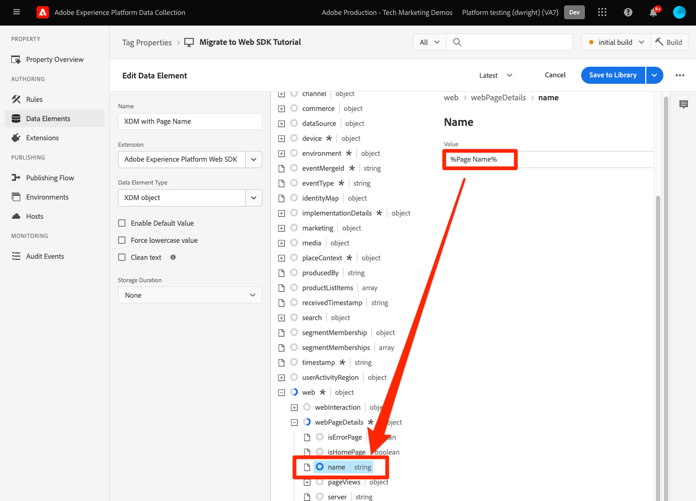
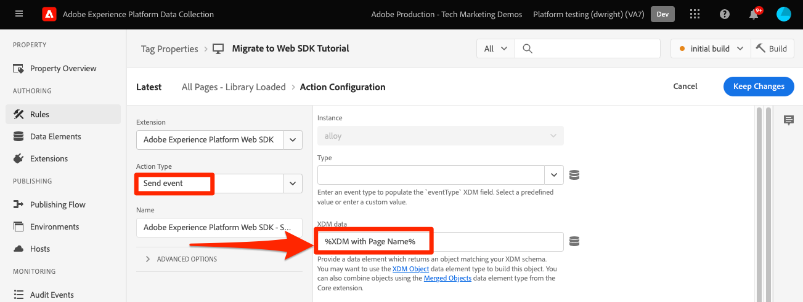
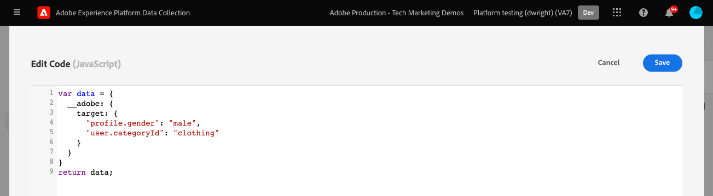
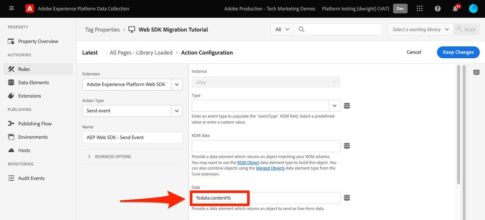
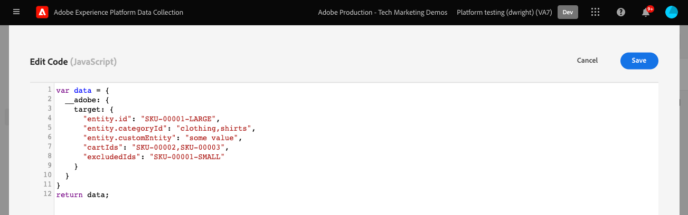
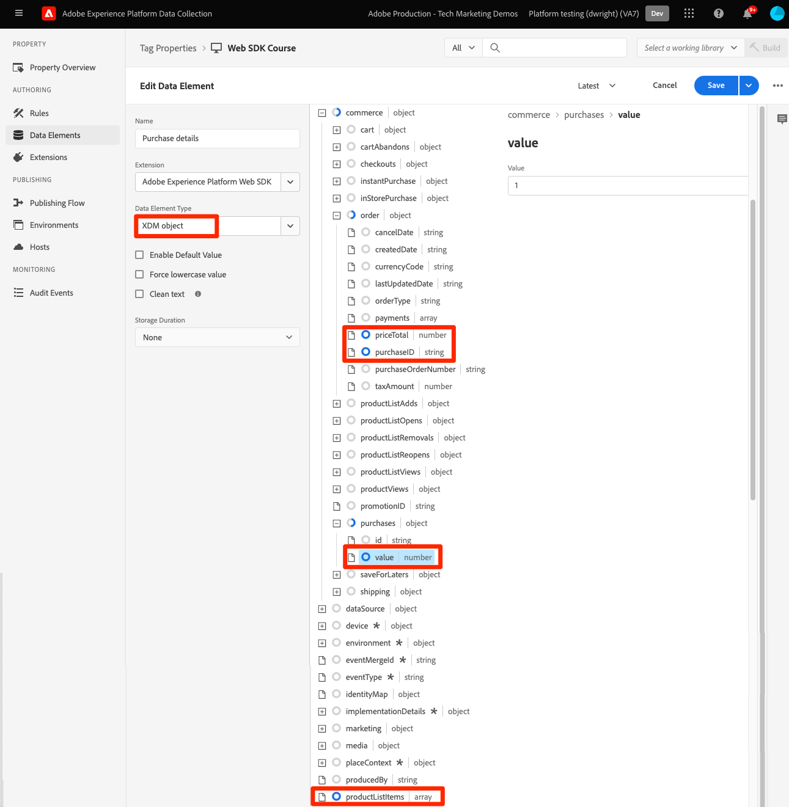
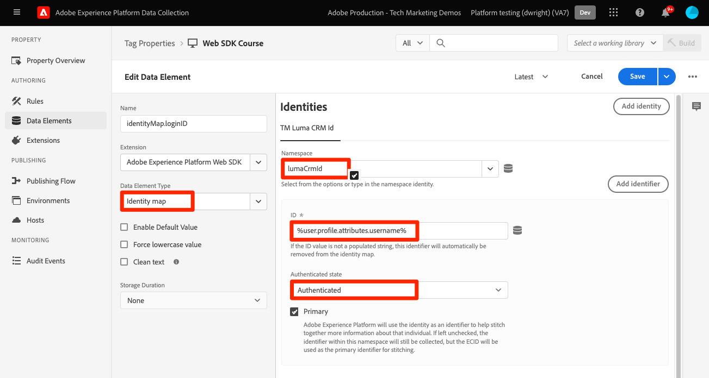
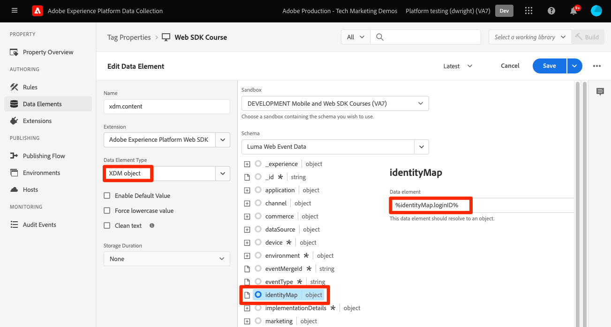
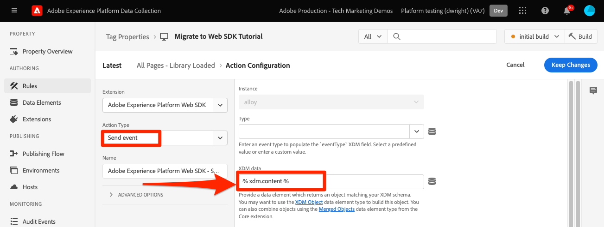
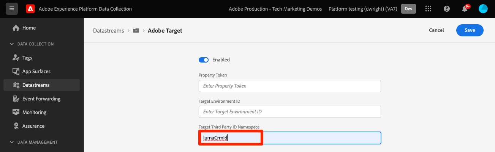

# Send parameters to Target using Platform Web SDK

Target implementations differ across websites due to site architecture, business requirements, and features used. Most Target implementations include passing various parameters for contextual information, audiences, and content recommendations.  

Let's use a simple product details page and an order confirmation page to demonstrate the differences between the libraries when passing parameters to Target.

Assume the following two example pages using at.js:

+++at.js on a Product Details page:

```HTML
<!doctype html>
<html>
<head>
  <title>Product Details - Men's Shirt</title>
  <!--Target parameters -->
  <script>
    targetPageParams = function() {
      return {
        // Property token
        "at_property": "5a0fd9bb-67de-4b5a-0fd7-9cc09f50a58d",
        // Mbox parameters
        "pageName": "product detail",
        // Profile parameters
        "profile.gender": "male",
        "user.categoryId": "clothing",
        // Entity parameters for Target Recomendations
        "entity.id": "SKU-00001-LARGE",
        "entity.categoryId": "clothing,shirts",
        "entity.customEntity": "some value",
        "cartIds": "SKU-00002,SKU-00003",
        "excludedIds": "SKU-00001-SMALL",
        // Customer ID for cross-device profile synching and Customer Attributes
        "mbox3rdPartyId": "TT8675309",
      };
    };
  </script>
  <!--Target at.js library loaded asynchonously-->
  <script src="/libraries/at.js" async></script>
</head>
<body>
  <h1 id="title">Men's Large Shirt</h1>
  <p>SKU: SKU-00001-LARGE</p>
</body>
</html>
```

+++ 


+++at.js on an Order Confirmation page:

```HTML
<!doctype html>
<html>
<head>
  <title>Order Confirmation</title>-->
  <!--Target parameters -->
  <script>
    targetPageParams = function() {
      return {
        // Property token
        "at_property": "5a0fd9bb-67de-4b5a-0fd7-9cc09f50a58d",
        // Order confirmation parameters
        "orderId": "ABC123",
        "productPurchasedId": "SKU-00002,SKU-00003",
        "orderTotal": 1337.89,
        // Customer ID for cross-device profile synching and Customer Attributes
        "mbox3rdPartyId": "TT8675309",
      };
    };
  </script>
  <!--Target at.js library loaded asynchonously-->
  <script src="/libraries/at.js" async></script>
</head>
<body>
  <h1 id="title">Order Confirmation</h1>
  <p>Thank you for your order</p>
</body>
</html>
```

+++ 


## Parameter-mapping summary

The Target parameters for these pages are sent differently using the Platform Web SDK. There are multiple ways to pass parameters to Target using at.js:

- Set with `targetPageParams()` function for the page load event 
- Set with `targetPageParamsAll()` function for all Target requests on the page
- Send parameters directly with the `getOffer()` function for a single location
- Send parameters directly with the `getOffers()` function for one or more locations

For these examples, the `targetPageParams()` approach is used.

The Platform Web SDK provides a single consistent way to send data without the need for extra functions. All parameters must be passed in the payload with the `sendEvent` command.

Parameters passed with the Platform Web SDK `sendEvent` payload fall under two categories:

1. Automatically mapped from the `xdm` object
1. Manually passed using the `data.__adobe.target` object

The table below outlines how the example parameters would be remapped using Platform Web SDK: 

| Example at.js parameter | Platform Web SDK option | Notes |
| --- | --- | --- |
| `at_property` | N/A | Property tokens are configured in the [datastream](https://experienceleague.adobe.com/docs/experience-platform/edge/datastreams/configure.html#target) and cannot be set in the `sendEvent` call. |
| `pageName` | `xdm.web.webPageDetails.name` | All Target mbox parameters must be passed as part of the `xdm` object and conform to a schema using the XDM ExperienceEvent class. Mbox parameters cannot be passed as part of the `data` object.|
| `profile.gender` | `data.__adobe.target.profile.gender` | All Target profile parameters must be passed as part of the `data` object and prefixed with `profile.` to be mapped appropriately. |
| `user.categoryId` | `data.__adobe.target.user.categoryId` | Reserved parameter used for Target's Category Affinity feature which must be passed as part of the `data` object. |
| `entity.id` | `data.__adobe.target.entity.id` <br>OR<br> `xdm.productListItems[0].SKU` | Entity IDs are used for Target Recommendations behavioral counters. These entity IDs can either be passed as part of the `data` object or automatically mapped from the first item in the `xdm.productListItems` array if your implementation uses that field group.|
| `entity.categoryId` | `data.__adobe.target.entity.categoryId` | Entity category IDs can be passed as part of the `data` object. | 
| `entity.customEntity` | `data.__adobe.target.entity.customEntity` | Custom entity parameters are used for updating the Recommendations product catalog. These custom parameters must be passed as part of the `data` object. | 
| `cartIds` | `data.__adobe.target.cartIds` | Used for Target's cart-based recommendations algorithms. | 
| `excludedIds` | `data.__adobe.target.excludedIds` | Used to prevent specific entity IDs from returning in a recommendations design. | 
| `mbox3rdPartyId` | Set in the identityMap. | Used for synching Target profiles across devices and Customer Attributes. The namespace to use for the customer ID must be specified in the [Target configuration of the datastream](https://experienceleague.adobe.com/docs/experience-platform/edge/personalization/adobe-target/using-mbox-3rdpartyid.html). | 
| `orderId` | `xdm.commerce.order.purchaseID` | Used for identifying a unique order for Target conversion tracking. | 
| `orderTotal` | `xdm.commerce.order.priceTotal` | Used for tracking order totals for Target conversion and optimization goals. | 
| `productPurchasedId` | `data.__adobe.target.productPurchasedId` <br>OR<br> `xdm.productListItems[0-n].SKU` | Used for Target conversion tracking and recommendations algorithms. Refer to the [entity parameters](#entity-parameters) section below for details. | 
| `mboxPageValue` | `data.__adobe.target.mboxPageValue` | Used for the [custom scoring](https://experienceleague.adobe.com/docs/target/using/activities/success-metrics/capture-score.html) activity goal. | 

{style="table-layout:auto"}

## Custom parameters

Custom mbox parameters must be passed as XDM data with the `sendEvent` command. It is important to ensure that the XDM schema includes all fields required for your Target implementation. 

at.js example using `targetPageParams()`:

```JavaScript
targetPageParams = function() {
  return {
    "pageName": "product detail"
  };
};
```

Platform Web SDK JavaScript examples using `sendEvent` command:

>[!BEGINTABS]

>[!TAB JavaScript]

```JavaScript
alloy("sendEvent", {
  "xdm": {
    "web": {
      "webPageDetails": {
        // Other attributes included according to xdm schema
        "name": "product detail"
      }
    }
  }
});
```

>[!TAB Tags]

In tags, first use an [!UICONTROL XDM object] data element to map to the XDM field:

{zoomable="yes"}

And then include your [!UICONTROL XDM object] in your [!UICONTROL Send event] [!UICONTROL action] (multiple [!UICONTROL XDM objects] can be [merged](https://experienceleague.adobe.com/docs/experience-platform/tags/extensions/client/core/overview.html?lang=en#merged-objects)):

{zoomable="yes"}

>[!ENDTABS]


>[!NOTE]
>
>Because custom mbox parameters are part of `xdm` object you need to update any audiences, activities, or profile scripts that reference these mbox parameters using their new names. See the [Update Target audiences and profile scripts for Platform Web SDK compatibility](update-audiences.md) page of this tutorial for more information.


## Profile parameters

Target profile parameters must be passed under the `data.__adobe.target` object in the Platform Web SDK `sendEvent` command payload.

Similar to at.js, all profile parameters must also be prefixed with `profile.` for the value to be properly stored as a persistent Target profile attribute. The reserved `user.categoryId` parameter for Target's Category Affinity capability is prefixed with `user.`.

at.js example using `targetPageParams()`:

```JavaScript
targetPageParams = function() {
  return {
    "profile.gender": "male",
    "user.categoryId": "clothing"
  };
};
```

Platform Web SDK examples using `sendEvent` command:

>[!BEGINTABS]

>[!TAB JavaScript]

```JavaScript
alloy("sendEvent", {
  "data": {
    "__adobe": {
      "target": {
        "profile.gender": "male",
        "user.categoryId": "clothing"
      }
    }
  }
});
```

>[!TAB Tags]

In tags, first create a data element to define the `data.__adobe.target` object:

{zoomable="yes"}

And then include your data object in your [!UICONTROL Send event] [!UICONTROL action] (multiple [!UICONTROL objects] can be [merged](https://experienceleague.adobe.com/docs/experience-platform/tags/extensions/client/core/overview.html?lang=en#merged-objects)):

{zoomable="yes"}

>[!ENDTABS]

## Entity parameters

Entity parameters are used to pass behavioral data and supplemental catalog information for Target Recommendations. Similar to profile parameters, all entity parameters must be passed under the `data.__adobe.target` object in the Platform Web SDK `sendEvent` command payload.

Entity parameters for a specific item must be prefixed with `entity.` for proper data capture. The reserved `cartIds` and `excludedIds` parameters for recommendations algorithms should not be prefixed and the value for each must contain a comma-separated list of entity IDs.

at.js example using `targetPageParams()`:

```JavaScript
targetPageParams = function() {
  return {
    "entity.id": "SKU-00001-LARGE",
    "entity.categoryId": "clothing,shirts",
    "entity.customEntity": "some value",
    "cartIds": "SKU-00002,SKU-00003",
    "excludedIds": "SKU-00001-SMALL"
  };
};
```

Platform Web SDK examples using `sendEvent` command:

>[!BEGINTABS]

>[!TAB JavaScript]

```JavaScript
alloy("sendEvent", {
  "data": {
    "__adobe": {
      "target": {
        "entity.id": "SKU-00001-LARGE",
        "entity.categoryId": "clothing,shirts",
        "entity.customEntity": "some value",
        "cartIds": "SKU-00002,SKU-00003",
        "excludedIds": "SKU-00001-SMALL"
      }
    }
  }
});
```

>[!TAB Tags]

In tags, first create a data element to define the `data.__adobe.target` object:

{zoomable="yes"}

And then include your data object in your [!UICONTROL Send event] [!UICONTROL action] (multiple [!UICONTROL objects] can be [merged](https://experienceleague.adobe.com/docs/experience-platform/tags/extensions/client/core/overview.html?lang=en#merged-objects)):

{zoomable="yes"}

>[!ENDTABS]


All [entity parameters](https://experienceleague.adobe.com/docs/target/using/recommendations/entities/entity-attributes.html) supported by at.js are also supported by the Platform Web SDK.

>[!NOTE]
>
>If the `commerce` field group is used and the `productListItems` array is included in the XDM payload, then the first `SKU` value in this array is mapped to `entity.id` for the purposes of incrementing a product view.


## Purchase parameters

Purchase parameters are passed on an order confirmation page after a successful order and are used for Target conversion and optimization goals. With a Platform Web SDK implementation, these parameters and are automatically mapped from XDM data passed as part of the `commerce` field group.

at.js example using `targetPageParams()`:

```JavaScript
targetPageParams = function() {
  return {
    "orderId": "ABC123",
    "productPurchasedId": "SKU-00002,SKU-00003"
    "orderTotal": 1337.89
  };
};
```

Purchase information is passed to Target when the `commerce` field group has `purchases.value` set to `1`. The order ID and order total are automatically mapped from the `order` object. If the `productListItems` array is present, then the `SKU` values are use for `productPurchasedId`.

Platform Web SDK examples using `sendEvent` command:

>[!BEGINTABS]

>[!TAB JavaScript]

```JavaScript
alloy("sendEvent", {
  "xdm": {
    "commerce": {
      "order": {
        "purchaseID": "ABC123",
        "priceTotal": 1337.89
      },
      "purchases": {
        "value": 1
      }
    },
    "productListItems": [{
      "SKU": "SKU-00002"
    }, {
      "SKU": "SKU-00003"
    }]
  }
});
```

>[!TAB Tags]

In tags, first use an [!UICONTROL XDM object] data element to map to the XDM fields:

{zoomable="yes"}

And then include your [!UICONTROL XDM object] in your [!UICONTROL Send event] [!UICONTROL action] (multiple [!UICONTROL XDM objects] can be [merged](https://experienceleague.adobe.com/docs/experience-platform/tags/extensions/client/core/overview.html?lang=en#merged-objects)):

{zoomable="yes"}

>[!ENDTABS]


>[!NOTE]
>
>The `productPurchasedId` value can also be passed as a comma-separated list of entity IDs under the `data` object.


## Customer Id (mbox3rdPartyId)

Target allows profile synching across devices and systems using a single customer Id. With at.js, this could be set as the `mbox3rdPartyId` in the Target request or as the first customer id sent to the Experience Cloud Identity Service. Unlike with at.js, a Platform Web SDK implementation allows you to specify which customer ID to use as the `mbox3rdPartyId` if there are multiple. For example, if your business has a global customer ID and separate customer IDs for different lines of business, you can configure which ID Target should use.

There are a few steps to set up ID synching for Target cross-device and Customer Attributes use cases:

1. Create an **[!UICONTROL identity namespace]** for the customer ID in **[!UICONTROL Identities]** screen of Data Collection or Platform
1. Make sure that the **[!UICONTROL alias]** in Customer Attributes matches the **[!UICONTROL identity symbol]** of your namespace
1. Specify the **[!UICONTROL identy symbol]** as the **[!UICONTROL Target Third Party ID Namespace]** in the Target configuration of the datastream
1. Execute a `sendEvent` command using the `identityMap` field group

at.js example using `targetPageParams()`:

```JavaScript
targetPageParams = function() {
  return {
    "mbox3rdPartyId": "TT8675309"
  };
};
```

Platform Web SDK examples using `sendEvent` command:

>[!BEGINTABS]

>[!TAB JavaScript]

```JavaScript
alloy("sendEvent", {
  "xdm": {
    "identityMap": {
      "GLOBAL_CUSTOMER_ID": [{
        "id": "TT8675309",
        "authenticatedState": "authenticated"
      }]
    }
  }
});
```

>[!TAB Tags]

The [!UICONTROL ID] value, [!UICONTROL Authenticated state] and [!UICONTROL Namespace] are captured in an [!UICONTROL Identity map] data element:
{zoomable="yes"}

The [!UICONTROL Identity map] data element is then used to set the [!UICONTROL identityMap] field in the [!UICONTROL XDM object] data element:
{zoomable="yes"}

The [!UICONTROL XDM object] is then included in the [!UICONTROL Send event] action of a rule:

{zoomable="yes"}

In your datastream's Adobe Target service, be sure to set the [!UICONTROL Target Third Party ID Namespace] to the same namespace used in the [!UICONTROL Identity map] data element:
{zoomable="yes"}

>[!ENDTABS]

## Platform Web SDK example

Now that you understand how the different Target parameters are mapped using the Platform Web SDK, our two example pages could be migrated from at.js to the Platform Web SDK as shown below. The example pages include the following:

- Target prehiding snippet for an asynchronous library implementation
- The Platform Web SDK base code
- The Platform Web SDK JavaScript library
- A `configure` command to initialize the library
- A `sendEvent` command to send data and request Target content to be rendered

+++Web SDK on a Product Details page:

```HTML
<!doctype html>
<html>
<head>
  <title>Product Details - Men's Shirt</title>

  <!--Prehiding snippet for Target with asynchronous Web SDK deployment-->
  <script>
    !function(e,a,n,t){var i=e.head;if(i){
    if (a) return;
    var o=e.createElement("style");
    o.id="alloy-prehiding",o.innerText=n,i.appendChild(o),setTimeout(function(){o.parentNode&&o.parentNode.removeChild(o)},t)}}
    (document, document.location.href.indexOf("mboxEdit") !== -1, ".body { opacity: 0 !important }", 3000);
  </script>

  <!--Platform Web SDK base code-->
  <script>
    !function(n,o){o.forEach(function(o){n[o]||((n.__alloyNS=n.__alloyNS||
    []).push(o),n[o]=function(){var u=arguments;return new Promise(
    function(i,l){n[o].q.push([i,l,u])})},n[o].q=[])})}
    (window,["alloy"]);
  </script>

  <!--Platform Web SDK loaded asynchonously. Change the src to use the latest supported version.-->
  <script src="https://cdn1.adoberesources.net/alloy/2.6.4/alloy.min.js" async></script>

  <!--Configure Platform Web SDK and send event-->
  <script>
    alloy("configure", {
      "edgeConfigId": "ebebf826-a01f-4458-8cec-ef61de241c93",
      "orgId":"ADB3LETTERSANDNUMBERS@AdobeOrg"
    });
    alloy("sendEvent", {
      "renderDecisions": true,
      "xdm": {
        "identityMap": {
          "GLOBAL_CUSTOMER_ID": [{
            "id": "TT8675309",
            "authenticatedState": "authenticated"
          }]
        },
        "web": {
          "webPageDetails": {
            // Other attributes included according to XDM schema
            "pageName": "product detail"
          }
        }
      },
      "data": {
        "__adobe": {
          "target": {
            "profile.gender": "male",
            "user.categoryId": "clothing",
            "entity.id": "SKU-00001-LARGE",
            "entity.categoryId": "clothing,shirts",
            "entity.customEntity": "some value",
            "cartIds": "SKU-00002,SKU-00003",
            "excludedIds": "SKU-00001-SMALL"
          }
        }
      }
    });
  </script>
</head>
<body>
  <h1 id="title">Men's Large Shirt</h1>
  <p>SKU: SKU-00001-LARGE</p>
</body>
</html>
```

+++

+++Web SDK on an Order Confirmation page:

```HTML
<!doctype html>
<html>
<head>
  <title>Order Confirmation</title>


  <!--Prehiding snippet for Target with asynchronous Web SDK deployment-->

  <script>
    !function(e,a,n,t){var i=e.head;if(i){
    if (a) return;
    var o=e.createElement("style");
    o.id="alloy-prehiding",o.innerText=n,i.appendChild(o),setTimeout(function(){o.parentNode&&o.parentNode.removeChild(o)},t)}}
    (document, document.location.href.indexOf("mboxEdit") !== -1, ".body { opacity: 0 !important }", 3000);
  </script>

  <!--Platform Web SDK base code-->

  <script>
    !function(n,o){o.forEach(function(o){n[o]||((n.__alloyNS=n.__alloyNS||
    []).push(o),n[o]=function(){var u=arguments;return new Promise(
    function(i,l){n[o].q.push([i,l,u])})},n[o].q=[])})}
    (window,["alloy"]);
  </script>
  <!--Platform Web SDK loaded asynchonously. Change the src to use the latest supported version.-->
  <script src="https://cdn1.adoberesources.net/alloy/2.6.4/alloy.min.js" async></script>

  <!--Configure Platform Web SDK and send event-->
  <script>
    alloy("configure", {
      "edgeConfigId": "ebebf826-a01f-4458-8cec-ef61de241c93",
      "orgId":"ADB3LETTERSANDNUMBERS@AdobeOrg"
    });
    alloy("sendEvent", {
      "xdm": {
        "identityMap": {
          "GLOBAL_CUSTOMER_ID": [{
            "id": "TT8675309",
            "authenticatedState": "authenticated"
          }]
        },
        "commerce": {
          "order": {
            "purchaseID": "ABC123",
            "priceTotal": 1337.89
          },
          "purchases": {
            "value": 1
          }
        },
        "productListItems": [{
          "SKU": "SKU-00002"
        }, {
          "SKU": "SKU-00003"
        }]
      }
    });
  </script>
</head>
<body>
  <h1 id="title">Order Confirmation</h1>
  <p>Thank you for your order</p>
</body>
</html>
```

+++

Next, learn how to [track Target conversion events](track-events.md) with the Platform Web SDK.

>[!NOTE]
>
>We are committed to helping you be successful with your Target migration from at.js to Web SDK. If you run into obstacles with your migration or feel like there is critical information missing in this guide, please let us know by posting in [this Community discussion](https://experienceleaguecommunities.adobe.com/t5/adobe-experience-platform-launch/tutorial-discussion-implement-adobe-experience-cloud-with-web/td-p/444996).
