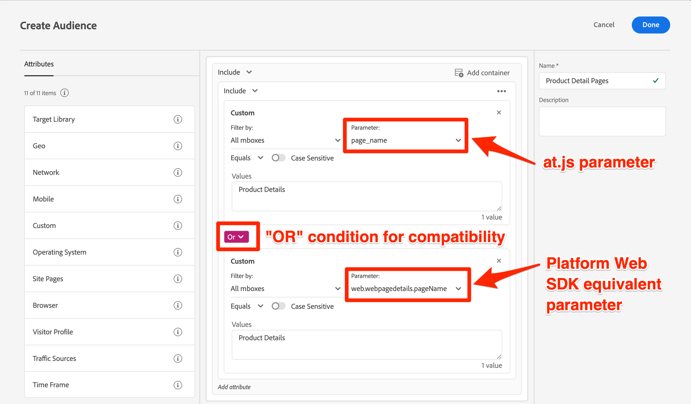

# Update Target audiences and profile scripts for Platform Web SDK compatibility

After you complete the technical updates to migrate Target to the Platform Web SDK, you may need to update some of your audiences, profile scripts, and activities to ensure a smooth transition. 

All Target mbox parameters must be passed in XDM format with a Platform Web SDK implementation. Before publishing your changes to production, you should:

* Update audiences that use mbox parameters
* Update profile scripts that use mbox parameters
* Update any offers and activities use mbox parameter token replacement (E.g. `${mbox.parameter_name}`)

## Adjust audiences

Any audiences that use custom mbox parameters should be updated to use the new XDM parameter names. For example, a custom parameter for `page_name` would likely be mapped to `web.webpagedetails.pageName`.

One approach to ensure compatibility with both at.js and Platform Web SDK is to update any relevant audiences so that `OR` conditions are used, as shown below:



## Edit profile scripts
 
Profile scripts should be updated to reference new XDM parameter names, similar to audiences. Aside from the change of mbox parameter names, there is no difference in the way the way profile scripts work between an at.js and a Platform Web SDK implementation.

One approach to ensure compatibility is to use `OR` conditions in your profile script code.

Example profile script: 

```Javascript
if(mbox.param('pageName') == 'Product Details'){
  return true
}
```

Updated profile script for Platform Web SDK compatibility:

```Javascript
if((mbox.param('pageName') == 'Product Details') || (mbox.param('page.webpagedetails.pageName') =='Product Details')){
  return true
}
```

For more information and best practices, refer to the dedicated documentation about about [profile scripts](https://experienceleague.adobe.com/docs/target/using/audiences/visitor-profiles/profile-parameters.html). 

## Update parameter tokens for dynamic content

If you have any offers, recommendations designs, or activities that leverage [dynamic content replacement](https://experienceleague.adobe.com/docs/target/using/experiences/offers/passing-profile-attributes-to-the-html-offer.html), they may need to be updated accordingly to account for the new XDM parameter names.

Depending on how you are using token replacement for mbox parameters, you may be able to enhance your existing setup to account for both old and new parameter names. In other situations, such as JSON offers where custom JavaScript code is not possible, you will likely need to create copies or make updates after the migration is complete and live on your production site.

Example JSON offer:

```JSON
{
  "pageName" : "${mbox.page_name}",
  "layoutVariation" : "grid"
}
```

Example JSON offer using Platform Web SDK parameter names:

```JSON
{
  "pageName" : "${mbox.web.webpagedetails.pageName}",
  "layoutVariation" : "grid"
}
```

If you choose to make adjustments after the migration to account for the new XDM mbox parameter names, be sure to pause any impacted activities during the migration event to help prevent any display errors to visitors.

Next, learn how to [validate the Target implementation](validate.md).

>[!NOTE]
>
>We are committed to helping you be successful with your Target migration from at.js to Web SDK. If you run into obstacles with your migration or feel like there is critical information missing in this guide, please let us know by posting in in [this Community discussion](https://experienceleaguecommunities.adobe.com/t5/adobe-experience-platform-launch/tutorial-discussion-implement-adobe-experience-cloud-with-web/td-p/444996).