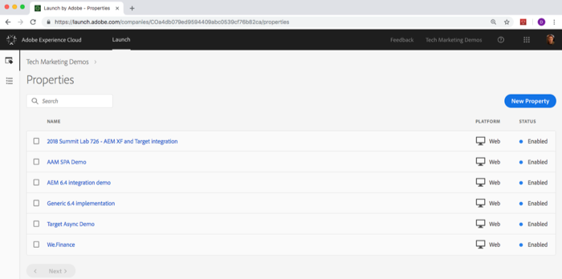

# Create a Launch Property

Adobe Experience Platform Launch is the next generation of mobile SDK and website tag management capabilities. Launch gives customers a simple way to deploy and manage all of the analytics, marketing, and advertising solutions necessary to power relevant customer experiences. There is no additional charge for Launch. It is available to any Adobe Experience Cloud customer.

In this lesson, you will create a Launch property for mobile apps.

>[!NOTE]
>
>Adobe Experience Platform Launch is being integrated into Adobe Experience Platform as a suite of data collection technologies. Several terminology changes have rolled out in the interface which you should be aware of while using this content:
>
> * Platform Launch (Client Side) is now **[[!DNL tags]](https://experienceleague.adobe.com/docs/launch/using/home.html)** 
> * Platform Launch Server Side is now **[[!DNL event forwarding]](https://experienceleague.adobe.com/docs/launch/using/server-side-info/server-side-overview.html)** 
> * Edge configurations  are now **[[!DNL datastreams]](https://experienceleague.adobe.com/docs/experience-platform/edge/fundamentals/datastreams.html)**

## Prerequisites

In order to complete the next few lessons, you must have permission to Develop, Approve, Publish, Manage Extensions, and Manage Environments in Launch. If you are unable to complete any of these steps because the user interface options are not available to you, reach out to your Experience Cloud Administrator to request access. For more information on Launch permissions, see [the documentation](https://experienceleague.adobe.com/docs/launch/using/reference/admin/user-permissions.html).

## Learning Objectives

At the end of this lesson, you will be able to:

* Log into the Launch user interface
* Create a new Launch mobile property
* Configure a Launch mobile property

## Go to Launch

**To get to Launch**

1. Log into the [Adobe Experience Cloud](https://experiencecloud.adobe.com)

1. Click the  icon to open the solution switcher

1. Select **[!UICONTROL Launch]** from the menu

    

1. Under **[!UICONTROL Adobe Experience Cloud Launch]**, click the **[!UICONTROL Go to Launch]** button

   

You should now see the `Properties` screen (if no properties have ever been created in the account, this screen might be empty):

If you use Launch frequently, you can also bookmark the following URL and log in directly [https://launch.adobe.com](https://launch.adobe.com)

## Create a Property

A property is basically a container that you fill with extensions, rules, data elements, and libraries as you deploy tags to your app. A single mobile property can be used across multiple app platforms (e.g. iOS and Android) provided the apps contain similar functionality and require the same solutions to be implemented.  For more information on creating properties, see ["Set up a mobile property"](https://aep-sdks.gitbook.io/docs/getting-started/create-a-mobile-property) in the product documentation.

**To Create a Property**

1. Click the **[!UICONTROL New Property]** button:

    

1. Name your property (e.g. `Mobile Tutorial`)
1. As the platform, click **[!UICONTROL Mobile]**
1. Click the **[!UICONTROL Save]** button

   

Your new property should display on Properties page. Note that if you check the box next to the property name, options to **[!UICONTROL Configure]** or **[!UICONTROL Delete]** the property appear above the property list. Click on the name of your property (e.g. `Mobile Tutorial`) to open the `Overview` screen.

[Next "Add Extensions" >](launch-add-extensions.md)
