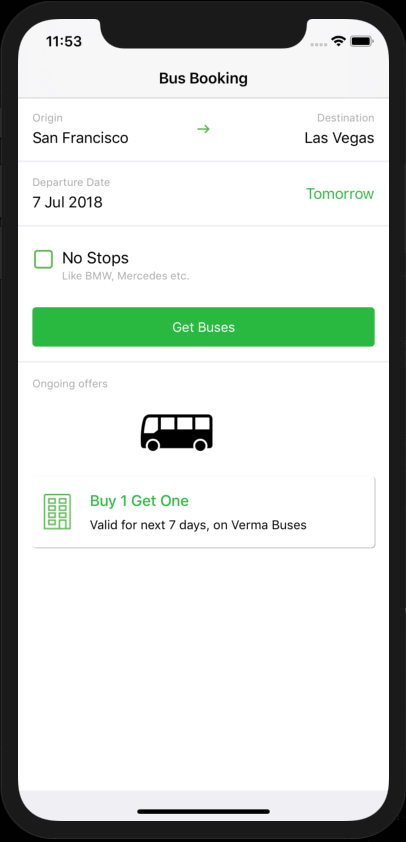

# Overview

_Implement the Experience Cloud in Mobile iOS Swift&trade; Applications_ is the perfect starting point for mobile app developers who want to learn how to implement the Adobe Experience Cloud solutions in their iOS Swift apps.

Each lesson contains how-to exercises and foundational information to help you implement the Experience Cloud and understand its value. A demo Swift app is provided for you to complete the tutorial, so you can learn the underlying techniques in a safe environment. After completing this tutorial, you should be ready to start implementing all of your Experience Cloud solutions in your own iOS Swift app!

After completing this tutorial, you will be able to:

* Create a mobile tag property

* Install a tag property in a Swift app

* Implement the following Adobe Experience Cloud solutions:
  * **[Adobe Experience Platform Identity Service](id-service.md)**
  * **[Adobe Target](target.md)**
  * **[Adobe Analytics](analytics.md)**
  * **[Adobe Audience Manager](audience-manager.md)**

* Publish changes in tags through development, staging, and production environments

>[!NOTE]
>
>Adobe Experience Platform Launch is being integrated into Adobe Experience Platform as a suite of data collection technologies. Several terminology changes have rolled out in the interface which you should be aware of while using this content:
>
> * Platform Launch (Client Side) is now **[[!DNL tags]](https://experienceleague.adobe.com/docs/experience-platform/tags/home.html)** 
> * Platform Launch Server Side is now **[[!DNL event forwarding]](https://experienceleague.adobe.com/docs/experience-platform/tags/event-forwarding/overview.html)** 
> * Edge configurations  are now **[[!DNL datastreams]](https://experienceleague.adobe.com/docs/experience-platform/edge/fundamentals/datastreams.html)**

>[!NOTE]
>
>Similar multi-solution tutorials are also available for the following platforms:
>
>* [Implement the Experience Cloud in Mobile iOS Objective-C Applications](/help/tutorial-mobile-ios-objective-c-implementation/overview.md)
>* [Implement the Experience Cloud in Mobile Android&trade; Applications](/help/tutorial-mobile-android-implementation/overview.md)
>* [Implement the Experience Cloud in websites](/help/tutorial-website-implementation/overview.md)

## Prerequisites

In these lessons, it is assumed that you have an Adobe Id and the required permissions to complete the exercises. If not, you may need to reach out to your Experience Cloud Administrator to request access.

* For tags, you must have permission to Develop, Approve, Publish, Manage Extensions, and Manage Environments. For more information on tag user permissions, see [the documentation](https://experienceleague.adobe.com/docs/experience-platform/tags/admin/user-permissions.html).
* For Target, you must have approver-level access to the Adobe Target interface
* For Adobe Analytics, you must know your tracking server and which report suites you will use to complete this tutorial

Also, it is assumed that you are familiar with iOS development in Swift. You do not need to be a Swift expert to complete the lessons, but you will get more out of them if you can comfortably read and understand code.

## About the Lessons

In these lessons, you will implement the Adobe Experience Cloud into a demo app called "[Bus Booking](https://github.com/Adobe-Marketing-Cloud/busbooking-mobileapps)" using your own Experience Cloud Organization. The App has some simple capabilities that will allow you to complete a basic Experience Cloud mobile implementation before you do so in your own app.

## Get the Tools

1. You must use a Mac&reg; to complete this tutorial
1. Download [Xcode](https://developer.apple.com/xcode/)
1. Download the [Bus Booking app](https://github.com/Adobe-Marketing-Cloud/busbooking-mobileapps)
1. Install [Cocoapods](https://guides.cocoapods.org/using/getting-started.html)

Let's get started!

[Next "Create a tag property" >](create-a-property.md)

*Apple, the Apple logo, iPad, iPhone, iPod, and iPod touch are trademarks of Apple Inc., registered in the U.S. and other countries. Swift and the Swift logo are trademarks of Apple Inc.*
