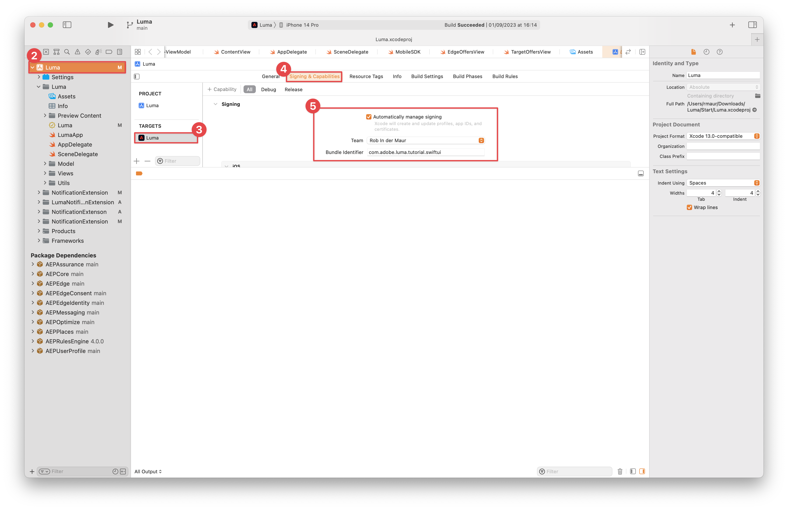

# Assurance

Learn how to set up Adobe Experience Platform Assurance in a mobile app.

Assurance, formally known as Project Griffon, is designed to help you inspect, proof, simulate, and validate how you collect data or serve experiences in your mobile app.

Assurance helps you inspect raw SDK events generated by the Adobe Experience Platform Mobile SDK. All events collected by the SDK are available for inspection. SDK events are loaded in a list view, sorted by time. Each event has a detailed view that provides further detail. Additional views to browse SDK configuration, data elements, Shared States, and SDK extension versions are also provided. Learn more about the [Assurance](https://experienceleague.adobe.com/docs/experience-platform/assurance/home.html) in the product documentation.


## Prerequisites

* Successfully set up the app with SDKs installed and configured.

## Learning objectives

In this lesson, you will:

* Confirm that your organization has access (and request it if you don't).
* Set up your Base URL.
* Add required iOS specific code.
* Connect to a session.

## Confirm access

Confirm that your organization has access to Assurance by completing the following steps:

1. Visit [https://experience.adobe.com/assurance](https://experience.adobe.com/assurance){target="_blank"}.
1. Log in using your Adobe ID credentials for the Experience Cloud.
1. If you see the **[!UICONTROL Sessions]** screen, then you have access. If you see the (beta) access page, select **[!UICONTROL Register]** to register.

## Implement

In addition to the general [SDK installation](install-sdks.md), you completed in the earlier lesson, iOS also requires the following addition to start the Assurance session for your app. 

1. Navigate to **[!UICONTROL Luma]** > **[!UICONTROL Luma]** > **[!UICONTROL SceneDelegate]** in your Xcode's Project navigator.
 
1. Add the following code to `func scene(_ scene: UIScene, openURLContexts URLContexts: Set<UIOpenURLContext>`:

   ```swift
   // Called when the app in background is opened with a deep link.
   if let deepLinkURL = URLContexts.first?.url {
       // Start the Assurance session
       Assurance.startSession(url: deepLinkURL)
   }
   ```

More information can be found [here](https://developer.adobe.com/client-sdks/documentation/platform-assurance-sdk/api-reference/){target="_blank"}.

## Signing

Before you run the application for the first time in Xcode, ensure you update the signing.

1. Open the project in Xcode.
1. Select **[!UICONTROL Luma]** in the Navigator.
1. Select the **[!UICONTROL Luma]** target.
1. Select the **Signing & Capabilities** tab.
1. Configure **[!UICONTROL Automatic manage signing]**, **[!UICONTROL Team]**, and **[!UICONTROL Bundle Identifier]**.

    

## Set up a base URL

1. Go to your project in Xcode.
1. Select **[!UICONTROL Luma]** in the Navigator.
1. Select the **[!UICONTROL Luma]** target.
1. Select the **Info** tab.
1. To add a base URL, scroll down to **URL Types** and select the **+** button.
1. Set **Identifier** to the Bundle Identifier you configured in [Signing](#signing) (for example `com.adobe.luma.tutorial.swiftui`) and **URL Schemes** to `lumatutorialswiftui`.

   

To learn more about URL Schemes in iOS, review [Apple's documentation](https://developer.apple.com/documentation/xcode/defining-a-custom-url-scheme-for-your-app){target="_blank"}.

Assurance works by opening a URL, either via browser or QR code. That URL begins with the base URL  which opens the app and contains additional parameters. Those unique parameters are used to connect the session.


## Connecting to a session

1. Run the application in the simulator or on a connected physical device.
1. Select **[!UICONTROL Assurance]** from the left rail in the Data Collection UI.
1. Select **[!UICONTROL Create Session]**.
1. Select **[!UICONTROL Start]**.
1. Provide a **[!UICONTROL Session Name]** such as `Luma Mobile App Session` and the **[!UICONTROL Base URL]**, which is the URL Schemes you entered in Xcode, followed by `://`. For example: `lumatutorialswiftui://`.
1. Select **[!UICONTROL Next]**.
    
1. In the **[!UICONTROL Create New Session]** modal dialog:
   
   If you're using a physical device: 

   * Select **[!UICONTROL Scan QR Code]**. Use your camera on your physical device to scan the QR code and tap the link to open the app.

     

   If you are using a simulator:

   1. Select **[!UICONTROL Copy Link]**.
   1. Copy the deep link using the copy  button and use the deep link to open the app with Safari in the simulator.
     
    
1. When the app loads, you are presented with a modal dialog asking you to enter the PIN shown in step 7.
   
   

   Enter the PIN and select **[!UICONTROL Connect]**.


1. If the connection was successful, you see:
    * An Assurance icon floating on top of your app.
      
    
    
    * Experience Cloud updates coming through in the Assurance web-based UI, showing:

      1. Experience Events coming from the app.
      1. Details of a selected event.
      1. The device and timeline.

        

If you run into any challenges, please review the [technical](https://developer.adobe.com/client-sdks/documentation/platform-assurance-sdk/){target="_blank"} and [general documentation](https://experienceleague.adobe.com/docs/experience-platform/assurance/home.html){target="_blank"}.

>[!SUCCESS]
>
>You have now set up your app to use Assurance for the remainder of the tutorial.<br/>Thank you for investing your time in learning about Adobe Experience Platform Mobile SDK. If you have questions, want to share general feedback, or have suggestions on future content, please share them on this [Experience League Community discussion post](https://experienceleaguecommunities.adobe.com/t5/adobe-experience-platform-launch/tutorial-discussion-implement-adobe-experience-cloud-in-mobile/td-p/443796)


Next: **[Consent](consent.md)**
