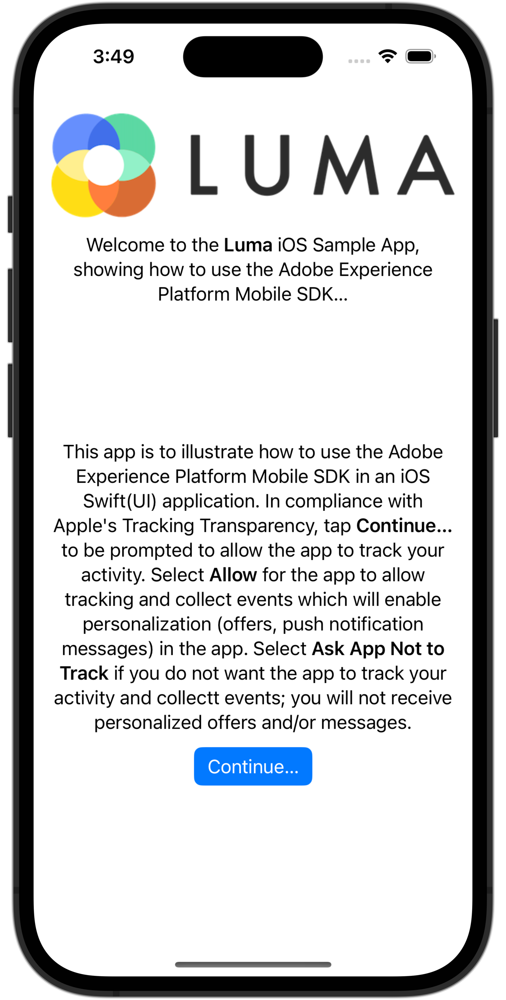
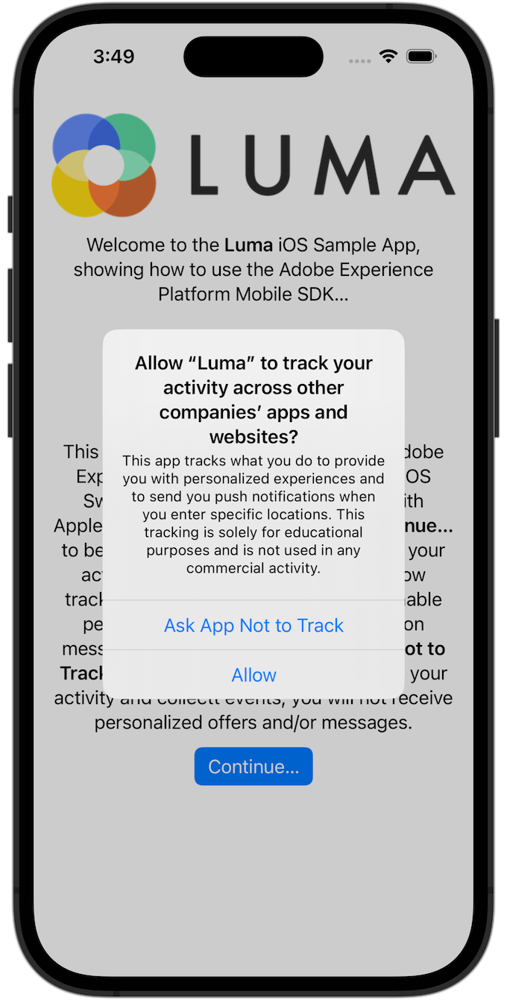

# Consent

Learn how to implement consent in a mobile app.

The Adobe Experience Platform Consent mobile extension enables consent preferences collection from your mobile app when using the Adobe Experience Platform Mobile SDK and the Edge Network extension. Learn more about the [Consent extension](https://developer.adobe.com/client-sdks/documentation/consent-for-edge-network/), in the documentation.

## Prerequisites

* Successfully built and run app with SDKs installed and configured.

## Learning objectives

In this lesson, you will:

* Prompt the user for consent.
* Update the extension based on the user response.
* Learn how to get the current consent state.

## Ask for consent

If you followed the tutorial from the beginning, you might remember that you have set the default consent in the Consent extension to **[!UICONTROL Pending - Queue events that occur before the user provides consent preferences.]** 

To begin collecting data, you must get consent from the user. In this tutorial, you get consent from the user by simply asking for it with an alert. In a real-world app, you'd want to consult consent best practices for your region.

1. You only want to ask the user once. So you want to combine the Mobile SDK consent with the required authorizations for tracking using Apple's [App Tracking Transparency framework](https://developer.apple.com/documentation/apptrackingtransparency). In this app, you assume when the user authorizes tracking, the user also consents with collecting events.
 
1. Navigate to **[!UICONTROL Luma]** > **[!UICONTROL Luma]** > **[!UICONTROL Utils]** > **[!UICONTROL MobileSDK]** in Xcode Project Navigator.
  
   Add this code to the `updateConsent` function.

   ```swift
   let collectConsent = ["collect": ["val": value]]
   let currentConsents = ["consents": collectConsent]
   Consent.update(with: currentConsents)
   MobileCore.updateConfigurationWith(configDict: currentConsents)
   ```

1. Navigate to **[!UICONTROL Luma]** > **[!UICONTROL Luma]** > **[!UICONTROL Views]** > **[!UICONTROL General]** > **[!UICONTROL DisclaimerView]** in Xcode's Project navigator, which is the view that is shown after installing or reinstalling the application and starting the app for the first time. The user is prompted to authorize tracking per Apple's [App Tracking Transparency framework](https://developer.apple.com/documentation/apptrackingtransparency). If the user authorizes, you also update the consent.

   Add the following code to the `ATTrackingManager.requestTrackingAuthorization { status in` closure.

   ```swift 
   if status == .authorized {
         // Set consent to yes
         MobileSDK.shared.updateConsent(value: "y")
   }
   else {
         MobileSDK.shared.updateConsent(value: "n")
   }
   ```

## Get current consent state

The Consent mobile extension automatically suppresses / pends / allows tracking based on the current consent value. You can also access the current consent state yourself:

1. Navigate to **[!UICONTROL Luma]** > **[!UICONTROL Luma]** > **[!UICONTROL Utils]** > **[!UICONTROL MobileSDK]** in Xcode's Project navigator.

   Add the following code to the `getConsents` function:

   ```swift
   Consent.getConsents { consents, error in
      guard error == nil, let consents = consents else { return }
      guard let jsonData = try? JSONSerialization.data(withJSONObject: consents, options: .prettyPrinted) else { return }
      guard let jsonStr = String(data: jsonData, encoding: .utf8) else { return }
      Logger.aepMobileSDK.info("Consent getConsents: \(jsonStr)")
   }
   ```

2. Navigate to **[!UICONTROL Luma]** > **[!UICONTROL Luma]** > **[!UICONTROL Views]** > **[!UICONTROL General]** > **[!UICONTROL HomeView]** in Xcode's Project navigator.

   Add the following  code to the `.task` modifier:

   ```swift
   // Ask status of consents
   MobileSDK.shared.getConsents()   
   ```

In the above example, you are simply logging the consent status to the console in Xcode. In a real-world scenario, you might use it to modify what menus or options are shown to the user.

## Validate with Assurance

1. Review the [Assurance](assurance.md) lesson.
1. Install the app.
1. Launch the app using the Assurance-generated URL.
1. If you added the above code correctly, you are prompted to provide consent. 
  
   Select **[!UICONTROL Continue...]** and then select **[!UICONTROL Allow]**.
   
    
    

1. You should see a **[!UICONTROL Get Consents Response]** event in the Assurance UI.
    


>[!SUCCESS]
>
>You have now enabled your app to prompt the user at its initial start after installation (or reinstallation) to consent using the Adobe Experience Platform Mobile SDK.<br/>Thank you for investing your time in learning about Adobe Experience Platform Mobile SDK. If you have questions, want to share general feedback, or have suggestions on future content, share them on this [Experience League Community discussion post](https://experienceleaguecommunities.adobe.com/t5/adobe-experience-platform-launch/tutorial-discussion-implement-adobe-experience-cloud-in-mobile/td-p/443796)

Next: **[Collect lifecycle data](lifecycle-data.md)**
