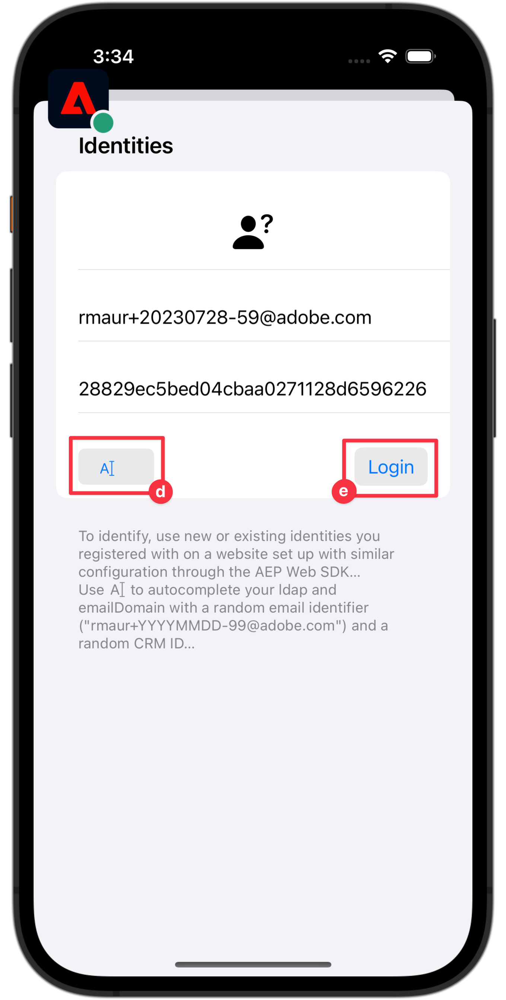

# Events

Learn how to track events in a mobile app.

The Edge Network extension provides an API to send Experience Events to Platform Edge Network. An Experience Event is an object that contains data conforming to the XDM ExperienceEvent schema definition. More simply, they capture what people do in your mobile app. Once data is received by Platform Edge Network, it can be forwarded to applications and services configured in your datastream, such as Adobe Analytics and Experience Platform. Learn more about the [Experience Events](https://developer.adobe.com/client-sdks/documentation/getting-started/track-events/) in the product documentation.

## Prerequisites

* All package dependencies in place in Xcode project.
* Registered extensions in AppDelegate.
* Configured MobileCore to use your development appId.
* Imported SDKs.
* Successfully built and run app with above changes.

## Learning objectives

In this lesson, you will:

* Understand how to structure XDM data based on a schema.
* Send an XDM event based on a standard field group.
* Send an XDM event based on a custom field group.
* Send an XDM purchase event.
* Validate with Assurance.

## Constructing an Experience Event 

The Adobe Experience Platform Edge extension can send events that follow a previously defined XDM schema to Adobe Experience Platform Edge Network. 

The process goes like this...

1. Identify the mobile app interaction that you are trying to track.

1. Review your schema and identify the appropriate event.

1. Review your schema and identify any additional fields that should be used to describe the event.

1. Construct & populate the data object.

1. Create & send event.

1. Validate.


### Standard field groups 

For the standard field groups, the process looks like:

* In your schema, identify the events that you are trying to collect. In this example, you are tracking commerce experience events, for example a product view (**[!UICONTROL productViews]**) event.
  
  

* To construct object containing the experience event data in your app, you would use code like:

  ```swift
  var xdmData: [String: Any] = [
      "eventType": "commerce.productViews",
      "commerce": [
          "productViews": [
            "id": sku,
            "value": 1
          ]
      ]
  ]
  ```

   * `eventType`: Describes the event that occurred, use a [known value](https://github.com/adobe/xdm/blob/master/docs/reference/classes/experienceevent.schema.md#xdmeventtype-known-values) when possible.
   * `commerce.productViews.id`: a string value representing the SKU of the product
   * `commerce.productViews.value`: Provide the numeric value of the event. If it's a Boolean (or "Counter" in Adobe Analytics), the value is always set to 1. If it's a numeric or currency event, the value can be > 1.

* In your schema, identify any additional data associated with the commerce product view event. In this example, include **[!UICONTROL productListItem]** which is a standard set of fields used with any commerce-related events:
      
   
   * Notice that **[!UICONTROL productListItems]** is an array so multiple products could be provided.

* To add this data, expand your `xdmData` object to include supplementary data:

```swift
var xdmData: [String: Any] = [
    "eventType": "commerce.productViews",
        "commerce": [
        "productViews": [
            "id": sku,
            "value": 1
        ]
    ],
    "productListItems": [
        [
            "name":  productName,
            "SKU": sku,
            "priceTotal": priceString,
            "quantity": 1
        ]
    ]
]
```

* You now can use this data structure to create an `ExperienceEvent`:

  ```swift
  let productViewEvent = ExperienceEvent(xdm: xdmData)
  ```

* And send the event and data to Platform Edge Network using the `sendEvent` API:

  ```swift
  Edge.sendEvent(experienceEvent: productViewEvent)
  ```

You are now going to actually implement this code in your Xcode project.
You do have different commerce product-related actions in your app and you want to send events based on these actions as performed by the user:

* view: occurs when users views a specific product,
* add to cart: when user tapps  in a product detail screen,
* save for later: when user taps  in product detail screen,
* purchasee: when user taps the  in product detail screen.

To structure sending experience events:

1. Navigate to **[!UICONTROL Luma]** > **[!UICONTROL Luma]** > **[!UICONTROL Utils]** > **[!UICONTROL MobileSDK]** in Xcode Project navgiator, and add the following to the `func sendCommerceExperienceEvent(commerceEventType: String, product: Product)` function. This function takes the commerce experience event and product as parameters:

    ```swift
    let xdmData: [String: Any] = [
        "eventType": "commerce." + commerceEventType,
        "commerce": [
            commerceEventType: [
                "id": product.sku,
                "value": 1
            ]
        ],
        "productListItems": [
            [
                "name": product.name,
                "priceTotal": product.price,
                "SKU": product.sku
            ]
        ]
    ]

    Logger.viewCycle.info("About to send commerce experience event of type  \(commerceEventType)..."
    let commerceExperienceEvent = ExperienceEvent(xdm: xdmData)
    Edge.sendEvent(experienceEvent: commerceExperienceEvent)
    ```

1. Navigate to **[!UICONTROL Luma]** > **[!UICONTROL Luma]** > **[!UICONTROL Views]** > **[!UICONTROL Products]** > **[!UICONTROL ProductView]** and add various calls to the `sendCommerceExperienceEvent` function:

   1. At the `.task` modifier, within the `ATTrackingManager.trackingAuthorizationStatus` closure. This `.task` modifier is called when product view is initialized and shown, so you want to send a product view event at that specific moment.

      ```swift
      // Send commerce experience event
      MobileSDK.shared.sendCommerceExperienceEvent(commerceEventType: "productView", product: product)
      ```  

   1. For each of the buttons (,  and ) in the toolbar, add the relevant call within the `ATTrackingManager.trackingAuthorizationStatus == .authorized` closure:

      1. For :

            ```swift
            // Send saveForLater commerce experience event
            MobileSDK.shared.sendCommerceExperienceEvent(commerceEventType: "saveForLaters", product: product)
            ```

      1. For :

            ```swift
            // Send productListAdds commerce experience event
            MobileSDK.shared.sendCommerceExperienceEvent(commerceEventType: "productListAdds", product: product)
            ```

      1. For :

            ```swift
            // Send purchase commerce experience event
            MobileSDK.shared.sendCommerceExperienceEvent(commerceEventType: "purchases", product: product)
            ```

### Custom field groups 

Imagine you want to track screen views and interactions in the app itself. Remember you have defined a custom field group for this type of events.

* In your schema, identify the events you are trying to collect. 
  

* Begin constructing your object. 

  >[!NOTE]
  >
  >* Standard field groups always begin in the object root. 
  >
  >* Custom fields groups always begin under an object unique to your Experience Cloud Org, `_techmarketingdemos` in this example.

  For the app interaction event, you would construct an object like:

  ```swift
  let xdmData: [String: Any] = [
    "eventType": "application.interaction",
    "_techmarketingdemos": [
      "appInformation": [
          "appInteraction": [
              "name": "login",
              "appAction": [
                  "value": 1
                  ]
              ]
          ]
      ]
  ]
  ```

  For the screen tracking event, you would construct an object like:

  ```swift
  var xdmData: [String: Any] = [
    "eventType": "application.scene",
    "_techmarketingdemos": [
        "appInformation": [
            "appStateDetails": [
                "screenType": "App",
                    "screenName": "luma: content: ios: us: en: login",
                    "screenView": [
                        "value": 1
                    ]
                ]
            ] 
        ]
  ]
  ```


* You now can use this data structure to create an `ExperienceEvent`.

    ```swift
    let event = ExperienceEvent(xdm: xdmData)
    ```

* Send the event and data to Platform Edge Network.

    ```swift
    Edge.sendEvent(experienceEvent: event)
    ```


Again, lets actually implement this code in your Xcode project. 

1. For convenience, you define two functions in **[!UICONTROL MobileSDK]**. Navigate to **[!UICONTROL Luma]** > **[!UICONTROL Luma]** > **[!UICONTROL Utils]** > **[!UICONTROL MobileSDK]** in your Xcode Project navigator.

   1. One for app interactions. Add this code to the `func sendAppInteractionEvent(actionName: String)` function:

        ```swift 
        let xdmData: [String: Any] = [
            "eventType": "application.interaction",
            tenant : [
                "appInformation": [
                    "appInteraction": [
                        "name": actionName,
                        "appAction": [
                            "value": 1
                        ]
                    ]
                ]
            ]
        ]
        let appInteractionEvent = ExperienceEvent(xdm: xdmData)
        Edge.sendEvent(experienceEvent: appInteractionEvent)
        ```

   1. And one for screen tracking. Add this code to the `func sendTrackScreenEvent(stateName: String) ` function:
  
        ```swift
        let xdmData: [String: Any] = [
            "eventType": "application.scene",
            tenant : [
                "appInformation": [
                    "appStateDetails": [
                        "screenType": "App",
                        "screenName": stateName,
                        "screenView": [
                            "value": 1
                        ]
                    ]
                ]
            ]
        ]
        let trackScreenEvent = ExperienceEvent(xdm: xdmData)
        Edge.sendEvent(experienceEvent: trackScreenEvent)
        ```

1. Navigate to **[!UICONTROL Luma]** > **[!UICONTROL Luma]** > **[!UICONTROL Views]** > **[!UICONTROL General]** > **[!UICONTROL LoginSheet]**.

   1. Add the following highlighted code to the Login button closure: 

        ```swift                              
        // Send app interaction event
        MobileSDK.shared.sendAppInteractionEvent(actionName: "login")
        dismiss()
        ```

   1. Add the following highlighted code to `onAppear` modifier:

        ```swift
        // Send track screen event
        MobileSDK.shared.sendTrackScreenEvent(stateName: "luma: content: ios: us: en: login")
        ```

### Validation

1. Review the [setup instructions](assurance.md) section and connect your simulator or device to Assurance.
1. Run the app to log in and interact with a product.

   1. Move the Assurance icon to the left.
   1. Select **[!UICONTROL Home]** in the tab bar.
   1. Select the  button to open the Login sheet.
   1. Select the  button to insert a random email and customer id.
   1. Select **[!UICONTROL Login]**.
   1. Select **[!UICONTROL Products]** in the tab bar.
   1. Select a product.
   1. Select .
   1. Select .
   1. Select .

        
 

1. In the Assurance UI, look for the **[!UICONTROL hitReceived]** events from the **[!UICONTROL com.adobe.edge.konductor]** vendor.
1. Select the event and review the XDM data in the **[!UICONTROL messages]** object.
   


### Implement in Luma app

You should now have all the tools to start adding data collection to the Luma app. You can add more intelligence to how your user interact with your products and you can add more app interaction and screen tracking calls to your app:

* Implement order, checkout, empty basket, and other functionality to the app and add relevant commerce experience event to this functionality.
* Repeat the call to `sendAppInteractionEvent` with the appropriate parameter to track other app interactions by the user. 
* Repeat the call to `sendTrackScreenEvent` with the appropriate parameter to track screens viewed by the user in the app.

>[!TIP]
>
>Review the [fully implemented app](https://github.com/Adobe-Marketing-Cloud/Luma-iOS-Mobile-App) for more examples.


## Send events to Analytics and Platform

Now that you have collected the events and sent them to Platform Edge Network, they are sent to the applications and services configured in your [datastream](create-datastream.md). In later lessons, you map this data to [Adobe Analytics](analytics.md) and [Adobe Experience Platform](platform.md). 

>[!SUCCESS]
>
>You have now set up your app to track commerce, app interaction, and screen tracking events to the Adobe Experience Platform Edge Network and all services you have defined in your datastream.<br/>Thank you for investing your time in learning about Adobe Experience Platform Mobile SDK. If you have questions, want to share general feedback, or have suggestions on future content, share them on this [Experience League Community discussion post](https://experienceleaguecommunities.adobe.com/t5/adobe-experience-platform-launch/tutorial-discussion-implement-adobe-experience-cloud-in-mobile/td-p/443796).

Next: **[WebViews](web-views.md)**
