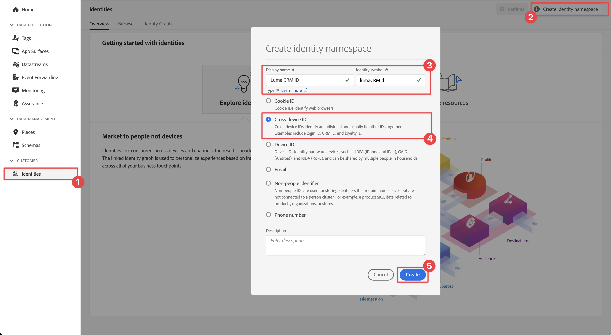
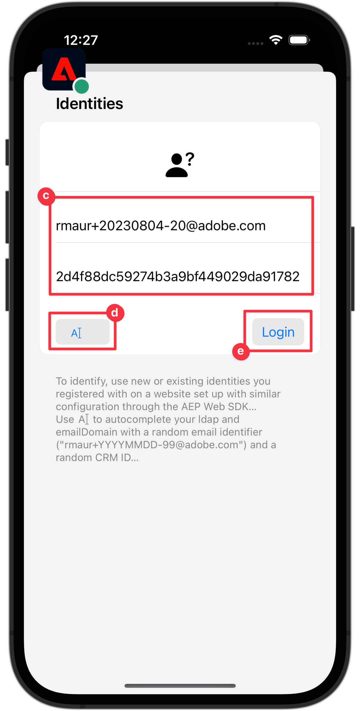

# Identity

Learn how to collect identity data in a mobile app.

Adobe Experience Platform Identity Service helps you to gain a better view of your customers and their behaviors by bridging identities across devices and systems, allowing you to deliver impactful, personal digital experiences in real time. Identity fields and namespaces are the glue that joins different data sources together to build the 360-degree real-time customer profile.

Learn more about the [Identity extension](https://developer.adobe.com/client-sdks/documentation/identity-for-edge-network/) and the [identity service](https://experienceleague.adobe.com/docs/experience-platform/identity/home.html) in the documentation.

## Prerequisites

* Successfully built and run app with SDKs installed and configured.

## Learning objectives

In this lesson, you will:

* Set up a custom identity namespace.
* Update identities.
* Validate the identity graph.
* Get ECID and other identities.


## Set up a custom identity namespace

Identity namespaces are components of [Identity Service](https://experienceleague.adobe.com/docs/experience-platform/identity/home.html?lang=en) that serve as indicators of the context to which an identity relates. For example, they distinguish a value of `name@email.com` as an email address or `443522` as a numeric CRM ID.

1. In the Data Collection interface, select **[!UICONTROL Identities]** from the left-rail navigation.
1. Select **[!UICONTROL Create identity namespace]**.
1. Provide a **[!UICONTROL Display name]** of `Luma CRM ID` and an **[!UICONTROL Identity symbol]** value of `lumaCRMId`.
1. Select **[!UICONTROL Cross-device ID]**.
1. Select **[!UICONTROL Create]**.

   


## Update identities

You want to update both the standard identity (email) and the custom identity (Luma CRM ID) when the user logs into the app.

1. Navigate to **[!UICONTROL Luma]** > **[!UICONTROL Luma]** > **[!UICONTROL Utils]** > **[!UICONTROL MobileSDK]** in the Xcode Project navigator and find the the `func updateIdentities(emailAddress: String, crmId: String)` function implementation. Add the following  code to the function.

   ```swift
   // Set up identity map
   let identityMap: IdentityMap = IdentityMap()

   // Add identity items to identity map
   let emailIdentity = IdentityItem(id: emailAddress, authenticatedState: AuthenticatedState.authenticated)
   let crmIdentity = IdentityItem(id: crmId, authenticatedState: AuthenticatedState.authenticated)
   identityMap.add(item:emailIdentity, withNamespace: "Email")
   identityMap.add(item: crmIdentity, withNamespace: "lumaCRMId")

   // Update identities
   Identity.updateIdentities(with: identityMap)
   ```

    This code:

    1. Creates an empty `IdentityMap` object.

       ```swift
       let identityMap: IdentityMap = IdentityMap()
       ```

    1. Sets up `IdentityItem` objects for email and CRM ID.
   
       ```swift
       let emailIdentity = IdentityItem(id: emailAddress, authenticatedState: AuthenticatedState.authenticated)
       let crmIdentity = IdentityItem(id: crmId, authenticatedState: AuthenticatedState.authenticated)
       ```

    1. Adds these `IdentityItem` objects to the `IdentityMap` object.

       ```swift
       identityMap.add(item:emailIdentity, withNamespace: "Email")
       identityMap.add(item: crmIdentity, withNamespace: "lumaCRMId")
       ```    

    1. Sends the `IdentityItem` object as part of the `Identity.updateIdentities` API call to the Edge Network.

       ```swift
       Identity.updateIdentities(with: identityMap) 
     
       ```   

1. Navigate to **[!UICONTROL Luma]** **[!UICONTROL Luma]** > **[!UICONTROL Views]** > **[!UICONTROL General]** > **[!UICONTROL LoginSheet]** in the Xcode Project navigator and find the code to execute when selecting the **[!UICONTROL Login]** button. Add the following code:

   ```swift
   // call updaeIdentities
   MobileSDK.shared.updateIdentities(emailAddress: currentEmailId, crmId: currentCRMId)                             
   ```


>[!NOTE]
>
>You can send multiple identities in a single `updateIdentities` call. You can also modify previously sent identities.


## Remove an identity

You can use `removeIdentity` to remove the identity from the stored client-side IdentityMap. The Identity extension stops sending the identifier to the Edge Network. Using this API does not remove the identifier from the server-side User Profile Graph or Identity Graph.

1. Navigate to **[!UICONTROL Luma]** > **[!UICONTROL Luma]** > **[!UICONTROL General]** > **[!UICONTROL MobileSDK]** in the Xcode Project navigator and add the following code to the `func removeIdentities(emailAddress: String, crmId: String)` function: 

   ```swift
   Identity.removeIdentity(item: IdentityItem(id: emailAddress), withNamespace: "Email")
   Identity.removeIdentity(item: IdentityItem(id: crmId), withNamespace: "lumaCRMId")
   // reset email and CRM Id to their defaults
   currentEmailId = "testUser@gmail.com"
   currentCRMId = "112ca06ed53d3db37e4cea49cc45b71e"
   ```

1. Navigate to **[!UICONTROL Luma]** > **[!UICONTROL Luma]** > **[!UICONTROL Views]** > **[!UICONTROL General]** > **[!UICONTROL LoginSheet]** in the Xcode Project navigator and find the code to execute when selecting the **[!UICONTROL Logout]** button. Add the following code:

   ```swift
   // call removeIdentities
   MobileSDK.shared.removeIdentities(emailAddress: currentEmailId, crmId: currentCRMId)
   dismiss()                   
   ```


## Validate with Assurance

1. Review the [setup instructions](assurance.md) section and connect your simulator or device to Assurance.
1. In the Luma app
   1. Select the **[!UICONTROL Home]** tab. 
   1. Select the  icon from the top right.
   1. Provide an email address and a CRM Id, or
   1. Select  to randomly generate an **[!UICONTROL Email]** and **[!UICONTROL CRM ID]**.
   1. Select **[!UICONTROL Login]**.

       
    

1. Look in the Assurance web UI for the **[!UICONTROL Edge Identity Update Identities]** event from the **[!UICONTROL com.adobe.griffon.mobile]** vendor.
1. Select the event and review the data in the **[!UICONTROL ACPExtensionEventData]** object. You should see the identities you updated.


## Validate with identity graph

Once you complete the steps in the [Experience Platform lesson](platform.md), you are able to confirm the identy capture in Platforms identity graph viewer:

1. Select **[!UICONTROL Identities]** in the Data Collection UI.
1. Select **[!UICONTROL Identity Graph]** from the top bar.
1. Enter `Luma CRM ID` as the **[!UICONTROL Identity namespace]** and your CRM Id (for example `24e620e255734d8489820e74f357b5c8`) as the **[!UICONTROL Identity value]**.
1. You see the **[!UICONTROL Identities]** listed.

   


>[!SUCCESS]
>
>You have now set up your app to update identities in the Edge Network and (when set up) with Adobe Experience Platform.<br/>Thank you for investing your time in learning about Adobe Experience Platform Mobile SDK. If you have questions, want to share general feedback, or have suggestions on future content, share them on this [Experience League Community discussion post](https://experienceleaguecommunities.adobe.com/t5/adobe-experience-platform-launch/tutorial-discussion-implement-adobe-experience-cloud-in-mobile/td-p/443796)

Next: **[Profile](profile.md)**
