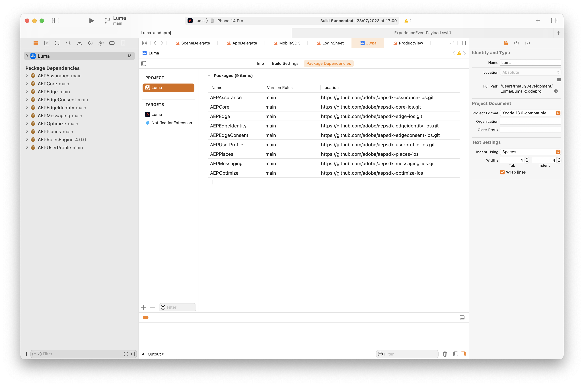

# Install Adobe Experience Platform Mobile SDKs

Learn how to implement the Adobe Experience Platform Mobile SDK in a mobile app.

## Prerequisites

* Successfully built tag library with the extensions described in the [previous lesson](configure-tags.md).
* Development Environment File ID from the [Mobile Install Instructions](configure-tags.md#generate-sdk-install-instructions).
* Downloaded, empty [sample app](https://github.com/Adobe-Marketing-Cloud/Luma-iOS-Mobile-App{target="_blank"}).
* Experience with [XCode](https://developer.apple.com/xcode/{target="_blank"}).

## Learning objectives

In this lesson, you will:

* Add the required SDK's to your project using the Swift Package Manager.
* Register the extensions.

>[!NOTE]
>
>In a mobile app implementation, the terms "extensions" and "SDKs" are nearly interchangeable.

## Swift Package Manager

Instead of using CocoaPods and using a Pod file (as outlined in the Mobile Install Instructions, see [Generate SDK install instructions](./configure-tags.md#generate-sdk-install-instructions)), you add individual packages using Xcode's native Swift Package Manager.

In Xcode, use **[!UICONTROL File]** > **[!UICONTROL Add Packages...]** and install all packages listed in the table below. Select the link of the package in the table to obtain the full URL for the specific package.

| Package | Description | 
|---|---|
| [AEP Core](https://github.com/adobe/aepsdk-core-ios.git) | The `AEPCore`, `AEPServices`, and `AEPIdentity` extensions represent the foundation of the Adobe Experience Platform SDK - every app using the SDK must include them. These modules contain a common set of functionality and services which are required by all SDK extensions.<br/>`AEPCore` contains implementation of the Event Hub. The Event Hub is the mechanism used for delivering events between the app and the SDK. The Event Hub is also used for sharing data between extensions.<br/>`AEPServices` provides several reusable implementations needed for platform support, including networking, disk access, and database management.<br/>`AEPIdentity` implements the integration with Adobe Experience Platform Identity services.<br/>`AEPSignal` represents the Adobe Experience Platform SDK's Signal extension that allows marketers to send a "signal" to their apps to send data to external destinations or to open URLs.<br/>`AEPLifecycle` represents the Adobe Experience Platform SDK's Lifecycle extension that helps collect application lifecycle metrics such as application install or upgrade information, application launch and session information, device information, and any additional context data provided by the application developer. |
| [AEP Edge](https://github.com/adobe/aepsdk-edge-ios.git) | The Adobe Experience Platform Edge Network mobile extension allows you to send data to the Adobe Edge Network from a mobile application. This extension allows you to implement Adobe Experience Cloud capabilities in a more robust way, serve multiple Adobe solutions though one network call, and simultaneously forward this information to the Adobe Experience Platform.<br/>The Edge Network mobile extension is an extension for the Adobe Experience Platform SDK and requires the `AEPCore` and `AEPServices` extensions for event handling, as well as the `AEPEdgeIdentity` extension for retrieving the identities, such as ECID.|
| [AEP Edge Identity](https://github.com/adobe/aepsdk-edgeidentity-ios.git)| The AEP Edge Identity mobile extension enables handling of user identity data from a mobile application when using the Adobe Experience Platform SDK and the Edge Network extension. |
| [AEP Edge Consent](https://github.com/adobe/aepsdk-edgeconsent-ios.git) | The AEP Consent Collection mobile extension enables consent preferences collection from the mobile application when using the Adobe Experience Platform SDK and the Edge Network extension. |
| [AEP User Profile](https://github.com/adobe/aepsdk-userprofile-ios.git) | The Adobe Experience Platform User Profile Mobile Extension is an extension to manage user profiles for the Adobe Experience Platform SDK.|
| [AEP Places](https://github.com/adobe/aepsdk-places-ios) |Adobe Experience Platform Places extension is an extension for the Adobe Experience Platform Swift SDK. The AEPPlaces extension allows you to track geolocation events as defined in the Adobe Places UI and in Adobe Launch rules. |
| [AEP Messaging](https://github.com/adobe/aepsdk-messaging-ios.git) |The AEP Messaging extension is an extension for the Adobe Experience Platform Swift SDK. The AEP Messaging extension allows you to send push notification tokens and push notification click-through feedback to the Adobe Experience Platform.|
| [AEP Optimize](https://github.com/adobe/aepsdk-optimize-ios) | The AEP Optimize extension provides APIs to enable real-time personalization workflows in the Adobe Experience Platform Mobile SDKs using Adobe Target or Adobe Journey Optimizer Offer Decisioning. It requires `AEPCore` and `AEPEdge` extensions to send personalization query events to the Experience Edge network. |
| [AEP Assurance](https://github.com/adobe/aepsdk-assurance-ios.git) | Assurance (a.k.a. project Griffon) is a new, innovative product to help you inspect, proof, simulate, and validate how you collect data or serve experiences in your mobile app.|


After you have installed all packages, your Xcode **[!UICONTROL Package Dependencies]** screen should look like:




## Import extensions

In Xcode, in the source for **[!UICONTROL AppDelegate]** and **[!UICONTROL MobileSDK]**, add the following imports.

```swift
import AEPCore
import AEPServices
import AEPIdentity
import AEPSignal
import AEPLifecycle
import AEPEdge
import AEPEdgeIdentity
import AEPEdgeConsent
import AEPUserProfile
import AEPPlaces
import AEPMessaging
import AEPOptimize
import AEPAssurance
```

## Update AppDelegate

In **AppDelegate**, 

1. Set the `@AppStorage` value for `environmentFileId` to the Development Environment File ID value that you retrieved from tags in step 6 in [Generate SDK install instructions](configure-tags.md#generate-sdk-install-instructions). 

   ```swift
   @AppStorage("environmentFileId") private var environmentFileId = "b5cbd1a1220e/1857ef6cacb5/launch-2594f26b23cd-development"
   ```

1. Add the following code to the `application(_, didFinishLaunchingWithOptions)` function.

    ```swift
        
    let extensions = [
        AEPIdentity.Identity.self,
        Lifecycle.self,
        Signal.self,
        Edge.self,
        AEPEdgeIdentity.Identity.self,
        Consent.self,
        UserProfile.self,
        Places.self,
        Messaging.self,
        Optimize.self,
        Assurance.self
    ]
    
    MobileCore.registerExtensions(extensions, {
        // Use the environment file id assigned to this application via Adobe Experience Platform Data Collection
        Logger.aepMobileSDK.info("Luma - using mobile config: \(self.environmentFileId)")
        MobileCore.configureWith(appId: self.environmentFileId)
        
        // set this to false or comment it when deploying to TestFlight (default is false),
        // set this to true when testing on your device.
        MobileCore.updateConfigurationWith(configDict: ["messaging.useSandbox": true])
        if appState != .background {
            // only start lifecycle if the application is not in the background
            MobileCore.lifecycleStart(additionalContextData: nil)
        }
        
        // assume unknown, adapt to your needs.
        MobileCore.setPrivacyStatus(.unknown)
        
        // update version and build
        Logger.configuration.info("Luma - Updating version and build number...")
        SettingsBundleHelper.setVersionAndBuildNumber()
    })
    ```

The above code does the following:

1. Registers the required extensions.
1. Configures MobileCore and other extensions to use your tag property configuration.
1. Enables debug logging. More details and options can be found in the [Adobe Experience Platform Mobile SDK documentation](https://developer.adobe.com/client-sdks/documentation/getting-started/enable-debug-logging/).

>[!IMPORTANT]
>
>Ensure you update `MobileCore.configureWith(appId: self.environmentFileId)` with the `appId` based on the `environmentFileId` from the tag environment you are building for (development, staging, or production).
>

>[!SUCCESS]
>
>You have now installed the necessary packages and updated your project to properly register the required  Adobe Experience Platform Mobile SDK extensions you are going to use for the remainder of the tutorial.<br/>Thank you for investing your time in learning about Adobe Experience Platform Mobile SDK. If you have questions, want to share general feedback, or have suggestions on future content, share them on this [Experience League Community discussion post](https://experienceleaguecommunities.adobe.com/t5/adobe-experience-platform-launch/tutorial-discussion-implement-adobe-experience-cloud-in-mobile/td-p/443796)

Next: **[Set up Assurance](assurance.md)**
