# Journey Optimizer in-app messaging

Learn how to create in-app messages for mobile apps with Platform Mobile SDK and Journey Optimizer.

Journey Optimizer allows you to create campaigns to send in-app messages to targeted audiences. Before you send in-app messages with Journey Optimizer, you must ensure that the proper configurations and integrations are in place. To understand the in-app messaging data flow in Journey Optimizer, refer to [the documentation](https://experienceleague.adobe.com/docs/journey-optimizer/using/in-app/inapp-configuration.html?lang=en).

>[!NOTE]
>
>This lesson is optional and only applies to Journey Optimizer users looking to send in-app messages. 


## Prerequisites

* Successfully built and run app with SDKs installed and configured.
* Access to Journey Optimizer and sufficient permissions as described [here](https://experienceleague.adobe.com/docs/journey-optimizer/using/configuration/configuration-message/push-config/push-configuration.html?lang=en). Also you need sufficient permission to the following Journey Optimizer features.
  * Manage campaigs.
* Paid Apple developer account with sufficient access to create certificates, identifiers, and keys.
* Physical iOS device or simulator for testing.
* Registered App ID with Apple Push Notificaton Service
* Added your app push credentials in Data Collection
* Installed Journey Optimizer tags extension
* Implemented Journey Optimizer in the app


## Learning objectives

In this lesson, you will

* Register App ID with the Apple Push Notification service (APN).
* Create an App Surface in AJO.
* Install & configure the Journey Optimizer tag extension.
* Update your app to include the Journey Optimizer tag extension.
* Validate setup in Assurance.
* Define your own campaign and in-app message experience in Journey Optimizer.
* Send your own in-app message from within the app.

## Setup your app

>[!TIP]
>
>If you have setup your app already as part of the [Journey Optimizer push messaging](journey-optimizer-push.md) tutorial, you can skip this section.

### Register App ID with APNS

The following steps are not Adobe Experience Cloud-specific and are designed to guide you through APNS configuration.

### Create a private key

1. In the Apple developer portal, navigate to **[!UICONTROL Keys]**.
1. To create a key, select **[!UICONTROL +]**.
   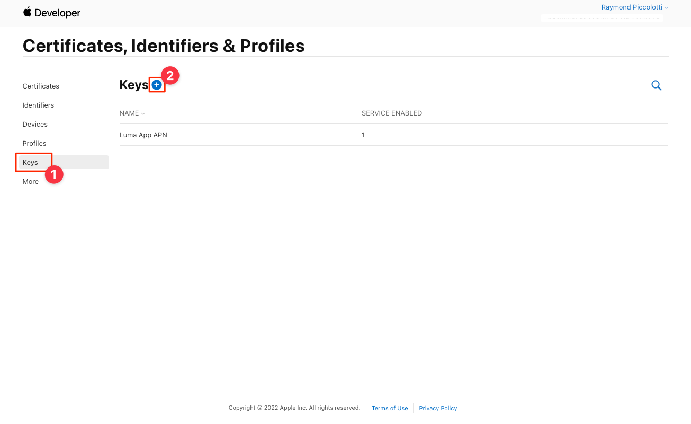

1. Provide a **[!UICONTROL Key Name]**.
1. Select the **[!UICONTROL Apple Push Notification service] (APNs)** checkbox.
1. Select **[!UICONTROL Continue]**.
   
1. Review the configuration and select **[!UICONTROL Register]**.
1. Download the `.p8` private key. It is used in the App Surface configuration.
1. Make note of the **[!UICONTROL Key ID]**. It is used in the App Surface configuration.
1. Make note of the **[!UICONTROL Team ID]**. It is used in the App Surface configuration.
   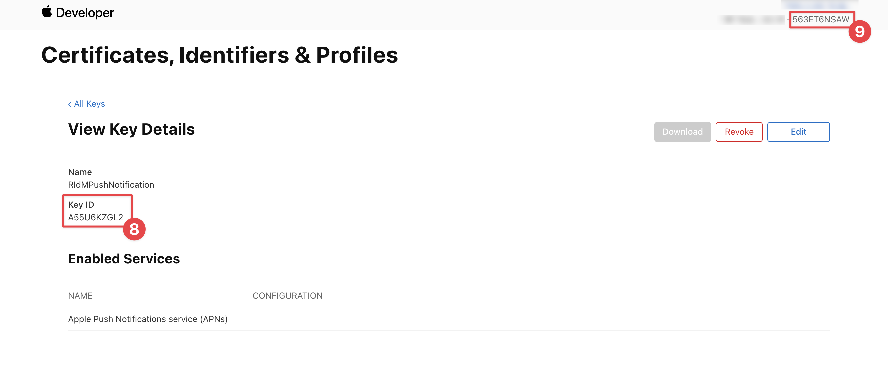

Additional documentation can be [found here](https://help.apple.com/developer-account/#/devcdfbb56a3).

### Add your app push credentials in Data Collection

1. From the [Data Collection interface](https://experience.adobe.com/data-collection/), select **[!UICONTROL App Surfaces]** in the left-hand panel.
1. To create a configuration, select **[!UICONTROL Create App Surface]**.

1. Enter a **[!UICONTROL Name]** for the configuration, for example `Luma App Tutorial`  .
1. From **[!UICONTROL Mobile Application Configuration]**, select **[!UICONTROL Apple iOS]**.
1. Enter the mobile app Bundle Id in the **[!UICONTROL App ID (iOS Bundle ID)]** field. For example,  `com.adobe.luma.tutorial.swiftui`. 
1. Switch on the **[!UICONTROL Push Credentials]** toggle to add your credentials.
1. Drag and drop your `.p8` **Apple Push Notification Authentication Key** file.
1. Provide the **[!UICONTROL Key ID]**, a 10-character string assigned during the creation of `p8` auth key. It can be found under the **[!UICONTROL Keys]** tab in the **Certificates, Identifiers and Profiles** page of the Apple Developer portal pages. See also [Create a private key](#create-a-private-key).
1. Provide the **[!UICONTROL Team ID]**. The Team ID is a value which can be found under the **Membership** tab or at the top of the Apple Developer portal page. See also [Create a private key](#create-a-private-key).
1. Select **[!UICONTROL Save]**.

   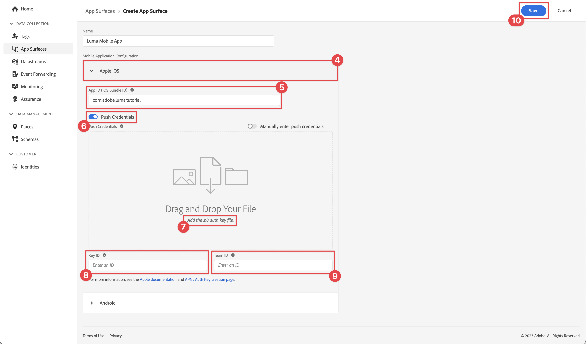

### Install Journey Optimizer tags extension

For your app to work with Journey Optimizer, you need to update your tag property.

1. Navigate to **[!UICONTROL Tags]** > **[!UICONTROL Extensions]** > **[!UICONTROL Catalog]**, 
1. Open your property, for example **[!UICONTROL Luma Mobile App Tutorial]**.
1. Select **[!UICONTROL Catalog]**.
1. Search for the **[!UICONTROL Adobe Journey Optimizer]** extension.
1. Install the extension.
1. In the **[!UICONTROL Install Extension]** dialog
   1. Select an environment, for example **[!UICONTROL Development]**.
   1. Select the **[!UICONTROL AJO Push Tracking Experience Event Dataset]** dataset from the **[!UICONTROL Event Dataset]** list.
   1. Select **[!UICONTROL Save to Library and Build]**.
       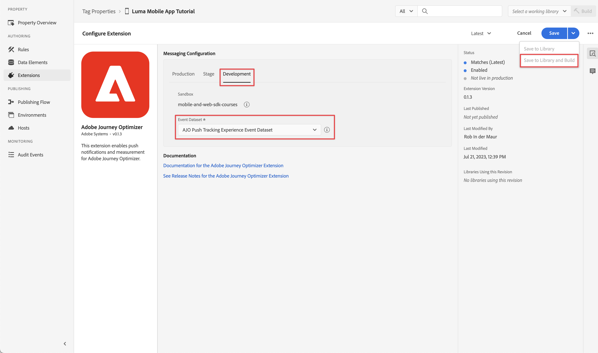

>[!NOTE]
>
>If you don't see `AJO Push Tracking Experience Event Dataset` as an option, contact customer care.
>

### Implement Journey Optimizer in the app

As discussed in previous lessons, installing a mobile tag extension only provides the configuration. Next you must install and register the Messaging SDK. If these steps aren't clear, review the [Install SDKs](install-sdks.md) section.

>[!NOTE]
>
>If you completed the [Install SDKs](install-sdks.md) section, then the SDK is already installed and you can skip this step.
>

1. In Xcode, ensure that [AEP Messaging](https://github.com/adobe/aepsdk-messaging-ios.git) is added to the list of packages in Package Dependencies. See [Swift Package Manager](install-sdks.md#swift-package-manager).
1. Navigate to **[!UICONTROL Luma]** > **[!UICONTROL Luma]** > **[!UICONTROL AppDelegate]** in the Xcode Project navigator.
1. Ensure `AEPMessaging` is part of your list of imports.

    `import AEPMessaging`

1. Ensure `Messaging.self` is part of the array of extensions that you are registering.

    ```swift
    let extensions = [
        AEPIdentity.Identity.self,
        Lifecycle.self,
        Signal.self,
        Edge.self,
        AEPEdgeIdentity.Identity.self,
        Consent.self,
        UserProfile.self,
        Places.self,
        Messaging.self,
        Optimize.self,
        Assurance.self
    ]
    ```

1. Add the `MobileCore.setPushIdentifier` to the `func application(_ application: UIApplication, didRegisterForRemoteNotificationsWithDeviceToken deviceToken: Data)` function.

    ```swift      
    // Send push token to Experience Platform
    MobileCore.setPushIdentifier(deviceToken)
    ```

    This function retrieves the device token unique to the device that the app is installed on. Then sets the token for push notification delivery using the configuration that you have set up and which relies on Apple's Push Notification service (APNs).


## Validate setup Assurance

1. Review the [setup instructions](assurance.md) section.
1. Install the app on your physical device or on the simulator.
1. Launch the app using the Assurance generated URL.
1. In the Assurance UI, select **[!UICONTROL Configure]**.
    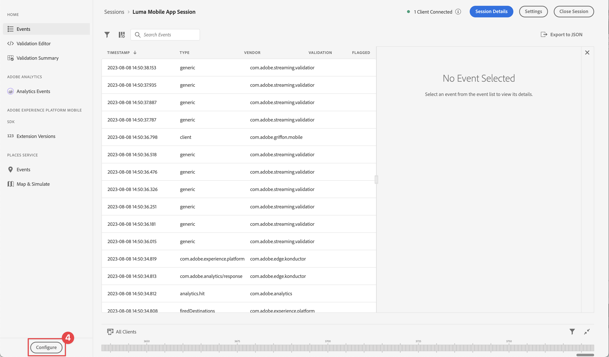
1. Select the  button next to **[!UICONTROL In-App Messaging]**.
1. Select **[!UICONTROL Save]**.
    
1. Select **[!UICONTROL In-App Messaging]** from the left navigation.
1. Select the **[!UICONTROL Validation]** tab.
1. Confirm that you aren't getting any errors.
   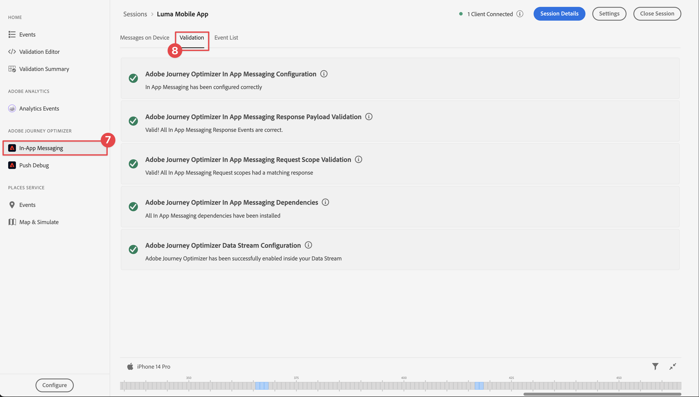


## Create your own in-app message

To create your own in-app message, you must define a campaign in Journey Optimizer that triggers an in-app message based on events that occur. These events can be:

* data sent to Adobe Experience Platform,
* core tracking events, like action, or state or collection of PII data, through the Mobile Core generic API's,
* application lifecycle events, such as launch, install, upgrade, close, or crash,
* geolocation events, like entering or exiting a point of interest.

In this tutorial, you are going to use the Mobile Core generic and extension-independent APIs to facilitate the event tracking of user screens, actions, and PII data. Events generated by these APIs are published to the SDK event hub and are available for use by extensions. For instance, when the Analytics extension is installed, all user actions and app screens event data is sent to the appropriate Analytics reporting endpoints. 

1. In the Journey Optimizer UI, select **[!UICONTROL Campaigns]** from the left rail.
1. Select **[!UICONTROL Create Campaign]**.
1. In the **[!UICONTROL Create Campaign]** screen: 
   1. Select **[!UICONTROL In-app message]** and select an app surface from the **[!UICONTROL App surface]** list, for example **[!UICONTROL Luma Mobile App]**.
   1. Select **[!UICONTROL Create]**
      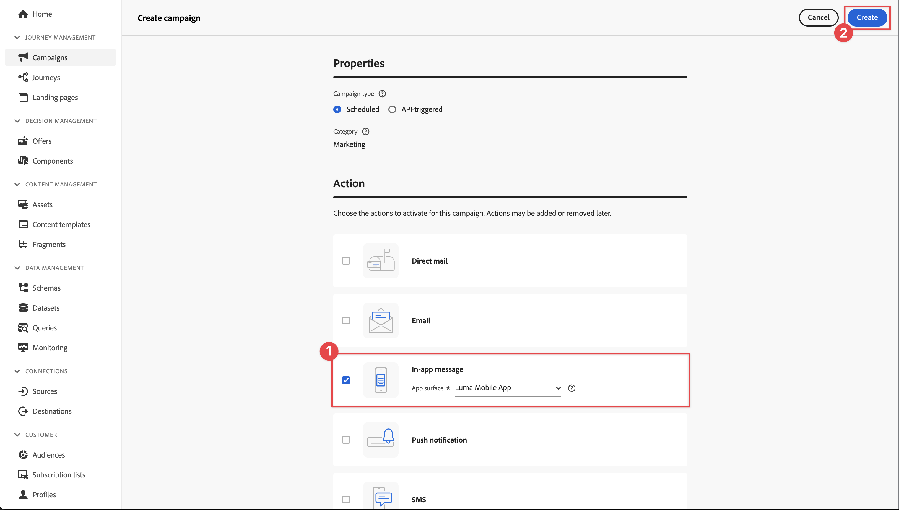
1. In the Campaign definition screen, at **[!UICONTROL Properties]**, enter a **[!UICONTROL Name]** for the campaign, for example `Luma - In-App Messaging Campaign`, and a **[!UICONTROL Description]**, for example `In-app messaging campaign for Luma app`.
   
1. Scroll down to **[!UICONTROL Action]**, and select **[!UICONTROL Edit Content]**.
1. In the **[!UICONTROL In-App Message]** screen:
   1. Select **[!UICONTROL Modal]** as the **[!UICONTROL Message Layout]**.
   2. Enter `https://luma.enablementadobe.com/content/dam/luma/en/logos/Luma_Logo.png` for **[!UICONTROL Media URL]**.
   3. Enter a **[!UICONTROL Header]**, for example `Welcome to this Luma In-App Message` and enter a **[!UICONTROL Body]**, for example `Triggered by pushing that button in the app...`.
   4. Enter **[!UICONTROL Dismiss]** as the **[!UICONTROL Button #1 text (primary)]**.
   5. Note how the preview is updated.
   6. Select **[!UICONTROL Review to activate]**.
      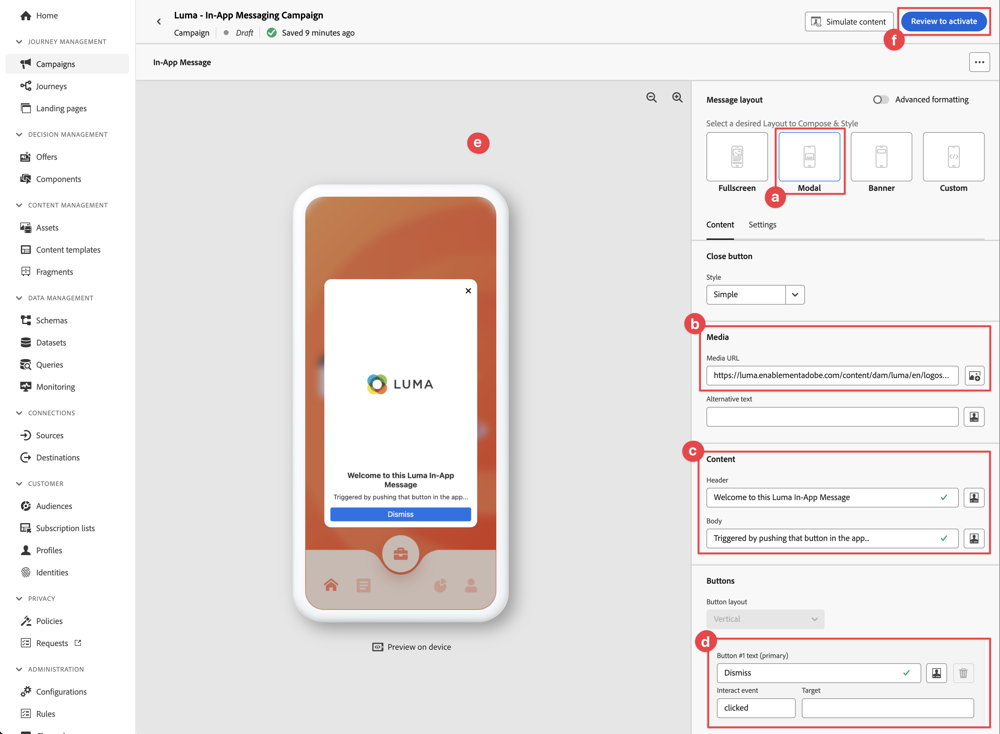
1. In the **[!UICONTROL Review to activate (Luma - In-App Messaging Campaign)]** screen, select  in the **[!UICONTROL Schedule]** tile.
   
1. Back in the **[!UICONTROL Luma - In-App Messaging Campaign]** screen, select  **[!UICONTROL Edit triggers]**.
1. In the **[!UICONTROL In-app message trigger]** dialog, you configure the details of the track action that triggers the in-app message:
   1. To remove **[!UICONTROL Application launch event]**, select  .
   1. Use  **[!UICONTROL Add condition]** repeatedly to build the following logic for **[!UICONTROL Show message if]**.
   1. Click **[!UICONTROL Done]**.
      
    
   You have defined a track action, where the **[!UICONTROL Action]** equals `in-app` and the **[!UICONTROL Context data]** with the action is a key value pair of `"showMessage" : "true"`.

1. Back in the **[!UICONTROL Luma - In-App Messaging Campaign]** screen, select **[!UICONTROL Review to activate]**.
1. In the **[!UICONTROL Review to activate (Luma - In-App Messaging Campaign)]** screen, select **[!UICONTROL Activate]**.
1. You see your **[!UICONTROL Luma - In-App Messaging Campaign]** with status **[!UICONTROL Live]** in the **[!UICONTROL Campaigns]** list.
   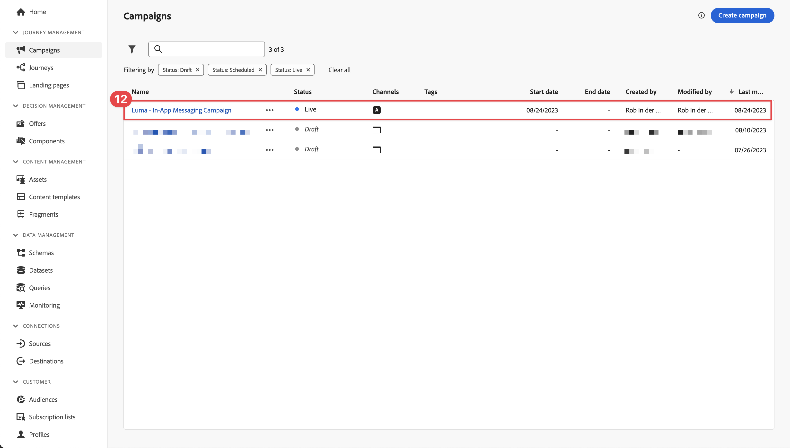


## Triggering the in-app message

You have all the ingredients in place to send an in-app message. What remains is how to trigger this in-app message in your app.

1. Go to **[!UICONTROL Luma]** > **[!UICONTROL Luma]** > **[!UICONTROL Utils]** > **[!UICONTROL MobileSDK]** in the Xcode Project navigator. Find the `func sendTrackAction(action: String, data: [String: Any]?)` function, and add the following code, which calls the `MobileCore.track` function, based on the parameters `action` and `data`.

    
    ```swift
    // send trackAction event
    MobileCore.track(action: action, data: data)
    ```  

1. Go to **[!UICONTROL Luma]** > **[!UICONTROL Luma]** > **[!UICONTROL Views]** > **[!UICONTROL General]** > **[!UICONTROL ConfigView]** in the Xcode Project Navigator. Find the code for the In-App Message button and add the following code:

    ```swift
    Task {
        AEPService.shared.sendTrackAction(action: "in-app", data: ["showMessage": "true"])
    }
    ```

## Validate using your app

1. Open your app on a device or in the simulator.

1. Go to the **[!UICONTROL Settings]** tab.

1. Tap **[!UICONTROL In-App Message]**. You see the in-app message appear in your app.

   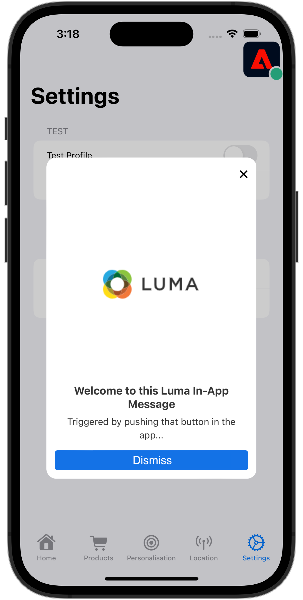


## Validate implementation in Assurance

You can validate your in-app messages in the Assurance UI. 

1. Select **[!UICONTROL In-App Messaging]**.
1. Select **[!UICONTROL Event List]**.
1. Select a **[!UICONTROL Display message]** entry.
1. Inspect the raw event, especially the `html`, which contains the complete layout and content of the in-app message.
    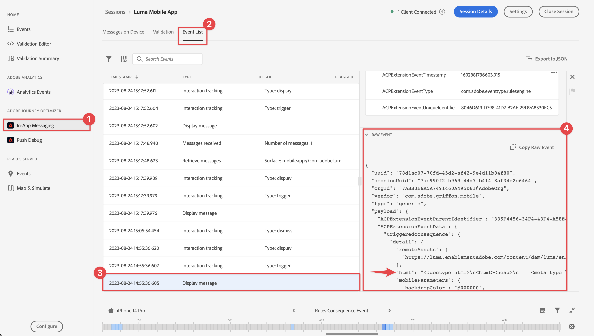
   

## Next steps

You should now have all the tools to start adding in-app messages, where relevant and applicable, to the Luma app. For example, promoting products based on specific interactions you have tracked in the app.

>[!SUCCESS]
>
>You have enabled the app for in-app messaging and added an in-app messaging campaign using Journey Optimizer and the Journey Optimizer extension for the Experience Platform Mobile SDK.<br/>Thank you for investing your time in learning about Adobe Experience Platform Mobile SDK. If you have questions, want to share general feedback, or have suggestions on future content, share them on this [Experience League Community discussion post](https://experienceleaguecommunities.adobe.com/t5/adobe-experience-platform-launch/tutorial-discussion-implement-adobe-experience-cloud-in-mobile/td-p/443796).

Next: **[Display offers with Journey Optimizer](journey-optimizer-offers.md)**
